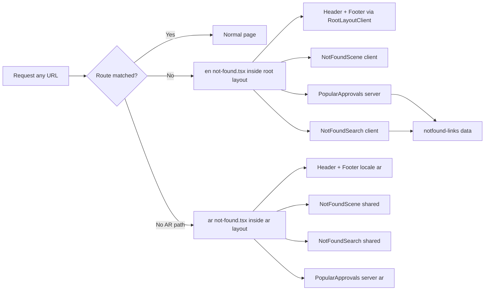

# Mega Plan — Extraordinary Blueprint 404 Page (EN + AR) — Dark Cyanotype "Night Sheet"

## 1. Overview & Goal

Redesign the site's 404 experience from a plain "big number + 3 buttons" page into an
on-brand, visually extraordinary **dark cyanotype "Night Sheet"** that:

- Delivers a genuine visual treat: an animated engineering-drawing scene drawn in **pale
  cyanotype ink on a Prussian-blue sheet**, with **frost (glassmorphism)** surfaces and
  **glow effects**, fully inside the brand token system
- Offers complete recovery navigation: full site nav (via existing header/footer),
  a **working search bar**, top-value destination links, category chips, and CTAs
- Is fully accessible (semantic HTML, focus states, keyboard-operable search,
  `prefers-reduced-motion` respected, AA contrast on dark)
- Is fully bilingual (English + Arabic RTL) and returns a **true HTTP 404**
- Implements the SEO best-practices from the shared opinion (no canonical, no hreflang
  cluster on error pages, noindex + real status, crawlable, minimal schema)

### Current State

| File | Notes |
|---|---|
| [`src/app/not-found.tsx`](../src/app/not-found.tsx:1) | Basic EN 404 — giant `404` text, H1, 3 buttons. Self-canonical to `/not-found`, WebPage + BreadcrumbList JSON-LD, `noindex, follow`. Renders inside root layout (header/footer present via `RootLayoutClient`). |
| [`src/app/ar/not-found.tsx`](../src/app/ar/not-found.tsx:1) | Arabic mirror, same simple layout. Self-canonical + `alternates.languages` hreflang EN↔AR. Renders inside Arabic layout (`dir="rtl"`). |
| `global-not-found.tsx` | Does NOT exist (not needed — see §4 decision 1). |
| Search | None anywhere in the codebase. |
| [`src/app/robots.ts`](../src/app/robots.ts:35) | Already allows 404 URLs crawlable to all bots — no change needed. |

---

## 2. Reference Design Analysis (wasleen.com)

Examined [`about-us/index.php`](../../../../C:/E--DRIVE%20FILES/wasleen.com/backup-wasleen.com-8-1-2026/public_html/about-us/index.php)
and [`about-us/legal-documents.php`](../../../../C:/E--DRIVE%20FILES/wasleen.com/backup-wasleen.com-8-1-2026/public_html/about-us/legal-documents.php).

### What the reference does well (borrow the *language* and *dark treatment*, keep our palette)

| Reference technique | Example in source | Adapt for our 404 (dark cyanotype) |
|---|---|---|
| Dark dramatic backdrop + radial glow | `legal-documents.php:251-256` | Prussian-blue `cyano-night-bg` + `brand-blue`/ink radial glows |
| Animated grid-line backdrop with radial mask | `legal-documents.php:258-269` | Cyanotype blueprint grid (`cyano-night-grid`) with fade mask |
| Frost/glass cards (`backdrop-filter: blur`) | `index.php:112-117`, `200-205` | Frost search bar + destination cards (`backdrop-blur`, translucent surface, `cyano-night-line` borders) |
| Eyebrow pill with accent line | `legal-documents.php:278-300` | `Error 404 — Page Not Found` pill (frost bg, amber/ink accent) |
| Glow / animated gradient cards | `index.php:155-165` | Hover-lift destination cards with ink glow (`glow-pulse`) + `cta-amber` accent |
| Pulsing "alive" dots / scan line | `legal-documents.php:352-363` | Pulsing scan line sweeping the drawing |
| Stamp / seal hero treatment | `SceneD_ApprovalStamp`, `stamp-press`/`stamp-loop` | **"REVISION NOT FOUND — RESUBMIT"** approval stamp that presses onto the sheet with a glow |
| Animated headline treatment | `legal-documents.php:312-317` | Cyanotype ink gradient text (optional, tasteful) |

**Palette note:** the reference uses purple/magenta (`#950991`, `#D84CD8`). Our 404 uses
the **existing cyanotype-night tokens** from [`globals.css`](../src/app/globals.css:101) —
the same "pale ink on Prussian blue" language already live on the About redesign. No new
hex values in components.

---

## 3. Dark Theme Spec — Cyanotype "Night Sheet"

### Palette (existing tokens, no new hex)

| Role | Token (utility prefix) | Value |
|---|---|---|
| Page background (deepest) | `bg-cyano-night-bg-deep` | `#06223c` |
| Main sheet surface | `bg-cyano-night-bg` | `#0a2f52` |
| Frost surface (cards/search) | `bg-cyano-night-surface` / `bg-cyano-night-card` | `#0f3a63` / `#0e3457` |
| Primary ink (drawing lines, H1) | `text-cyano-night-ink` | `#d7e6f8` |
| Soft ink (body, dimension labels) | `text-cyano-night-ink-soft` | `#8fb3d9` |
| Grid lines | `cyano-night-grid` | `rgba(215,230,248,0.09)` |
| Body text | `text-cyano-night-text` | `#eaf3fc` |
| Headings | `text-cyano-night-heading` | `#d0e3f8` |
| Hairline borders | `border-cyano-night-line` | `rgba(215,230,248,0.22)` |
| CTA accent (unchanged brand) | `bg-cta-amber` / `text-cta-amber` | `#f5a623` |

**Why safe:** all `--color-cyano-night-*` tokens are declared in `@theme` in
[`globals.css`](../src/app/globals.css:101) → Tailwind v4 generates utilities site-wide
(`bg-cyano-night-bg`, `text-cyano-night-ink`, etc.). The 404 uses these **directly** and
does **not** import the About-scoped `about.css` `--about-*` semantic vars or its
`data-theme` toggle. The 404 is always dark (no day/night switch).

### Frost (glassmorphism) spec
- Search bar + destination cards: `bg-cyano-night-card/60 backdrop-blur-md
  border border-cyano-night-line` with `shadow-card`-style soft dark shadow.
- Eyebrow pill: `bg-cyano-night-ink/10 border border-cyano-night-line
  backdrop-blur-sm`.
- Optional frosted CTA card behind the action row.

### Glow spec
- Radial glows: two absolutely-positioned `bg-brand-blue/20 blur-3xl` (or
  `bg-cyano-night-ink/10`) blobs behind the drawing — compositor-friendly, GPU-composited.
- Drawing glow: reuse existing `glow-pulse` keyframe for the freshly drawn walls and the
  stamp (ink-colored `drop-shadow`).
- Hover glow on destination cards: `hover:border-cyano-night-ink/40
  hover:shadow-[0_0_24px_rgba(215,230,248,0.15)]` (soft, non-jarring).

### Top-to-bottom section rhythm
1. **Sheet backdrop:** `cyano-night-bg-deep` base → gradient to `cyano-night-bg`, blueprint
   grid + corner crop marks (reuse `BlueprintGrid` primitive), ink glow blobs, bottom fade.
2. **Drawing scene** (`NotFoundScene`).
3. **Content block** on the dark sheet: eyebrow pill → H1 → copy → frost search →
   CTAs → frost destination cards + chips.
4. **Bottom fade** into the (white) footer to soften the dark→light seam.

---

## 4. Shared SEO Opinion — Analysis & Decisions

The opinion you shared was audited against our setup. Decisions:

| # | Opinion point | Decision for this project | Where |
|---|---|---|---|
| 1 | Real HTTP 404, avoid soft-404 | Keep per-locale `not-found.tsx` (render inside layouts → true 404 for unmatched routes; no root `loading.tsx`, no `<Suspense>` around layout children → no streaming-200 risk). **Verify** with `curl -I` on fake URLs (EN + AR). | §9 |
| 2 | No canonical on the 404 page | **Remove** the self-canonical `alternates.canonical` from BOTH 404 metadata objects. | Task 6, 7 |
| 3 | Bilingual: localized 404, never redirect AR→EN, never put a 404 in an hreflang cluster | AR 404 stays at `/ar/*` with Arabic nav/search and `dir="rtl"`. **Remove** the `alternates.languages` hreflang block from AR 404 metadata. | Task 7 |
| 4 | robots.txt / AI crawlers: leave 404 crawlable | No change — [`robots.ts`](../src/app/robots.ts:35) already allows `/` to all bots; `noindex + 404` is sufficient. | none |
| 5 | Redirect strategy (no blanket → homepage; 410 for gone) | **Out of scope for the page build** — ops follow-up (§10). The 404 page must NOT auto-redirect to `/`. | follow-up |
| 6 | Don't generate broken links; add link validation to pseo pipeline | **Out of scope for the page build** — ops follow-up (§10). | follow-up |
| 7 | Recovery elements: plain-language message, full nav + search, top-value links, same header/footer | **All implemented** (search is brand new to the site). | Tasks 4-8 |
| 8 | Ongoing monitoring (status re-checks, Search Console, server logs) | **Out of scope for the page build** — ops follow-up (§10). | follow-up |

### Additional decision — JSON-LD on the 404
**Remove** WebPage + BreadcrumbList JSON-LD from both 404 pages — `noindex` error pages
gain no rich-result value and self-referencing schema creates mixed signals.

---

## 5. Routing Architecture (Next.js 15)

**Decision 1 — keep `not-found.tsx` (per-locale), do NOT add `global-not-found.tsx`:**
The opinion flags the newer `global-not-found.tsx` convention, but that file **bypasses
the root layout entirely** — it would drop our header/footer/nav (the "dead-end look" the
opinion warns against) and force re-importing fonts/global styles. Our per-locale
`not-found.tsx` files render inside their layouts → full nav, branding, WhatsApp button
and popup remain.

**Decision 2 — no root `loading.tsx` / Suspense added:** keeps unmatched-route responses
as true 404s (no streaming-200 risk).

---

## 6. Design Concept — "The Lost Night Sheet"

A dark Prussian-blue blueprint sheet with an engineering drawing that is visibly
*incomplete and mis-measured* — the page you wanted simply isn't on this sheet.

### Animated drawing scene (`NotFoundScene`, client, `aria-hidden`)

1. The digits **4 0 4** drawn as architectural line-work using the existing `draw-line`
   stroke-dashoffset technique, in pale cyanotype ink (`text-cyano-night-ink` +
   `stroke-current`) with a `glow-pulse` after-glow.
2. A dashed **"AREA NOT FOUND"** rectangle with a bold **X** at its center (dashed
   stroke draw + X `draw-line`).
3. Dimension lines ending in **"???"** and a small **"NO DIMENSIONS"** leader label
   (Roboto Mono, `ink-soft`).
4. A **scan line** that sweeps the sheet vertically (`pulse-opacity`/custom keyframe) —
   the "plotter" feel.
5. A compass north arrow (`rotate-in`) and the sheet's title block.
6. An approval stamp **"REVISION NOT FOUND — RESUBMIT"** that presses onto the sheet
   (`stamp-press` / `stamp-loop`) with an ink glow.
7. Two compositor-friendly glow blobs behind the drawing (`bg-brand-blue/20 blur-3xl`).

All decorative; content is readable with animations off; global `prefers-reduced-motion`
block in [`globals.css`](../src/app/globals.css:527) already neutralizes motion.

### Content block
- Eyebrow pill (frost): `Error 404 — Page Not Found`.
- **H1 (plain language, ink/heading color):** "We couldn't find that page."
- Copy: "The drawing you're looking for isn't on this sheet. It may have been moved,
  renamed, or never existed. Let's get you back on plan."
- **Frost search bar** (`role="search"`) with live suggestions.
- CTA row: **Go Home**, **Browse Approvals**, **WhatsApp us**, **Contact Us** (amber
  primary, ink-outline secondary — all contrast-safe on dark).
- **Popular destinations** (frost cards, 6) + **category chips** linking to hubs.

### Token & rules compliance
- Colors from tokens only (cyano-night set + existing brand tokens). **No raw hex.**
- Icons via `lucide-react` (`Search`, `Home`, `MessageCircle`, `Phone`, `ArrowRight`,
  `Compass`, `Ruler`, `X`), `strokeWidth={1.75}`.
- Fonts: Montserrat headings, Roboto body, Roboto Mono for dimension/stamp labels.
- Mobile-first at 360–390px: drawing scales via `aspect-*`, CTAs stack full-width,
  cards single-column.

---

## 7. Accessibility Specification (dark theme)

| Area | Requirement |
|---|---|
| Semantics | One real `<h1>` with the plain-language message; the giant "404" is decorative (inside the SVG / `aria-hidden` styled span — never the H1). `<main>`/`<section>`/`<nav>` landmarks (layout already provides `<main id="main-content">`). |
| Search | `<form role="search">` + visible/`sr-only` `<label>`; `input type="search"`, `autocomplete="off"`; suggestions as `<ul role="listbox">` with `role="option"` + `aria-selected`; `aria-expanded`/`aria-controls` (combobox pattern); Arrow/Enter/Escape handling; `aria-live="polite"` result count. |
| Focus | Visible `focus-visible` rings on every interactive element — **light ring on dark** (`focus:ring-cyano-night-ink` / `focus:ring-cta-amber`) so it is clearly visible. |
| Contrast (dark) | `cyano-night-text` (`#eaf3fc`) on `cyano-night-bg` (`#0a2f52`) passes AA; headings `#d0e3f8` on dark passes AA; `cta-amber` (`#f5a623`) text on `#0a2f52` passes AA (amber on dark is a valid pairing). Avoid `ink-soft` for critical body text if contrast < 4.5:1 — use it only for decorative labels or bump to `ink`. |
| Motion | Global `@media (prefers-reduced-motion: reduce)` block; no animation required to understand the page. |
| ARIA | Decorative SVG `aria-hidden="true"`, `focusable="false"`; icons `aria-hidden` with visible text; descriptive link text. |
| Keyboard | Full tab order: search → CTAs → destinations; Escape closes suggestions. |
| Language | `lang`/`dir` handled by root + AR layouts. |

---

## 8. Bilingual Specification

| Aspect | English (`/not-found`) | Arabic (`/ar/not-found`) |
|---|---|---|
| Route file | `src/app/not-found.tsx` | `src/app/ar/not-found.tsx` |
| Layout | Root layout (EN header/footer) | AR layout (`dir="rtl"`, AR header/footer) |
| Copy | Inline EN or `SITE`-based | New `AR.misc.notFound*` keys in [`src/lib/constants.ts`](../src/lib/constants.ts:123) |
| Digits | `404` | `404` (universal) with Arabic supporting text |
| Search index | EN curated index | AR curated index |
| CTA hrefs | `/`, `/approvals`, WhatsApp, `/contact-us` | `/ar`, `/ar/approvals`, WhatsApp, `/ar/contact-us` |
| RTL | n/a | Logical properties only (`start`/`end`/`ms`/`me`), no JS locale conditionals; `[dir="rtl"]` CSS only for transforms (existing pattern in globals) |

New AR strings (under `AR.misc`): `notFoundErrorLabel`, `notFoundEyebrow`,
`notFoundTitle`, `notFoundSubtitle`, `notFoundSearchPlaceholder`,
`notFoundSearchNoResults`, `notFoundPopular`, `notFoundCategories`,
`notFoundBrowseAll`.

---

## 9. Component Architecture & Files

### New files

| File | Type | Purpose |
|---|---|---|
| [`src/components/notfound/NotFoundScene.tsx`](../src/components/notfound/NotFoundScene.tsx) | client | Animated dark-cyanotype "lost sheet" SVG scene (404 line-work, X, dimension labels, scan line, stamp, glows). Shared EN+AR. |
| [`src/components/notfound/NotFoundSearch.tsx`](../src/components/notfound/NotFoundSearch.tsx) | client | Frost search-as-you-type over the curated index; combobox + listbox; keyboard navigable; dark styling. Props: `items`, `locale`. |
| [`src/components/notfound/PopularApprovals.tsx`](../src/components/notfound/PopularApprovals.tsx) | server | Frost destination cards + category chips. Props: `locale`. Reads `notfound-links`. |
| [`src/data/notfound-links.ts`](../src/data/notfound-links.ts) | data | Curated EN + AR index (~24 entries each): `{ title, href, category, keywords }`. Chosen over importing the 7,400-line `approvals.ts` into the error path for resilience + small client payload. |

### Modified files

| File | Change |
|---|---|
| [`src/app/not-found.tsx`](../src/app/not-found.tsx) | Rewrite: dark `NotFoundScene` + `NotFoundSearch` + `PopularApprovals`; new copy; **remove canonical + JSON-LD**; keep `robots: noindex, follow`. |
| [`src/app/ar/not-found.tsx`](../src/app/ar/not-found.tsx) | Rewrite (Arabic, RTL): shared components with `locale="ar"`; **remove canonical + hreflang + JSON-LD**; keep `noindex, follow`. |
| [`src/lib/constants.ts`](../src/lib/constants.ts) | Add `AR.misc.notFound*` keys (see §8). |
| [`src/app/globals.css`](../src/app/globals.css) | Only if needed: small dark-theme utilities/keyframes for the 404 (e.g., scan-line, ink drop-shadow glow). Reuse existing keyframes first; keep additive and minimal. |

### NOT modified (out of scope)
`Header`, `Footer`, `RootLayoutClient`, logo components, favicon files, `robots.ts`,
`sitemap.ts`, About `about.css` / `data-theme` toggle, token values themselves.

---

## 10. Implementation Tasks (execution order — ONE task at a time)

1. **Add copy** to [`src/lib/constants.ts`](../src/lib/constants.ts) — new `AR.misc.notFound*`
   keys (+ any shared EN label). Verify no type errors.
2. **Create** [`src/data/notfound-links.ts`](../src/data/notfound-links.ts) — curated EN + AR
   index mirroring real slugs/categories from [`approvals.ts`](../src/data/approvals.ts:21),
   [`services.ts`](../src/data/services.ts), [`guides.ts`](../src/data/guides.ts).
3. **Build** [`NotFoundScene.tsx`](../src/components/notfound/NotFoundScene.tsx) — dark
   cyanotype animated SVG scene (pale ink on Prussian blue, glows, scan line, stamp);
   reuse `DrawingSymbols` + existing keyframes; `aria-hidden`; respects reduced-motion.
4. **Build** [`NotFoundSearch.tsx`](../src/components/notfound/NotFoundSearch.tsx) — frost
   combobox/listbox search; keyboard nav; RTL-safe; dark styling + light focus rings.
5. **Build** [`PopularApprovals.tsx`](../src/components/notfound/PopularApprovals.tsx) —
   frost destination cards + category chips (server component).
6. **Rewrite** [`src/app/not-found.tsx`](../src/app/not-found.tsx) — compose components on
   the dark sheet; new copy; remove canonical + JSON-LD; keep noindex.
7. **Rewrite** [`src/app/ar/not-found.tsx`](../src/app/ar/not-found.tsx) — Arabic RTL
   composition; remove canonical + hreflang + JSON-LD; keep noindex.
8. **Mobile-first QA (360–390px)** both locales — layout, drawing scale, search, touch
   targets ≥ 44px, focus rings, RTL mirror, dark→white seam at footer.
9. **Verification gates** (blocking):
   - `npm run build` + `npm run lint` clean.
   - `curl -I https://www.dubaiapprovalconsultants.com/this-page-does-not-exist` → **HTTP 404**
     (and `/ar/...` → 404).
   - No canonical/hreflang tags on the served 404 HTML; `noindex` meta present.
   - Lighthouse/AXE: no a11y violations (contrast checked on dark); LCP target maintained
     (CSS-animated SVG; use `.drawing-deferred` if needed).

---

## 11. Out-of-Scope Ops Follow-ups (recommended, not part of the page build)

- **Post-deploy status re-check** after every deploy/URL restructure (`curl -I` over changed URLs).
- **Search Console Page Indexing** review — catch real pages accidentally returning 404.
- **Redirect policy:** 301 only where a genuinely relevant replacement exists; **410 Gone**
  for permanently removed content; never blanket-redirect dead URLs to `/`.
- **Link validation in the pseo pipeline:** crawl-and-check step at generation time.
- **Recheck hreflang clusters** (Screaming Frog) after any slug rename on one locale.

---

## 12. Success Criteria

- [ ] Extraordinary, on-brand dark-cyanotype 404 (animated ink drawing + scan line +
      stamp + glows + frost surfaces) in both languages
- [ ] Real HTTP 404 status (verified), no canonical, no hreflang, `noindex, follow`
- [ ] Working search bar + popular destinations + full nav → bounce recovery path
- [ ] WCAG AA on dark: semantics, focus rings, keyboard search, reduced motion, contrast
- [ ] Mobile-first (360–390px) and desktop both pass; dark→light seam at footer is clean
- [ ] `npm run build` clean; no regressions to layout/data/schema
