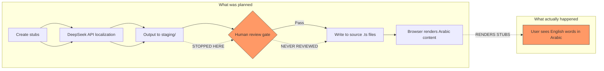

# Arabic Content Overhaul Plan — 3-Phase Execution

**Status:** DRAFT
**Purpose:** Fix all Arabic content quality issues — eliminate English words, replace stub content, achieve native Emirati/Gulf Arabic tone, and optimize for Arabic search
**Prerequisite:** [`plans/arabic-market-domination-reconciled-plan.md`](plans/arabic-market-domination-reconciled-plan.md) — this plan supplements rather than replaces the reconciled plan

---
## Golden Rule: English Approval Page Structure → Arabic Fidelity

Every Arabic approval page **must mirror the exact 13-section structure** of the English approval pages, with identical SEO/GEO/AEO tactics applied to Arabic content. The Arabic template at [`src/app/ar/approvals/[slug]/page.tsx`](src/app/ar/approvals/[slug]/page.tsx:110) already renders all 13 sections — the data layer (`approvals-ar.ts`, `guides-ar.ts`, `services-ar.ts`) is what needs to be fixed.

Each Arabic page is written **one page at a time** to guarantee structural perfection, not bulk-generated.

### Section Mapping Matrix — English SEO Structure → Arabic Content

| # | English Section | SEO/GEO Tactic | Arabic Section | Arabic Content Requirement |
|---|---|---|---|---|
| **Schema** | JSON-LD stack: Service + WebPage + FAQPage + HowTo + BreadcrumbList | Structured data drives AIO/GEO. Google AI Overviews, ChatGPT Search, Perplexity all parse schema. | Same schema stack with `"ar"` locale. [`line 125-143`](src/app/ar/approvals/%5Bslug%5D/page.tsx:125) | Arabic FAQPage text must match visible FAQ text word-for-word. HowTo steps must match visible process. |
| **1** | Hero / Direct Answer Block | **Direct answer block = most AI-quoted content.** Self-contained 2-3 sentence answer that makes sense with zero surrounding context. | [`S1 lines 199-248`](src/app/ar/approvals/%5Bslug%5D/page.tsx:199) | H1 = `ar.primaryKeyword`. Direct answer states: what, who requires it, timeline. No pronouns referencing external text. |
| **2** | At-a-Glance Stats Strip | **Numbers are #1 most quoted content by AI engines.** 4 stat facts: authority, timeline, mandatory for, documents. | [`S2 line 253`](src/app/ar/approvals/%5Bslug%5D/page.tsx:253) | Stats are English structural data — must add Arabic stat labels in data layer. Currently falls back to English. |
| **3** | What Is This Approval? | Entity-first content. Define acronym/name in first paragraph. Full name + abbreviation consistently. | [`S3 lines 255-270`](src/app/ar/approvals/%5Bslug%5D/page.tsx:255) | H2 = `ما هي {ar.shortName}؟`. Description: 150-250 words with natural Arabic flow, not English calque. |
| **4** | Who Needs This? | Bullet-point list for AI parsing. Targeted at user intent "do I need this?" | [`S4 lines 272-296`](src/app/ar/approvals/%5Bslug%5D/page.tsx:272) | 4-7 bullets with `ar.whoNeedsIt`. Each bullet = complete sentence with natural Arabic syntax. |
| **5** | Documents & Requirements Table | **HTML tables parse beautifully by AI models.** Concrete document names + description + source. | [`S5 lines 298-304`](src/app/ar/approvals/%5Bslug%5D/page.tsx:298) | All document names and descriptions in native Arabic. Disclaimer in Arabic. |
| **6** | Step-by-Step Process | HowTo schema + numbered steps. AI extracts process steps for "how to" queries. | [`S6 line 309`](src/app/ar/approvals/%5Bslug%5D/page.tsx:309) | 5-8 steps with `ar.process`. Step titles and descriptions in native Arabic. |
| **7** | Timeline & Cost Table | Data-driven queries. Pricing/timeline transparency builds E-E-A-T Trustworthiness. | [`S7 lines 311-317`](src/app/ar/approvals/%5Bslug%5D/page.tsx:311) | Timeline entries with Arabic labels. Cost values use Arabic numerals. Disclaimer in Arabic. |
| **8** | Common Rejection Reasons | E-E-A-T Experience signal. Specific rejection reasons show operational depth. | [`S8 line 322`](src/app/ar/approvals/%5Bslug%5D/page.tsx:322) | 3-5 reasons with `ar.rejectionReasons`. Reason + explanation in native Arabic. |
| **9** | Real Project Example (Case Study) | E-E-A-T Experience. Anonymized real project demonstrates practical knowledge. | [`S9 line 327`](src/app/ar/approvals/%5Bslug%5D/page.tsx:327) | Case study in Arabic. Project type, challenge, solution, outcome — all localized. |
| **10** | Why Choose Wasleen | E-E-A-T Authority + Trust. Credentials and success metrics. | [`S10 lines 329-335`](src/app/ar/approvals/%5Bslug%5D/page.tsx:329) | 3-5 reasons with `ar.whyChooseUs`. First-person native Arabic ("نحن في وسلين نضمن...") not third-person translation. |
| **11** | FAQ Block (5-8 questions) | FAQPage schema. AI extracts Q&A pairs for answer queries. Each answer must be self-contained. | [`S11 lines 337-346`](src/app/ar/approvals/%5Bslug%5D/page.tsx:337) | 5-8 Q&A pairs with `ar.faqs`. Questions in natural Arabic dialect. Answers 2-3 sentences, complete without context. |
| **12** | Related Approvals + Related Guides | Internal linking: topic clusters, descriptive anchor text. All related content cross-links. | [`S12 lines 348-436`](src/app/ar/approvals/%5Bslug%5D/page.tsx:348) | Uses English structural data (`approval.relatedSlugs`) but renders Arabic display names from `ar.shortName`. Need to verify all /ar/ links resolve. |
| **13** | Call to Action | Conversion. Category-specific CTA text. | [`S13 line 441`](src/app/ar/approvals/%5Bslug%5D/page.tsx:441) | Uses [`CTASectionArabic`](src/components/sections/CTASectionArabic.tsx). Verify Arabic CTA text is persuasive, not translated. |

### SEO/GEO Content Tactics per Section

| Tactic | Sections Affected | Arabic Implementation |
|---|---|---|
| **Direct Answer Extraction** | S1, S11 | Every ~150-200 words needs a quotable fact. Direct answer must make sense in isolation. AI overviews will lift this verbatim. |
| **Table Structure for AI Parsing** | S5, S7 | HTML `<table>` with `<th>` headers. AI models parse tables well for data queries. |
| **Numbered Facts** | S2, S7 | Numbers are the #1 most quoted content type. Every page must have concrete numbers in Arabic. |
| **Self-Contained Answers** | S3, S11 | Each paragraph and FAQ answer must read independently. No "as mentioned above" or cross-references. |
| **Comparison Content** | S4, S8 | AI engines favor content that clearly distinguishes categories. Make who-needs-it and rejection reasons distinct per page. |
| **Entity-First Content** | S1, S3, S5 | Define the authority/acronym in the first paragraph. "الدفاع المدني بدبي DCD هي..." |
| **E-E-A-T Signals** | S8, S9, S10 | Specific rejection reasons, real case studies, transparent credentials — all in native Arabic. |
| **Internal Linking** | S12 | Every page links to 3-5 related Arabic approval pages and 2-4 related Arabic guides with descriptive anchor text. |

### Verification: Structural Parity

- [ ] All 52 Arabic approval pages render all 13 sections (check by inspecting each /ar/approvals/{slug} page)
- [ ] H1 contains Arabic primary keyword, not English fallback
- [ ] All 13 section H2/H3 headings are in Arabic
- [ ] Tables (documents, timeline) have Arabic column headers
- [ ] FAQ questions are in Arabic, not English
- [ ] Related approvals show Arabic short names, not English
- [ ] CTA text is in Arabic, not English
- [ ] Breadcrumb labels are in Arabic
- [ ] Category badge shows Arabic category label
- [ ] Schema JSON-LD uses Arabic text for FAQPage and HowTo

### Per-Page Writing Mandate

Each of the **52 approval pages** must be written **one by one** following this checklist:

1. Copy English page data as reference
2. Write Arabic `directAnswer` — self-contained, quotable, native tone
3. Write Arabic `description` — 150-250 words, entity-first
4. Write Arabic `whoNeedsIt` — 4-7 bullets
5. Write Arabic `documents` — names + descriptions
6. Write Arabic `process` — 5-8 steps with titles + descriptions
7. Write Arabic `timelineTable` — entries with Arabic labels
8. Write Arabic `rejectionReasons` — 3-5 reasons + explanations
9. Write Arabic `caseStudy` — project type, challenge, solution, outcome
10. Write Arabic `whyChooseUs` — 3-5 bullets, first-person native tone
11. Write Arabic `faqs` — 5-8 Q&A pairs
12. Set Arabic `primaryKeyword` + `secondaryKeywords`
13. Verify all 13 sections render correctly in browser

---
## Known Structural Parity Issues (Must Fix)

The following issues prevent the Arabic pages from achieving full structural parity with English pages. These must be fixed during Phase 1 before any copywriting begins.

### Issue 1: StatsStrip Shows English Labels on Arabic Pages

**Location:** [`src/app/ar/approvals/[slug]/page.tsx:253`](src/app/ar/approvals/%5Bslug%5D/page.tsx:253) passes `approval.stats` (English) to `<StatsStrip>`

**Root cause:** The [`ApprovalArabicContent`](src/types/index.ts:207-242) type does NOT include a `stats` field. The Arabic template falls back to English structural data for Section 2.

**Impact:** Arabic pages display stat labels like "Authority" instead of "الجهة المختصة", "Timeline" instead of "المدة التقريبية", etc. This breaks the Arabic-only requirement and reduces AI quotability for Arabic search.

**Fix options:**
| Option | Description | Effort |
|--------|-------------|--------|
| **A (Recommended)** | Add `stats: StatFact[]` to `ApprovalArabicContent` and populate with Arabic-labeled StatFacts in data. Also update [`getIconKey()`](src/components/sections/StatsStrip.tsx:48) to match Arabic labels. | Medium |
| **B** | Keep English stats but update the `getIconKey()` to also match Arabic. Stats values (numbers) are universal. Only labels need Arabic. | Low |

**Files to change:**
- [`src/types/index.ts`](src/types/index.ts) — Add `stats: StatFact[]` to `ApprovalArabicContent`
- [`src/components/sections/StatsStrip.tsx`](src/components/sections/StatsStrip.tsx:48) — Add Arabic label matching to `getIconKey()`
- [`src/data/approvals-ar.ts`](src/data/approvals-ar.ts) — Add Arabic-labeled `stats` for all 52 entries
- [`src/app/ar/approvals/[slug]/page.tsx`](src/app/ar/approvals/%5Bslug%5D/page.tsx:253) — Change `approval.stats` to `ar.stats`

### Issue 2: Category Badge Label

**Location:** [`src/app/ar/approvals/[slug]/page.tsx:223`](src/app/ar/approvals/%5Bslug%5D/page.tsx:223) calls `getArabicCategoryLabel(approval.category)`

**Status:** This already uses `AR.categories` from constants. Verify all category labels exist in Arabic. Phase 4.1 covers this.

### Issue 3: Stats Values Reference English Fields

**Location:** [`src/app/ar/approvals/[slug]/page.tsx:240-244`](src/app/ar/approvals/%5Bslug%5D/page.tsx:240) uses `approval.typicalTimeline` and `approval.typicalCostRange` for the hero quick-info badges.

**Impact:** These are English strings like "5-10 business days" and "AED 500 - 3,000". The labels are already Arabic ("المدة التقريبية", "التكلفة التقريبية") but the VALUES are in English.

**Fix:** Add `typicalTimeline` and `typicalCostRange` fields to `ApprovalArabicContent` type with Arabic equivalents. Or accept numbers as universal (timeline values like "5-10 أيام عمل" would need Arabic).

---

## Current State Summary
| Metric | Value |
|--------|-------|
| Arabic approval pages required | 52 |
| Arabic guide pages required | 30+ |
| Arabic service pages required | 5 |
| Source files with stub content | 3 files (2800 + 539 + 173 lines) |
| Staging files with DeepSeek-localized content | 3 JSON files (10,876 + 742 + 527 lines) |
| Pipeline completeness | **70%** — scripts exist + API output generated, but review gate & write-back never executed |

---

## Root Cause Diagram



---

## Phase 1: Pipeline Completion — Write DeepSeek Content to Source Files

**Goal:** Get proper Arabic content rendering in the browser by completing the stalled pipeline. This is a mechanical task — no creative writing required.

**Gate to pass before Phase 2:** Parity script passes; 5 sample Arabic pages render without English words in titles/headings.

### 1.1 Populate Arabic Slugs

**Problem:** In both the stub files AND the staging JSON, `ar.slug` contains English values (e.g., `"dubai-civil-defense-approval"`) instead of Arabic (e.g., `"موافقة-الدفاع-المدني-دبي"`).

**Action:** Generate proper Arabic slugs for all 52 + 30 + 5 entries using a deterministic mapping.

**Mapping rules:**
| English Slug | Arabic Slug |
|---|---|
| `dubai-municipality-building-permit` | `موافقة-بلدية-دبي-للبناء` |
| `dubai-civil-defense-approval` | `موافقة-الدفاع-المدني-دبي` |
| `dewa-approval` | `موافقة-هيئة-كهرباء-ومياه-دبي` |
| `rta-approval` | `موافقة-هيئة-الطرق-والمواصلات` |
| ... 84 more | ... 84 more |

**Files:** 
- [`scripts/generate-arabic-slugs.js`](scripts/generate-arabic-slugs.js) — New script
- [`src/data/approvals-ar.ts`](src/data/approvals-ar.ts) — Update `ar.slug` fields
- [`src/data/guides-ar.ts`](src/data/guides-ar.ts) — Update `ar.slug` fields  
- [`src/data/services-ar.ts`](src/data/services-ar.ts) — Update `ar.slug` fields

### 1.2 Update Arabic Route Components

**Problem:** The Arabic approval page at [`src/app/ar/approvals/[slug]/page.tsx`](src/app/ar/approvals/[slug]/page.tsx) currently uses the **English slug** for routing (line 53: `return approvals.map((approval) => ({ slug: approval.slug }))`). It finds Arabic content via `approvalsAr.find((a) => a.slug === slug)` using English slugs.

Since we're keeping the route parameter as English (matching the top-level `slug`), the routing logic is actually fine — it finds the `ApprovalArabicEntry` by its English `slug` field, then pulls the `ar` object. The `ar.slug` is only used for hreflang and canonical references.

**But** we need to verify the hreflang and canonical URLs use the correct Arabic slug. Check that:
- [`src/app/ar/approvals/[slug]/page.tsx`](src/app/ar/approvals/[slug]/page.tsx) uses `ar.slug` in hreflang alternates
- [`src/lib/schema.ts`](src/lib/schema.ts) uses `ar.slug` in Arabic canonical references

**Files to verify:**
- [`src/app/ar/approvals/[slug]/page.tsx`](src/app/ar/approvals/[slug]/page.tsx)
- [`src/app/ar/guides/[slug]/page.tsx`](src/app/ar/guides/[slug]/page.tsx)
- [`src/app/ar/services/[slug]/page.tsx`](src/app/ar/services/[slug]/page.tsx)
- [`src/lib/schema.ts`](src/lib/schema.ts)
- [`src/app/sitemap.ts`](src/app/sitemap.ts)

### 1.3 Write Staging Content into Source Files

**Action:** Convert the staging JSON content into TypeScript format and write it to the source `.ts` files.

**Process:**
1. Take each entry from [`scripts/staging/approvals-ar.json`](scripts/staging/approvals-ar.json)
2. Add `slug` field (top-level English slug) matching the JSON key
3. Replace `ar.slug` with the Arabic slug from Step 1.1
4. Write as TypeScript export into [`src/data/approvals-ar.ts`](src/data/approvals-ar.ts)
5. Repeat for guides and services

**Format (after conversion):**

```typescript
// src/data/approvals-ar.ts
import type { ApprovalArabicEntry } from "@/types";

export const approvals: ApprovalArabicEntry[] = [
  {
    slug: "dubai-civil-defense-approval",
    ar: {
      slug: "موافقة-الدفاع-المدني-دبي",
      name: "موافقة الدفاع المدني بدبي",
      shortName: "موافقة الدفاع المدني",
      authorityFull: "الدفاع المدني بدبي",
      authorityAbbr: "DCD",
      primaryKeyword: "موافقة الدفاع المدني بدبي",
      secondaryKeywords: [
        "موافقة الدفاع المدني دبي",
        "تصريح الدفاع المدني دبي",
        "موافقة السلامة من الحرائق دبي",
      ],
      directAnswer: "موافقة الدفاع المدني بدبي (DCD) هي تصريح إلزامي للسلامة من الحرائق...",
      // ... all fields from staging JSON
    },
  },
  // ... 51 more
];
```

**Files (replace entirely):**
- [`src/data/approvals-ar.ts`](src/data/approvals-ar.ts) — 2800 lines → ~10,876 lines of proper content
- [`src/data/guides-ar.ts`](src/data/guides-ar.ts) — 539 lines → ~742 lines of proper content
- [`src/data/services-ar.ts`](src/data/services-ar.ts) — 173 lines → ~527 lines of proper content

### 1.4 Verify Parity

**Action:** Run the existing parity validation script:

```bash
node scripts/validate-ar-parity.js
```

**Expected result:** Exit code 0. All 52 approvals, 30+ guides, 5 services have matching Arabic entries.

**Verify render:** Check 5 sample Arabic pages in the browser — confirm NO English words appear in:
- Page titles (H1)
- Body content (direct answer, descriptions)
- FAQ questions/answers
- Navigation labels
- Category labels

### 1.5 Verification Gate Checklist

- [ ] Parity script passes (exit code 0) — ALL English entries have Arabic counterparts
- [ ] `/ar/approvals/موافقة-الدفاع-المدني-دبي` renders with: H1 = `"موافقة الدفاع المدني بدبي"` (no English)
- [ ] `/ar/approvals/موافقة-هيئة-كهرباء-ومياه-دبي` renders with: H1 = `"موافقة هيئة كهرباء ومياه دبي"` (no English)
- [ ] `/ar/` homepage renders with Arabic content
- [ ] `/ar/guides/` hub renders with Arabic guide titles
- [ ] `/ar/services/` hub renders with Arabic service names
- [ ] Zero English words in any visible Arabic heading or title
- [ ] `npm run build` completes without TypeScript errors

---

## Phase 2: Native Emirati/Gulf Arabic Copywriting

**Goal:** Upgrade the DeepSeek-generated content from "competent translation" to "natively written Emirati/Gulf Arabic." This is a creative/editorial task requiring human expertise.

**Gate to pass before Phase 3:** Native Arabic reviewer signs off on 5 representative pages.

### 2.1 Understand the Quality Gap

**What DeepSeek produces (current staging content):**

> "موافقة الدفاع المدني بدبي (DCD) هي تصريح إلزامي للسلامة من الحرائق والسلامة الحياتية مطلوب لجميع مشاريع البناء في دبي."

This is **correct Arabic** but reads like a translation. It uses:
- Formal MSA (Modern Standard Arabic) sentence structures
- Direct calques from English (e.g., "السلامة الحياتية" for "life safety")
- Generic phrasing that doesn't sound like a local expert wrote it

**What native Emirati/Gulf Arabic should sound like:**

> "موافقة الدفاع المدني بدبي (DCD) هي تصريح لا غنى عنه للسلامة من الحرائق، ولا يمكن لأي مشروع بناء في دبي تجاوزه. يشترط الدفاع المدني مراجعة أنظمة الحماية من الحرائق ومخارج الطوارئ وأنظمة الإنذار قبل منح شهادة الإشغال النهائية."

Key differences:
- Natural Arabic phrasing (لا غنى عنه, يشترط, منح)
- Authority names in official Arabic forms
- Terminology consistent with Dubai government usage
- Sentence flow that doesn't follow English word order

### 2.2 Arabic Copywriting Style Guide

**Rules for native Emirati/Gulf Arabic content:**

| Rule | ❌ Bad (Translation) | ✅ Good (Native) |
|-------|---------------------|------------------|
| **Authority names** | "هيئة كهرباء ومياه دبي" (correct, but use full official name) | "هيئة كهرباء ومياه دبي (ديوا)" — always include the Arabic abbreviation |
| **Process descriptions** | "تقديم جميع المستندات المطلوبة عبر البوابة الإلكترونية" | "يتم رفع الطلب إلكترونياً عبر بوابة البلدية مع إرفاق كامل المستندات المطلوبة" |
| **Timeline language** | "تستغرق المعالجة عادة" | "تتراوح المدة الزمنية المعتادة بين..." |
| **CTA / persuasive text** | "تقدم وسلين ليمينال للاستشارات المعتمدة مساعدة شاملة" | "نحن في وسلين ليمينال نضمن لك تجربة سلسة ومعالجة احترافية لطلبك" |
| **FAQ answers** | "موافقة الدفاع المدني بدبي هي تصريح إلزامي للسلامة من الحرائق..." | "موافقة الدفاع المدني بدبي هي تصريح رسمي يثبت التزام منشأتك باشتراطات السلامة من الحرائق في إمارة دبي." |
| **Numbers & Currency** | "500 – 2,000 درهم إماراتي" | "من 500 إلى 2,000 درهم إماراتي" |
| **Reflexive phrasing** | "يتم إصدارها من قبل السلطة المختصة" | "تصدرها الجهة المختصة بعد استيفاء المتطلبات" |

### 2.3 Content Priority Matrix

Not all content needs the same level of native copywriting investment. Prioritize by SEO impact and user visibility:

| Priority | Content Type | Count | Effort | Method |
|----------|-------------|-------|--------|--------|
| **P0** | Approval names, short names, H1 titles | 52 | Low (52 entries × 2 fields) | Native copywriter or human review |
| **P0** | Direct answer blocks (AI-extracted) | 52 | Medium (52 × 3 sentences) | DeepSeek rewrite + human polish |
| **P0** | FAQ questions & answers | 52 × 5-9 = ~350 | High | Native copywriter |
| **P1** | Descriptions & whoNeedsIt | 52 × 2 fields | Medium | DeepSeek rewrite with stricter prompt |
| **P1** | WhyChooseUs | 52 | Low | 3-4 bullet points each |
| **P2** | Process steps | 52 × 5-7 = ~300 | High | Template-based with keyword insertion |
| **P2** | Timeline & cost tables | 52 | Low | Numbers only, minimal text change |
| **P3** | Rejection reasons | 52 × 3-5 = ~200 | Medium | Template with specific details |
| **P3** | Case studies | ~20 | Medium | Per-case creative writing |

### 2.4 Execution Strategy

**Option A: DeepSeek + Human Polish (Recommended)**

1. **Enhance the DeepSeek system prompt** in [`scripts/lib/localize-utils.js`](scripts/lib/localize-utils.js:54) with:
   - Specific examples of native vs translated phrasing
   - Forbidden patterns (e.g., "يتم إصدارها من قبل", "تقدم وسلين مساعدة شاملة")
   - Required patterns (e.g., "نحن في وسلين نضمن", "تصدرها الجهة المختصة")
   - Prescribed official Arabic names for all authorities
   - Instruction to avoid parenthetical English on first mention for Arabic-only content

2. **Re-run localization scripts** with enhanced prompt:
   ```bash
   node scripts/localize-approvals.js --force --review  # Output to staging
   node scripts/review-localization.js --sample         # Generate spot-check
   ```

3. **Human polish pass** on P0 and P1 content:
   - Native Arabic speaker reviews all direct answers + FAQs
   - Corrects phrasing, naturalizes tone, verifies authority names
   - Signs off per the review checklist

4. **Write back** to source files after human sign-off

**Option B: Full Native Copywriter (Highest Quality, Most Expensive)**

1. Engage a freelance Emirati/Gulf Arabic copywriter (Upwork, ProZ, local Dubai talent)
2. Provide the English source content + the DeepSeek output as reference
3. Copywriter rewrites all P0 and P1 content natively
4. Expected timeline: 2-3 weeks for 52 + 30 + 5 pages
5. Estimated cost: $1,500-3,000 USD

### 2.5 Verification Gate Checklist

- [ ] 5 representative approval pages reviewed by native Arabic speaker
- [ ] Zero instances of "يتم إصدارها من قبل" or similar calque patterns
- [ ] All authority names use official Arabic forms
- [ ] FAQ answers are self-contained (2-3 sentences, no pronouns referring to previous text)
- [ ] Direct answer blocks are quotable by AI engines without needing surrounding context
- [ ] CTA text sounds natural and persuasive, not translated
- [ ] No English words remain in any Arabic content field
- [ ] Git diff reviewed before writing to source files

---

## Phase 3: Arabic Keyword Research & SEO Optimization

**Goal:** Replace placeholder keywords with real, researched Arabic search terms that drive traffic from Google and AI search engines.

**Gate to pass before Phase 4:** All 52 approval pages have unique, non-cannibalizing Arabic primary keywords mapped from research.

### 3.1 Arabic Keyword Research Pipeline

**Tooling:**
1. **Google Keyword Planner** (UAE geo, Arabic language filter) — primary tool
2. **Google Search Console** — Arabic query data (if available)
3. **Manual Google search** — "People also ask" in Arabic for each approval type
4. **ChatGPT Search + Perplexity** — Arabic query testing

**Process per English seed keyword:**

```
1. English keyword: "dubai civil defense approval"
       │
       ▼
2. Generate Arabic variants (5-8):
   - موافقة الدفاع المدني دبي
   - تصريح الدفاع المدني دبي
   - شهادة السلامة من الحرائق دبي
   - موافقة الدفاع المدني للمباني دبي
   - كم تكلفة موافقة الدفاع المدني دبي
   - مستندات الدفاع المدني دبي
       │
       ▼
3. Check search volume (Keyword Planner)
   - Prioritize by volume + intent match
       │
       ▼
4. Map one primary keyword per Arabic page
   - Must NOT duplicate another Arabic page's primary keyword
   - Must NOT duplicate any English page's primary keyword
       │
       ▼
5. Assign secondary keywords (3-5 per page)
   - Long-tail variations
   - Question-form queries (for AI search)
   - Related terms
```

### 3.2 Keyword Cannibalization Prevention

**Critical rule:** No two pages on the site (English OR Arabic) may target the same primary keyword.

**Cross-language check:**
- English page `/approvals/dewa-approval` targets "DEWA approval Dubai"
- Arabic page `/ar/approvals/موافقة-هيئة-كهرباء-ومياه-دبي` targets "موافقة هيئة كهرباء ومياه دبي"
- These are DIFFERENT keywords (different languages) — no cannibalization
- But Arabic page `موافقة-الدفاع-المدني-دبي` and English page `dubai-civil-defense-approval` — also different languages, no issue

**Intra-Arabic check:**
- `موافقة الدفاع المدني دبي` (primary for DCD page)
- `تصريح الدفاع المدني دبي` (secondary for DCD page, NOT used as primary for any other page)
- If another page also uses `موافقة الدفاع المدني دبي` as primary → cannibalization → fix

### 3.3 Update SEO Metadata

Once keywords are researched, update these fields in each Arabic entry:

```typescript
ar: {
  primaryKeyword: "موافقة الدفاع المدني بدبي",     // ← From research
  secondaryKeywords: [                             // ← From research
    "تصريح الدفاع المدني دبي",
    "شهادة السلامة من الحرائق دبي",
    "كم تكلفة موافقة الدفاع المدني دبي",
    "مستندات الدفاع المدني المطلوبة دبي",
  ],
}
```

These are consumed by [`src/app/ar/approvals/[slug]/page.tsx`](src/app/ar/approvals/[slug]/page.tsx:68):
```typescript
const seoTitle = `${ar.primaryKeyword} | ${AR.siteShortName}`.substring(0, 60);
const description = `${ar.directAnswer.substring(0, 150)} اتصل بنا اليوم للحصول على استشارة مجانية.`;
```

### 3.4 Arabic Meta Description Optimization

**Problem:** Current Arabic meta descriptions end with `اتصل بنا اليوم للحصول على استشارة مجانية.` for every page — this is not unique and wastes characters.

**Fix:** For each page, craft a unique meta description in Arabic (140-160 chars) that:
1. States the primary benefit
2. Includes one concrete number (timeline, cost range, document count)
3. Uses natural Arabic CTA (not templated)
4. Fits within 160 chars

**Example:**
> "موافقة الدفاع المدني بدبي إلزامية لجميع مشاريع البناء. نوفر لك استشارات متخصصة وإعداد المستندات ومتابعة التقديم — خبرة 8 سنوات ونسبة نجاح 98%. احصل على موافقتك الآن."

### 3.5 Verification Gate Checklist

- [ ] All 52 + 30 + 5 Arabic pages have unique primary keywords
- [ ] No keyword cannibalization within Arabic pages (automated check via script)
- [ ] No keyword cannibalization between EN and AR pages (SAM file)
- [ ] Meta titles ≤ 60 chars for all Arabic pages
- [ ] Meta descriptions 140-160 chars for all Arabic pages (not templated)
- [ ] Each description contains at least one concrete number
- [ ] Primary keywords appear in H1 of respective pages
- [ ] Secondary keywords naturally distributed across H2s
- [ ] Output: `plans/arabic-keyword-map.json`

---

## Phase 4: Additional Content Fixes (Bonus)

### 4.1 Fix Category Labels in Arabic

**Problem:** [`src/types/index.ts`](src/types/index.ts:25) defines `APPROVAL_CATEGORIES` with English labels only. The Arabic page at [`src/app/ar/approvals/[slug]/page.tsx`](src/app/ar/approvals/[slug]/page.tsx:101-103) uses `AR.categories` to translate them, but these may not exist or may be inaccurate.

**Action:** Verify and update `AR.categories` in [`src/lib/constants.ts`](src/lib/constants.ts) with proper Arabic category names:

| English Category | Arabic Translation |
|-----------------|-------------------|
| Government & Regulatory | الجهات الحكومية والتنظيمية |
| Free Zone Approvals | موافقات المناطق الحرة |
| Developer & Community | المطورون والمجتمعات السكنية |
| Property & Registration | الملكية والتسجيل العقاري |
| Technical & Utility | الخدمات الفنية والمرافق |
| Trade, Food & Hospitality | التجارة والغذاء والضيافة |
| Fit-Out & Construction | التشطيبات والبناء |
| Drawing & Documentation | الرسومات والتوثيق الهندسي |

### 4.2 Fix Breadcrumb Labels

**Problem:** Arabic breadcrumbs use `AR.breadcrumb.home` and `AR.breadcrumb.approvals` — verify these exist and are correct Arabic.

### 4.3 Fix Content for Hub Pages

**Problem:** The Arabic hub pages (`/ar/approvals`, `/ar/guides`, `/ar/services`) may also have stub content.

**Action:** Check [`src/app/ar/approvals/page.tsx`](src/app/ar/approvals/page.tsx) and others for any remaining English/placeholder text.

---

## Execution Summary

```
Phase 1 (Pipeline Completion) — 1-2 days
├── 1.1 Generate Arabic slugs
├── 1.2 Verify route components use slugs correctly
├── 1.3 Write staging JSON to source .ts files
├── 1.4 Validate parity + render check
└── ✅ Gate: Zero English in Arabic headings

Phase 2 (Native Copywriting) — 1-3 weeks
├── 2.1 Enhance DeepSeek system prompt
├── 2.2 Re-run localization with --force --review
├── 2.3 Human review + polish (P0 content first)
├── 2.4 Write finalized content to source files
└── ✅ Gate: Native speaker sign-off on 5 pages

Phase 3 (Arabic SEO) — 1 week
├── 3.1 Arabic keyword research (all 87 pages)
├── 3.2 Cannibalization audit
├── 3.3 Update primaryKeyword + secondaryKeywords
├── 3.4 Craft unique meta descriptions
└── ✅ Gate: Keyword map + no cannibalization

Phase 4 (Polish) — 1-2 days
├── 4.1 Fix Arabic category labels
├── 4.2 Verify breadcrumb labels
├── 4.3 Fix hub page content
└── ✅ Done
```

---

## Risk Register

| Risk | Likelihood | Impact | Mitigation |
|------|-----------|--------|------------|
| Staging JSON is out of sync with current English data | Medium | High | Run parity check + content hash diff before writing. Re-localize any entries where English source changed since staging was generated. |
| DeepSeek still produces poor Arabic even with enhanced prompt | Medium | High | Mandatory human review on all P0 content (names, direct answers, FAQs). Fall back to Option B (full native copywriter) if quality is unacceptable. |
| Arabic slug changes break existing hreflang/canonical links | Medium | Medium | Use `scripts/validate-ar-parity.js` to verify slug consistency. Auto-generate hreflang from slug pairs — never hand-author. |
| Length mismatch — Arabic text is ~30% longer than English | High | Low | Test all Arabic pages at 360px viewport for overflow. Tables with Arabic text need wider columns. |
| English data files change during Phase 2-3 work | Low | Medium | Work on a feature branch. Re-run parity check before merge to production. |

---

## Files That Will Change

| File | Change | Phase |
|------|--------|-------|
| [`src/data/approvals-ar.ts`](src/data/approvals-ar.ts) | Full rewrite — staging JSON content + Arabic slugs | 1 |
| [`src/data/guides-ar.ts`](src/data/guides-ar.ts) | Full rewrite — staging JSON content + Arabic slugs | 1 |
| [`src/data/services-ar.ts`](src/data/services-ar.ts) | Full rewrite — staging JSON content + Arabic slugs | 1 |
| [`src/lib/constants.ts`](src/lib/constants.ts) | Add/verify Arabic category labels, breadcrumb labels | 4 |
| [`src/types/index.ts`](src/types/index.ts) | Add Arabic category type if needed | 4 |
| [`scripts/lib/localize-utils.js`](scripts/lib/localize-utils.js) | Enhanced DeepSeek system prompt | 2 |
| New: `plans/arabic-keyword-map.json` | Arabic keyword research output | 3 |
