# Arabic Market Domination — RECONCILED IMPLEMENTATION PLAN
**Status:** FINAL — resolves all conflicts between `arabic-market-domination-refined-plan.md`, `arabic-seo-technical-addendum.md`, `roocode-build-directive-for-arabic-seo-pages.md`, and `arabic-seo-master-implementation.md`
**Authority:** Where conflicts exist, `roocode-build-directive-for-arabic-seo-pages.md` is authoritative
**Target:** #1 ranking in Arabic search + AI search engine dominance for Dubai approval queries

---

## Conflict Resolution Summary

| # | Issue | My Refined Plan (WRONG) | Corrected Approach (Authoritative) | Source |
|---|-------|------------------------|------------------------------------|--------|
| 1 | Route architecture | `[locale]` dynamic segment, all pages under `/en/...`, redirect `/` → `/en/` | **English routes UNCHANGED** at root. Arabic added as physically separate `src/app/ar/` tree. No URL changes to existing English pages. | Build Directive 🔴 |
| 2 | Middleware | Accept-Language auto-redirect, cookie-based root redirect | **NO Accept-Language auto-redirect. NO root redirect.** Middleware only normalizes `/ar` → `/ar/`. Language switcher is the ONLY way to switch. | Build Directive + Addendum §B |
| 3 | Data model | Parallel files (`approvals-ar.ts`) — approved ✅ | Approved but **MUST ADD** parity validation script (`scripts/validate-ar-parity.js`) | Build Directive ➕ |
| 4 | English regression gate | **MISSING** — not in any phase | **ADD**: Lighthouse + link check on 5 English URLs at end of EVERY phase. Any >2 point Performance drop = blocking failure. | Build Directive ➕ |
| 5 | Deployment strategy | **MISSING** — vague mention in Phase 8 | **ADD**: Feature branch → Vercel preview → single merge to production after Phase 7. Revert capability for 2 weeks post-launch. | Build Directive ➕ |
| 6 | Build sequence | 9 phases, no explicit gates | **GATED** sequence: each phase has specific pass/fail gate before next phase can begin | Build Directive |
| 7 | Hreflang generation | Custom `<HreflangTags>` component | **Next.js native `alternates.languages` metadata API** — cleaner, less error-prone at 100+ pages | Addendum §J |
| 8 | Sitemap | Mentions "sitemap index" (contradictory) | **Single `sitemap.ts`** with `alternates.languages` — not dual sitemaps | Addendum §I |
| 9 | Phase ordering | UI localization (Phase 3) after content (Phase 2) | **UI chrome/nav localization + fonts + CSS audit in Phase 0** — before content generation | Addendum §L |
| 10 | Phase 0 gate | Parity script only — missing CSS regression risk | **Phase 0 gate expands to TWO checks**: parity script passes, AND English regression gate passes after CSS logical-properties conversion (Phase 0.5 touches every shared component). | User approval refinement #1 |
| 11 | Shared boilerplate drift | Two layout.tsx files wiring GTM/analytics/schema independently | **Extract shared head boilerplate** into `src/lib/site-config.ts` — a single `renderSitewideHead(locale)` function both layouts call with a locale param. Prevents GTM ID / tracking pixel drift. | User approval refinement #2 |
| 12 | RTL behavior mechanism | JS conditionals (`if (locale === 'ar')`) inside shared components | **CSS `[dir="rtl"]` selectors** instead. CSS-attribute-driven RTL is inert for English by construction — zero code path touches English behavior. | User approval refinement #3 |
| 13 | BASE_URL source | `process.env.NEXT_PUBLIC_SITE_URL` fallback in constants.ts | **Hardcode BASE_URL** as a string literal. Never derive from VERCEL_URL or env vars that could leak preview-domain canonicals. | User approval refinement #4 |

---

## Phase 0: Foundation (Build First — Everything Depends On This)

**Gate to pass before Phase 1 (TWO checks):**
1. Parity validation script passes on empty/stub Arabic data.
2. **English regression gate passes** — Lighthouse + link check on 5 baseline English URLs after the CSS logical-properties conversion (Phase 0.5). This catches visual regressions from `left-0` → `start-0` conversions before any Arabic code is introduced. A single wrong conversion that breaks English layout silently is the highest-risk regression in this entire build.

### 0.1 Data Parity Validation Script

Create `scripts/validate-ar-parity.js` — runs in CI on every PR touching `src/data/*`:

- Confirms every entry in `approvals.ts` has a matching entry in `approvals-ar.ts` (by stable `id` field — add one if missing)
- Fails the build if any English entry has no Arabic counterpart
- Same for `guides` and `services`
- Validates that Arabic slugs in `-ar.ts` files are non-empty and unique

**Files:** Create `scripts/validate-ar-parity.js`

### 0.2 Parallel Arabic Data Files (Approved from refined plan)

**Current state:** Content lives in:
- [`src/types/index.ts`](src/types/index.ts) — English-only interfaces
- [`src/data/approvals.ts`](src/data/approvals.ts) — 7337 lines, 52 approvals
- [`src/data/guides.ts`](src/data/guides.ts) — 965 lines, 30+ guides
- [`src/data/services.ts`](src/data/services.ts) — 5 services

**Action:** Add `ar?: { ... }` optional field to `ApprovalData`, `GuideData`, `ServiceData` in types. Create parallel Arabic data files:

```typescript
// In ApprovalData, add:
ar?: {
  id: string;                      // Matches English id for parity check
  slug: string;                    // Arabic-script slug (e.g., "موافقة-ديوا")
  name: string;                    // Arabic name
  shortName: string;
  authorityFull: string;
  authorityAbbr: string;
  primaryKeyword: string;
  secondaryKeywords: string[];
  directAnswer: string;
  description: string;
  whoNeedsIt: string[];
  documents: DocumentRequirement[];
  process: ProcessStep[];
  timelineTable: TimelineEntry[];
  rejectionReasons: RejectionReason[];
  caseStudy: CaseStudy | null;
  whyChooseUs: string[];
  faqs: FAQItem[];
}
```

Same pattern for `GuideData.ar` and `ServiceData.ar`.

**Files:**
- [`src/types/index.ts`](src/types/index.ts) — Add `ar?` field to all interfaces
- Create `src/data/approvals-ar.ts` — Arabic versions of all 52 approvals (stub content initially, filled in Phase 2)
- Create `src/data/guides-ar.ts` — Arabic versions of all 30+ guides (stub content)
- Create `src/data/services-ar.ts` — Arabic versions of all 5 services (stub content)

### 0.3 Arabic Font Configuration

**Current state:** [`src/app/layout.tsx`](src/app/layout.tsx) loads Montserrat, Roboto, Roboto Mono with `subsets: ["latin"]`.

**Action:** Add Arabic font via `next/font/google`:

```typescript
const notoSansArabic = Noto_Sans_Arabic({
  subsets: ["arabic"],
  weight: ["400", "500", "700"],
  variable: "--font-noto-sans-arabic",
  display: "swap",
});
```

> **Font choice:** Noto Sans Arabic (broader glyph coverage, good for UAE government/legal content). Applied only on Arabic layout via CSS variable.

**Files:**
- Create `src/lib/fonts.ts` — locale-aware font utility
- [`src/app/ar/layout.tsx`](src/app/ar/layout.tsx) — Apply `--font-noto-sans-arabic` variable

### 0.4 Arabic UI Constants

**Current state:** [`src/lib/constants.ts`](src/lib/constants.ts) has `SITE`, `NAP`, `SOCIAL`, `LOCALE`, `HUB_SLUGS` — all English.

**Action:** Add `AR` export with translated strings for:
- Navigation labels (home, approvals, services, guides, about us, contact us)
- Footer sections and labels
- CTA text
- Language switcher labels
- Breadcrumb labels
- Category labels (8 categories translated)
- Form labels and placeholders

**Files:** [`src/lib/constants.ts`](src/lib/constants.ts)

### 0.5 CSS Logical Properties Audit

**Scope:** Audit and convert ALL physical directional properties to logical properties across the ENTIRE codebase.

**Physical → Logical mapping (Tailwind v3.3+):**
| Physical | Logical | Example |
|----------|---------|---------|
| `left-*` / `right-*` | `start-*` / `end-*` | `left-0` → `start-0` |
| `ml-*` / `mr-*` | `ms-*` / `me-*` | `ml-4` → `ms-4` |
| `pl-*` / `pr-*` | `ps-*` / `pe-*` | `pr-8` → `pe-8` |
| `border-l-*` / `border-r-*` | `border-s-*` / `border-e-*` | |
| `text-left` / `text-right` | `text-start` / `text-end` | |
| `translate-x-*` | Direction-aware conditional | |

**Files to audit (complete list):**
- [`src/app/globals.css`](src/app/globals.css) — animation keyframes using `translateX`, `left`/`right`
- [`src/components/layout/Header.tsx`](src/components/layout/Header.tsx) — `left-0 right-0` → `inset-inline-0`
- [`src/components/layout/Footer.tsx`](src/components/layout/Footer.tsx) — all padding/margin
- [`src/components/layout/MobileNav.tsx`](src/components/layout/MobileNav.tsx) — `right-0`, `translate-x-full`
- [`src/components/layout/MegaMenu.tsx`](src/components/layout/MegaMenu.tsx) — positioning
- ALL [`src/components/sections/*`](src/components/sections/) — every component
- ALL [`src/components/ui/*`](src/components/ui/) — every component
- [`src/components/drawings/*`](src/components/drawings/) — animation transforms

> **Command:** `find src -name "*.tsx" -o -name "*.ts" -o -name "*.css" | xargs grep -n "left-\|right-\|ml-\|mr-\|pl-\|pr-\|border-l-\|border-r-\|text-left\|text-right\|float-left\|float-right\|translate-x"` — count must reach ZERO before launch.

### 0.6 Hardcode BASE_URL (Prevents Preview-Domain Canonical Leakage)

**Current state:** [`src/lib/constants.ts`](src/lib/constants.ts:7) uses:
```typescript
url: process.env.NEXT_PUBLIC_SITE_URL || "https://www.dubaiapprovalconsultants.com",
```

This is dangerous — if `NEXT_PUBLIC_SITE_URL` is set to a Vercel preview domain (e.g., `arabic-market-git-feature.vercel.app`), that domain leaks into `og:image`, canonical URLs, and sitemap entries.

**Fix:** Hardcode as a string literal:
```typescript
export const SITE = {
  url: "https://www.dubaiapprovalconsultants.com",
  // ...
} as const;
```

Any per-environment URL needs (e.g., preview builds) are handled by Vercel's own automatic canonical handling — never in application code. The env var should only be used for non-SEO values like API endpoints.

**Files affected:** [`src/lib/constants.ts`](src/lib/constants.ts)

### 0.7 Extract Shared Layout Boilerplate (Prevents Silent Drift)

**Problem:** English `layout.tsx` and Arabic `src/app/ar/layout.tsx` will each independently wire up GTM, analytics initialization, and sitewide schema injection. Six months from now, someone updates a GTM ID in one layout and forgets the other — silent drift.

**Fix:** Create `src/lib/site-config.ts` that exports a single function both layouts call:

```typescript
// src/lib/site-config.ts
export function renderSitewideHead(locale: 'en' | 'ar') {
  return {
    gtmId: GTM_ID,                                    // single source of truth
    gaId: GA_MEASUREMENT_ID,                          // single source of truth
    sitewideSchema: [organizationSchema(locale), websiteSchema(locale)],  // locale-aware
    googleTagManager: <GoogleTagManager gtmId={GTM_ID} />,
  };
}
```

Both `layout.tsx` files import this single function. Any future update (new tracking pixel, changed GTM ID, additional schema) happens in one place.

**Files affected:**
- Create `src/lib/site-config.ts`
- [`src/app/layout.tsx`](src/app/layout.tsx) — refactor to use shared function
- [`src/app/ar/layout.tsx`](src/app/ar/layout.tsx) — use same shared function

### 0.8 Locale Utility Library

Create `src/lib/locale.ts` with helpers:

```typescript
export function isArabic(locale: string): boolean;
export function getLang(locale: string): string;        // "ar-AE" | "en-AE"
export function getDir(locale: string): "rtl" | "ltr";
export function getOgLocale(locale: string): string;     // "ar_AE" | "en_AE"
export function getLocalizedData<T>(data: T & { ar?: any }, locale: string): T | any;
```

**Files:** Create `src/lib/locale.ts`

---

## Phase 1: Route Architecture & Middleware (Arabic Route Tree)

**Gate to pass before Phase 2:** English regression gate passes on 5 URLs; `/ar/` returns 200 with placeholder content.

### 1.1 Create Arabic Route Tree (Physically Separate)

**CRITICAL: English routes stay EXACTLY as they are.** No re-parenting. No redirects. No URL changes.

```
src/app/
├── layout.tsx                        ← EXISTING — UNCHANGED (lang="en-AE", Montserrat/Roboto, GTM, schema)
├── page.tsx                          ← EXISTING — UNCHANGED
├── approvals/[slug]/page.tsx         ← EXISTING — UNCHANGED
├── guides/[slug]/page.tsx            ← EXISTING — UNCHANGED
├── services/[slug]/page.tsx          ← EXISTING — UNCHANGED
├── about-us/page.tsx                 ← EXISTING — UNCHANGED
├── contact-us/page.tsx               ← EXISTING — UNCHANGED
├── ar/                               ← NEW — Arabic route tree
│   ├── layout.tsx                    ← NEW — lang="ar-AE", dir="rtl", Arabic font, Arabic Header/Footer
│   ├── page.tsx                      ← NEW — Arabic homepage
│   ├── approvals/
│   │   ├── page.tsx                  ← NEW — Arabic approvals hub
│   │   └── [slug]/page.tsx           ← NEW — Arabic approval detail
│   ├── guides/
│   │   ├── page.tsx                  ← NEW — Arabic guides hub
│   │   └── [slug]/page.tsx           ← NEW — Arabic guide detail
│   ├── services/
│   │   ├── page.tsx                  ← NEW — Arabic services hub
│   │   └── [slug]/page.tsx           ← NEW — Arabic service detail
│   ├── about-us/page.tsx             ← NEW — Arabic about us
│   └── contact-us/page.tsx           ← NEW — Arabic contact us
├── middleware.ts                     ← NEW — limited scope (see 1.2)
```

**Arabic layout (`src/app/ar/layout.tsx`):**
- `<html lang="ar-AE" dir="rtl">`
- Applies `notoSansArabic.variable` CSS variable
- `font-family` defaults to Arabic font with Roboto/Montserrat fallback
- Renders `Header locale="ar"` and `Footer locale="ar"`
- Sitewide JSON-LD schema (Arabic versions)
- GTM/analytics (same IDs, locale-aware events)
- `og:locale: ar_AE`

### 1.2 Middleware (Limited Scope)

```typescript
// src/middleware.ts
export function middleware(req: NextRequest) {
  const { pathname } = req.nextUrl;
  // ONLY normalize /ar → /ar/ (trailing slash)
  if (pathname === '/ar') {
    return NextResponse.redirect(new URL('/ar/', req.url), 308);
  }
  return NextResponse.next();
}
export const config = { matcher: ['/ar', '/ar/:path*'] };
```

**What middleware does NOT do:**
- ❌ No Accept-Language-based auto-redirect
- ❌ No redirect of `/` to any locale
- ❌ No cookie-based redirect
- ❌ No locale detection or rewriting

**Language persistence strategy:**
- Language switcher (Phase 3) sets `NEXT_LOCALE` cookie on manual switch
- This cookie is used ONLY for UI preference memory (e.g., show dismissible "View in Arabic?" banner on return visits)
- NEVER used for auto-redirect

### 1.3 Arabic Page Components (Shared Logic via Imports)

Each Arabic page follows same pattern — imports shared utilities from `src/lib/`:

```typescript
// src/app/ar/approvals/[slug]/page.tsx
import { approvals } from '@/data/approvals-ar';  // Arabic data
import { approvalSchemaStack } from '@/lib/schema';
// ... same section components, just consuming Arabic data
```

**Files to create (12 new pages):**
- [`src/app/ar/layout.tsx`](src/app/ar/layout.tsx)
- [`src/app/ar/page.tsx`](src/app/ar/page.tsx)
- [`src/app/ar/approvals/page.tsx`](src/app/ar/approvals/page.tsx)
- [`src/app/ar/approvals/[slug]/page.tsx`](src/app/ar/approvals/%5Bslug%5D/page.tsx)
- [`src/app/ar/guides/page.tsx`](src/app/ar/guides/page.tsx)
- [`src/app/ar/guides/[slug]/page.tsx`](src/app/ar/guides/%5Bslug%5D/page.tsx)
- [`src/app/ar/services/page.tsx`](src/app/ar/services/page.tsx)
- [`src/app/ar/services/[slug]/page.tsx`](src/app/ar/services/%5Bslug%5D/page.tsx)
- [`src/app/ar/about-us/page.tsx`](src/app/ar/about-us/page.tsx)
- [`src/app/ar/contact-us/page.tsx`](src/app/ar/contact-us/page.tsx)

---

## Phase 2: Arabic Content Generation & Keyword Research

**Gate to pass before Phase 3:** Parity script passes on real data; human review sign-off on pricing/legal fields.

### 2.1 Arabic Keyword Research (Do in Parallel with Phase 0-1)

**Tooling:**
1. Google Keyword Planner (UAE geo, Arabic locale)
2. SEMrush / Ahrefs Arabic keyword database
3. Manual Google search (auto-suggest + "People also ask" in Arabic)

**Process per English seed keyword:**
1. Generate 5-8 Gulf Arabic variants using DeepSeek
2. Cross-check search volume via Keyword Planner API
3. Classify by intent: transactional / informational / navigational / commercial
4. Map one primary keyword cluster per Arabic page
5. Ensure NO cannibalization between EN and AR pages

**Output:** `plans/arabic-keyword-map.json`

### 2.2 DeepSeek Localization Pipeline

**Current state:** Original plan assumes `/content/en/` folder. Content is in `src/data/approvals.ts` etc.

**Action:** Build `scripts/localize-approvals.js` that:

1. Reads `src/data/approvals.ts` (English source)
2. For each entry, sends ALL text fields to DeepSeek API
3. DeepSeek system prompt (from master file §2 — adopted as-is):
   - Elite Emirati/Gulf Arabic business copywriter
   - NOT word-for-word translation — localized content
   - Preserves HTML, variables, numerals
   - Headings as real Arabic search queries
   - RTL-natural sentence structure
4. Writes output directly into `src/data/approvals-ar.ts` `ar` fields
5. Rate-limited queue with exponential backoff
6. `translation-manifest.json` with content hash diffing (skip unchanged entries)
7. `--review` flag outputs to staging folder first
8. **Mandatory human review halt** for: pricing pages, legal/compliance claims, government process pages

**Files:**
- Create `scripts/localize-approvals.js`
- Create `scripts/localize-guides.js`
- Create `scripts/localize-services.js`
- Create `scripts/translation-manifest.json`

### 2.3 Human Review Quality Gates

| Content Type | Review Required | Reviewer |
|---|---|---|
| Approval pages (pricing, timelines) | Mandatory — every field | Native Arabic speaker + domain expert |
| Approval pages (general description) | Spot-check 20% | Native Arabic speaker |
| Guide/Q&A pages | Spot-check 30% | Native Arabic speaker |
| Service pages (pricing) | Mandatory — every field | Native Arabic speaker + domain expert |
| Navigation, UI strings | Mandatory — every string | Native Arabic speaker |
| Schema content (FAQPage, HowTo) | Automated spot-check | Match visible content |

---

## Phase 3: UI Localization — Language Switcher, Nav, RTL

**Gate to pass before Phase 4:** English regression gate passes; manual switcher test both directions on 5 page types.

### 3.1 Language Switcher Component

Create `src/components/layout/LanguageSwitcher.tsx`:

- Lives in `Header.tsx` (visible, top-level — not buried in footer)
- Duplicated in `MobileNav.tsx` for mobile access
- Behavior: toggles between current page's EN/AR counterpart using slug mapping
- Implementation: `<Link>` using `usePathname()` + localized slug from data
- Accessibility: `hreflang` attribute on the switcher link, `aria-label` in target language
- Shows "English" (when on Arabic page) and "العربية" (when on English page)

**Pattern:**
```
Current: /approvals/dewa-approval → Click "العربية" → /ar/approvals/موافقة-ديوا
Current: /ar/approvals/موافقة-ديوا → Click "English" → /approvals/dewa-approval
```

**Files:** Create `src/components/layout/LanguageSwitcher.tsx`

### 3.2 Localize Header / MegaMenu / MobileNav / Footer

All four components need:
- `locale` prop passed from layout
- Navigation labels from `AR.nav` / `AR.footer` constants
- Links generated with correct locale prefix
- Category labels translated via `AR.categories`

**Files:**
- [`src/components/layout/Header.tsx`](src/components/layout/Header.tsx)
- [`src/components/layout/MegaMenu.tsx`](src/components/layout/MegaMenu.tsx)
- [`src/components/layout/MobileNav.tsx`](src/components/layout/MobileNav.tsx)
- [`src/components/layout/Footer.tsx`](src/components/layout/Footer.tsx)

### 3.3 RTL-Specific Component Behavior — CSS `[dir="rtl"]` Selectors, Not JS Conditionals

Components needing special attention for RTL:
1. **FAQ Accordion** — chevron rotation direction
2. **Stats Strip** — stat order
3. **Process Steps** — numbered step rendering
4. **Timeline/Cost Tables** — column order
5. **Cards with Icons** — icon placement relative to text
6. **Mega Menu Columns** — column order
7. **Search/Input Fields** — placeholder alignment

**IMPLEMENTATION RULE:** Implement ALL RTL-specific behavior using CSS `[dir="rtl"]` selectors, NOT JavaScript `if (locale === 'ar')` conditionals inside shared components.

```css
/* ✅ CORRECT — CSS-driven, inert for English by construction */
.chevron {
  transition: transform 0.2s;
}
[dir="rtl"] .chevron {
  transform: rotate(180deg);
}

/* ❌ WRONG — JS conditional touches English render path */
// if (locale === 'ar') { ... }  ← NEVER do this in shared components
```

**Why:** CSS-attribute-driven RTL behavior is inert for English rendering by construction — there is no code path that touches English behavior at all. A JS conditional inside a shared component is one more branch that could have a bug reachable from the English render path.

---

## Phase 4: Schema & Technical SEO — Bilingual JSON-LD, Hreflang, Sitemaps

**Gate to pass before Phase 5:** Google Rich Results Test validates both locales; hreflang reciprocity check (Screaming Frog or equivalent) shows zero errors.

### 4.1 Locale-Aware Schema Generators

**Current state:** [`src/lib/schema.ts`](src/lib/schema.ts) — English-only.

**Action:** Extend ALL schema generators to accept `locale: 'en' | 'ar'` parameter:

```typescript
// Pattern for every schema function
export function organizationSchema(locale: 'en' | 'ar' = 'en') {
  return {
    "@context": "https://schema.org",
    "@type": "Organization",
    "@id": locale === 'ar' 
      ? `${BASE}/ar/#organization` 
      : `${BASE}/#organization`,
    name: locale === 'ar' 
      ? "واصلين ليمينال لاستشارات الموافقات" 
      : NAP.companyName,
    // ...
    availableLanguage: ["en", "ar"],
  };
}
```

Functions to update:
- `organizationSchema()` — add locale param, Arabic name
- `websiteSchema()` — add locale param
- `webPageSchema()` — add locale param
- `serviceSchema()` — add locale param
- `faqPageSchema()` — Arabic FAQ content
- `howToSchema()` — Arabic process steps
- `qaPageSchema()` — Arabic Q&A
- `breadcrumbList()` — Arabic breadcrumb labels
- `approvalSchemaStack()` — locale-aware stack
- `guideSchemaStack()` — same
- `serviceSchemaStack()` — same
- `staticPageSchema()` — same
- `homepageSchema()` — same

**Files:** [`src/lib/schema.ts`](src/lib/schema.ts)

### 4.2 Hreflang via Next.js Native API (Not Custom Components)

Use Next.js `alternates.languages` metadata API in `generateMetadata` — this is the cleanest approach for 100+ pages:

```typescript
// In each page's generateMetadata
export async function generateMetadata({ params }): Promise<Metadata> {
  const data = getData(params.slug); // or load from data files
  
  return {
    alternates: {
      canonical: `https://www.dubaiapprovalconsultants.com${data.slug}`,
      languages: {
        'en-AE': `https://www.dubaiapprovalconsultants.com/${data.slug}`,
        'ar-AE': `https://www.dubaiapprovalconsultants.com/ar/${data.ar?.slug || data.slug}`,
        'x-default': `https://www.dubaiapprovalconsultants.com/${data.slug}`,
      },
    },
    openGraph: {
      locale: 'en_AE',
      // ...
    },
  };
}
```

**CRITICAL:** Hreflang must be **bidirectional and reciprocal** on every page pair. Auto-generated from the slug-pair config — never hand-authored.

### 4.3 Single Bilingual Sitemap (Not Sitemap Index)

```typescript
// src/app/sitemap.ts — single file with alternates.languages
export default function sitemap(): MetadataRoute.Sitemap {
  const entries: MetadataRoute.Sitemap = [];
  
  // English entries (unchanged root URLs)
  for (const approval of approvals) {
    entries.push({
      url: `${BASE_URL}/approvals/${approval.slug}`,
      lastModified: new Date(approval.lastUpdated),
      alternates: {
        languages: {
          'ar-AE': `${BASE_URL}/ar/approvals/${approval.ar?.slug || approval.slug}`,
        },
      },
    });
  }
  
  // Arabic entries
  for (const approval of approvals) {
    entries.push({
      url: `${BASE_URL}/ar/approvals/${approval.ar?.slug || approval.slug}`,
      lastModified: new Date(approval.lastUpdated),
      alternates: {
        languages: {
          'en-AE': `${BASE_URL}/approvals/${approval.slug}`,
        },
      },
    });
  }
  
  return entries; // Next.js auto-generates xhtml:link from alternates.languages
}
```

Same pattern for guides, services, static pages, and hubs.

**Files:** [`src/app/sitemap.ts`](src/app/sitemap.ts)

### 4.4 Update robots.ts

**Current:** Points to single `sitemap.xml`. No `Disallow: /ar/`.

**Action:** Confirm robots.ts allows `/ar/` and references `sitemap.xml` (the single bilingual sitemap).

**Files:** [`src/app/robots.ts`](src/app/robots.ts)

### 4.5 Fix OpenGraph Locale

Set `og:locale` dynamically per locale:
- English pages: `og:locale = "en_AE"`
- Arabic pages: `og:locale = "ar_AE"`

**Files:** [`src/app/ar/layout.tsx`](src/app/ar/layout.tsx), [`src/app/layout.tsx`](src/app/layout.tsx)

---

## Phase 5: AI Search (GEO) Optimization for Arabic

**Gate to pass before Phase 6:** Spot-check 5 Arabic pages against the answer-first structure rule.

### 5.1 Arabic Answer-First Content Blocks

Same GEO principles applied to Arabic pages:
1. Every Arabic page starts with 2-3 sentence direct answer in Arabic
2. Each H2 section self-contained (entity name included, no pronouns)
3. FAQPage schema matches visible Arabic FAQ text word-for-word
4. HowTo schema for approval process steps in Arabic

### 5.2 Arabic llms.txt & llms-full.txt

Create Arabic versions of the LLM-optimized text files:
- `src/app/ar/llms.txt/route.ts`
- `src/app/ar/llms-full.txt/route.ts`

**Files:** Create Arabic llms routes under `src/app/ar/llms.txt/`

### 5.3 Arabic Internal Linking Strategy

- Every Arabic approval page links to 3-5 other Arabic approval pages (data-driven)
- Every Arabic guide links to its parent Arabic approval page
- Every Arabic hub lists all Arabic child pages
- Cross-language links only when no Arabic equivalent exists

---

## Phase 6: Local SEO — GBP Arabic + Social Media

**Content/ops task — can run in parallel with Phases 3-5. No code gate required.**

### 6.1 Google Business Profile Arabic Setup

| Element | Action |
|---|---|
| Business Name (Arabic) | واصلين ليمينال لاستشارات الموافقات |
| Description | Human-reviewed DeepSeek-generated Arabic |
| Services | Add Arabic service names |
| Reviews | Encourage Arabic reviews |

### 6.2 NAP Consistency (Arabic)

Ensure `واصلين ليمينال لاستشارات الموافقات` is identical across:
- GBP Arabic description
- JSON-LD Organization schema (Arabic `name` field)
- Footer (if Arabic company name shown)
- Contact page Arabic version

### 6.3 Social Media Arabic Strategy

| Platform | Action |
|---|---|
| Instagram | Bilingual captions + Arabic hashtags |
| Facebook | Bilingual posting |
| LinkedIn | Arabic versions of key posts |
| TikTok | Native Arabic content |
| YouTube | Arabic titles/descriptions |

---

## Phase 7: Performance & QA — Full Lighthouse Matrix

**Gate to pass before Phase 8 (merge):** 95+ on all EN and AR page types; English regression gate passes one final time.

### 7.1 Test Matrix (Run After Every Deploy)

| Test Case | URL | Target |
|---|---|---|
| EN Homepage | `/` | 95+ |
| AR Homepage | `/ar/` | 95+ |
| EN Approval | `/approvals/dewa-approval` | 95+ |
| AR Approval | `/ar/approvals/موافقة-ديوا` | 95+ |
| EN Guide | `/guides/how-long-does-dda-approval-take` | 95+ |
| AR Guide | `/ar/guides/...` | 95+ |
| EN Service | `/services/2d-drawings` | 95+ |
| AR Service | `/ar/services/...` | 95+ |
| EN About | `/about-us` | 95+ |
| AR About | `/ar/about-us` | 95+ |

### 7.2 CLS Prevention for RTL (Watch Items)

1. **Font swap** — Preload Arabic font, `font-display: swap`
2. **Icon mirroring** — Ensure icons have explicit dimensions
3. **Table column width** — Arabic text is wider; test mobile overflow
4. **Mega Menu positioning** — Dropdown menus using `left: 0` will break in RTL
5. **Sticky header spacing** — Same physical property issues

### 7.3 Pre-Launch Checklist (Final)

- [ ] All 52 approval pages have Arabic versions (parity validation passes)
- [ ] All 30+ guide pages have Arabic versions
- [ ] All 5 service pages have Arabic versions
- [ ] All static pages have Arabic versions
- [ ] Navigation renders in Arabic on Arabic pages
- [ ] Language switcher works in both directions on all page types
- [ ] Hreflang tags are bidirectional and reciprocal (Screaming Frog check — zero errors)
- [ ] Canonical tags are correct per locale
- [ ] JSON-LD schema validates (Google Rich Results Test) for both locales
- [ ] Sitemap includes all Arabic URLs with alternate annotations
- [ ] Robots.txt allows `/ar/` crawling
- [ ] Lighthouse scores 95+ on ALL test cases above
- [ ] Google Search Console has sitemap submitted
- [ ] GBP has Arabic description and services
- [ ] Zero physical CSS properties remaining (`find src -name "*.tsx" -o -name "*.css" | xargs grep -c "left-\|right-\|ml-\|mr-\|pl-\|pr-\|text-left\|text-right"`)
- [ ] English regression gate passes one final time (5 URLs, <2 point drop from baseline)

---

## Phase 8: Launch & Monitoring

### 8.1 Deployment Strategy (CRITICAL)

```
feature/arabic-market branch
       │
       ├── Phase 0 → PR preview on Vercel
       ├── Phase 1 → PR preview on Vercel
       ├── Phase 2 → PR preview on Vercel
       ├── Phase 3 → PR preview on Vercel
       ├── Phase 4 → PR preview on Vercel
       ├── Phase 5 → PR preview on Vercel
       ├── Phase 6 → (ops, no code deploy)
       └── Phase 7 → FINAL QA on Vercel preview
                      │
                      ▼
           MERGE TO PRODUCTION (single deploy)
           Revert capability: 2 weeks minimum
```

**Rules:**
- All work on `feature/arabic-market` branch
- Deployed to Vercel preview URLs for testing
- Merge to production ONLY after Phase 7 passes in full
- Single deploy adds the `/ar/` tree — English routes are untouched by construction
- Keep ability to instantly revert (single commit revert) for 2 weeks post-launch

### 8.2 Post-Launch Monitoring (30-60-90 Day)

| Metric | Tool | Target | Check |
|---|---|---|---|
| Indexed pages (EN vs AR split) | GSC Coverage | ~1:1 parity within 4 weeks | Weekly |
| Arabic keyword rankings | GSC Performance | Top 10 within 90 days | Monthly |
| AI engine citation (Arabic) | Manual ChatGPT Search + Perplexity | Cited in >=1 AI engine | Monthly |
| Hreflang errors | GSC International Targeting | Zero errors | Weekly |
| PageSpeed (both locales) | PageSpeed Insights | 95+ both | After each deploy |
| Local pack visibility (Arabic) | GBP Insights | Appear for top 5 terms | Monthly |

### 8.3 Recurring GEO Audit (Monthly)

1. Take top 20 Arabic target queries
2. Query ChatGPT Search, Perplexity, Google AI Overviews
3. Check if Arabic pages are cited
4. If not cited → diagnose indexation first (GSC), then content quality
5. Log results in tracking sheet

---

## Architecture Diagrams

### Route Structure (Corrected)

```mermaid
flowchart TD
    subgraph "English Route Tree UNCHANGED"
        A1[src/app/layout.tsx] --> A2[src/app/page.tsx]
        A1 --> A3[src/app/approvals/[slug]/page.tsx]
        A1 --> A4[src/app/guides/[slug]/page.tsx]
        A1 --> A5[src/app/services/[slug]/page.tsx]
    end

    subgraph "Arabic Route Tree NEW"
        B1[src/app/ar/layout.tsx] --> B2[src/app/ar/page.tsx]
        B1 --> B3[src/app/ar/approvals/[slug]/page.tsx]
        B1 --> B4[src/app/ar/guides/[slug]/page.tsx]
        B1 --> B5[src/app/ar/services/[slug]/page.tsx]
    end

    subgraph "Shared Libraries src/lib/"
        C1[schema.ts] --> A1
        C1 --> B1
        C2[constants.ts] --> A1
        C2 --> B1
        C3[locale.ts] --> B1
        C4[analytics.ts] --> A1
        C4 --> B1
    end

    D[middleware.ts] --> E[Only normalize /ar to /ar/]
    D -.->|NO redirect| F[English root / is UNCHANGED]
```

### Middleware Flow (Corrected — Limited Scope)

```mermaid
flowchart TD
    A[Incoming request] --> B{Path starts with /ar?}
    B -->|No| C[Pass through - no action]
    B -->|Yes| D{Path is exactly /ar?}
    D -->|Yes| E[308 redirect to /ar/]
    D -->|No| F[Pass through - already /ar/...]
    C --> G[English page served as-is]
    E --> H[/ar/ page served]
    F --> H
    
    I[Language switcher clicked] --> J[Set NEXT_LOCALE cookie]
    J --> K[Navigate to /ar/... or /...]
    K --> L[Return visit to / shows banner if cookie = ar]
    L -.->|Banner, NOT redirect| M[Dismissible: View in Arabic?]
```

### Data Flow: English → Arabic Content

```mermaid
flowchart LR
    subgraph "English Data (UNCHANGED)"
        A1[src/data/approvals.ts] --> B1[English ApprovalData]
        A2[src/data/guides.ts] --> B2[English GuideData]
        A3[src/data/services.ts] --> B3[English ServiceData]
    end

    subgraph "Localization Pipeline"
        C[scripts/localize-approvals.js] --> D[DeepSeek API]
        D --> E[Arabic localized content]
        E --> F1[src/data/approvals-ar.ts]
        E --> F2[src/data/guides-ar.ts]
        E --> F3[src/data/services-ar.ts]
        G[scripts/validate-ar-parity.js] --> H{Parity check passes?}
        H -->|Yes| I[Build proceeds]
        H -->|No| J[Build FAILS]
    end

    subgraph "Static Generation"
        B1 --> K[generateStaticParams en]
        F1 --> L[generateStaticParams ar]
        K --> M[/approvals/dewa-approval]
        L --> N[/ar/approvals/موافقة-ديوا]
    end
```

### Build Sequence with Gates

```mermaid
flowchart TD
    P0[Phase 0: Foundation] --> G0{Gate: Parity script passes}
    G0 -->|Pass| P1[Phase 1: Route Tree + Middleware]
    G0 -->|Fail| P0
    
    P1 --> G1{Gate: English regression + /ar/ returns 200}
    G1 -->|Pass| P2[Phase 2: Content + Keywords]
    G1 -->|Fail| P1
    
    P2 --> G2{Gate: Parity on real data + human review}
    G2 -->|Pass| P3[Phase 3: UI Localization + RTL]
    G2 -->|Fail| P2
    
    P3 --> G3{Gate: English regression + switcher test}
    G3 -->|Pass| P4[Phase 4: Schema + Hreflang + Sitemap]
    G3 -->|Fail| P3
    
    P4 --> G4{Gate: Rich Results + Screaming Frog}
    G4 -->|Pass| P5[Phase 5: GEO + llms.txt]
    G4 -->|Fail| P4
    
    P5 --> G5{Gate: Spot-check Arabic GEO structure}
    G5 -->|Pass| P6[Phase 6: GBP + Social ops]
    G5 -->|Fail| P5
    
    P6 --> P7[Phase 7: Full Lighthouse Matrix]
    P7 --> G6{Gate: 95+ all pages + English regression final}
    G6 -->|Pass| P8[Phase 8: Merge to Production]
    G6 -->|Fail| P7
```



---

## Risk Register (Updated)

| Risk | Likelihood | Impact | Mitigation |
|---|---|---|---|
| English regression from shared component changes | Medium | Critical | English regression gate at EVERY phase — Lighthouse + link check on 5 URLs |
| DeepSeek API produces poor Arabic for government/legal content | Medium | High | Mandatory human review for pricing/legal pages. Spot-check 20% of remaining. |
| Arabic font causes CLS regression | High | Medium | Preload Arabic font with `font-display: swap`. Separate Lighthouse test for AR pages. |
| Hreflang reciprocity breaks after content updates | Medium | High | Auto-generate from single slug-pair config. Screaming Frog check at Phase 4 gate. Never hand-author. |
| Arabic content files become too large (7337 lines x 2 languages) | Medium | Medium | Split data files by category. Consider dynamic imports. |
| Google treats Arabic pages as duplicate content | Low | Critical | Distinct Arabic slugs, localized content (never translated), separate canonical URLs, bidirectional hreflang. |
| Parity drift between parallel data files | Medium | High | Parity validation script runs in CI on every PR. Fails build on mismatch. |
| RTL layout breakage not caught by English-only testing | High | Medium | Separate AR test cases in Lighthouse matrix. Full CSS logical properties audit. |

---

## Summary: Execution Order

```
Phase 0 (Foundation) → Gate → Phase 1 (Routes) → Gate → Phase 2 (Content) → Gate
→ Phase 3 (UI/RTL) → Gate → Phase 4 (SEO Schema) → Gate → Phase 5 (GEO) → Gate
→ Phase 6 (GBP ops) → Phase 7 (QA) → Gate → Phase 8 (Launch)
```

**Critical path items that block everything:**
1. ✅ Parity validation script (0.1) — must exist before any Arabic data is created
2. ✅ Add `ar?` field to types + create stub Arabic data files (0.2)
3. ✅ `src/app/ar/` route tree (1.1) — Arabic pages can't exist without this
4. ✅ Corrected middleware (1.2) — must be limited scope, no auto-redirect
5. ✅ Arabic layout with fonts + RTL (1.1) — must render before content goes live
6. ✅ Content localization pipeline (2.2) — generates all Arabic content
7. ✅ English regression gate — runs at end of EVERY phase

---

**End of reconciled plan.** This replaces `arabic-market-domination-refined-plan.md` as the authoritative build document.
