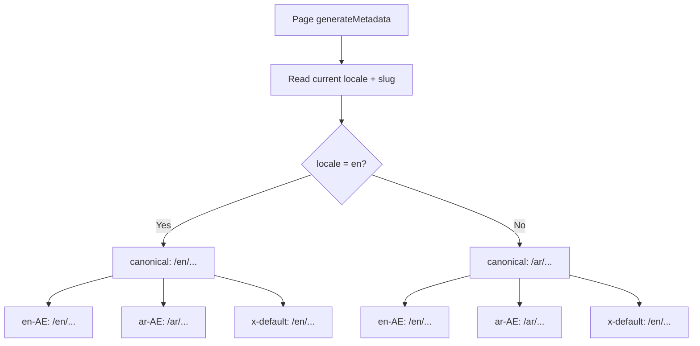

# Arabic Market Domination — Refined Implementation Blueprint
**Based on:** `plans/arabic-seo-master-implementation.md`
**Audit Date:** 2026-07-28
**Target:** #1 ranking in Arabic search + AI engine dominance for Dubai approval queries

---

## Table of Contents
1. [Executive Summary — What's Different From the Original Plan](#1-executive-summary)
2. [Phase 0: Foundation — Locale Infrastructure, Data Model, Fonts](#phase-0-foundation)
3. [Phase 1: Route Architecture — Route Groups, Middleware, Layout Hierarchy](#phase-1-route-architecture)
4. [Phase 2: Arabic Content Generation — Keyword Research, Localization Pipeline](#phase-2-arabic-content-generation)
5. [Phase 3: UI Localization — Header/Footer/Nav, Language Switcher, RTL CSS](#phase-3-ui-localization)
6. [Phase 4: Schema & Technical SEO — Bilingual JSON-LD, Hreflang, Sitemaps](#phase-4-schema--technical-seo)
7. [Phase 5: AI Search (GEO) Optimization for Arabic](#phase-5-ai-search-geo-optimization)
8. [Phase 6: Local SEO — GBP Arabic Optimization, Citations](#phase-6-local-seo)
9. [Phase 7: Performance & QA — Bilingual Lighthouse Audit](#phase-7-performance--qa)
10. [Phase 8: Launch, Monitoring & Recurring GEO Audit](#phase-8-launch--monitoring)
11. [Architecture Diagrams](#architecture-diagrams)
12. [Risk Register](#risk-register)

---

## 1. Executive Summary

### What Stays From the Original Plan
The original `arabic-seo-master-implementation.md` is **80% solid**. The following sections are excellent and will be adopted as-is:
- §0 Non-Negotiable Engineering Principles
- §1 URL & Site Architecture (subdirectory `/ar/`, Arabic-script slugs)
- §2 DeepSeek API localization pipeline concept (but with corrected data path)
- §3.1 Hreflang tag structure
- §3.2 `<html lang dir>` switch
- §5 On-Page Content Rules (Arabic)
- §6 Structured Data approach (separate JSON-LD per language)
- §7 AI Search GEO principles
- §8 GBP Arabic guidance
- §9 Zero-Bloat RTL Styling (logical properties)
- §10 Performance checklist
- §12 KPIs & Monitoring

### What's Being Added/Refined
| New Element | Description |
|---|---|
| **Middleware-based locale detection** | Cookie + `accept-language` header for first-visit routing |
| **Route group architecture** | `(en)` and `(ar)` route groups in App Router |
| **Bilingual data model** | Parallel Arabic data arrays alongside English |
| **Arabic font strategy** | Specific Google Font (Noto Sans Arabic / Tajawal) with `next/font` Arabic subsets |
| **Language switcher component** | Toggle in Header + Footer for `/ar/` ↔ `/en/` switching |
| **Translated nav/schema content map** | Complete Arabic translations for all UI strings, category labels, breadcrumb labels |
| **CSS logical properties audit** | File-by-file checklist of physical↔logical properties to convert |
| **RTL-aware component audit** | Every component checked for RTL compatibility |
| **Arabic keyword research workflow** | Specific tooling (Google Keyword Planner, SEMrush) and mapping table format |
| **GBP Arabic action items** | Exact Arabic name, category, services to add |
| **Social media Arabic strategy** | Platform-by-platform Arabic content approach |

---

## Phase 0: Foundation — Locale Infrastructure, Data Model, Fonts

### 0.1 Extend Data Model for Bilingual Content

**Current state:** [`src/types/index.ts`](src/types/index.ts) has `ApprovalData`, `GuideData`, `ServiceData` — all English-only.

**Action:**
Add Arabic content fields to all three interfaces. Use a parallel approach where Arabic data lives in a suffix field.

```typescript
// In ApprovalData, add:
ar?: {
  slug: string;                    // Arabic-script slug
  name: string;                    // Arabic name
  shortName: string;               // Arabic short name
  authorityFull: string;           // Arabic authority name
  authorityAbbr: string;           // Arabic abbreviation
  primaryKeyword: string;          // Arabic primary keyword
  secondaryKeywords: string[];     // Arabic secondary keywords
  directAnswer: string;            // Arabic direct answer
  description: string;             // Arabic description
  whoNeedsIt: string[];            // Arabic bullet points
  documents: DocumentRequirement[];// Arabic documents
  process: ProcessStep[];          // Arabic process steps
  timelineTable: TimelineEntry[];  // Arabic timeline
  rejectionReasons: RejectionReason[];// Arabic rejection reasons
  caseStudy: CaseStudy;            // Arabic case study
  whyChooseUs: string[];           // Arabic why choose us
  faqs: FAQItem[];                 // Arabic FAQs (critical for FAQPage schema)
}
```

Same pattern for `GuideData.ar` and `ServiceData.ar`.

**Files affected:** [`src/types/index.ts`](src/types/index.ts)

### 0.2 Create Parallel Arabic Data Files

**Current state:** Content lives in `src/data/approvals.ts` (7337 lines), `src/data/guides.ts` (965 lines), `src/data/services.ts`.

**Action:**
Create separate Arabic data files:
- `src/data/approvals-ar.ts` — Arabic versions of all 52 approvals
- `src/data/guides-ar.ts` — Arabic versions of all 30+ guides
- `src/data/services-ar.ts` — Arabic versions of all 5 services

These export arrays matching the same types but populated with Arabic content. Each entry's `ar` field is populated.

**Files affected:** 
- Create `src/data/approvals-ar.ts`
- Create `src/data/guides-ar.ts`
- Create `src/data/services-ar.ts`

### 0.3 Add Arabic Font Configuration

**Current state:** [`src/app/layout.tsx`](src/app/layout.tsx:17-36) loads Montserrat, Roboto, Roboto Mono with `subsets: ["latin"]`.

**Action:**
Add an Arabic-optimized font. Recommended: **Noto Sans Arabic** (covers Arabic + Latin, variable weight, good RTL support) or **Tajawal** (popular for UAE business sites, clean professional look).

```typescript
// Add to layout.tsx
const notoSansArabic = Noto_Sans_Arabic({
  subsets: ["arabic"],
  weight: ["400", "500", "700"],
  variable: "--font-noto-sans-arabic",
  display: "swap",
});
```

Create a locale-aware font configuration utility at `src/lib/fonts.ts` that exports the correct font class based on locale.

**Files affected:**
- [`src/app/layout.tsx`](src/app/layout.tsx)
- Create `src/lib/fonts.ts`

### 0.4 Extend Constants for Arabic Translations

**Current state:** [`src/lib/constants.ts`](src/lib/constants.ts) has `SITE`, `NAP`, `SOCIAL`, `LOCALE`, `HUB_SLUGS` — all English.

**Action:**
Add Arabic translations for all sitewide strings:

```typescript
export const AR = {
  siteName: "واصلين ليمينال لاستشارات الموافقات",
  tagline: "خبراء موافقات دبي",
  nav: {
    home: "الرئيسية",
    approvals: "الموافقات",
    services: "الخدمات",
    guides: "الأدلة والإرشادات",
    aboutUs: "من نحن",
    contactUs: "اتصل بنا",
  },
  footer: {
    services: "الخدمات",
    governmentApprovals: "الموافقات الحكومية",
    freeZoneApprovals: "موافقات المناطق الحرة",
    fitoutInterior: "التشطيبات والديكور الداخلي",
    companyContact: "الشركة والاتصال",
    viewAll: "عرض الكل",
    ourLocations: "مواقعنا",
    rightsReserved: "جميع الحقوق محفوظة",
  },
  cta: {
    getFreeConsultation: "احصل على استشارة مجانية",
    callUs: "اتصل بنا",
    contactUs: "تواصل معنا",
  },
  language: {
    switchToEnglish: "English",
    switchToArabic: "العربية",
    currentLanguage: "العربية",
  },
  breadcrumbs: {
    home: "الرئيسية",
    approvals: "الموافقات",
    guides: "الأدلة",
    services: "الخدمات",
    aboutUs: "من نحن",
    contactUs: "اتصل بنا",
  },
  // Category labels translated
  categories: {
    "government-regulatory": "الحكومية والتنظيمية",
    "free-zone": "المناطق الحرة",
    "developer-community": "المطورين والمجتمعات",
    "property-registration": "التسجيل العقاري",
    "technical-utility": "الفنية والخدماتية",
    "trade-food-hospitality": "التجارة والغذاء والضيافة",
    "fit-out-construction": "التشطيبات والإنشاءات",
    "drawing-documentation": "الرسومات والتوثيق",
  },
} as const;
```

**Files affected:** [`src/lib/constants.ts`](src/lib/constants.ts)

---

## Phase 1: Route Architecture — Route Groups, Middleware, Layout Hierarchy

### 1.1 Restructure Routes with Route Groups

**Current state:** Flat structure under `src/app/`.

```
src/app/
├── layout.tsx           ← Single root layout (lang="en-AE")
├── page.tsx             ← English homepage
├── approvals/[slug]/page.tsx  ← English approval pages
├── guides/[slug]/page.tsx     ← English guides
└── services/[slug]/page.tsx   ← English services
```

**Target state:**

```
src/app/
├── [locale]/            ← Dynamic locale segment
│   ├── layout.tsx       ← Locale-aware root layout (reads [locale] param)
│   ├── page.tsx         ← Homepage (EN or AR based on locale)
│   ├── approvals/
│   │   ├── page.tsx     ← Approvals hub
│   │   └── [slug]/page.tsx  ← Approval detail page
│   ├── guides/
│   │   ├── page.tsx     ← Guides hub
│   │   └── [slug]/page.tsx  ← Guide detail page
│   ├── services/
│   │   ├── page.tsx     ← Services hub
│   │   └── [slug]/page.tsx  ← Service detail page
│   ├── about-us/page.tsx
│   └── contact-us/page.tsx
├── middleware.ts         ← Locale detection, redirect, cookie management
├── layout.tsx            ← Minimal root layout (just html/body wrapper)
```

**IMPORTANT:** Existing `src/app/layout.tsx` needs to be split:
- Move root-level concerns (fonts, metadata defaults, GTM, schema) into `src/app/[locale]/layout.tsx`
- Keep `src/app/layout.tsx` as a thin wrapper that just provides `<html>`/`<body>` tags and lets the locale layout handle language-specific rendering

**Files affected:**
- Move/refactor [`src/app/layout.tsx`](src/app/layout.tsx) → `src/app/[locale]/layout.tsx`
- Create `src/app/middleware.ts`
- Refactor ALL page files to accept `params.locale`

### 1.2 Create Middleware (`src/middleware.ts`)

Purpose:
1. Check for `locale` cookie on every request
2. If no cookie, detect from `Accept-Language` header (prefer `ar-AE` if Arabic is top preference)
3. Default to `en` if no preference detected
4. Redirect `/` → `/{locale}/` on first visit
5. Redirect `/ar` → `/ar/` (trailing slash normalization)
6. Set `locale` cookie on language switch
7. Skip locale detection for `/api/`, `/_next/`, `/favicon.ico`, etc.

```typescript
// Pseudocode for src/middleware.ts
import { NextResponse } from "next/server";
import type { NextRequest } from "next/server";

const LOCALES = ["en", "ar"] as const;
const DEFAULT_LOCALE = "en";

function getLocale(request: NextRequest): string {
  // Check cookie first
  const cookieLocale = request.cookies.get("NEXT_LOCALE")?.value;
  if (cookieLocale && LOCALES.includes(cookieLocale as any)) return cookieLocale;
  
  // Check Accept-Language header
  const acceptLang = request.headers.get("accept-language");
  if (acceptLang?.startsWith("ar")) return "ar";
  
  return DEFAULT_LOCALE;
}

export function middleware(request: NextRequest) {
  const { pathname } = request.nextUrl;
  
  // Skip non-page routes
  if (pathname.startsWith("/_next") || pathname.startsWith("/api") || 
      pathname.startsWith("/favicon") || pathname.match(/\.\w+$/)) return;
  
  // Check if pathname already has a locale prefix
  const pathnameHasLocale = LOCALES.some(
    (locale) => pathname.startsWith(`/${locale}/`) || pathname === `/${locale}`
  );
  
  if (pathnameHasLocale) return;
  
  // Redirect to locale-prefixed path
  const locale = getLocale(request);
  request.nextUrl.pathname = `/${locale}${pathname === "/" ? "" : pathname}`;
  return NextResponse.redirect(request.nextUrl);
}

export const config = {
  matcher: ["/((?!_next|api|favicon).*)", "/(en|ar)?/"],
};
```

**Files affected:**
- Create `src/middleware.ts`
- Update `next.config.ts` if needed for trailing slash config

### 1.3 Create Locale-Aware Root Layout

**Current state:** Single layout with hardcoded `lang="en-AE"`.

**Target:** Layout at `src/app/[locale]/layout.tsx` that:
1. Reads `params.locale` from the route segment
2. Sets `<html lang={locale === "ar" ? "ar-AE" : "en-AE"} dir={locale === "ar" ? "rtl" : "ltr"}>`
3. Loads the correct font (Montserrat/Roboto for `en`, Noto Sans Arabic for `ar`)
4. Conditionally renders GTM, schema, analytics
5. Renders Header/Footer with locale-aware navigation
6. Sets `og:locale` dynamically

```typescript
// src/app/[locale]/layout.tsx (pseudocode)
export default async function LocaleLayout({
  children,
  params,
}: {
  children: React.ReactNode;
  params: Promise<{ locale: string }>;
}) {
  const { locale } = await params;
  const isArabic = locale === "ar";
  
  return (
    <html lang={isArabic ? "ar-AE" : "en-AE"} dir={isArabic ? "rtl" : "ltr"}
          className={`${montserrat.variable} ${roboto.variable} ${arabicFont.variable}`}>
      <body className={isArabic ? "font-arabic" : "font-roboto"}>
        <Header locale={locale} />
        <main id="main-content">{children}</main>
        <Footer locale={locale} />
        {/* Analytics, GTM, Schema — locale-aware */}
      </body>
    </html>
  );
}
```

**Files affected:**
- Create `src/app/[locale]/layout.tsx`
- Simplify `src/app/layout.tsx` to minimal wrapper

### 1.4 Update All Page Components

Every page that uses `generateStaticParams` needs to return params for BOTH locales:

```typescript
// approvals/[slug]/page.tsx
export function generateStaticParams() {
  const enSlugs = approvals.map((a) => ({ locale: "en", slug: a.slug }));
  const arSlugs = approvals.map((a) => ({ locale: "ar", slug: a.ar?.slug || a.slug }));
  return [...enSlugs, ...arSlugs];
}
```

Same for guides and services pages.

**Files affected:**
- [`src/app/approvals/[slug]/page.tsx`](src/app/approvals/%5Bslug%5D/page.tsx)
- [`src/app/guides/[slug]/page.tsx`](src/app/guides/%5Bslug%5D/page.tsx)
- [`src/app/services/[slug]/page.tsx`](src/app/services/%5Bslug%5D/page.tsx)
- All static page components (about-us, contact-us, not-found, hub pages)

### 1.5 Create Locale Utility Library

Create `src/lib/locale.ts` with helper functions:

```typescript
export function isArabic(locale: string): boolean {
  return locale === "ar";
}

export function getLang(locale: string): string {
  return locale === "ar" ? "ar-AE" : "en-AE";
}

export function getDir(locale: string): "rtl" | "ltr" {
  return locale === "ar" ? "rtl" : "ltr";
}

export function getOgLocale(locale: string): string {
  return locale === "ar" ? "ar_AE" : "en_AE";
}

export function getAlternateHref(path: string, targetLocale: string): string {
  // Convert /en/approvals/dm-approval → /ar/approvals/dm-approval
  return path.replace(/^\/(en|ar)/, `/${targetLocale}`);
}

export function getLocalizedSlug(approval: ApprovalData, locale: string): string {
  return locale === "ar" && approval.ar?.slug ? approval.ar.slug : approval.slug;
}
```

**Files affected:**
- Create `src/lib/locale.ts`

---

## Phase 2: Arabic Content Generation — Keyword Research, Localization Pipeline

### 2.1 Arabic Keyword Research

Before generating ANY Arabic content, build the keyword-to-page map.

**Tooling:**
1. Google Keyword Planner (UAE geo, Arabic locale)
2. SEMrush / Ahrefs (Arabic keyword database)
3. Manual Google search (auto-suggest + "People also ask" in Arabic)

**Process per English seed keyword:**
1. Generate 5-8 Gulf Arabic variants using DeepSeek (as per §4 of original plan)
2. Cross-check each variant's search volume via Keyword Planner API
3. Classify by intent: transactional / informational / navigational / commercial
4. Map one primary keyword cluster per Arabic page
5. Ensure NO cannibalization between EN and AR pages targeting the same intent

**Output:**
A mapping table (Google Sheets or JSON):
```json
{
  "dewa-approval": {
    "en": { "primaryKeyword": "DEWA approval Dubai", "slug": "dewa-approval" },
    "ar": { "primaryKeyword": "موافقة ديوا دبي", "slug": "موافقة-ديوا", "variants": ["تصريح ديوا", "موافقة هيئة كهرباء دبي", "استخراج موافقة ديوا"] }
  }
}
```

**Files affected:**
- Create `plans/arabic-keyword-map.json` (or similar)

### 2.2 Arabic Content Localization Pipeline

**Current state:** Original plan assumes `/content/en/` folder. Actual content is in `src/data/approvals.ts` etc.

**Corrected approach:**
Build a Node.js script (`scripts/localize-approvals.js`) that:

1. Reads `src/data/approvals.ts`
2. For each approval entry, extracts all text fields
3. Sends each to DeepSeek API (with the system prompt from §2 of original plan)
4. Receives localized Arabic text
5. Outputs a corresponding entry for `src/data/approvals-ar.ts`

**Script requirements:**
- Rate-limited queue with exponential backoff (avoid 429s)
- `translation-manifest.json` with content hash diffing (skip unchanged entries)
- `--review` flag outputs to staging folder first
- Halt on pricing/legal pages for mandatory human review
- Logs diff report for spot-checking

**Critical: The DeepSeek system prompt from the original plan is excellent. Adopt it as-is.**

**Files affected:**
- Create `scripts/localize-approvals.js`
- Create `scripts/localize-guides.js`
- Create `scripts/localize-services.js`
- Create `scripts/translation-manifest.json`

### 2.3 Human Review & Quality Gates

| Content Type | Review Required | Reviewer |
|---|---|---|
| Approval pages (pricing, timelines) | Mandatory — every field | Native Arabic speaker + domain expert |
| Approval pages (general description) | Spot-check 20% | Native Arabic speaker |
| Guide/Q&A pages | Spot-check 30% | Native Arabic speaker |
| Service pages (pricing) | Mandatory — every field | Native Arabic speaker + domain expert |
| Navigation, UI strings | Mandatory — every string | Native Arabic speaker |
| Schema (FAQPage, HowTo) | Mandatory — match visible content | Automated + spot-check |

---

## Phase 3: UI Localization — Header/Footer/Nav, Language Switcher, RTL CSS

### 3.1 Create Language Switcher Component

New component at `src/components/layout/LanguageSwitcher.tsx`:

- Dropdown or toggle button in Header (next to CTA on desktop, in mobile nav)
- Displays current language and allows switching
- Uses `next/navigation` to navigate to the same path in the other locale
- Each option has hreflane annotations for SEO
- Accessible: `aria-label="Switch language to Arabic/English"`

```typescript
// Behavior:
// Current: /en/approvals/dewa-approval → Click "العربية" → /ar/approvals/موافقة-ديوا
// Current: /ar/approvals/موافقة-ديوا → Click "English" → /en/approvals/dewa-approval
```

**Files affected:**
- Create `src/components/layout/LanguageSwitcher.tsx`

### 3.2 Localize Header Navigation

**Current state:** [`Header.tsx`](src/components/layout/Header.tsx:16-23) has hardcoded English `NAV_ITEMS`.

**Action:**
Make `NAV_ITEMS` locale-aware by either:
1. Passing `locale` prop and using `AR.nav` from constants when Arabic
2. Or building a `getNavigation(locale)` function that returns translated items

Also add a "Language" entry in the mobile nav that shows the language switcher.

**Files affected:**
- [`src/components/layout/Header.tsx`](src/components/layout/Header.tsx)

### 3.3 Localize MegaMenu

**Current state:** `MegaMenu.tsx` displays approval/service categories and links — all English.

**Action:**
- Pass `locale` prop to MegaMenu
- Use translated category labels from `AR.categories` in constants
- Generate Arabic links with `/ar/` prefix and Arabic slugs

**Files affected:**
- [`src/components/layout/MegaMenu.tsx`](src/components/layout/MegaMenu.tsx)

### 3.4 Localize MobileNav

**Current state:** [`MobileNav.tsx`](src/components/layout/MobileNav.tsx:19-24) has hardcoded English `NAV_LINKS`.

**Action:**
Same pattern as Header — locale-aware nav items + language switcher.

**Files affected:**
- [`src/components/layout/MobileNav.tsx`](src/components/layout/MobileNav.tsx)

### 3.5 Localize Footer

**Current state:** [`Footer.tsx`](src/components/layout/Footer.tsx) has hardcoded English service links, approval links, section titles, and contact info.

**Action:**
- Pass `locale` prop
- Use translated section titles from `AR.footer`
- Generate Arabic links with `/ar/` prefix
- Keep NAP data identical (phone, email, address — these should NOT be translated)

**Files affected:**
- [`src/components/layout/Footer.tsx`](src/components/layout/Footer.tsx)

### 3.6 CSS Logical Properties Audit — File-by-File

Convert all physical `left`/`right` properties to logical `inline-start`/`inline-end` equivalents.

**Checklist of files to audit:**

| File | Physical Properties to Convert |
|---|---|
| [`src/app/globals.css`](src/app/globals.css) | `@keyframes` animations using `translateX` → `translate` with direction-aware values |
| [`src/components/layout/Header.tsx`](src/components/layout/Header.tsx:84) | `left-0 right-0` → `inset-inline-0` |
| [`src/components/layout/Header.tsx`](src/components/layout/Header.tsx:122) | `left-4` (skip-link) → `inset-inline-4` |
| [`src/components/layout/Footer.tsx`](src/components/layout/Footer.tsx) | Check all padding/margin left/right |
| [`src/components/layout/MobileNav.tsx`](src/components/layout/MobileNav.tsx:90) | `right-0` → `inset-inline-end-0`, `translate-x-full` etc. |
| [`src/components/sections/*`](src/components/sections/) | ALL section components — check every `left-*`, `right-*`, `ml-*`, `mr-*`, `pl-*`, `pr-*` |
| [`src/components/ui/*`](src/components/ui/) | ALL UI components — same check |
| [`src/components/drawings/*`](src/components/drawings/) | Drawing animations using `translateX` |

**Important:** Tailwind CSS v4 supports logical properties natively. Instead of `left-0`, use `start-0` (maps to `inset-inline-start: 0`). Instead of `ml-4`, use `ms-4` (margin-inline-start).

**Files affected:** All component files listed above.

### 3.7 RTL-Specific Component Testing

Components that need special attention for RTL:
1. **FAQ Accordion** — chevron rotation direction (rotate for open state should be RTL-aware)
2. **Stats Strip** — order of stats should mirror naturally in RTL
3. **Process Steps** — numbered steps should render correctly in RTL
4. **Timeline/Cost tables** — table column order should be RTL-correct
5. **Cards with icons** — icon placement relative to text
6. **Mega Menu columns** — column order
7. **Search/input fields** — placeholder text alignment

---

## Phase 4: Schema & Technical SEO — Bilingual JSON-LD, Hreflang, Sitemaps

### 4.1 Create Locale-Aware Schema Generators

**Current state:** [`src/lib/schema.ts`](src/lib/schema.ts) generates English-only schema.

**Action:**
Extend all schema generators to accept an optional `locale` parameter:

```typescript
export function organizationSchema(locale?: string) {
  const isArabic = locale === "ar";
  return {
    "@context": "https://schema.org",
    "@type": "Organization",
    "@id": `${BASE}/#organization`,
    name: isArabic ? "واصلين ليمينال لاستشارات الموافقات" : NAP.companyName,
    url: BASE,
    telephone: NAP.phone,
    email: NAP.email,
    address: { /* same — address is location, not language-specific */ },
    areaServed: isArabic ? "دبي" : NAP.areaServed,
    availableLanguage: ["en", "ar"],
    priceRange: "AED",
  };
}
```

For sitewide schema (Organization, WebSite), inject TWO blocks — one per language — and use `@id` with locale suffix to differentiate:

```typescript
// English: https://www.dubaiapprovalconsultants.com/#organization
// Arabic:  https://www.dubaiapprovalconsultants.com/ar/#organization
```

**Files affected:**
- [`src/lib/schema.ts`](src/lib/schema.ts)

### 4.2 Implement Hreflang Tags via Layout Component

**Current state:** No hreflang tags currently.

**Action:**
Create a shared `HreflangTags` component or utility that auto-generates the four required tags from the current URL and slug-pair config:

```typescript
// In [locale]/layout.tsx — dynamically generate:
<link rel="canonical" href="https://www.dubaiapprovalconsultants.com/ar/approvals/موافقة-ديوا" />
<link rel="alternate" hreflang="en-AE" href="https://www.dubaiapprovalconsultants.com/approvals/dewa-approval" />
<link rel="alternate" hreflang="ar-AE" href="https://www.dubaiapprovalconsultants.com/ar/approvals/موافقة-ديوا" />
<link rel="alternate" hreflang="x-default" href="https://www.dubaiapprovalconsultants.com/approvals/dewa-approval" />
```

This needs access to the slug mapping (from the bilingual data model). Best approach: generate these in each page's `generateMetadata` function.

**Files affected:**
- `src/app/[locale]/layout.tsx` (for sitewide hreflang)
- All page components' `generateMetadata` (for per-page hreflang)

### 4.3 Generate Bilingual Sitemaps

**Current state:** [`src/app/sitemap.ts`](src/app/sitemap.ts) generates single sitemap with only English URLs.

**Action:**
Replace with a sitemap index approach:

```
sitemap.xml → sitemap-index.xml (references en and ar sitemaps)
sitemap-en.xml → all English URLs
sitemap-ar.xml → all Arabic URLs with <xhtml:link> alternates
```

Using Next.js sitemap function signature with `alternates`:

```typescript
// src/app/sitemap.ts
export default function sitemap(): MetadataRoute.Sitemap {
  const entries: MetadataRoute.Sitemap = [];
  
  // English entries (unchanged)
  for (const approval of approvals) {
    entries.push({
      url: `${BASE_URL}/approvals/${approval.slug}`,
      lastModified: new Date(approval.lastUpdated),
      alternates: {
        languages: {
          "ar-AE": `${BASE_URL}/ar/approvals/${approval.ar?.slug || approval.slug}`,
        },
      },
    });
  }
  
  // Arabic entries
  for (const approval of approvals) {
    entries.push({
      url: `${BASE_URL}/ar/approvals/${approval.ar?.slug || approval.slug}`,
      lastModified: new Date(approval.lastUpdated),
      alternates: {
        languages: {
          "en-AE": `${BASE_URL}/approvals/${approval.slug}`,
        },
      },
    });
  }
  
  return entries;
}
```

**Files affected:**
- [`src/app/sitemap.ts`](src/app/sitemap.ts)

### 4.4 Update robots.txt

**Current state:** [`src/app/robots.ts`](src/app/robots.ts) points to single `sitemap.xml`.

**Action:**
Reference the sitemap index. Ensure no `Disallow: /ar/` rules exist.

**Files affected:**
- [`src/app/robots.ts`](src/app/robots.ts)

### 4.5 Fix OpenGraph Locale

**Current state:** [`src/app/layout.tsx`](src/app/layout.tsx:87) hardcodes `locale: "en_AE"`.

**Action:**
In the locale-aware layout, set:
```typescript
openGraph: {
  locale: locale === "ar" ? "ar_AE" : "en_AE",
  // ...
}
```

**Files affected:**
- `src/app/[locale]/layout.tsx`

---

## Phase 5: AI Search (GEO) Optimization for Arabic

### 5.1 Arabic Answer-First Content Blocks

Apply the same AI-search optimization principles to Arabic pages:
1. Every Arabic approval page starts with a 2-3 sentence direct answer in Arabic
2. Each H2 section in Arabic is self-contained (includes entity name, no pronouns)
3. Arabic FAQPage schema matches visible Arabic FAQ text word-for-word
4. Arabic HowTo schema for approval process steps

### 5.2 Arabic llms.txt & llms-full.txt

**Current state:** `src/app/llms.txt/route.ts` and `src/app/llms-full.txt/route.ts` serve English content.

**Action:**
Generate Arabic versions:
- `src/app/ar/llms.txt/route.ts`
- `src/app/ar/llms-full.txt/route.ts`

**Files affected:**
- Create Arabic llms.txt route

### 5.3 Arabic Internal Linking Strategy

- Every Arabic approval page links to 3-5 other Arabic approval pages
- Every Arabic guide page links to its parent Arabic approval page
- Every Arabic hub page lists all Arabic child pages
- Cross-language links only when no Arabic equivalent exists

**This should be data-driven** — the `relatedSlugs` and `relatedGuideSlugs` in the data model should have Arabic equivalents.

---

## Phase 6: Local SEO — GBP Arabic Optimization, Citations

### 6.1 Google Business Profile Arabic Setup

| Element | Current (English) | Arabic Addition |
|---|---|---|
| Business Name | Wasleen Liminal Approval Consultants | واصلين ليمينال لاستشارات الموافقات |
| Description | English description | Full Arabic description (human-reviewed DeepSeek output) |
| Services | English service names | Add Arabic service names in Services section |
| Category | Approval consultant / Business service | Same (categories don't have Arabic versions in GBP) |
| Reviews | Mostly English | Encourage Arabic reviews from Arabic-speaking clients |

### 6.2 NAP Consistency Check (Arabic)

Ensure the Arabic name `واصلين ليمينال لاستشارات الموافقات` is consistent across:
- GBP Arabic description
- JSON-LD Arabic organization name
- Footer Arabic company name (if shown)
- Contact page Arabic version

### 6.3 Social Media Arabic Strategy

| Platform | Action |
|---|---|
| Instagram | Add Arabic captions alongside English ones. Use Arabic hashtags (موافقات_دبي, استشارات_موافقات_دبي) |
| Facebook | Create Arabic-language page or enable bilingual posting |
| LinkedIn | Publish Arabic versions of key posts |
| TikTok | Native Arabic content (high potential for local Dubai audience) |
| YouTube | Arabic video titles + descriptions for approval process videos |

---

## Phase 7: Performance & QA — Bilingual Lighthouse Audit

### 7.1 Test Matrix

Run Lighthouse on ALL of these after every deploy:

| Test Case | URL | Expected |
|---|---|---|
| EN Homepage | `/` | 95+ |
| AR Homepage | `/ar/` | 95+ |
| EN Approval page | `/approvals/dewa-approval` | 95+ |
| AR Approval page | `/ar/approvals/موافقة-ديوا` | 95+ |
| EN Guide page | `/guides/how-long-does-dda-approval-take` | 95+ |
| AR Guide page | `/ar/guides/...` | 95+ |

**Watch for:** CLS regressions on RTL pages specifically. RTL layout shifts are the #1 cause of Arabic page performance drops.

### 7.2 CLS Prevention for RTL

Key CLS risks for Arabic pages:
1. **Font swap** — Arabic font loading causes layout shift. Preload Arabic font with `font-display: swap`
2. **Icon mirroring** — If icons flip in RTL, ensure they have explicit dimensions
3. **Table column width** — Arabic text is wider; tables may overflow on mobile
4. **Mega Menu positioning** — Dropdown menus that use `left: 0` will break in RTL
5. **Sticky header spacing** — Same physical property issues

---

## Phase 8: Launch & Monitoring

### 8.1 Pre-Launch Checklist

- [ ] All 52 approval pages have Arabic versions
- [ ] All 30+ guide pages have Arabic versions
- [ ] All 5 service pages have Arabic versions
- [ ] All static pages (about-us, contact-us, not-found) have Arabic versions
- [ ] All hub pages (approvals, guides, services) have Arabic versions
- [ ] Navigation renders in Arabic on Arabic pages
- [ ] Language switcher works in both directions
- [ ] Hreflang tags are bidirectional and reciprocal on every page pair
- [ ] Canonical tags are correct per locale
- [ ] JSON-LD schema validates (Google Rich Results Test) for both locales
- [ ] Sitemap includes all Arabic URLs with alternate annotations
- [ ] Robots.txt references sitemap index
- [ ] Lighthouse scores 95+ on both EN and AR test pages
- [ ] Google Search Console has both sitemaps submitted
- [ ] GBP has Arabic description and services

### 8.2 Post-Launch Monitoring (30-60-90 Day)

| Metric | Tool | Target | Check |
|---|---|---|---|
| Indexed pages (EN vs AR split) | GSC Coverage | ~1:1 parity within 4 weeks | Weekly |
| Arabic keyword rankings | GSC Performance / Rank tracker | Top 10 within 90 days | Monthly |
| AI engine citation (Arabic) | Manual ChatGPT Search + Perplexity audit | Cited in ≥1 AI engine | Monthly |
| Hreflang errors | GSC International Targeting | Zero errors | Weekly |
| PageSpeed (both locales) | PageSpeed Insights | 95+ both | After each deploy |
| Local pack visibility (Arabic queries) | GBP Insights | Appear for top 5 terms | Monthly |

### 8.3 Recurring GEO Audit (Monthly)

Process:
1. Take top 20 Arabic target queries
2. Query ChatGPT Search, Perplexity, Google AI Overviews
3. Check if Arabic pages are cited
4. If not cited → diagnose indexation issue first (GSC), then content quality
5. Log results in a tracking sheet

---

## Architecture Diagrams

### Language Detection Flow (Middleware)

```mermaid
flowchart TD
    A[User visits site] --> B{Middleware intercepts request}
    B --> C{Path starts with /en/ or /ar/?}
    C -->|Yes| D[Pass through to route handler]
    C -->|No| E{Cookie NEXT_LOCALE exists?}
    E -->|Yes| F[Redirect to /{locale}/...]
    E -->|No| G{Check Accept-Language header}
    G -->|Arabic preferred| H[Set locale=ar]
    G -->|English or other| I[Set locale=en default]
    H --> F
    I --> F
    F --> J[Set locale cookie]
    J --> K[Render page with locale context]
```

### Route Structure

```mermaid
flowchart TD
    subgraph "Next.js App Router"
        A[src/app/layout.tsx] --> B[Minimal root html/body wrapper]
        A --> C[src/app/middleware.ts]
        C --> D[Locale detection + redirect]
        
        subgraph "src/app/[locale]/"
            E[layout.tsx - locale-aware] --> F[page.tsx - Homepage]
            E --> G[approvals/page.tsx - Hub]
            E --> H[approvals/[slug]/page.tsx]
            E --> I[guides/page.tsx]
            E --> J[guides/[slug]/page.tsx]
            E --> K[services/page.tsx]
            E --> L[services/[slug]/page.tsx]
            E --> M[about-us/page.tsx]
            E --> N[contact-us/page.tsx]
        end
    end
    
    O[English: /en/approvals/dewa-approval] --> C
    P[Arabic: /ar/approvals/موافقة-ديوا] --> C
```

### Data Flow: English → Arabic Content

```mermaid
flowchart LR
    A[src/data/approvals.ts] --> B[English ApprovalData array]
    C[scripts/localize-approvals.js] --> D[DeepSeek API]
    D --> E[Arabic localized content]
    E --> F[src/data/approvals-ar.ts]
    
    B --> G[generateStaticParams en]
    F --> H[generateStaticParams ar]
    
    G --> I[/en/approvals/dewa-approval]
    H --> J[/ar/approvals/موافقة-ديوا]
    
    I --> K[English schema + hreflang]
    J --> L[Arabic schema + hreflang]
```

### Hreflang Tag Generation



---

## Risk Register

| Risk | Likelihood | Impact | Mitigation |
|---|---|---|---|
| DeepSeek API produces poor-quality Arabic for government/legal content | Medium | High | Mandatory human review for pricing/legal pages. Spot-check 20% of remaining. |
| Arabic font causes CLS regression | High | Medium | Preload Arabic font with `font-display: swap`. Test Lighthouse on Arabic pages separately. |
| Hreflang reciprocity breaks after content updates | Medium | High | Auto-generate from single slug-pair config. Never hand-author. Add to CI/CD validation. |
| Arabic content files become too large (7337 lines × 2 languages) | Medium | Medium | Split data files by category. Consider dynamic imports. |
| Google treats Arabic pages as duplicate content | Low | Critical | Distinct Arabic slugs, localized content (never translated), separate canonical URLs, bidirectional hreflang. |
| Language switcher causes UX confusion | Low | Medium | Prominent position in Header. Clear visual indicator of current language. Smooth transition. |
| Arabic keyword cannibalization with English pages | Medium | High | Keyword-to-page mapping table prevents this. Treat EN and AR as separate SERPs. |
| rtl.css not applied correctly, breaking layout | Medium | High | Add RTL-specific Tailwind classes. Test every component in both directions. |

---

## Summary: What To Do First

The critical path is:

1. **Phase 0 (Foundation)** — Data model + fonts + constants must be done first (everything depends on it)
2. **Phase 1 (Route Architecture)** — Middleware + route groups + locale layout (pages can't exist without this)
3. **Phase 2 (Content)** — Keyword research → Localization pipeline → Arabic data files
4. **Phase 3 (UI)** — Language switcher → Nav localization → RTL CSS audit
5. **Phase 4-5 (SEO)** — Schema → Hreflang → Sitemaps → GEO
6. **Phase 6-8 (Local SEO + QA + Launch)**

The original `arabic-seo-master-implementation.md` is a **strong foundation** but missing these critical pieces. This refined plan addresses every gap.

---

**End of refined plan.**
