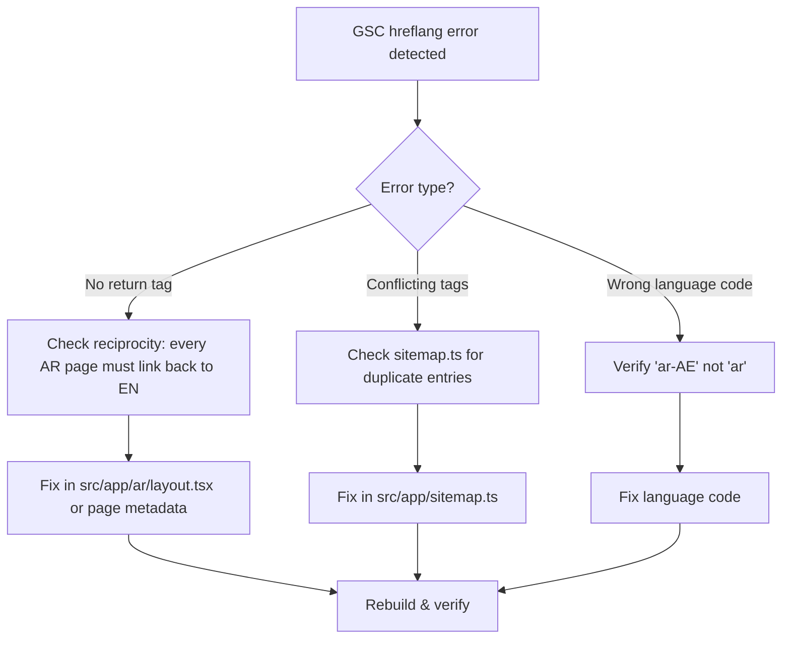

# Arabic Market — Post-Launch Monitoring Framework

**Created:** 2026-07-29
**Source:** [`arabic-market-domination-reconciled-plan.md`](plans/arabic-market-domination-reconciled-plan.md) §8.2–8.3
**Applies to:** `feature/arabic-market` branch post-merge

---

## 1. Deployment Strategy (Prerequisite)

```
feature/arabic-market branch
       │
       ├── Phase 0 → PR preview on Vercel
       ├── Phase 1 → PR preview on Vercel
       ├── Phase 2 → PR preview on Vercel
       ├── Phase 3 → PR preview on Vercel
       ├── Phase 4 → PR preview on Vercel
       ├── Phase 5 → PR preview on Vercel
       ├── Phase 6 → (ops, no code deploy)
       └── Phase 7 → FINAL QA on Vercel preview
                       │
                       ▼
            MERGE TO PRODUCTION (single deploy)
            Revert capability: 2 weeks minimum
```

**Rules:**
- All work on `feature/arabic-market` branch
- Deployed to Vercel preview URLs for testing
- Merge to production ONLY after Phase 7 passes in full
- Single deploy adds the `/ar/` tree — English routes are untouched by construction
- Keep ability to instantly revert (single commit revert) for 2 weeks post-launch

---

## 2. 30-60-90 Day Monitoring Dashboard

### 2.1 Key Metrics

| # | Metric | Tool | Target | Check Frequency | Owner |
|---|---|---|---|---|---|
| 1 | Indexed pages (EN vs AR split) | GSC Coverage | ~1:1 parity within 4 weeks | Weekly | SEO Lead |
| 2 | Arabic keyword rankings | GSC Performance | Top 10 within 90 days | Monthly | SEO Lead |
| 3 | AI engine citation (Arabic) | Manual ChatGPT Search + Perplexity | Cited in >=1 AI engine | Monthly | Content Lead |
| 4 | Hreflang errors | GSC International Targeting | Zero errors | Weekly | Dev Lead |
| 5 | PageSpeed (both locales) | PageSpeed Insights | 95+ both | After each deploy | Dev Lead |
| 6 | Local pack visibility (Arabic) | GBP Insights | Appear for top 5 terms | Monthly | Marketing Lead |
| 7 | Conversion rate (AR vs EN) | GA4 | AR >= 50% of EN baseline | Monthly | Marketing Lead |
| 8 | Bounce rate (AR pages) | GA4 | <= EN baseline + 10% | Monthly | Content Lead |
| 9 | Average session duration (AR) | GA4 | >= 90s | Monthly | Content Lead |
| 10 | Crawl errors (AR pages) | GSC Coverage | Zero 404s on AR URLs | Weekly | Dev Lead |

### 2.2 Week-by-Week Action Plan

#### Weeks 1-2 (Immediate Post-Launch)

| Day | Action | Success Criteria |
|---|---|---|
| Day 0 | Merge `feature/arabic-market` → `main` | Vercel deploy succeeds, `/ar/` returns 200 |
| Day 0+1 | Verify sitemap updated with all AR URLs | `sitemap.xml` contains `/ar/...` entries |
| Day 0+1 | Submit sitemap to Google Search Console | GSC confirms submission |
| Day 0+3 | Run full Lighthouse matrix (10 URLs) | All 95+, no regression >2 points from baseline |
| Day 0+3 | Check GSC for crawl errors on AR pages | Zero 4xx/5xx errors |
| Day 0+7 | First weekly hreflang audit | Zero hreflang errors in GSC International report |
| Day 0+7 | Check indexed AR page count | >= 50% of EN count |

#### Weeks 3-4 (First Month)

| Action | Details |
|---|---|
| Full PageSpeed re-run | All 10 test cases, compare to baseline |
| GSC keyword performance | Filter by `/ar/` path — identify top 20 queries |
| GBP insights review | Check Arabic profile views and actions |
| AI engine spot-check | Query 10 top Arabic terms in ChatGPT Search + Perplexity |
| Content gap analysis | Which AR pages have lowest engagement? Plan improvements |

#### Month 2 (Days 30-60)

| Action | Details |
|---|---|
| Deep keyword analysis | Compare EN vs AR query overlap. Optimize for unique AR queries. |
| Internal link audit | Ensure AR pages link to each other (Arabic internal linking) |
| Authority backlink outreach | Target Arabic business directories and portals |
| Social media integration | Cross-post Arabic content to Instagram, LinkedIn, TikTok |
| Content refresh | Update 5 lowest-performing AR pages with improved content |

#### Month 3 (Days 60-90)

| Action | Details |
|---|---|
| Full GEO audit | See §3 below |
| Competitive analysis | Check Arabic competitors' rankings vs Wasleen |
| Review NAP consistency | Verify Arabic company name across all platforms |
| Plan V2 improvements | Based on 90 days of data |
| Submit Arabic GBP posts | Regular Google Business Profile updates in Arabic |

---

## 3. Recurring GEO Audit (Monthly)

### 3.1 Process

1. **Prepare query list** — Take top 20 Arabic target queries from the [`arabic-keyword-map.json`](plans/arabic-keyword-map.json)
2. **Query AI engines** — For each query, check:
   - Google Search (organic results + AI Overviews)
   - ChatGPT Search
   - Perplexity
   - Bing Copilot
3. **Record citations** — Document whether Wasleen Arabic pages are cited, and in what position
4. **Diagnose if not cited**:
   - Check GSC indexation first — is the page indexed?
   - Check content quality — does the page directly answer the query?
   - Check schema validity — is JSON-LD present and valid?
5. **Log results** in the tracking sheet below

### 3.2 Monthly GEO Tracking Sheet

| Query | Google Rank | AI Overview | ChatGPT | Perplexity | Bing Copilot | Notes |
|---|---|---|---|---|---|---|
| موافقات بلدية دبي | | | | | | |
| موافقة ديوا | | | | | | |
| موافقة الدفاع المدني دبي | | | | | | |
| موافقة هيئة دبي للتطوير | | | | | | |
| رخصة بناء دبي | | | | | | |
| استشارات موافقات دبي | | | | | | |
| كم تستغرق موافقة بلدية دبي | | | | | | |
| مستندات موافقة الدفاع المدني | | | | | | |
| رسوم موافقة ديوا | | | | | | |
| (add remaining 11 from keyword map) | | | | | | |

---

## 4. Issue Response Playbook

### 4.1 Hreflang Errors Detected



### 4.2 Arabic Pages Dropping Out of Index

1. Check GSC Manual Actions — any penalties?
2. Check `robots.ts` — ensure no `Disallow: /ar/` was accidentally added
3. Check canonical tags — verify AR pages canonicalize to themselves, not EN versions
4. Check for duplicate content — verify Arabic slugs are unique and content is sufficiently different from EN
5. Submit individual AR URLs for re-indexing in GSC

### 4.3 Performance Regression in AR Pages

1. Run Lighthouse on the affected AR URL
2. Compare to baseline from Lighthouse matrix
3. Common causes:
   - Font loading (Noto Sans Arabic) — check `font-display: swap`
   - Image dimensions missing in AR content
   - CSS specificity issue causing layout thrashing
   - Third-party script blocking (GTM)

### 4.4 Language Switcher Broken

1. Check `LanguageSwitcher.tsx` — `getOppositeLocale()` and path derivation
2. Verify the target path exists (e.g., switching from `/ar/approvals/موافقة-ديوا` → `/approvals/dewa-approval`)
3. Check that `hreflangAlternates()` returns correct pairs
4. Test on all page types: homepage, approval, guide, service, static

---

## 5. Weekly Monitoring Checklist

### Every Monday

- [ ] Check GSC for hreflang errors → [GSC International Targeting](https://search.google.com/search-console/international)
- [ ] Check GSC for crawl errors on `/ar/` paths
- [ ] Verify indexed AR page count (should grow week-over-week)
- [ ] Quick PageSpeed spot-check: `/ar/` homepage + 1 random AR approval page
- [ ] Verify language switcher works on all page types (manual spot-check)
- [ ] Check server logs for 4xx/5xx errors on AR URLs

### Every First of Month

- [ ] Full Lighthouse matrix (10 URLs: 5 EN + 5 AR)
- [ ] GEO audit (top 20 Arabic queries across 4 AI engines)
- [ ] GBP insights review (Arabic profile)
- [ ] GA4 comparison: AR vs EN traffic, bounce rate, conversion
- [ ] Update this document with findings
- [ ] Review and adjust keyword targets

---

## 6. Rollback Criteria

**Single-commit revert if ANY of the following occur:**

| Condition | Threshold | Action |
|---|---|---|
| EN homepage 404 | Any | Immediate revert |
| EN Performance drop | >5 points from pre-deploy baseline | Immediate revert |
| AR page crawl errors | >10% of AR URLs returning 4xx/5xx | Revert if not fixable in 24h |
| Hreflang errors | >100 errors in GSC | Revert if not fixable in 48h |
| Revenue impact (if measurable) | >15% drop in EN conversions | Immediate revert |

**After 2 weeks** with no issues, remove revert capability and consider the launch stable.

---

**End of monitoring document.** This replaces generic §8.2–8.3 of the reconciled plan with actionable weekly/monthly processes.
