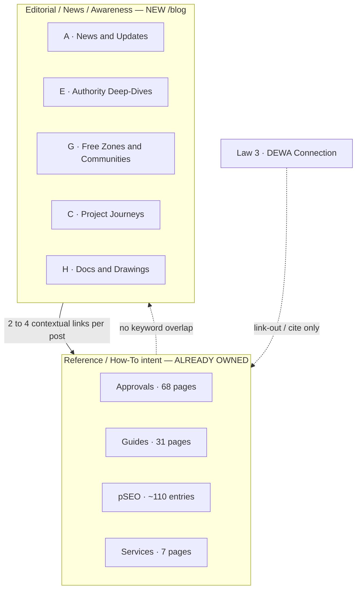

# Blog — Approved Categories, Topics & URLs (Cannibalism-Safe)

> **Status:** APPROVED by project owner — 2026-08-13 (RULE 2 gate passed)
> **Applies to:** `/blog` build — see [`plans/blog-pre-build-plan.md`](plans/blog-pre-build-plan.md)
> **Authoritative source for the initial topic wave:** [`reference details/dubai_authority_approval_updates_2026.md`](reference details/dubai_authority_approval_updates_2026.md:1)
> **DNA role:** this file is the RULE 2 output that **replaces the provisional §7 "Categories & Content Map"** in [`reference details/blog-design-dna-implementation-plan.md`](reference details/blog-design-dna-implementation-plan.md:455). The category list here is data-driven and lives in ONE data file — only this file (and its data file) change when categories/posts change; templates stay generic.

---

## 1. Purpose

This file is the **single source of truth** for the blog's category taxonomy and the initial wave of post topics, URLs, and internal links. It exists so that:

1. No blog URL or topic duplicates an existing page (approvals, guides, services, pSEO).
2. Every blog post has a **distinct editorial intent** that links *into* the money pages.
3. Implementation (Code mode) can generate posts from this list without re-litigating the taxonomy.

**Nothing on this list may be changed without updating this file first.**

---

## 2. Cannibalism Guardrails (NON-NEGOTIABLE)

These were validated against the full live inventory in [`reference details/live-pages-urls.md`](reference details/live-pages-urls.md:1) and the data files:

| Guardrail | Rule |
|---|---|
| **Intent ownership** | Approvals/guides/pSEO own **reference & how-to** intent. Blog owns **editorial / news / awareness / comparison** intent. Never write a how-to that duplicates a money page. |
| **Keyword exclusivity** | A blog slug may not target the primary keyword of any existing page. Run each new slug against approvals, guides, pSEO, and this file before writing. |
| **Law 3 of 2026** | Fully owned by pillar `/approvals/dubai-building-quality-safety-certificate` + 34 guides + 40+ pSEO entries. Blog may **link out** to it or cover it inside the A1 roundup only. No standalone Law 3 blog post. |
| **DEWA connection** | Fully owned by `/guides/dewa-connection-process-guide`, `/approvals/dewa-connection-noc`, `/approvals/dewa-approval` + pSEO. Blog may **reference/cite** it only; never a standalone post. |
| **Sibling overlap** | Within the blog, two posts may not target the same keyword. Where sources overlap (e.g., S16 feeds both A1 and E3), the intent must be visibly different (news roundup vs. how-to-navigate deep-dive). |
| **Internal links** | Every post must carry **2–4 contextual links** to the money pages listed below, with descriptive anchor text (never "click here"). Every post also links to 1–2 sibling blog posts. |
| **Arabic** | Arabic pages are **native-Arabic SEO rewrites**, same context & meaning — never word-for-word translation. Arabic URLs mirror English: `/ar/blog/{slug}`. |

### Who owns which search intent

---

## 3. The 8 Categories (APPROVED)

| ID | Category | Intent / Job-to-be-done | Example queries it owns |
|---|---|---|---|
| **A** | Approval News & Regulation Updates | "What changed?" — official circulars, laws, new e-services, launches | `dubai building regulation news 2026`, `dda circular 667`, `dewa marafeq` |
| **B** | Approval Comparisons | "Which is better / how do they differ?" — authority vs authority, process vs process | reserved for future sources |
| **C** | Project-Type Approval Journeys | "What is it like for my kind of project?" — modular, infrastructure, mixed-use | `modular building approval dubai`, `new dubai bridges impact` |
| **D** | Approval Costs & Timeline Stories | Narrative cost/timeline breakdowns from real project stories | reserved for future sources |
| **E** | Authority Deep-Dives | "How does this authority actually work?" — inside the agency | `dubai municipality building permits agency`, `trakhees rules` |
| **F** | Rejection & Mistake Stories | Editorial case narratives on rejection & lessons learned | reserved for future sources |
| **G** | Free Zones & Developer Communities | Zone-specific & community-specific approval angles | `jafza modifications noc`, `dmcc jlt approvals` |
| **H** | Documentation & Drawing Insights | Digital submission, BIM/GIS, drawing standards in practice | `dubai municipality bim gis` |

> **Empty for this wave:** B, D, F. These will be filled ONLY from future trusted sources with editorial angles that do not collide with pSEO (`mainland-vs-free-zone-approval-comparison`, `how-much-does-approval-cost-in-dubai`, `common-reasons-approvals-rejected-in-dubai`). Do not force topics into empty categories.

---

## 4. Initial Topic Wave — 19 Approved Posts

**Link targets used below (verified slugs):**
- Approvals: `dubai-municipality-building-permit` · `dubai-building-quality-safety-certificate` · `dewa-approval` · `dewa-connection-noc` · `rta-approval` · `dubai-civil-defense-approval` · `dubai-civil-defense-noc` · `dubai-municipality-signage-approval` · `dubai-municipality-health-safety-approval` · `jebel-ali-free-zone-approval` · `dmcc-approval` · `dubai-land-department-registration` · `ejari-registration` · `title-deed-registration` · `dda-approval` · `change-of-usage-permit` · `2d-drawing-submission` · `interior-fit-out-approval` · `community-approval`
- Guides: `complete-guide-dubai-building-approvals` · `how-long-does-dm-building-permit-take` · `dewa-connection-process-guide` · `dcd-fire-safety-approval-documents` · `dmcc-free-zone-approval-process` · `rta-approval-commercial-projects` · `cad-drawing-standards-dubai-guide`
- Services: `approval-management` · `document-clearing` · `project-management` · `cad-documentation`

### Category A — Approval News & Regulation Updates (9)

| # | URL `/blog/...` | Working title | Source | Link out (money pages) |
|---|---|---|---|---|
| A1 | `dubai-building-regulations-2026-updates` | Dubai building regulations 2026: the biggest changes property owners must know | S1 + S16 (roundup) | `/approvals/dubai-building-quality-safety-certificate` · `/guides/complete-guide-dubai-building-approvals` |
| A2 | `dm-circular-224-design-build-contractor-qualification` | DM Circular 224: Design & Build contractor qualification explained | S2 | `/approvals/dubai-municipality-building-permit` · `/services/approval-management` |
| A3 | `dewa-marafeq-infrastructure-noc-digital-submission` | DEWA Marafeq: submit infrastructure NOCs digitally | S3 | `/approvals/dewa-connection-noc` · `/approvals/dewa-approval` · `/guides/dewa-connection-process-guide` |
| A4 | `dubai-real-estate-advertisement-permit-dld` | Dubai's real estate advertisement permit: rules for developers & agents | S4 | `/approvals/dubai-land-department-registration` · `/approvals/ejari-registration` |
| A5 | `dda-circular-667-fire-life-safety-construction` | DDA Circular 667: fire & life safety during construction explained | S8 | `/approvals/dda-approval` · `/guides/dcd-fire-safety-approval-documents` |
| A6 | `dda-circular-656-scaffolding-inspection-certificates` | DDA Circular 656: mandatory scaffolding inspection certificates | S9 | `/approvals/dda-approval` · `/approvals/dubai-municipality-health-safety-approval` |
| A7 | `dubai-civil-defence-ai-lab-digital-approvals` | Dubai Civil Defence AI Lab: how digital approvals are getting faster | S11 | `/approvals/dubai-civil-defense-approval` · `/approvals/dubai-civil-defense-noc` |
| A8 | `trakhees-mobilization-signboard-noc-explained` | Trakhees mobilization & signboard NOC: what contractors must submit | S13 | `/approvals/dubai-municipality-signage-approval` · `/services/approval-management` |
| A9 | `dda-circulars-2026-announcements-roundup` | Every DDA circular & announcement in 2026 (how to track new ones) | S17 (hub of A5+A6) | `/approvals/dda-approval` · links to A5, A6 |

### Category E — Authority Deep-Dives (4)

| # | URL `/blog/...` | Working title | Source | Link out (money pages) |
|---|---|---|---|---|
| E1 | `dubai-municipality-building-permits-agency-explained` | Inside Dubai Municipality's Building Regulation & Permits Agency | S6 | `/approvals/dubai-municipality-building-permit` · `/guides/how-long-does-dm-building-permit-take` |
| E2 | `trakhees-pcfc-rules-waterfront-approvals` | Trakhees rules & circulars: approvals in special development zones | S12 | `/approvals/dubai-municipality-building-permit` · `/approvals/community-approval` |
| E3 | `navigating-dubai-municipality-laws-legislation` | How to read Dubai Municipality laws & legislations like a professional | S16 | `/approvals/dubai-municipality-building-permit` · `/services/document-clearing` |
| E4 | `dubai-land-department-key-regulations` | Dubai Land Department regulations: what property owners should track | S18 | `/approvals/dubai-land-department-registration` · `/approvals/title-deed-registration` |

### Category G — Free Zones & Developer Communities (3)

| # | URL `/blog/...` | Working title | Source | Link out (money pages) |
|---|---|---|---|---|
| G1 | `jafza-modifications-noc-request-guide` | JAFZA modifications & NOC: a step-by-step walkthrough | S14 | `/approvals/jebel-ali-free-zone-approval` · `/approvals/change-of-usage-permit` |
| G2 | `jafza-services-guidebook-approvals` | Inside the JAFZA services guidebook: 5 approvals tenants miss | S15 | `/approvals/jebel-ali-free-zone-approval` · `/services/document-clearing` |
| G3 | `dmcc-jlt-concordia-approvals-guide` | Approvals in DMCC's JLT: a look at Concordia & the community | S19 | `/approvals/dmcc-approval` · `/guides/dmcc-free-zone-approval-process` · `/approvals/interior-fit-out-approval` |

### Category C — Project-Type Approval Journeys (2)

| # | URL `/blog/...` | Working title | Source | Link out (money pages) |
|---|---|---|---|---|
| C1 | `dubai-modular-building-system-approval-news` | Dubai approves an innovative modular building system: what it means | S7 | `/approvals/dubai-municipality-building-permit` · `/services/project-management` |
| C2 | `rta-al-asayel-oud-maitha-bridges-impact` | Two new Dubai bridges open: impact for developers & commuters | S10 | `/approvals/rta-approval` · `/guides/rta-approval-commercial-projects` |

### Category H — Documentation & Drawing Insights (1)

| # | URL `/blog/...` | Working title | Source | Link out (money pages) |
|---|---|---|---|---|
| H1 | `dubai-municipality-bim-gis-digital-approvals` | Dubai Municipality BIM & GIS: how digital drawing submission works | S20 | `/approvals/2d-drawing-submission` · `/services/cad-documentation` · `/guides/cad-drawing-standards-dubai-guide` |

**Totals:** A=9 · E=4 · G=3 · C=2 · H=1 → **19 posts EN + 19 posts AR (`/ar/blog/{slug}`) = 38 URLs.**

---

## 5. Excluded Sources (deliberately NOT blog posts)

| Source | Verdict | Rationale |
|---|---|---|
| S1 — Law No. 3 of 2026 | **LINK-OUT ONLY** | Pillar approval + 34 guides + 40+ pSEO pages own every angle. Blog covers it only inside A1 and links to the pillar. |
| S5 — DEWA Electricity Connection / Building NOC | **REFERENCE / CITE ONLY** | Owned by `/guides/dewa-connection-process-guide` + `/approvals/dewa-connection-noc` + pSEO. Only cited inside A3. |

---

## 6. Publish Sequencing (4 posts/day — 9:00, 12:00, 16:00, 21:00 GST)

Ordering prioritizes news/introductory intent first so the blog establishes topical authority quickly:

| Day | Slots (post IDs) |
|---|---|
| Day 1 | A1 · A2 · A3 · A4 |
| Day 2 | A5 · A6 · A7 · A8 |
| Day 3 | A9 · E1 · E2 · E3 |
| Day 4 | E4 · G1 · G2 · G3 |
| Day 5 | C1 · C2 · H1 (3 posts) |

**Sitemap:** every published post is automatically included in the dynamic [`src/app/sitemap.ts`](src/app/sitemap.ts:76) (blog section added in the pre-build plan) — no manual submission needed.

**Dates (owner decision, 2026-08-13):** `publishedAt` is set to the **actual live URL date/time** at publish. If a predefined date is ever used it must be ≤ the live date — **never greater**. `dateModified` / sitemap `lastmod` always reflect the true live date.

---

## 7. Change Log

| Date | Change |
|---|---|
| 2026-08-13 | Initial taxonomy (8 categories) + 19-topic wave approved by project owner. |

---

*Next step: implement per [`plans/blog-pre-build-plan.md`](plans/blog-pre-build-plan.md).*
