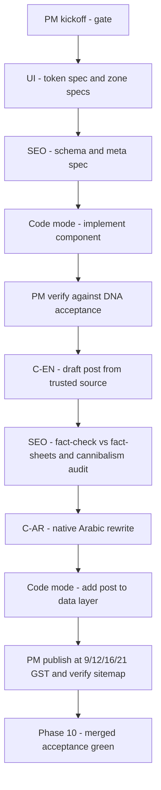

# Blog Build Execution Plan — Team-Based, Cross-Checked Against DNA (Next.js 15)

> **Status:** Approved direction — 2026-08-13 · **Revision 2** (team-based, full-DNA cross-check)
> **Companion file (CONTENT SOURCE OF TRUTH):** [`plans/blog-categories-topics-urls.md`](plans/blog-categories-topics-urls.md) — the APPROVED 8 categories + 19 topics + URLs + internal links (this file **replaces DNA §7** per RULE 2)
> **Design source (DNA):** [`reference details/blog-design-dna-implementation-plan.md`](reference details/blog-design-dna-implementation-plan.md) — MUST be read by Code mode before starting Phase 1
> **Content sources:** [`reference details/dubai_authority_approval_updates_2026.md`](reference details/dubai_authority_approval_updates_2026.md) + user-provided authority files in `reference details/`
> **Rules:** [`00-PROJECT-MASTER-RULE.md`](.roo/rules/00-PROJECT-MASTER-RULE.md) · [`03-SEO-AI-SEARCH-MASTER.md`](.roo/rules/03-SEO-AI-SEARCH-MASTER.md) · [`05-TECHNICAL-SEO-SCHEMA.md`](.roo/rules/05-TECHNICAL-SEO-SCHEMA.md) · DNA RULE 1/2/3

---

## 0. CROSS-CHECK RESULT — what changed vs. Revision 1 and the DNA

Every DNA deliverable (Document Map A–F, §1 tokens, §2 shared layout, §3 11 zones, §4 search, §5 13 article sections, §6 inventories, §8 responsive, §9 order, §10 acceptance) was checked against the previous `blog-pre-build-plan.md`. Findings:

| # | Finding | Status | Resolution |
|---|---|---|---|
| 1 | **Font conflict (RULE 1)** — DNA lists Open Sans / Lato / Playfair; current site uses Montserrat / Roboto / Roboto Mono (`next/font`). | **CONFLICT** | Resolved: keep current site fonts. DNA font **roles** map to site fonts (see §1.2). Playfair `--font-editorial` is **omitted** (no new font load, perf budget) — documented owner decision. |
| 2 | **Token names** — Revision 1 invented `--blog-bg`/`--blog-blue`; DNA mandates the fixed role map `--accent / --accent-2 / --accent-dark / --bg / --surface / --border / --text / --text-dim / --alt-bg / --alt-text / --glow`. | **CONFLICT** | Resolved: adopt DNA token names/roles exactly (§1.1) so a future theme swap is one-file (DNA §1 implementation instruction). |
| 3 | **11 index zones** — Revision 1 said only "11-zone DNA layout, adapted"; the zones were not enumerated. | **GAP** | Fixed: all 11 zones + ZONE 1b marquee enumerated with behaviors/JS in §5. |
| 4 | **Search page** — Revision 1 had the route but not the signature design (dual-layer gradient border, 1px-gap results grid, 7 no-results gradient pills). | **GAP** | Fixed: §6 enumerates the full DNA §4 search spec + SEO noindex decision. |
| 5 | **13 article sections** — Revision 1 said only "13-section article anatomy". | **GAP** | Fixed: all 13 sections enumerated with behaviors/JS in §7. |
| 6 | **12 buttons / 11 keyframes / 10 signature patterns** — Revision 1 only told Code to "read" them. | **GAP** | Fixed: enumerated with site-theme mapped values and made QA items (§3, §10). |
| 7 | **Schema stack (RULE 3)** — Revision 1 had BlogPosting/BreadcrumbList/WebPage/FAQPage only. | **GAP** | Fixed: add `Blog`/`CollectionPage` (index), `HowTo` (step content), `Service` + `OfferCatalog` (services bridge / CTA), and the article `@graph` pattern (§8, DNA §5 note). |
| 8 | **Shared layout** — footer `footerDividerGlow` + `waPulse`, marquee include, 3-level breadcrumbs, dark header treatment for blog. | **GAP** | Fixed: §4. Footer master-rule constraint documented (footer stays LOCKED; blog dark canvas covers the content area; optional dark chrome = owner decision). |
| 9 | **Category index pages** — DNA §7/§2.4 assume `Home → Blog → Category` URLs. | **DECISION** | Resolved: **no separate category index URLs this wave** (cannibalism-safe). Category filtering via `/blog?category={slug}` (server `searchParams`); CollectionPage schema on the hub; silo/pill links point to the filtered hub. Documented deliberate deviation. |
| 10 | **Team roles** — Revision 1 had no owner per task. | **GAP** | Fixed: every phase/task is owned by UI Designer, EN Writer, AR Writer, Tech SEO Expert, or PM (§1, §2). |
| 11 | **Acceptance checklist** — Revision 1's gate missed DNA §10 items. | **GAP** | Fixed: merged checklist in §10 (DNA §10 + project requirements). |
| 12 | **Images** — user requires 2–3 images/post, varied positions. | **KEPT** | Explicit image strategy task per post in §7.6/§9 (hero, inline, end). |

**Net result:** no conflicts remain. The plan below is the single execution reference and must be followed in strict phase order (master rule: one task at a time).

---

## 1. ENGINEERING TEAM & ROLES

The plan is executed by a cross-functional team. **Code mode implements; roles own the WHAT and the VERIFY.**

| Role | Tag | Responsibility |
|---|---|---|
| 🎨 **UI Designer** | `UI` | Design tokens, all 11 zones, search, 13 article sections, 12 buttons, 11 keyframes, 10 signature patterns, responsive 1200/992/640, `prefers-reduced-motion`. Signs off the dark theme visual quality. |
| ✍️ **EN Content Writer (SEO & GEO)** | `C-EN` | The 19 English posts: direct-answer leads, concrete numbers, extraction-friendly structure (tables/lists), 2–4 contextual `linkOuts`, FAQs, E-E-A-T author/review lines. Content must read human, not templated. |
| ✍️ **AR Content Writer (native Arabic SEO)** | `C-AR` | The 19 Arabic posts: **native-Arabic SEO rewrites** (same context/meaning, RTL, Arabic keyword map) — NEVER word-for-word translation of the English. |
| 🧠 **Technical SEO Expert** | `SEO` | Metadata (titles/descriptions/OG/Twitter), canonical + hreflang, JSON-LD schema stacks (incl. HowTo, Service/OfferCatalog, @graph), sitemap integration, cannibalism re-audit, Rich Results validation, noindex rules, internal-link strategy validation. |
| 🧭 **Project Manager** | `PM` | Phase gates, publish calendar (4/day), owner decisions, sitemap verification after each deploy, RULE 2 protection (nothing new without the categories file), final acceptance. |

---

## 2. DELIVERY WORKFLOW (how the team works together)

---

## 3. DESIGN SYSTEM SPEC (DNA §1 + §6 — owned by `UI`, validated by `SEO`)

### 3.1 Token role map — single `:root` in a scoped blog stylesheet (DNA §1.1)

> **Implementation instruction (DNA):** create ONE `:root` token map at the top of the blog stylesheet. Populate these exact token names with the current-site theme values (except `--bg` which stays black + dark-blue gradient). Use ONLY tokens in every rule so a future theme swap is one-file. No raw hex in JSX.

| Token (ROLE fixed) | Target value (site-mapped) | Note |
|---|---|---|
| `--bg` | `#000` base + **dark-blue gradient layers** | **FIXED — never change** (DNA RULE 1) |
| `--surface` | dark glass — tint of `brand-blue` (e.g. `rgba(16,26,46,0.6)`) | glassmorphism surfaces |
| `--text` | near-white `#F5F8FF` | replaces lavender `#FFD7FE` |
| `--text-dim` | muted `#8B9BB8` | secondary text |
| `--accent` | light `brand-blue` `#4D8DFF` | primary accent (replaces magenta `#D84CD8`) |
| `--accent-2` | `cta-amber` `#F5A623` | gradient partner (replaces hot pink `#ff40fb`) |
| `--accent-dark` | `brand-blue-hover` `#003366` | hover/state fills (replaces `#950991`) |
| `--alt-bg` | light inversion — `light-bg` `#f8fafc` / `card-bg` `#EAF1FB` | black text on it (replaces lavender `#FFD7FE`) |
| `--alt-text` | `body-text` `#1A2233` | text on `--alt-bg` blocks |
| `--border` | hairline `rgba(77,141,255,0.18)` | 1px-gap grids / borders |
| `--glow` | `rgba(77,141,255,0.15)` | hover shadow tint |
| `--sidebar-w` | `320px` | article sidebar width |

**Canvas (fixed):** `--bg` black + dark-blue gradient layers (`#060A14` → `#0A0F1E` deep blue radial glows). Keeps DNA §1.2 moody canvas.

### 3.2 Font role mapping (RULE 1 resolution)

| DNA role | DNA source font | Target (current site) | Usage |
|---|---|---|---|
| `--font-h` headings | Open Sans 800 | **Montserrat 800** | H1–H3, hero title |
| `--font-b` body | Montserrat | **Roboto 400/500** | body text |
| `--font-a` labels/CTAs/eyebrows | Lato 700 uppercase | **Montserrat 700 uppercase** (codes: Roboto Mono) | eyebrows, buttons, pills |
| `--font-editorial` article body | Playfair Display | **OMITTED** (owner decision) | article body uses Roboto 400 for consistency + perf budget <50KB fonts |

> Fonts load via existing `next/font` variables in [`src/lib/fonts.ts`](src/lib/fonts.ts) — **no new font loading, no new dependency.**

### 3.3 Gradient tokens (eye-catching, theme-compliant — DNA §1.2 mapped)

| Use | Source (DNA) | Target (site-mapped) |
|---|---|---|
| Hero base | `#080412` | `#0A0F1E` |
| Hero mesh radial glows | accent-magenta blobs | `--accent` + `--accent-2` radial blobs |
| Hero grain | white 0.03 | keep (neutral) |
| Hero grid lines | 60px repeating | keep, low opacity |
| Newsletter section | `linear-gradient(135deg,#0d0013,#1a0018)` | dark-blue variant `135deg,#0A0F1E,#060A14` |
| Article bottom newsletter | `linear-gradient(135deg,#080012,#140018)` | dark-blue variant |
| Slide overlay | black → transparent vertical fade | keep |
| No-results pills `--wg-01..07` | 7 source gradients | 7 **site-theme** gradients (blue↔amber↔green mixes) |
| Animated table row | `#222 → #444` | neutral `#101A2E → #1A2233` |

### 3.4 Inversion rule (DNA §1.3)

Any block using `--alt-bg` flips text to `--alt-text` (black). Signature contrast device — used in silo `.alt` blocks, `.all-categories`, `alt`-style zones. **Keep.**

### 3.5 The 12 buttons — exact hover states (DNA §6.1, colors site-mapped)

| # | Button | Default | Hover |
|---|---|---|---|
| 1 | `.btn-read` (featured CTA) | outline/accent | **invert** + arrow slide |
| 2 | `.btn-load-more` | dark + accent border | **glow** (accent shadow) |
| 3 | `.btn-quote` (services) | accent fill | **lift + glow** |
| 4 | `.silo-cta` | outline | **fill** (accent) |
| 5 | `.cat-pill` | ghost pill | active underline + color shift |
| 6 | `.cat-pill-full` | light-inversion pill | accent hover |
| 7 | `.btn-scta` | accent fill | `--accent-dark` fill + glow |
| 8 | `.btn-scta-outline` | outline | accent fill/outline flip |
| 9 | `.nl-submit` | gradient fill | `--accent-dark` fill + glow |
| 10 | `.share-btn` | ghost icon chip | accent border/fill |
| 11 | `.tag-chip` | border chip | accent tint |
| 12 | `.post-cat-tag` | pill tag | accent hover underline |

> Existing [`src/components/ui/Button.tsx`](src/components/ui/Button.tsx) may be reused/extended where compatible; keep blog-specific variants inside the scoped blog stylesheet.

### 3.6 The 11 keyframes (DNA §6.2 — names/durations fixed, colors site-mapped)

| Keyframe | Duration | Use | Reduced-motion |
|---|---|---|---|
| `meshPulse` | 8s ease-in-out infinite | hero mesh glows | off |
| `blink` | 1.5s infinite | ticker dot | off |
| `tickerUp` | 40s linear infinite | vertical hero ticker, hover pause | static |
| `scrollLeft` | 50s linear infinite | marquee + trending track, hover pause | static |
| `gradientBorder` | 6s | featured deco ring | off |
| `scrollbarGlow` | 3s | category pill bar scrollbar | off |
| `gradientShift` | 4s pills / 15s table rows | animated gradients (200% bg-size) | off |
| `crossfade` | 1.4s | hero slideshow | off |
| `footerDividerGlow` | — | footer divider glow (shared) | off |
| `waPulse` | — | WhatsApp pulse ring (shared) | off |
| `.fade-in` / `.reveal` | 0.6s / 0.5s | IntersectionObserver reveals | off |

### 3.7 The 10 signature patterns (DNA §6.3 — use everywhere)

1. 1px-gap tile grids (`gap:1px; background:var(--border)`)
2. Glassmorphism (`backdrop-filter blur(12–22px)` + translucent surface + accent border)
3. Dual-layer gradient focus rings (`padding-box` fill + `border-box` gradient border + glow on focus-within) — search form, newsletter, sidebar search
4. Accent hover mechanic (hairline → accent edge `scaleX(0→1)`)
5. Eyebrow + rule label (uppercase label + short rule)
6. Light inversion blocks (`--alt-bg` + black text)
7. Gradient avatars/rings (author)
8. Slow zoom on hover (`scale(1.03–1.1)` in overflow-hidden wrappers)
9. Hover-pause scrollers (marquee, ticker, trending)
10. Sticky elements (pill bar top 0 z100 blur; sidebar top 24px)

**Architecture note (DNA §0):** one **self-contained stylesheet per template** driven by tokens — each blog template re-declares `:root`. Keep this pattern (scoped `@layer blog`).

---

## 4. SHARED LAYOUT (DNA §2 — `UI` + `Code`, `SEO` validates)

### 4.1 Blog header (dark) — decision recorded

- The global [`src/components/layout/Header.tsx`](src/components/layout/Header.tsx) + [`Footer.tsx`](src/components/layout/Footer.tsx) render on all routes (root layout). Per master rule, **Footer is LOCKED** — never modify.
- **This wave:** the blog's **content area** is the full dark canvas (BlogShell in [`src/app/blog/layout.tsx`](src/app/blog/layout.tsx)); global header/footer remain the white-site theme (no touch).
- **Optional future enhancement (owner decision, not in this wave):** a blog-scoped dark top bar + footer for `/blog` routes. Do NOT implement now.
- SEO page-level variables in Next.js = `generateMetadata` + root metadata template (matches DNA `$page_title/$meta_desc/$canonical/$og_image/$active_nav/$breadcrumb_items`).

### 4.2 Marquee include (DNA §2.3)

- `BlogMarquee.tsx` — full-width horizontal strip; `scrollLeft` 50s linear infinite; content duplicated for seamless loop; hover pauses; **disabled under `prefers-reduced-motion`**.
- Used at ZONE 1b (between hero and category pill bar) and reused on article pages if desired.

### 4.3 Footer interactions (DNA §2.2)

- Footer is the existing site footer (LOCKED). `footerDividerGlow` + `waPulse` keyframes already exist in the site or are defined in the blog scoped stylesheet for use by shared components — do not duplicate global ones.

### 4.4 Breadcrumbs (DNA §2.4)

- Semantic `<nav aria-label="breadcrumb">` + `<ol>`, last item = current (no link).
- Levels: Blog index `Home → Blog`; Article `Home → Blog → {Category} → {Article}`; Search `Home → Blog → Search`.
- Paired with `BreadcrumbList` JSON-LD (always).

---

## 5. BLOG INDEX — 11 ZONES + MARQUEE (DNA §3 — `UI` + `Code`, `SEO` schema)

Route: [`src/app/blog/page.tsx`](src/app/blog/page.tsx). Schema: `Blog`/`CollectionPage` + `BreadcrumbList` + `WebPage`. Category filtering = `/blog?category={slug}` (server `searchParams`); no separate category URLs.

| Zone | Component / behavior | Key specs (DNA) |
|---|---|---|
| **ZONE 1** | `BlogHero` | 650px tall; layered `hero-mesh` (meshPulse 8s) + `hero-grain` 0.03 + `hero-grid-lines` 60px; `hero-inner` grid `1fr 380px`; left = 5-slide slideshow (crossfade 1.4s, `setInterval` 4500ms, slide overlay fade), eyebrow+rule, `hero-title clamp(2.8rem,5.5vw,4.5rem)`, `hero-stats`; right = `sidebar-search` (focus-within glow → `/blog/search?q=`) + vertical `ticker-track` (tickerUp 40s, hover pause, `ticker-dot` blink 1.5s) |
| **ZONE 1b** | `BlogMarquee` | see §4.2 |
| **ZONE 2** | `BlogCategoryNav` | sticky `top:0; z-index:100`, `backdrop-filter: blur(20px)`; horizontal scrollable `.cat-pill` row + "All" pill; active = underline; gradient scrollbar (scrollbarGlow 3s); JS `filterPosts(cat)` filters featured + cat-grid + bento; "All" resets |
| **ZONE 3** | `FeaturedCard` | 480px min-height; `featured-bg` full-bleed, hover `scale(1.03)` slow zoom; `featured-deco-inner` gradientBorder 6s ring; cat tag pill; clamp title; `.btn-read` invert + arrow slide |
| **ZONE 4** | `BlogCategoryGrid` | `repeat(4,1fr)`, `gap:1px; background:var(--border)`; `.cat-card` hover `translateY(-2px)` + bottom accent edge `scaleX(0→1)`; links to `/blog?category={slug}` |
| **ZONE 5** | `BentoGrid` | rows `2fr 1fr` / `1fr 1fr 1fr` / `1fr 2fr`; `.post-card` top hairline → accent on hover; `.post-thumb` 16/9 emoji 3rem opacity 0.15, hover `scale(1.1)`; `.btn-load-more` glow (stub → wire to paging) |
| **ZONE 6** | `TrendingSection` | glass shell `rgba(16,26,46,0.6)` blur 12–22px, radius 40px, accent border; `trending-track` scrollLeft 50s, hover pause; eyebrow + heading |
| **ZONE 7** | `SiloBlocks` | 5 blocks (categories A/E/G/C/H); `.silo-post-row` hover `padding-left:8px` + accent; alternate `.alt` **light inversion**; `.silo-cta` hover fill |
| **ZONE 8** | `AuthorSection` | `.eeat-badge` E-E-A-T badge; `.author-photo` 80px gradient ring; name/role/bio/links |
| **ZONE 9** | `NewsletterSection` | gradient bg `135deg` dark-blue; `.nl-form` focus-within glow; `.nl-stars` gold `#F5A623` trust markers |
| **ZONE 10** | `ServicesBridge` | `.srv-card` accent underline reveal; `.btn-quote` lift + glow; links to the 4 services in the categories file |
| **ZONE 11** | `BlogFAQ` | accordion; `.faq-toggle` `+` → `rotate(45deg)` = `×`; `.faq-a` `max-height 0→300px`; JS `toggleFaq(el)` one-at-a-time; FAQPage schema |

**Index JS:** hero slideshow IIFE · `toggleFaq` · `filterPosts` · `loadMore` stub · single `IntersectionObserver` for `.fade-in` (0.6s, translateY 24px) / `.reveal` (0.5s, translateY 20px), `threshold 0.1`, `rootMargin 0px 0px -40px 0px`, unobserve after reveal.

---

## 6. SEARCH PAGE (DNA §4 — `UI` + `SEO` + `Code`)

Route: [`src/app/blog/search/page.tsx`](src/app/blog/search/page.tsx).

1. **Logic:** empty `?q=` → server redirect to `/blog`. Full-text search over post content (body text, tags, lead — strip markup). Query value preserved in the input.
2. **SEO:** results page = **`noindex,follow`** (utility page, prevents duplicate results URLs) + `WebPage` + `BreadcrumbList`.
3. **Layout:**
   - `.search-hero` — heading shows query + result count.
   - `.search-form` — **signature dual-layer gradient focus border** (`padding-box` fill + `border-box` gradient `--accent → --accent-2` + glow on focus-within). Reuse this signature for search, newsletter, sidebar inputs.
   - `.results-grid` — `repeat(auto-fill,minmax(340px,1fr)); gap:1px; background:var(--border)`.
   - `.result-card` — title, excerpt with context snippet, cat tag, meta; hover `translateY(-2px)` + shadow + `z-index:2`.
   - `.no-results` — empty state + **7 gradient pills `--wg-01..07`** (`gradientShift` 4s, `background-size 200% 200%`, white text, each links to a category).
4. Single `IntersectionObserver` for `.fade-in`/`.reveal`.

---

## 7. ARTICLE PAGE — 13 SECTIONS (DNA §5 — `UI` + `SEO` + `Code`, content by `C-EN`/`C-AR`)

Route: [`src/app/blog/[slug]/page.tsx`](src/app/blog/[slug]/page.tsx). Schema `@graph`: `Article` + `BreadcrumbList` + `WebPage` (+ `FAQPage` when FAQ present, + `HowTo` when step content present, + `Service`/`OfferCatalog` for the services bridge). `generateStaticParams` from data; `notFound()` for unknown slugs.

| # | Section | Spec (DNA) |
|---|---|---|
| 5.1 | `#progress-bar` | fixed top 3px, gradient `--accent → --accent-2`, `z-index 9999`, JS `updateProgress()` = scroll % |
| 5.2 | `.post-hero` | mesh 2 radial glows; `.post-cat-tag`; `.post-hero-title clamp(2.2rem,4.5vw,3.8rem)`; `.post-meta-bar` (date/read-time/author); `.meta-avatar` 36px gradient circle |
| 5.3 | `.post-hero-image` | ~460px tall rounded overflow hidden; `::after` 150px fade to page bg |
| 5.4 | `.stats-strip` | 5 `.stat-cell` facts (timeline, fee range, docs, savings…); thin dividers; stat number + label |
| 5.5 | `.post-layout` | grid `1fr var(--sidebar-w)` (320px); `<article>` + `<aside class="sidebar">` |
| 5.6 | `.post-content` | body font Roboto 400; `h2` top-border accent rule; `h3 ::before` 3px accent bar; `li ::before` 6px accent dot; `details/summary` expanders; `.animated-row` table (gradientShift 15s); **Expert Insight box** (border-left 6px accent, hover translateY(-4px)) |
| 5.7 | `.article-footer` | `.tag-chip`; `.share-btn` LinkedIn/X/WhatsApp/Facebook popups 600×400; `copyLink()` "✓ Copied!" 2000ms revert |
| 5.8 | `.author-bio-card.reveal` | avatar, name, title, bio, links; `.reveal` animation |
| 5.9 | `.sidebar` (sticky) | `position:sticky; top:24px`; cards: `.toc-link` scroll-spy (`updateTOC()` when section top ≤120px), `.fact-item`, `.sb-related-item`, `.sidebar-cta-card` (`.btn-scta` + `.btn-scta-outline`) |
| 5.10 | `.prev-next` | JS-randomized prev/next with **different-category preference** |
| 5.11 | `.all-categories` | **light inversion** block; `.cat-pill-full` links |
| 5.12 | `.nl-bottom` | gradient `135deg` dark-blue; `.nl-submit` `--accent-dark` fill + glow |
| 5.13 | article JS | `updateProgress` · `updateTOC` · `revealObserver` · `share` · `copyLink` |

**Article images (user requirement):** every post carries **2–3 images with varied positions** — `position: "hero" | "inline" | "end"` per the `BlogImage` type; `next/image` with explicit width/height; descriptive alt; `loading="lazy"` for non-hero.

---

## 8. SEO & SCHEMA (DNA §3 / RULE 3 — `SEO` owns, `C-EN`/`C-AR` supply content)

1. **`src/lib/blog-schema.ts`** — `blogSchemaStack(post)`:
   - Index: `Blog`/`CollectionPage` + `BreadcrumbList` + `WebPage` (publisher ref → Organization `@id`).
   - Article `@graph`: `Article` (headline, author, datePublished/Modified = visible text, image, mainEntityOfPage, publisher ref) + `BreadcrumbList` + `WebPage` + `FAQPage` (FAQ block text mirrored word-for-word) + `HowTo` (step content, when present) + `Service`/`OfferCatalog` (services bridge using existing service data).
   - NAP + Organization `@id` unchanged — blog schema references the existing Organization (never redefine).
2. **Metadata per article** — unique `seoTitle` (keyword front-loaded, ≤60 chars, `| Wasleen Approvals` suffix), description (140–160, one concrete number, CTA), canonical self-ref, `alternates` en/ar hreflang, `openGraph` + `twitter` (1200×630), visible `last updated` = `dateModified`.
3. **Sitemap** — modify [`src/app/sitemap.ts`](src/app/sitemap.ts:76): add a blog section after guides iterating `blog-posts.ts`, EN + AR via existing `pushPair`, `lastModified = post.lastUpdated`, x-default stays English. **All 38 blog URLs appear after each build.**
4. **Cannibalism re-audit (SEO gate)** — every blog slug vs approvals/guides/services/pSEO/sibling posts (per the guardrails in the categories file). S1/S5 = link-out/cite only.
5. **Verification** — Google Rich Results Test for a sample article; Schema.org validator; canonical/hreflang spot-check.

---

## 9. PHASED EXECUTION (STRICT ORDER — one task at a time; owner tags)

> Golden rule: finish one file, verify, then proceed. `PM` gates every phase boundary.

### Phase 0 — Kickoff & Intake (`PM`) — **OWNER LOCKED DECISIONS (2026-08-13)**
1. Lock the categories file as the RULE 2 output (replaces DNA §7). Nothing new without it.
2. **Author identity (E-E-A-T) — LOCKED.** Reuse the verified registry [`src/data/authors.ts`](src/data/authors.ts) (NEVER fabricate credentials/stats). Assignments per [`reference details/authors-profile-links.md`](reference details/authors-profile-links.md):

   | Blog posts | Author (`authorId`) | Title (EN) | External profile links |
   |---|---|---|---|
   | A1–A9 (DM/DCD/DDA/DLD + Law 3 regulatory), E1–E4 (DEWA), G1–G2 (Trakhees/JAFZA/PCFC), C1–C2 (building permits/contractor) | **Jamsheed Khalid** (`jamsheed-khalid`) | Senior Fit-Out Consultant & Structural Engineer | LinkedIn `in/jamsheed-khalid-343148b6` + Gravatar `jamsheedkhalid` |
   | G3 (DMCC-JLT fit-out angle), H1 (BIM/GIS drawings) | **Kavya Ramachandran** (`kavya-ramachandran`) | Interior Designer | Gravatar `maximumglitter2857dbbf77` (no LinkedIn) |
   | Blog hub / index / search (no byline) | **Organization** (`organization`) | Approval Consultants | LinkedIn company `in/wasleen-uae-a0b769291` |

   `BlogPost.authorId` maps to these ids; the hub `AuthorSection` + article `.author-bio-card` render from the registry (name, title EN/AR, `sameAs`).
3. **Image sourcing — LOCKED.** Use ONLY the blog asset set [`public/images/dubai-approval-consultants-Blogs`](public/images/dubai-approval-consultants-Blogs) (16 WebP in 2 subfolders):
   - **Hero** = authority-matched asset: DM posts → `dubai-municipality-approval-*`; DCD → `dcd-approval-consultants-*`; DDA → `dda-approval-consultants-*`; DEWA/general → `dubai-authority-approval-consultants-team` or `dubai-approval-consultants-engineer-team`; fit-out/drawing posts (C, G3, H1) → `dubai-fit-out-approval-*`.
   - **Inline / end** = same authority family first, then general/team assets; **never reuse the same hero on same-day posts**.
   - **Dims gate:** run [`scripts/get-webp-dims.mjs`](scripts/get-webp-dims.mjs) before wiring; hero must be **≥1200px wide** (upscale → 1600×900), inline 1200×675 / 1200×900, end 800×450; `next/image` explicit width/height; never fake `alt`.
4. **Publish calendar + dates — LOCKED (`PM` owns).** 19 posts × 4/day = 5 days; slots **09:00 / 12:00 / 16:00 / 21:00 GST**; sequence = categories file (Day 1 A1–A4 → Day 5 C1+C2+H1); calendar slot dates start 2026-07-28.
   - **Preferred (owner): `publishedAt` = the ACTUAL live URL date/time**, stamped when `PM` flips `status: "live"` at deploy — the post date is the live date.
   - **Fallback guardrail:** predefined/backdated dates allowed only if **≤ the live URL publish date — NEVER greater** (no future-dated posts).
   - `dateModified` + sitemap `lastmod` = the true live date.
5. Define `status` field convention (`draft → ready → live`) so the hub renders only live posts; **only `live` posts** enter `sitemap.xml`.
6. **Editorial font omission (Playfair Display) — LOCKED** (perf budget <50KB fonts); article body = Roboto 400.

### Phase 1 — Design System (`UI` → `Code`, `SEO` validates) — DNA §1 + §6
1. Scoped blog stylesheet (self-contained per template pattern) with the token role map (§3.1) + canvas + gradient tokens + inversion rule.
2. Font role mapping wired to existing `next/font` (§3.2) — no new font load.
3. 12 buttons spec (§3.5) · 11 keyframes (§3.6) · 10 signature patterns (§3.7) implemented as reusable classes.
4. **Verify:** dark canvas renders brand-compliant; white site `@theme` in [`globals.css`](src/app/globals.css:8) untouched.

### Phase 2 — Shared Layout (`UI` + `Code`) — DNA §2
1. `BlogShell` (scoped `.blog-dark` wrapper) + breadcrumbs base in [`src/app/blog/layout.tsx`](src/app/blog/layout.tsx).
2. `BlogMarquee` (§4.2). Footer/keyframes: reuse site ones; **Footer LOCKED**.
3. **Verify:** marquee pauses on hover; disabled under reduced-motion; breadcrumbs semantic.

### Phase 3 — Blog Index (`UI` + `Code`, `SEO` schema) — DNA §3
1. Build zones in order: 1 → 1b → 2 → 3 → 4 → 5 → 6 → 7 → 8 → 9 → 10 → 11 + all JS + schema.
2. Wire `filterPosts` to `/blog?category={slug}` and "All" reset.
3. **Verify:** all 11 zones + marquee in order; each interaction works at 360px before desktop.

### Phase 4 — Search (`UI` + `SEO` + `Code`) — DNA §4
1. Redirect empty query; full-text search; dual-layer gradient form; results grid; 7 no-results pills; `noindex,follow`.
2. **Verify:** search returns correct posts; snippet context; no-results pills animate.

### Phase 5 — Article Page (`UI` + `SEO` + `Code`) — DNA §5
1. All 13 sections + progress bar + sticky TOC scroll-spy + share/copy + prev-next + all-categories + nl-bottom + `@graph` schema.
2. **Verify:** TOC highlights on scroll; share popups 600×400; copyLink feedback; sidebar sticky.

### Phase 6 — Data Layer & Types (`Code`, schema by `SEO`)
1. Extend [`src/types/index.ts`](src/types/index.ts:266) — `BlogCategory`, `BlogPost`, `BlogSection` (discriminated union), `BlogImage` (position hero/inline/end), `BlogArabicContent`.
2. [`src/data/blog-categories.ts`](src/data/blog-categories.ts) — the 8 approved categories (A–H) **from the categories file, not DNA §7**.
3. `src/lib/blog.ts` — helpers: `byCategory`, `relatedPosts`, `resolvePost`, `getPostContent` (full-text helper for search).
4. **Verify:** `npx tsc --noEmit` clean.

### Phase 7 — Content Pipeline — 19 posts, post-by-post (`C-EN` → `SEO` → `C-AR` → `Code`, `PM` cadence)
Per post:
1. `C-EN` reads the post's trusted source file (`reference details/…`) + official URL citation.
2. `SEO` fact-checks against the fact-sheets ([`src/data/fact-sheets/index.ts`](src/data/fact-sheets/index.ts)) as single source of truth — **never fabricate**.
3. `C-EN` drafts the English post: direct-answer lead (2–3 sentences, quotable in isolation), concrete numbers, 2,000+ words where warranted, tables/lists for AI extraction, human voice.
4. `C-EN`/`SEO` weave **2–4 contextual `linkOuts`** into the exact money pages from the categories file with descriptive anchor text (never "click here") + 1–2 sibling blog links.
5. `C-EN` adds **2–3 images, varied positions** (hero/inline/end) — reuse existing `/public` assets where relevant; never fake alt.
6. `SEO` runs the cannibalism re-audit on the post's slug/keywords.
7. `C-AR` writes the **native-Arabic rewrite** (same context/meaning, RTL, Arabic keyword map — NOT a translation) into `blog-posts-ar.ts`.
8. `Code` adds the post to `blog-posts.ts` with `status: "ready"`.
9. `PM` publishes at the 4/day slots (09:00 / 12:00 / 16:00 / 21:00 GST): sets `publishedAt` = **actual live URL date/time** at deploy, flips `status: "live"`, deploys, and **verifies the new URLs appear in `sitemap.xml`** after build. Predefined dates may be used only when ≤ the live date — never greater.

**Content fields:** title, `seoTitle`, description, lead, body sections, FAQ block (+FAQPage schema), tags, readTime, publishedAt/lastUpdated (= visible dates), author/reviewer lines, linkOuts, relatedPostSlugs, images.

### Phase 8 — Navigation (`Code` + `SEO`)
1. Add **Blog** to [`src/components/layout/Header.tsx`](src/components/layout/Header.tsx:22) `getNavItems` (EN + AR) — real `<Link href="/blog">`.
2. Add `blog: "/blog"` to `HUB_SLUGS` in [`src/lib/constants.ts`](src/lib/constants.ts) + Arabic nav strings.
3. **Verify:** blog link visible mobile + desktop; guides/approvals nav untouched.

### Phase 9 — Responsive, Performance, Accessibility (`UI` + `Code` + `SEO`)
1. **Responsive (DNA §8):** 1200px (hero-right stacks, col counts reduce) · 992px (4-col→2-col, bento collapses, `post-layout` single col, sidebar sticky off) · 640px (single-column, pill bar stays horizontally scrollable, hero title clamp min). Sticky pill bar, horizontal scroll areas, glass degrade gracefully.
2. **Performance:** total page weight <150KB HTML/CSS/JS; images <200KB/page; `next/image` explicit dims (CLS<0.05); LCP<1.5s; INP<100ms; no new dependencies.
3. **A11y:** semantic landmarks, `aria-label`s, focus states, `prefers-reduced-motion` disables all animation keyframes (§3.6).

### Phase 10 — QA & Acceptance Gate (`PM` + all) — DNA §10 MERGED with project requirements

**Design DNA (§10):**
- [ ] Black + dark-blue gradient background preserved (RULE 1)
- [ ] All token roles mapped to current site theme; headings/hovers/effects replaced
- [ ] All 11 index zones + marquee present in order
- [ ] All 12 buttons with exact hover states
- [ ] All 11 keyframes + scroll reveal timings
- [ ] Search: dual-layer gradient focus border, 1px-gap results grid, 7 gradient no-results pills
- [ ] Article: all 13 sections, progress bar, sticky TOC scroll-spy, share/copy, `@graph` schema
- [ ] All 10 signature language patterns used
- [ ] Categories discussion done with user; plan edited; no duplicate/deindexed pages (RULE 2)
- [ ] SEO tactics + page-related schema identical to current site (RULE 3)
- [ ] Responsive at 1200/992/640

**Project requirements (Revision 1 + owner):**
- [ ] `npm run build` clean, zero TS/lint errors
- [ ] All 19 EN + 19 AR blog pages render; unknown slug → 404
- [ ] Unique meta titles/descriptions per URL; single H1; valid heading hierarchy
- [ ] Blog/CollectionPage, Article, FAQPage, HowTo, Service/OfferCatalog, BreadcrumbList, WebPage schema valid (Rich Results Test)
- [ ] NAP + Organization `@id` unchanged
- [ ] Sitemap lists all 38 blog URLs (EN + AR) after each deploy
- [ ] Header shows Blog; all blog links real server-rendered
- [ ] Cannibalism re-audit: no blog URL/keyword collides with approvals/guides/services/pSEO or siblings
- [ ] Dark theme confined to `/blog`; white site visually unchanged
- [ ] 2–3 images per post, varied positions, descriptive alt, explicit dims
- [ ] 4 posts/day cadence executed (09:00/12:00/16:00/21:00 GST); `publishedAt` = live URL date (never future-dated); sitemap verified post-publish
- [ ] Lighthouse ≥95 mobile/desktop; reduced-motion respected
- [ ] Native-Arabic (not word-for-word) confirmed by AR writer for all 19 AR posts

---

## 10. OUT OF SCOPE / LOCKED (DO NOT TOUCH)

- [`src/components/logo/WasleenIcon.tsx`](src/components/logo/WasleenIcon.tsx) · [`WasleenLogo.tsx`](src/components/logo/WasleenLogo.tsx) (LOCKED)
- `/public/favicon.*` · `/public/manifest.json` (LOCKED)
- Global `@theme` tokens in [`globals.css`](src/app/globals.css:8) — blog theme is scoped
- All `guides`, `approvals`, `services`, `pSEO` routes/data and their pages
- [`src/components/layout/Footer.tsx`](src/components/layout/Footer.tsx) (LOCKED)
- GTM/analytics wiring, Arabic layout logic outside `/ar/blog`
- No new npm dependencies

---

## 11. OPEN ITEMS FOR OWNER (not blocking build)

**RESOLVED at P0 kickoff (2026-08-13):**
1. **Blog images — LOCKED:** reuse [`public/images/dubai-approval-consultants-Blogs`](public/images/dubai-approval-consultants-Blogs) only; authority-matched hero rule (§9 Phase 0).
2. **Author identity — LOCKED:** Jamsheed Khalid / Kavya Ramachandran / Organization via [`src/data/authors.ts`](src/data/authors.ts) (§9 Phase 0).
3. **Editorial font — LOCKED:** Playfair omitted (perf budget); Roboto 400 article body.
4. **Publish dates — LOCKED:** `publishedAt` = live URL date at deploy; predefined dates never > live date (§9 Phase 0).

**Still OPEN:**
5. **Dark chrome:** keep the global (white) header/footer on blog routes this wave (default: yes, keep).
6. **Future waves:** categories B, D, F stay empty until new trusted sources are provided.

---

*Acceptance = Phase 10 checklist fully green. Implement in Code mode one phase at a time; verify each before proceeding.*
