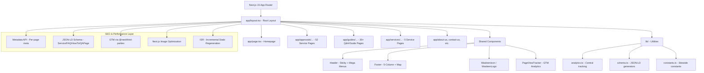

# Wasleen Liminal Approval Consultants — Complete Website Build Plan

## Project Overview

Build a Next.js 15 (App Router) + Tailwind CSS v4 + TypeScript website for Dubai approval consultancy services. The site targets **#1 ranking on Google and AI search engines** (Google AI Overviews, ChatGPT Search, Perplexity) through a comprehensive SEO, AEO, GEO, and AIO strategy.

**Domain (PRIMARY):** `https://www.dubaiapprovalconsultants.com`  
**Company Legal Name:** Wasleen Liminal Approval Consultants  
**Trading Name:** Wasleen Approvals  
**Phone / WhatsApp:** +971542330837 | **Email:** approvals@wasleen.com  
**Target Location:** Dubai, United Arab Emirates

---

## Architecture Overview



---

## 1. AI AGENT RULES SYSTEM (NEW)

Six core rule files govern ALL AI behavior. Every AI agent must load them in this exact order:

| # | File | Purpose |
|---|---|---|
| 0 | `.roo/rules/00-PROJECT-MASTER-RULE.md` | Master identity, domain, NAP, core principles |
| 1 | `.roo/rules/01-AI-AGENT-ROLES.md` | Agent role definitions, duties, constraints |
| 2 | `.roo/rules/02-DESIGN-TOKEN-SYSTEM.md` | Color tokens `#004080`, typography, spacing |
| 3 | `.roo/rules/03-SEO-AI-SEARCH-MASTER.md` | SEO/AEO/GEO/AIO 2026 standards |
| 4 | `.roo/rules/04-BUILD-SEQUENCING.md` | One-task-at-a-time build order |
| 5 | `.roo/rules/05-TECHNICAL-SEO-SCHEMA.md` | JSON-LD, canonical, hreflang, sitemap |

Plus domain-specific rules (analytics-tracking.md, header-footer-structure.md, etc.) loaded as needed.

### Agent Role Assignments

| Mode | Role | Responsibility |
|---|---|---|
| 🏗️ Architect | Senior Technical Architect / SEO Strategist | Plan, design, validate, create rules, save plans to `/plans/` |
| 💻 Code | Senior Full-Stack Developer | Execute approved plan, write production code, one file at a time |
| ❓ Ask | Senior Technical SEO Analyst | Review, audit, analyze, recommend |
| 🪲 Debug | Senior Debug Engineer | Troubleshoot, optimize, fix bugs |
| 🪃 Orchestrator | NOT USED for this project | — |

---

## Phase 2: Project Initialization & Foundation

### 2.1 Initialize Next.js 15 Project

```bash
npx create-next-app@latest . --typescript --tailwind --eslint --app --src-dir --import-alias "@/*"
```

**Key decisions:**
- `--src-dir` for cleaner separation of source code
- `--app` for App Router (Pages Router is explicitly forbidden)
- Tailwind CSS v4 (latest)
- TypeScript strict mode
- Initialize IN the current directory (project root)

### 2.2 Install Core Dependencies

```bash
npm install lucide-react @next/third-parties@latest
npm install -D @types/node
```

**NOT installed** (per project rules):
- No `framer-motion` — CSS animations only
- No `next-seo` — Next.js 15 Metadata API handles this natively
- No `styled-components` or CSS modules — Tailwind CSS v4 only
- No `axios`, `react-query` — keep bundle minimal

### 2.3 Environment Variables

Create `.env.local`:

```env
NEXT_PUBLIC_GTM_ID=GTM-P45BMK7J
NEXT_PUBLIC_SITE_URL=https://www.dubaiapprovalconsultants.com
NEXT_PUBLIC_COMPANY_PHONE=+971542330837
NEXT_PUBLIC_COMPANY_WHATSAPP=+971542330837
NEXT_PUBLIC_COMPANY_EMAIL=approvals@wasleen.com
```

### 2.4 Tailwind CSS v4 Configuration

Configure extended colors from design token system (`.roo/rules/02-DESIGN-TOKEN-SYSTEM.md`):

| Token | Hex | Usage |
|---|---|---|
| `brand-blue` | `#004080` | Primary: headers, nav, buttons, borders |
| `brand-blue-hover` | `#003366` | Hover state for brand blue |
| `uae-red` | `#C8102E` | "WASLEEN" text in logo ONLY |
| `uae-green` | `#00843D` | "LIMINAL" text in logo ONLY |
| `brand-black` | `#000000` | "APPROVAL CONSULTANTS" subtitle |
| `cta-amber` | `#F5A623` | Primary CTA buttons ONLY |
| `cta-amber-hover` | `#D68910` | CTA hover state |
| `light-bg` | `#f8fafc` | Alternating section backgrounds |
| `card-bg` | `#EAF1FB` | Cards, icon backgrounds |
| `body-text` | `#1A2233` | Body copy (charcoal navy) |
| `heading-text` | `#004080` | Section headings |
| `link-blue` | `#0466C8` | Hyperlinks |
| `success-green` | `#2E9E5B` | Approved status, checkmarks |
| `border-light` | `#D6E4F0` | Borders, dividers |

**Font setup via `next/font`:**
- Headings (H1-H3): `Montserrat` 700
- Body: `Roboto` 400, 500
- Logo: `Montserrat` 800/900
- Mono: `Roboto Mono` 400, 500

### 2.5 Folder Structure

```
src/
├── app/
│   ├── layout.tsx              # Root layout (GTM, fonts, metadata)
│   ├── page.tsx                # Homepage
│   ├── approvals/
│   │   ├── [slug]/page.tsx     # Dynamic approval service pages
│   │   └── page.tsx            # Approvals hub
│   ├── guides/
│   │   ├── [slug]/page.tsx     # Dynamic Q&A/guide pages
│   │   └── page.tsx            # Guides hub
│   ├── services/
│   │   ├── [slug]/page.tsx     # Dynamic service pages
│   │   └── page.tsx            # Services hub
│   ├── about-us/page.tsx
│   ├── contact-us/page.tsx
│   └── not-found.tsx
├── components/
│   ├── layout/
│   │   ├── Header.tsx          # Sticky header with mega menus
│   │   ├── Footer.tsx          # 5-column footer with map
│   │   ├── MobileNav.tsx       # Mobile hamburger menu
│   │   └── MegaMenu.tsx        # Reusable mega menu component
│   ├── logo/
│   │   ├── WasleenIcon.tsx     # Icon-only mark (LOCKED)
│   │   └── WasleenLogo.tsx     # Full lockup (LOCKED)
│   ├── analytics/
│   │   └── PageViewTracker.tsx # GTM page view tracking
│   ├── sections/
│   │   ├── HeroSection.tsx     # Homepage hero
│   │   ├── StatsStrip.tsx      # At-a-glance fact strip
│   │   ├── DocumentsTable.tsx  # Documents & requirements table
│   │   ├── TimelineTable.tsx   # Timeline & cost table
│   │   ├── ProcessSteps.tsx    # Numbered process list
│   │   ├── FAQBlock.tsx        # FAQ accordion
│   │   ├── RelatedApprovals.tsx# Internal linking section
│   │   ├── CTASection.tsx      # Call to action
│   │   └── TrustStrip.tsx      # Authority logos strip
│   ├── drawings/
│   │   ├── SceneA_FloorPlan.tsx    # Architectural floor plan
│   │   ├── SceneB_Structural.tsx   # Structural frame
│   │   ├── SceneC_Steel.tsx        # Steel structure
│   │   ├── SceneD_Interior.tsx     # Interior drawing
│   │   ├── SceneE_SitePlan.tsx     # Site plan
│   │   └── DrawingSymbols.tsx      # Shared symbol library
│   └── ui/
│       ├── Button.tsx
│       ├── Card.tsx
│       ├── Badge.tsx
│       └── Accordion.tsx
├── lib/
│   ├── analytics.ts            # Central tracking utility
│   ├── schema.ts               # JSON-LD generators
│   ├── content.ts              # Content helpers
│   └── constants.ts            # Sitewide constants
├── data/
│   ├── approvals.ts            # All 52 approval definitions
│   ├── guides.ts               # All guide page definitions
│   └── services.ts             # Service page definitions
└── types/
    └── index.ts                # Shared TypeScript types
/public/
├── favicon.svg                 # LOCKED
├── favicon.ico                 # LOCKED
├── favicon-96x96.png           # LOCKED
├── apple-icon.png              # LOCKED
├── web-app-manifest-192x192.png# LOCKED
├── web-app-manifest-512x512.png# LOCKED
├── manifest.json               # LOCKED
└── logos/
    └── authorities/            # Authority logo assets
```

---

## Phase 3: Logo & Branding System

### 3.1 Create Logo Components

**WasleenIcon.tsx** — Floor-plan badge SVG from finalized `logo-components.md`:
- `viewBox="0 0 200 200"`
- Blue badge frame: `#004080` (brand-blue) — per `logo-code.md`
- Outer wall boundary: `#004080`
- Internal partition wall: `#000000`
- Door leaf + swing arc: `#C8102E` (UAE red)
- Window break lines: `#00843D` (UAE green)
- `role="img"` with `<title>` and `<desc>`

**WasleenLogo.tsx** — Full lockup rendering WasleenIcon internally:
- "WASLEEN" in `#C8102E` (UAE red)
- "LIMINAL" in `#00843D` (UAE green)
- "APPROVAL CONSULTANTS" in `#000000`
- Font: Montserrat 800/900 via next/font

**IMPORTANT:** Both components are LOCKED after creation. Never modify geometry, viewBox, or color assignments.

### 3.2 Favicon Files (LOCKED)

Generate from WasleenIcon geometry:
- `favicon.svg` — Primary (SVG format)
- `favicon.ico` — 48x48 fallback
- `favicon-96x96.png` — 96x96 fallback
- `apple-icon.png` — 180x180 iOS
- `web-app-manifest-192x192.png` — PWA
- `web-app-manifest-512x512.png` — PWA
- `manifest.json` — PWA manifest

### 3.3 Root Layout Metadata

```tsx
export const metadata = {
  metadataBase: new URL('https://www.dubaiapprovalconsultants.com'),
  title: {
    default: "Dubai Approvals Expert | DM, DDA, DEWA & DCD | Wasleen",
    template: "%s | Wasleen Approvals"
  },
  description: "Need fast engineering and safety approvals in Dubai? Wasleen manages DM, DDA, DEWA, and DCD permits for your projects. Contact our experts today!",
  icons: {
    icon: [
      { url: '/favicon.svg', type: 'image/svg+xml' },
      { url: '/favicon-96x96.png', sizes: '96x96', type: 'image/png' },
    ],
    shortcut: '/favicon.ico',
    apple: [{ url: '/apple-icon.png', sizes: '180x180' }],
  },
  manifest: '/manifest.json',
}
```

---

## Phase 4: Layout Components (Header & Footer)

### 4.1 Header Component

**Specification summary:**
- Sticky on scroll with height compression
- Mobile: Logo (left) — CTA (right) — Hamburger (rightmost)
- Desktop: Logo (left) — Nav links (center) — CTA button (right)
- Nav items: Home, Approvals (mega menu), Services (mega menu), Guides, About Us, Contact Us
- Active page indicator using brand-blue `#004080`
- All links use real `<a href>` tags (server-rendered)
- CTA button: amber `#F5A623`, links to WhatsApp

**Approvals Mega Menu (52 items, categorized):**
- 8 category columns: Government & Regulatory, Free Zone, Developer & Community, Property & Registration, Technical/Utility, Trade/Food/Hospitality, Fit-Out/Interior/Construction, Drawing/Documentation
- Mobile: accordion pattern, 44x44px tap targets

**Services Mega Menu:**
- 2D Drawings, 3D Designs, CAD Drawings, Project Management, Fit-Outs → `/services/...`
- Interior → `https://wasleen.com` (external, `rel="noopener"`, same-tab)
- Pergolas → `https://www.pergolas.wasleen.com` (external, `rel="noopener"`, same-tab)

### 4.2 Footer Component

**5-column layout (desktop) / single-column accordion (mobile):**
1. Company info — Logo, description, social icons
2. Services — Mirror of Services mega menu
3. Government & Regulatory Approvals — Top 5-6 + "View All"
4. Free Zone + Fit-Out Approvals — Top 5-6 + "View All"
5. Company & Contact — About, Contact, Guides, Phone, Email, Address

**Bottom bar:**
- Left: "Designed by Wasleen Digital Labs"
- Right: `© {dynamic year} Wasleen Liminal Approval Consultants. All rights reserved.`

**Google Map embed** — Lazy-loaded iframe

---

## Phase 5: Analytics & Tracking

### 5.1 GTM Installation (Single Mechanism)

- `lib/analytics.ts` — Central `trackEvent()` utility (never call `sendGTMEvent` directly)
- `components/analytics/PageViewTracker.tsx` — Client component for App Router route changes
- Root layout: `GoogleTagManager` from `@next/third-parties/google`

**Critical rule:** Only GTM loads. No direct gtag.js. GA4 configured inside GTM dashboard.

### 5.2 Event Tracking Taxonomy

| Event | Action | Category | When |
|---|---|---|---|
| CTA click | `cta_click` | `engagement` | Any CTA button |
| Form submit | `generate_lead` | `lead` | Contact form |
| Phone click | `contact_click` | `contact` | tel: links |
| WhatsApp click | `contact_click` | `contact` | WhatsApp links |
| FAQ expand | `faq_expand` | `content_engagement` | FAQ accordion |
| Menu open | `menu_open` | `navigation` | Mega menu |
| Related link | `related_link_click` | `internal_navigation` | Section 12 links |

### 5.3 GTM Dashboard Checklist (Manual)

- [ ] Create GA4 Configuration tag (Measurement ID: `G-SJF4WHM8QJ`)
- [ ] Create Custom Event triggers for all events
- [ ] Create GA4 Event tags for each trigger
- [ ] Publish GTM container
- [ ] Enable Enhanced Measurement in GA4
- [ ] Mark `generate_lead` and `contact_click` as key events
- [ ] Link Google Search Console to GA4

---

## Phase 6: Homepage

### 6.1 Homepage Sections (in order)

1. **Hero** — Animated SVG drawing (Scene A — Floor Plan) + H1 + CTA
2. **Trust Strip** — Authority logos (grayscale, reduced opacity)
3. **Service Categories** — 8 category cards with Lucide icons
4. **Featured Approvals** — Top 6-8 most popular approvals
5. **Process Overview** — How it works (3-4 steps)
6. **Stats/Trust Signals** — Real, verifiable numbers
7. **FAQ** — Top 5-6 general questions with FAQPage schema
8. **CTA Section** — Final call to action

### 6.2 Homepage Metadata

- **Meta Title (54 chars):** `Dubai Approvals Expert | DM, DDA, DEWA & DCD | Wasleen`
- **Meta Description (152 chars):** `Need fast engineering and safety approvals in Dubai? Wasleen manages DM, DDA, DEWA, and DCD permits for your projects. Contact our experts today!`
- **Canonical:** `https://www.dubaiapprovalconsultants.com`

### 6.3 Homepage Schema

- `WebPage` + `ItemList` of top service categories
- Reference to sitewide `Organization` `@id`
- `BreadcrumbList` (Home only)

---

## Phase 7: Approval Service Pages (52 Pages)

### 7.1 Dynamic Route

`/approvals/[slug]/page.tsx` with `generateStaticParams` for ISR.

### 7.2 Data Layer

`src/data/approvals.ts` — All 52 approval definitions with full content structure:
- slug, name, shortName, authorityFull, authorityAbbr, category
- primaryKeyword, secondaryKeywords, typicalTimeline, typicalCostRange
- directAnswer, stats, description, whoNeedsIt, documents, process
- timelineTable, rejectionReasons, caseStudy, faqs, relatedSlugs

### 7.3 Page Content Structure (13 sections, strict order)

1. **Direct Answer Block** — Self-contained, quotable by AI engines
2. **At-a-Glance Fact Strip** — Authority, Timeline, Mandatory for, Documents
3. **What is [Approval]** — 150-250 words with secondary keywords
4. **Who Needs This** — Bullet list
5. **Documents Table** (TABLE #1) — With legal disclaimer
6. **Process Steps** — Numbered list (5-8 steps) + HowTo schema
7. **Timeline & Cost Table** (TABLE #2) — With disclaimer
8. **Rejection Reasons** — 4-6 specific, real reasons
9. **Case Reference** — Anonymized real project
10. **Why Choose Us** — License, credentials
11. **FAQ Block** — 5-8 questions + FAQPage schema (text matches schema verbatim)
12. **Related Approvals** — Internal linking cluster
13. **CTA** — One form, one phone, one WhatsApp

### 7.4 Per-Page Schema Stack

- `Service` schema (references Organization @id)
- `FAQPage` schema (text matches visible content exactly)
- `HowTo` schema (steps match visible list exactly)
- `BreadcrumbList` (Home > Category > This page)
- `WebPage` wrapper

### 7.5 Per-Page Metadata

- Title: 50-60 chars, primary keyword front-loaded, ends with `| Wasleen`
- Description: 140-160 chars, includes concrete number, active voice, ends with CTA
- Canonical: `https://www.dubaiapprovalconsultants.com/approvals/{slug}`
- OG tags matching meta

---

## Phase 8: Guide / Q&A Pages (30+ Pages)

### 8.1 Dynamic Route

`/guides/[slug]/page.tsx` with `generateStaticParams`.

### 8.2 Page Types

**Type A — Hub guides (evergreen pillar pages):**
- Types of Approvals in Dubai
- Dubai Approval Rules & Regulations
- Approvals Required for Fit-Out Projects
- Government vs Free Zone Approvals
- How to Choose an Approvals Company

**Type B — Long-tail Q&A (specific questions):**
- Format: `/guides/{slug}` with year for time-sensitive content
- Each links back to its parent service page

### 8.3 Schema for Q&A Pages

- `QAPage` with single `Question` + `acceptedAnswer`
- `BreadcrumbList` (Home > Category > This page)
- `WebPage` with `about` referencing parent Service @id

---

## Phase 9: Services Pages (5 Pages)

### 9.1 Pages

| Page | Slug |
|---|---|
| 2D Drawings | `/services/2d-drawings` |
| 3D Designs | `/services/3d-designs` |
| CAD Drawings | `/services/cad-drawings` |
| Project Management | `/services/project-management` |
| Fit-Outs | `/services/fit-outs` |

### 9.2 Content Structure

Same approval-page structure adapted for service capabilities: direct answer, process, requirements/deliverables table, FAQ, related links.

---

## Phase 10: Static Pages

### 10.1 About Us (`/about-us`)
- Company story, team, credentials
- Schema: `AboutPage` + `Organization` reference
- Strong E-E-A-T: founder `Person` objects, employee credentials
- Never fabricate team sizes or credentials

### 10.2 Contact Us (`/contact-us`)
- Contact form, phone, WhatsApp, email, Google Map
- Schema: `ContactPage` + `ContactPoint`
- NAP data matches Organization schema byte-for-byte

### 10.3 Hub Pages
- `/approvals` — 52 approvals by category with Lucide icons
- `/guides` — All guide/Q&A pages by parent approval
- `/services` — 5 service pages

---

## Phase 11: JSON-LD Schema System

### 11.1 Sitewide Schema (injected once in root layout)

**Organization `@id`:** `https://www.dubaiapprovalconsultants.com/#organization`
**WebSite `@id`:** `https://www.dubaiapprovalconsultants.com/#website`

```typescript
// lib/schema.ts
organizationSchema()    → Organization with @id, name, url, telephone, email, address
websiteSchema()         → WebSite with @id, url, name, publisher
serviceSchema(data)     → Service with provider reference
faqPageSchema(faqs)     → FAQPage with Question/Answer array
howToSchema(steps)      → HowTo with HowToStep array
qaPageSchema(qData)     → QAPage with Question/AcceptedAnswer
breadcrumbList(items)   → BreadcrumbList with ListItem array
```

### 11.2 Consistency Rules

- Every page references same `Organization` `@id`
- NAP data identical across ALL schema instances and Google Business Profile
- Visible text = schema text word-for-word
- No fabricated data
- Every page includes `BreadcrumbList`

---

## Phase 12: Animated SVG Drawing System

### 12.1 Symbol Library

`DrawingSymbols.tsx` with `<defs>`: dim-tick, column-bubble, north-arrow, section-marker, title-block, scale-bar, steel-i-beam, bolt-symbol, rebar-dot, door-swing, window-symbol, furniture symbols

### 12.2 Pattern Library

Hatch patterns: concrete, steel, insulation, blueprint grid. All via `<pattern>` tiles (never individual path elements).

### 12.3 Scene Components

| Scene | Used On | Animation Budget |
|---|---|---|
| A — Floor Plan | Homepage hero | 3-5 seconds |
| B — Structural Frame | Structural approval pages | 3-5 seconds |
| C — Steel Structure | Steel/structural pages | 3-5 seconds |
| D — Interior Drawing | Interior Works Approval | 3-5 seconds |
| E — Site Plan | DM/DDA pages | 3-5 seconds |

### 12.4 Animation Rules

- Staged via `animation-delay`: grid → outline → secondary → symbols → dimensions → title block
- Only `opacity`, `transform`, `stroke-dashoffset` animated
- `ease-out` only — no bounce/elastic
- Plays once on load/scroll-into-view, holds final state
- `prefers-reduced-motion` disables all animation
- `role="img"` + `<title>`/`<desc>` for accessibility
- No Framer Motion — CSS keyframes + IntersectionObserver only

---

## Phase 13: SEO & AI Search Ranking Strategy

### 13.1 Meta Tag Standards (2026)

| Rule | Specification |
|---|---|
| Title length | 50-60 characters (NEVER exceed 60) |
| Title format | `{Primary Keyword} | Wasleen` |
| Description length | 140-160 characters |
| Description must include | One concrete number + CTA |
| Uniqueness | 100% unique per page |

### 13.2 AEO / GEO / AIO Requirements

Every approval page MUST have:
- **Direct Answer Block** — Self-contained 2-3 sentences quotable by AI
- **Stats Strip** — 4 numbered facts (most quoted content type by AI)
- **2 Structured Tables** — AI models parse HTML tables for data-driven queries
- **FAQ with FAQPage Schema** — 5-8 questions, text matches schema verbatim
- **Entity-first content** — Define acronyms immediately, use full names

### 13.3 On-Page SEO

- Heading hierarchy: H1 → H2 → H3 (never skip levels)
- One H1 per page = exact primary keyword
- Descriptive anchor text for ALL internal links
- Never "click here", "learn more"
- Every image needs descriptive alt text
- Clean URL slugs: `/approvals/{slug}`, `/guides/{slug}`, `/services/{slug}`

### 13.4 E-E-A-T Signals

- Author/reviewer credit line on every page
- License/registration numbers where applicable
- Disclaimer notes beneath all tables
- Transparent pricing (indicative ranges, never "contact us" only)
- Visible "last updated" date matching `dateModified` in schema
- Case studies with real project examples

### 13.5 Performance Strategy (95+ PageSpeed)

| Metric | Target | How |
|---|---|---|
| LCP | < 1.5s | Inline critical CSS, optimize hero SVG, next/image |
| FID/INP | < 100ms | Minimal JS bundles, no framer-motion |
| CLS | < 0.05 | Explicit dimensions on all images |
| TBT | < 100ms | Lazy non-critical JS |
| SI | < 2.0s | Progressive rendering |

---

## Phase 14: Build Sequencing (One Task at a Time)

| Priority | Phase | Description | Verification Gate |
|---|---|---|---|
| P0 | Foundation | Next.js init, deps, config, folders | `npm run build` passes |
| P0 | Logo System | WasleenIcon, WasleenLogo, favicons | Favicon shows in browser |
| P0 | Layout | Header, Footer, MegaMenu, MobileNav | Responsive at 360px + desktop |
| P0 | Analytics | GTM, trackEvent, PageViewTracker | GTM Preview mode |
| P0 | Homepage | Hero, sections, schema | Full page render |
| P1 | Static Pages | About, Contact, Not Found | All render correctly |
| P1 | Data Layer | types, data files, schema utilities | TypeScript compiles |
| P1 | First 10 Approvals | [slug]/page.tsx + sections | Rich Results Test passes |
| P2 | Remaining 42 Approvals | Data-driven generation | All 52 build without errors |
| P2 | Guide Pages (30+) | [slug]/page.tsx + data | Internal links verified |
| P2 | Hub Pages | /approvals, /guides, /services | All links working |
| P3 | Services Pages (5) | [slug]/page.tsx | All 5 render correctly |
| P3 | SVG Drawings | Symbols + 5 scenes | Reduced-motion verified |
| P4 | Performance | sitemap, robots, Lighthouse | Score 95+ |
| P4 | Deployment | Vercel, domain, Search Console | Site live + verified |

---

## Phase 15: Deployment & Launch Checklist

### 15.1 Pre-Launch Verification

- [ ] All 52 approval pages built with unique content
- [ ] All 30+ guide/Q&A pages built
- [ ] All 5 service pages built
- [ ] All static pages built (About, Contact, Hubs)
- [ ] Header + Footer consistent across all pages
- [ ] Logo components render correctly at all sizes
- [ ] Favicon displays in all browsers
- [ ] GTM installed via `@next/third-parties` (not direct gtag.js)
- [ ] PageViewTracker fires on every route change
- [ ] All tracking via `trackEvent()` — never direct `sendGTMEvent`
- [ ] JSON-LD schema valid on every page
- [ ] Meta titles unique, 50-60 chars
- [ ] Meta descriptions unique, 140-160 chars, with CTA
- [ ] All internal links point to real pages
- [ ] External links correct (wasleen.com, pergolas.wasleen.com)
- [ ] NAP data consistent across footer, schema, GBP
- [ ] Animated SVGs play correctly + reduced-motion fallback
- [ ] Mobile-first responsive verified at 360-390px
- [ ] PageSpeed score 95+ mobile and desktop
- [ ] sitemap.xml includes all pages
- [ ] robots.txt allows crawling
- [ ] Google Search Console verified

### 15.2 Deployment Steps

1. Push to GitHub (`wasleenliminalapprovals@gmail.com` account)
2. Connect to Vercel (same GitHub account)
3. Set environment variables in Vercel Dashboard
4. Deploy production branch
5. Configure custom domain: `www.dubaiapprovalconsultants.com`
6. Submit sitemap to Google Search Console
7. Verify site in GTM Preview mode
8. Post-launch monitoring (30-60-90 day)

---

## Key Architecture Decisions (Summary)

1. **Domain:** `www.dubaiapprovalconsultants.com` — NOT wasleen.com
2. **Brand Blue:** `#004080` — from logo-code.md specification
3. **Analytics:** GTM only, no direct gtag.js — single mechanism
4. **Animations:** CSS-only — no Framer Motion
5. **SEO:** Next.js Metadata API — no next-seo
6. **Styling:** Tailwind CSS v4 only — no inline styles, no CSS modules
7. **Schema:** Centralized `lib/schema.ts` — consistent Organization @id everywhere
8. **Build Order:** Strict P0→P4 sequencing — one task at a time
9. **Mobile-First:** Build and test at 360-390px before desktop
10. **Data-Driven:** All content in `src/data/` — pages are thin rendering layers
