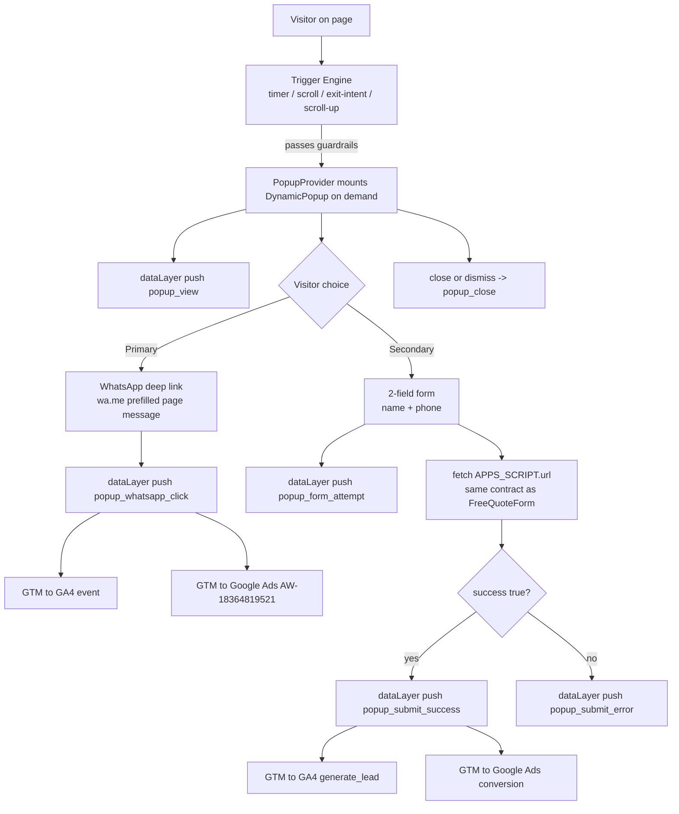

# Dynamic Popup Implementation Plan — Wasleen Liminal Approval Consultants

**Domain:** https://www.dubaiapprovalconsultants.com
**Source spec (to be superseded by this plan):** [`reference details/Dynamic-Popup-Conversion-Plan.md`](../reference%20details/Dynamic-Popup-Conversion-Plan.md)
**Stack:** Next.js 15 App Router · Tailwind CSS v4 (tokens in `src/app/globals.css`) · TypeScript · `lucide-react` · GTM-P45BMK7J · GA4 G-SJF4WHM8QJ · Google Ads AW-18364819521

---

## 0. Non-Negotiable Constraints

1. **Additive-only.** All new behavior lives in NEW files. The only existing-file changes are:
   - `src/app/layout.tsx` — mount `<PopupProvider />` (one import + one element, beside `<FloatingWhatsApp />`).
   - `reference details/analytics-tracking.md` — add the new popup events to the taxonomy (required by the project's analytics rule before any `trackEvent` use).
   - `src/app/globals.css` — **only if** a keyframe is genuinely missing (the plan prefers reusing existing `fade-in` / `fade-in-up` keyframes; see §7).
2. **NEVER modify** (LOCKED / out of scope): Header, Footer, MegaMenu, MobileNav, logo components, `FreeQuoteForm.tsx`, `FloatingWhatsApp.tsx`, `constants.ts`, `approvals.ts`, `guides.ts`, `services.ts`, all page files under `src/app/`, favicons/manifest.
3. **Mirror the existing Apps Script contract byte-for-byte** — `Content-Type: text/plain;charset=utf-8`, `token`, awaits `res.json()`, checks `json.success === true` (from [`FreeQuoteForm.tsx`](../src/components/sections/FreeQuoteForm.tsx:148)). No `no-cors`, no `application/json`. **Single canonical `phone` field — never `whatsapp`** (the contact form sends `phone`; one Apps Script column serves both, §8).
4. **Performance floor:** zero popup **UI** JS on initial load — `DynamicPopup` + `PopupForm` are never in the initial bundle (mounted on demand via `next/dynamic`). `PopupProvider` is a small (~3KB) eager chunk required to register the suppression listener early (before any trigger could fire). Zero CLS (fixed-position overlay), no LCP/TBT regression. Do NOT import `approvals.ts` into the client bundle — use the generated `popup-service-names.ts` map instead (§4).
5. **No dark patterns:** no `popstate`/back-button hijack, no scroll-blocking, no full-screen interstitial.
6. **All analytics via [`trackEvent()`](../src/lib/analytics.ts:57)** — never `sendGTMEvent` directly. PII (name/WhatsApp) never routed through GTM; only via Apps Script (matching existing form behavior — no `metaLead` from the popup in v1 to avoid double-firing Meta events; revisit in a follow-up).
7. **Mobile-first:** design, build, and test at 360–390px before desktop.

---

## 1. Goals

1. Increase incremental lead capture — measured via a **baseline + control-group test** (§14), not popup-attributed volume alone.
2. **WhatsApp-first:** the primary CTA on every popup is a one-tap `wa.me` deep link with a page-contextual, pre-filled message. The 2-field form is the secondary path.
3. Match popup content to visitor intent per page type (home / approvals hub / service / guide / none), derived automatically from the page — no manual copy for **69 approval pages + 7 service pages** (names come from a generated `slug → shortName` map, §3).
4. Feed every conversion (WhatsApp click + form submit) into GTM/GA4/Google Ads as distinct events, with `popup_submit_success` wired to the existing AW-18364819521 conversion account.
5. Zero regression to SEO (LCP, CLS, dwell time), bots never see the popup, and no conflict with the existing `FreeQuoteForm` / `FloatingWhatsApp` conversion paths (suppression rule §12).

---

## 2. System Architecture (Data Flow)



All App Script side-effects (Sheet row + email to `approvals@wasleen.com`) are handled by the **existing** Apps Script `doPost(e)`; the popup only adds a `source: "popup"` field and uses the **canonical `phone` field** (identical to the contact form — never a `whatsapp` field, §8). No new endpoint, no change to delivery.

---

## 3. File Plan (NEW FILES — additive only)

| # | File | Purpose | Client bundle impact |
|---|---|---|---|
| 1 | `src/lib/popup.ts` | Types, EN/AR copy, trigger constants, `readPopupConfig()`, event names, `buildWhatsAppMessage()`, `prettifySlug()`, `isBot()`, suppression helpers | Tiny (provider imports it) |
| 2 | `src/lib/popup-service-names.ts` | **Generated** `POPUP_SERVICE_NAMES` map — `slug → clean shortName` for all 69 approvals + 7 services; single source of truth for `serviceInterest` copy | Tiny (~2KB) |
| 3 | `src/components/popup/PopupProvider.tsx` | Client provider: pathname→config, trigger engine, suppression, state machine, lazy-mounts the UI | Small; the only file mounted in layout |
| 4 | `src/components/popup/usePopupTrigger.ts` | `usePopupTrigger` hook: timer / scrollDepth / exitIntent / scroll-up, with guardrails | Imported by provider |
| 5 | `src/components/popup/DynamicPopup.tsx` | The UI: `MobileSheet` + `DesktopModal`, two-step (WhatsApp-first → form), success/error states, a11y | **Lazy-loaded** — loaded only when a trigger fires |
| 6 | `src/components/popup/PopupForm.tsx` | 2-field form mirroring the Apps Script contract (canonical `phone` field, §8) | Loaded with DynamicPopup |
| 7 | `scripts/generate-popup-names.mjs` | Build-time script: reads `src/data/approvals.ts` + `services.ts`, emits `src/lib/popup-service-names.ts` | Build-time only, never shipped |

### Existing-file changes (the ONLY ones)

| File | Change |
|---|---|
| `src/app/layout.tsx` | Import `PopupProvider` and render `<PopupProvider />` beside `<FloatingWhatsApp />` in `<body>` |
| `reference details/analytics-tracking.md` | Add popup events to the taxonomy table (§9) |
| `src/app/globals.css` | **Optional** — add one `popup-sheet-up` keyframe only if `fade-in-up` proves insufficient for the bottom-sheet feel (likely not needed) |

**No other file in the codebase is touched.**

**Generated-file rule:** `src/lib/popup-service-names.ts` is machine-generated. After any edit to `src/data/approvals.ts` or `src/data/services.ts`, re-run `node scripts/generate-popup-names.mjs` and commit the regenerated map. Never hand-edit it.

---

## 4. Page-Type Resolution (no manual per-page config)

The provider derives configuration from `usePathname()` + the live DOM — no data import, no per-page files.

| Route pattern | pageType | WhatsApp pre-fill | Trigger |
|---|---|---|---|
| `/` | `home` | "Not sure which approval…" | 8s timer |
| `/approvals` (and `/approvals?category=*`) | `approvals-hub` | "Comparing approval options…" | 8s timer |
| `/approvals/[slug]` (69) | `service` | Service-specific (from generated map) | 10s OR 40% scroll |
| `/services/[slug]` (7) | `service` | Service-specific (from generated map) | 10s OR 40% scroll |
| `/services` | `none` | — | **Suppressed** (hub page, low-intent) |
| `/guides/[slug]` · `/blog/[slug]` | `guide` | Guide-specific | 55% scroll OR 15s dwell (hard floor: never before 12s) |
| `/about-us` · `/contact-us` · `/free-quote` · `/license` | `none` | — | **Suppressed** (exit-intent only, capped) |
| `/ar/*` (any Arabic route) | locale-aware | Arabic message | Same rules |
| unknown / 404 | `none` | — | Suppressed |

**Service-name derivation (key performance + copy-quality decision):**
- **Primary source: the generated map** — `POPUP_SERVICE_NAMES[slug]` from `src/lib/popup-service-names.ts` (e.g. `"dubai-municipality-building-permit" → "DM Building Permit"`, `"dewa-approval" → "DEWA Approval"`). Guarantees clean, natural copy for all 69 approval + 7 service pages with zero manual per-page config.
- **Why NOT the `<h1>`?** Approval-page H1s are SEO **keyword phrases** (e.g. `"DEWA approval Dubai"`, `"Dubai Municipality building permit"`) — reading the live H1 produces awkward popup copy. The generated map uses each record's clean `shortName` field (already present in `approvals.ts` / `services.ts`).
- Fallback chain (in order): `POPUP_SERVICE_NAMES[slug]` → cleaned `document.querySelector("h1")` (strip trailing `" | Wasleen Approvals"`, `" in Dubai"`, whitespace) → `prettifySlug(slug)`.
- This avoids importing the 7,400-line `approvals.ts` into the client bundle entirely (map is ~2KB).

---

## 5. Trigger Engine (`usePopupTrigger`)

| Trigger | Fires when | Guardrails |
|---|---|---|
| `timer` | N seconds after first content paint | Skip if `document.referrer` is same-site (already engaged) |
| `scrollDepth` | Scroll passes X% of page | Never fire if scroll is already past 50% at check time (don't interrupt mid-read) |
| `exitIntent` (desktop) | `mouseleave` with `clientY < 10` | Only if no popup shown this session; only once |
| `scrollUp` (mobile, exit-intent equivalent) | User scrolls back up toward the top after having scrolled down ≥35% | No `popstate` interception — explicitly forbidden |

**Timing constants (from `src/lib/popup.ts`, runtime-override-able):**

```
service:   timer 10s  OR scroll 40%  (whichever first)
home/hub:  timer 8s
guide:     scroll 55% OR dwell 15s   (hard floor: never before 12s)
exit-intent + scroll-up: always gated by session cap
```

**Runtime config (enables GTM-controlled A/B without redeploys):** the provider calls `readPopupConfig()` before every trigger decision. GTM injects `window.WLP_POPUP_CONFIG` to flip variants/timings per traffic slice:

```ts
export type PopupRuntimeConfig = {
  serviceTimerS: number;     // default 10
  serviceScrollPct: number;  // default 40
  variant: "whatsapp-primary" | "form-primary"; // default "whatsapp-primary"
};

export const DEFAULT_POPUP_CFG: PopupRuntimeConfig = {
  serviceTimerS: 10, serviceScrollPct: 40, variant: "whatsapp-primary",
};

export function readPopupConfig(): PopupRuntimeConfig {
  return { ...DEFAULT_POPUP_CFG, ...(window.WLP_POPUP_CONFIG ?? {}) };
}
```

**Session / frequency guardrails (§12) are evaluated inside the provider BEFORE any listener is registered** so no work is wasted and no event is lost.

---

## 6. DynamicPopup UI — Visual Design Specification (stunning + easy + mobile-first)

### 6.1 Design language
- **Tokens only:** `brand-blue` (`#004080`), `cta-amber` (`#F5A623`), `card-bg` (`#EAF1FB`), `light-bg`, `body-text`, `heading-text`, `link-blue`, `success-green`, `border-light`, `shadow-card` / `shadow-dropdown`. WhatsApp green uses `bg-[#25D366]` — the exact arbitrary class already used by [`FloatingWhatsApp.tsx`](../src/components/sections/FloatingWhatsApp.tsx:40) (existing precedent).
- **Typography:** headline `font-montserrat font-bold text-h3` (mobile) / `text-h2` (desktop); body `font-roboto text-body-sm`. All scale tokens from `globals.css`.
- **Icons:** `lucide-react`, `strokeWidth={1.75}`, 20–24px, `currentColor`.
- **Motion:** calm, professional (regulatory/trust niche). 240ms ease-out; no bounce/elastic. Respect `prefers-reduced-motion` (render static).

### 6.2 MOBILE — Bottom Sheet (designed first, 360–390px)
Layout (top → bottom):
1. **Drag handle** — 40×4px rounded neutral bar, centered at the very top of the sheet (affordance + polish).
2. **Header row** — left: small eyebrow pill `"FREE ESTIMATE"` (`bg-card-bg text-brand-blue`, `rounded-sm`); right: 44×44px X close (`text-body-text`, `hover:text-brand-blue`, `focus-visible:ring`). 48px tap-target rule.
3. **Headline** — mirrors the page service (from H1), `text-h3`, `text-heading-text`.
4. **Subheadline** — one line: *"Get your {service} timeline & cost estimate — free, takes 2 minutes."*
5. **PRIMARY CTA — WhatsApp button** — full-width, `bg-[#25D366]`, white bold text, `MessageCircle` icon, label *"Chat on WhatsApp — Free & Instant"*. Under-button microcopy: *"We reply within 1 hour · No forms needed"*. Subtle, calm attention via a soft icon pulse (respects reduced-motion).
6. **Divider** — `"or"` centered (`border-border-light` lines).
7. **Secondary CTA** — `Get a written estimate` text link (`text-link-blue`, underline on hover). Tapping it expands the 2-field form INLINE in the same sheet (no new modal, no navigation). Under the form, privacy microcopy matching the existing form's tone (not copied verbatim — see [`FreeQuoteForm.tsx`](../src/components/sections/FreeQuoteForm.tsx:74)): *"Your details are only used to reply to your enquiry — we never share your number."*
8. **Trust row** — one compact line, real verified stats only: `ShieldCheck` *"Trusted by 500+ Dubai projects"* · `Clock` *"8+ years experience"` (both verified present on the site).
9. **Dismiss** — full-width *"Not now"* text link at the bottom (`text-body-text/60`).

Sheet properties:
- `fixed inset-x-0 bottom-0 z-[70]`, `rounded-t-2xl` (16px), `bg-white`, `shadow-dropdown`, `max-h-[78dvh]` with internal `overflow-y-auto`. `z-[70]` sits **above** the `z-50` `FloatingWhatsApp` button (per [`FloatingWhatsApp.tsx`](../src/components/sections/FloatingWhatsApp.tsx:40)) so the sheet never overlaps it.
- Backdrop: `fixed inset-0 z-[69] bg-black/45` — tap/click to dismiss.
- **Keyboard:** listen to `visualViewport` resize; when an input is focused, translate the sheet so it sits above the keyboard (classic mobile bug guard).
- WhatsApp field pre-fills `+971 ` country prefix; `type="tel"`, `inputMode="tel"`.

### 6.3 DESKTOP — Centered Modal (≥ 768px)
- `fixed inset-0 z-[70]` flex-centered (above `FloatingWhatsApp` at `z-50`); card `w-full max-w-[440px]`, `rounded-xl`, `shadow-dropdown`.
- Same content order as mobile (no drag handle; X top-right 32×32).
- Entry animation: `fade-in` + subtle `scale` (200ms), calm.
- Full a11y: `role="dialog"`, `aria-modal="true"`, `aria-labelledby`, focus trap, ESC to close, initial focus inside, restore focus on close.
- Exit-intent variant renders the same modal.

### 6.4 Shared rules (both breakpoints)
- Overlay never blocks page scroll entirely; background scroll remains but overlay dismissible.
- One popup max per session; never re-trigger same type.
- Wait for `window.dataLayer` (early init already exists in [`layout.tsx`](../src/app/layout.tsx:154)) before registering listeners — tracking never lost on fast interactions.
- Popup is `position: fixed` → **zero CLS**; content is lazy-loaded → **zero LCP/TBT impact**.

---

## 7. Performance Strategy

1. **Zero popup UI JS on initial load.** `PopupProvider` (small ~3KB eager chunk) is the only mounted piece — required to register the suppression listener before any trigger could fire. `DynamicPopup` + `PopupForm` are loaded via `next/dynamic` with `ssr: false` inside the provider, **mounted only after a trigger fires**. No popup UI JS ships on initial load.
2. **No heavy data imports.** Service name resolved from the generated `POPUP_SERVICE_NAMES` map (~2KB); never `approvals.ts`.
3. **Overlay is fixed-position** — cannot shift layout → no CLS.
4. **No new fonts/images** — reuses `font-montserrat` / `font-roboto`; no network images.
5. **CSS:** prefer existing keyframes `fade-in` / `fade-in-up` (already in [`globals.css`](../src/app/globals.css:148)). Add a `popup-sheet-up` keyframe to `globals.css` **only if** the bottom-sheet entrance needs a slide-up distinct from fade-in-up.
6. **Verification gate:** `npm run build` clean; Lighthouse mobile ≥ 90 performance on a rollout page with the popup armed.

---

## 8. Apps Script Payload Contract (mirror exactly)

```ts
// PopupForm submit — MUST mirror FreeQuoteForm.tsx handleSubmit
// FIELD-NAME NOTE: the contact form sends `phone` (see FreeQuoteForm.tsx ~line 153).
// The popup sends the SAME canonical `phone` field — NOT `whatsapp`.
// One Apps Script doPost row-writer reads `data.phone` for BOTH channels.
const res = await fetch(APPS_SCRIPT.url, {
  method: "POST",
  headers: { "Content-Type": "text/plain;charset=utf-8" }, // NOT application/json
  body: JSON.stringify({
    name: string,            // required
    phone: string,           // required — CANONICAL field, must match FreeQuoteForm (never `whatsapp`)
    email: "",               // empty for popup (2 fields only)
    source: "popup",
    pageType: string,        // "service" | "home" | "approvals-hub" | "guide"
    pageSlug: string,        // e.g. "dewa-approval"
    serviceInterest: string, // from POPUP_SERVICE_NAMES[slug] (generated map, §4)
    pageUrl: location.href,
    utm_source / utm_campaign / utm_medium: read from URLSearchParams,  // optional passthrough
    locale: "en" | "ar",
    token: APPS_SCRIPT.token,          // from src/data/free-quote.ts (reused)
    submittedAt: new Date().toISOString(),
  }),
});
const json = await res.json().catch(() => ({}));
if (!res.ok || json.success !== true) throw new Error("submit failed");
```

- Success → `popup_submit_success` + success state. Failure → `popup_submit_error` + inline error with a WhatsApp fallback button.
- **Privacy:** the popup shows the same privacy microcopy as the form (§6.2) — name/phone are used only to reply to the enquiry and never shared.
- **Apps Script side (existing `doPost`) — single row-writer, branch only on `source`:** the existing contact-form submit sends `phone`; the popup sends `phone` too. There is **no `whatsapp` field anywhere** — one sheet column, one row-writer:
  ```js
  const data = JSON.parse(e.postData.contents);
  const isPopup = data.source === "popup";
  const subject = isPopup
    ? `New Popup Lead — ${data.serviceInterest}`  // popup email subject
    : "New Contact Form Lead";                     // existing subject (unchanged)
  // ONE row-writer: phone column ← data.phone for BOTH channels
  // popup additionally logs: source, pageSlug, serviceInterest, pageUrl, locale
  // optional lead-quality columns: status / closed_date / lead_value_aed
  return ContentService.createTextOutput(JSON.stringify({ success: true }))
    .setMimeType(ContentService.MimeType.JSON);
  ```
  Keep recipient `approvals@wasleen.com` for both. *(This is an ops/Apps Script edit, not a repo code change — flag for the owner.)*

---

## 9. Analytics & GTM

### 9.1 Taxonomy additions (to `reference details/analytics-tracking.md`)

| Event name | Fired when | Params | GTM destination |
|---|---|---|---|
| `popup_view` | Popup visible | `popup_type`, `page_slug`, `trigger_type` | GA4 event |
| `popup_close` | Dismissed without submit | `popup_type`, `page_slug`, `time_open_ms` | GA4 event (friction/dismissal-rate signal) |
| `popup_form_toggle` | User chose written estimate | `popup_type`, `page_slug` | GA4 event |
| `popup_form_attempt` | Form submitted | `popup_type`, `page_slug` | GA4 event |
| `popup_submit_success` | Apps Script confirms | `popup_type`, `page_slug`, `service_interest` | GA4 `generate_lead` + **Google Ads conversion** |
| `popup_submit_error` | Apps Script fails | `popup_type`, `page_slug` | GA4 event |
| `popup_whatsapp_click` | WhatsApp CTA clicked | `popup_type`, `page_slug`, `service_interest` | GA4 event + **Google Ads conversion** (separate label from form) |

All fired via `trackEvent({ action, category: "popup", label, ...params })` — never `sendGTMEvent` directly. No PII in GTM.

### 9.2 GTM setup (no-code, in GTM-P45BMK7J — ops task for owner)
1. Custom Event triggers for `popup_submit_success` and `popup_whatsapp_click`.
2. GA4 Event tags (event `generate_lead`) + Google Ads conversion tags — **two separate Google Ads conversions** (`popup_form` and `popup_whatsapp`) under AW-18364819521 so channel value is comparable.
3. Optional `popup_close` GA4 event for dismissal-rate analysis in GA4 Explore.

---

## 10. Content — WhatsApp Pre-Fill Messages (per page type)

All built with `wa.me/${NAP.whatsapp}?text=${encodeURIComponent(msg)}` (same pattern as [`FloatingWhatsApp.tsx`](../src/components/sections/FloatingWhatsApp.tsx:18)); NAP from `constants.ts` (never hardcoded).

| Page type | Pre-filled message (EN) |
|---|---|
| Home | `Hi Wasleen Approvals 👋 I'm on your website and not sure which Dubai approval my project needs. Could you help me work out the right permits and roughly how long they take? Thank you!` |
| Approvals hub | `Hi Wasleen Approvals 👋 I'm comparing approval options on your site. Which approvals apply to my project in Dubai, and can you give me an idea of timeline and cost? Thank you!` |
| Service | `Hi Wasleen Approvals 👋 I just read your {service} page — I need {service} for my project in Dubai. Could you share the typical timeline and an indicative cost estimate? Thank you!` |
| Guide / Blog | `Hi Wasleen Approvals 👋 I read your guide on {topic} and have a question about my situation in Dubai. Could you help me understand the next step? Thank you!` |

Arabic (`/ar/*`): reuse the `AR.cta` strings from `constants.ts`; Arabic message templates added to the `src/lib/popup.ts` copy map.

---

## 11. Accessibility (required by project rules)

- `role="dialog"`, `aria-modal="true"`, `aria-labelledby` → headline id.
- Focus trap (Tab cycles within dialog), initial focus inside, ESC to close, focus restored to trigger on close.
- All buttons: visible labels or `aria-label`.
- `prefers-reduced-motion`: no animations.
- Color contrast: dark-on-light body, brand-blue/white CTA, WhatsApp green/white.
- Mobile: `+971` prefix pre-filled; inputs have `<label>` (visible), not placeholders alone.
- **Privacy/consent:** every form includes a visible consent line (e.g. *"Your number is only used to reply to your enquiry — we never share it."*), consistent with the existing form's privacy note (§6.2 / §8).

---

## 12. Frequency Capping & Suppression

| Rule | Mechanism |
|---|---|
| Max 1 popup per session | `sessionStorage.setItem("wlp_popup_shown","1")` |
| No repeat for 7 days after dismissal | `localStorage` timestamp (`wlp_popup_dismissed_at`) |
| Never show after any lead submit this session | Flag set on `popup_submit_success` |
| **Suppress if visitor already engaged existing paths** | Capture-phase click listener detects clicks on `a[href^="https://wa.me"]` or `[aria-label="Contact us on WhatsApp"]` (the floating button) or within `FreeQuoteForm` — sets the same session flag. **No change to `FloatingWhatsApp.tsx` / `FreeQuoteForm.tsx`.** |
| Suppress on About/Contact/Free-Quote/License | `pageType: "none"` — exit-intent only |
| Suppress on unknown/404 routes | `pageType: "none"` |
| Never for bots/crawlers | Central `isBot()` helper (in `src/lib/popup.ts`): `navigator.webdriver \|\| /bot\|crawl\|spider\|googlebot\|bingbot\|duckduckbot\|baiduspider/i.test(navigator.userAgent)`. Also gate on a user-gesture-independent timeout so crawlers without JS are naturally unaffected; keep popup inside client-only dynamic import |

---

## 13. QA & Verification Gates

Before any rollout:
- [ ] `npm run build` + `npm run lint` clean, zero TS errors.
- [ ] Lighthouse mobile performance ≥ 90 on a rollout page; **no LCP/TBT regression** vs pre-push (dynamic import verified — popup chunk absent from initial bundle).
- [ ] Zero CLS (fixed overlay).
- [ ] Apps Script delivery verified: email arrives at `approvals@wasleen.com` with `New Popup Lead — …` subject; Sheet row contains `source`, `pageSlug`, **and the phone number landed in the `phone` column** (single canonical field — popup never sends `whatsapp`).
- [ ] `node scripts/generate-popup-names.mjs` run; all 69 approval + 7 service slugs resolve to clean shortNames in popup copy (no `"DEWA approval Dubai"`-style H1 leakage).
- [ ] GTM Preview shows `popup_view`, `popup_whatsapp_click`, `popup_submit_success`.
- [ ] Mobile 360–390px: sheet fits, keyboard re-position works, `+971` pre-filled, "Not now" + X both dismiss.
- [ ] Desktop: focus trap, ESC, reduced-motion, exit-intent.
- [ ] Bot/crawler: popup never fires (UA/webdriver check + no-JS naturally absent).
- [ ] Existing paths unaffected: `FloatingWhatsApp` + `FreeQuoteForm` still work; clicking either suppresses the popup.
- [ ] AR routes: Arabic copy renders RTL correctly (or popup suppressed on `/ar` in v1 if QA time is limited — **decision gate**).

---

## 14. Rollout & Incrementality (baseline + control)

1. **Baseline (2–4 weeks, no code):** record per-page conversion rate (all paths: FreeQuoteForm + FloatingWhatsApp + contact CTAs) on the **8 rollout pages** and **8 matching control pages** (similar traffic profile, no popup). Exact rollout slugs (allowlist keys in `src/lib/popup.ts`):
   - `dubai-municipality-building-permit` → DM Building Permit
   - `dubai-civil-defense-approval` → DCD Approval
   - `dewa-approval` → DEWA Approval
   - `dda-approval` → DDA Approval
   - `rta-approval` → RTA Approval
   - `ejari-registration` → Ejari Registration
   - `interior-fit-out-approval` → Interior Fit-Out Approval
   - `interior-works-approval` → Interior Works Approval
2. **Pre-Phase-A foundation (build-time, must land before Phase A):** the service-name generator + generated `POPUP_SERVICE_NAMES` map (§3/§4) and the canonical `phone` field in `PopupForm` + the Apps Script `source` branch (§8). Without these, popup copy is awkward and phone numbers silently drop from the Sheet.
3. **Phase A — launch:** ship popup on the 8 rollout pages only (routing-based allowlist). Validate email, GTM, Google Ads end-to-end.
4. **A/B (GTM-controlled):** inject `window.WLP_POPUP_CONFIG` via GTM to flip `variant` (`whatsapp-primary` vs `form-primary`) and timing per traffic slice — no redeploy needed (`readPopupConfig()`, §5).
5. **Measure:** compare aggregate `generate_lead` on rollout vs control pages (GA4 Explore). Decide: scale to all **69 approval** + **7 service** pages **only if** incremental lift is positive.
6. **Phase B:** all 69 approval + 7 service pages. **Phase C:** guides (only after a real lead magnet exists — no placeholder "checklist"). Homepage: simple WhatsApp-first popup, lowest priority (no multi-step quiz).

---

## 15. Out of Scope (do not touch)

- Any page file under `src/app/` (approvals, guides, services, blog, about, contact, free-quote, license, ar/*).
- Header, Footer, navigation, logo components, favicons.
- `FloatingWhatsApp.tsx`, `FreeQuoteForm.tsx`, `constants.ts`, `approvals.ts` (no popup config embedded there).
- No new dependencies (uses `lucide-react`, `next/dynamic`, existing tokens).
- No `framer-motion`, no new fonts, no new images, no new routes.
