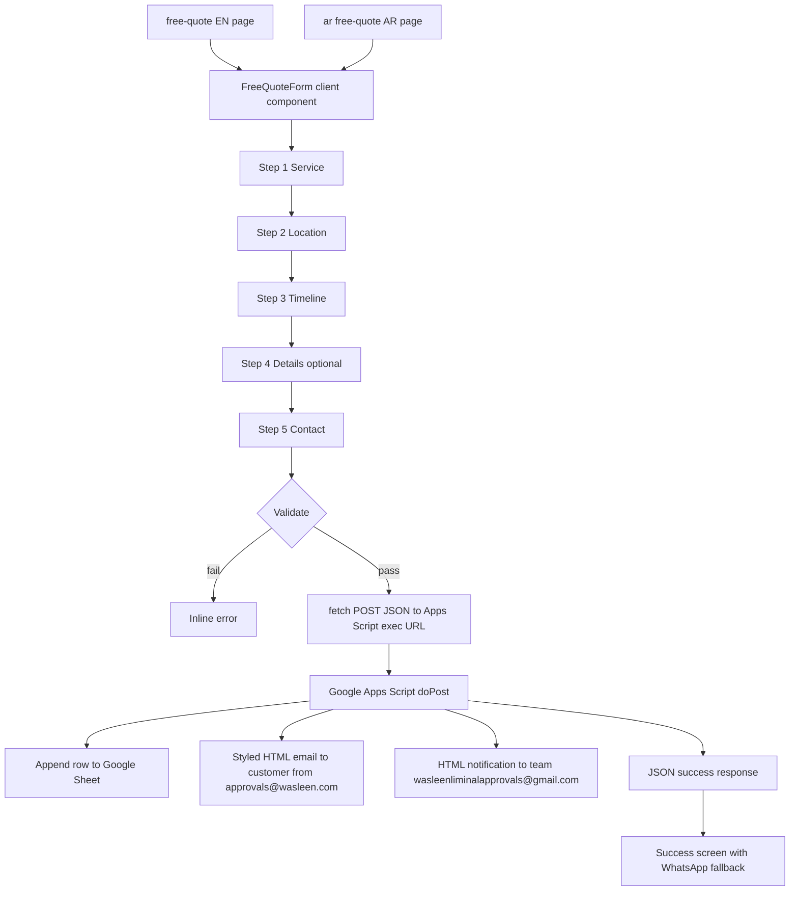

# Free Quote Multi-Step Wizard — Build Plan v2 (Google Apps Script Backend)

**Status:** Draft for approval — v2 replaces the Google Forms (iframe) approach with a
**native Next.js form + Google Apps Script Web App webhook**.
**Mode:** Architect → Code (after approval)
**Target:** `/free-quote` (EN) + `/ar/free-quote` (AR)
**Date:** 2026-08-03

---

## 1. Goal & Vision

Build a premium, headless, multi-step free quote wizard as a **native Next.js Client
Component** (no iframe, no third-party APIs). On submit it sends a JSON `POST` to a
**Google Apps Script Web App** (`doPost` webhook) which:

1. Appends the lead to a Google Sheet.
2. Sends a **highly-styled HTML thank-you email** to the customer — sent **from
   `approvals@wasleen.com`** (verified Gmail alias) via `GmailApp`, with inline
   (cid) brand logo `og.jpg`, a small horizontal row of authority logos, a WhatsApp
   button, and **100% inline CSS**.
3. Sends a simple HTML notification to the team (`wasleenliminalapprovals@gmail.com`).

**The promise to the visitor (visible in page copy):**
> "Get your free Dubai approval quote in 30 seconds. No payment, no obligation — a
> real consultant reviews your request and replies within 24 hours."

### Experience goals
- **Zero friction:** 5 short steps, progress bar always visible.
- **Feels premium:** frosted-glass card, soft brand gradients, smooth step transitions.
- **Feels safe:** trust strip (licensed DET #1188577), privacy note, "no spam" promise.
- **Always has an exit:** WhatsApp fallback + phone CTA on error and success screens.

---

## 2. Architecture



**Key technical constraint (CORS):** Google Apps Script Web Apps do **not** support
CORS preflight (`OPTIONS`). Therefore the frontend `fetch` MUST send
`Content-Type: text/plain;charset=utf-8` (a "simple request") and the `.gs` parses
`JSON.parse(e.postData.contents)`. **Never** send `application/json` from the browser.

---

## 3. The 5-Step Wizard (Design Spec)

### 3.1 Layout & container
- Hero section with a soft brand gradient (`bg-gradient-to-br from-brand-blue via-brand-blue-hover to-brand-blue`) + subtle grid-line / floor-plan pattern.
- Centered **glassmorphism card**: `bg-white/80 backdrop-blur-xl rounded-3xl shadow-dropdown border border-white/60`, inner `p-6 md:p-10`, `max-w-2xl mx-auto`.
- H1 above the card (exact primary keyword + benefit); trust strip below (Badges).
- RTL-safe: Tailwind logical spacing + `rtl:rotate-180` on arrows.

### 3.2 Progress bar
- 5 segments; active = `bg-cta-amber`, completed = `bg-success-green`, upcoming = `bg-border-light`; `transition-all duration-500`.
- "Step X of 5" caption + back button after Step 1.

### 3.3 Step 1 — Service Category (radio cards, no dropdown)
Six selectable cards (`grid grid-cols-1 sm:grid-cols-2 gap-3`), icon + bold label + helper:

| Option | Icon (lucide) | Helper |
|---|---|---|
| DM Approval | `Landmark` | Dubai Municipality building / health / trade approvals |
| DCD Approval | `ShieldCheck` | Dubai Civil Defense fire & safety approval |
| DEWA Approval | `Zap` | DEWA connection / NOC approvals |
| DDA Approval | `Building2` | DDA plot / developer approvals |
| Fit-out / Commercial Approvals | `Store` | Shop / restaurant / office fit-out, trade approvals |
| Others | `HelpCircle` | Any other authority or project type |

**Selection effect:** unselected = `bg-white border-border-light`; selected =
`bg-card-bg border-brand-blue ring-2 ring-brand-blue scale-[1.02] shadow-card` with
`CheckCircle2` top-right and label → `text-brand-blue`. `aria-pressed` on real `<button>`s.

### 3.4 Step 2 — Location (radio cards)
Mainland (`Building`) · Free Zone (`Factory`) · Emaar Community (`Home`) · Nakheel
Community (`Palmtree`) · DAMAC Community (`Building2`) · Other Developer/Community (`MapPin`).

### 3.5 Step 3 — Timeline (radio cards)
Urgent — as soon as possible (`Zap`) · Within 1–2 weeks (`CalendarClock`) · Flexible — no deadline (`Clock`).

### 3.6 Step 4 — Project Details (optional textarea)
- Placeholder: *"Tell us about your project — e.g. restaurant fit-out in Business Bay, DEWA connection for a villa, DCD approval for an office."*
- Microcopy: "Optional, but more detail = a more accurate quote." + character counter.

### 3.7 Step 5 — Contact
Full name (required), Phone/WhatsApp (required, `tel`), Email (**required** — the
confirmation/thank-you email and your actual quote are delivered to it), privacy note
linking to `/privacy-policy`. Small helper text under the email field:
*"We'll send your free quote and confirmation to this address."*

### 3.8 Button effects
- **Next:** full-width `bg-cta-amber hover:bg-cta-amber-hover` with `ArrowRight`/`ArrowLeft`
  nudging on hover; `active:scale-[0.98]`.
- **Submit:** `bg-cta-amber` with `Send` icon + "Get My Free Quote"; on click → `Loader2 animate-spin` + "Sending…".
- Buttons gently pulse when the step is valid (encouraging, never "dead grey").

### 3.9 Validation
Inline, friendly errors (`text-uae-red text-body-sm`, `role="alert"`). Steps 1–3 need a
selection; Step 5 needs name + phone + a valid email — the email is required because the
confirmation and the actual quote are delivered to it.

### 3.10 Success screen
- Replaces the form inside the same card; progress bar stays 100% green.
- Animated `CheckCircle2` pop-in.
- Copy: "Thank you! Your request is in." + "A Wasleen consultant will reply within 24 hours."
- **WhatsApp fallback** (pre-filled with chosen service), Call button, "Submit another request" reset.

### 3.11 Error screen
- Friendly error card with `AlertCircle`, "Try again" button, plus WhatsApp + Call fallbacks.

---

## 4. Frontend — Files to Create

### 4.1 `src/data/free-quote.ts` (data + config)

```ts
/* Free Quote wizard data — EN + AR labels + Apps Script webhook config */

export interface QuoteOption {
  id: string;
  icon: string;
  labelEn: string;
  labelAr: string;
  helperEn: string;
  helperAr: string;
}

export const QUOTE_SERVICE_OPTIONS: QuoteOption[] = [
  { id: "dm", icon: "Landmark", labelEn: "DM Approval", labelAr: "موافقة بلدية دبي",
    helperEn: "Dubai Municipality building / health / trade approvals",
    helperAr: "موافقات بلدية دبي للمباني والصحة والتجارة" },
  { id: "dcd", icon: "ShieldCheck", labelEn: "DCD Approval", labelAr: "موافقة الدفاع المدني",
    helperEn: "Dubai Civil Defense fire & safety approval",
    helperAr: "موافقة الدفاع المدني لدبي للسلامة والحريق" },
  { id: "dewa", icon: "Zap", labelEn: "DEWA Approval", labelAr: "موافقة ديوا",
    helperEn: "DEWA connection / NOC approvals",
    helperAr: "موافقات ديوا للوصلات وعدم الممانعة" },
  { id: "dda", icon: "Building2", labelEn: "DDA Approval", labelAr: "موافقة هيئة دبي للتطوير",
    helperEn: "DDA plot / developer approvals",
    helperAr: "موافقات هيئة دبي للتطوير والأراضي" },
  { id: "fitout", icon: "Store", labelEn: "Fit-out / Commercial Approvals", labelAr: "موافقات التشطيبات التجارية",
    helperEn: "Shop / restaurant / office fit-out and trade approvals",
    helperAr: "تشطيبات المحلات والمطاعم والمكاتب وموافقات الترخيص" },
  { id: "others", icon: "HelpCircle", labelEn: "Others", labelAr: "أخرى",
    helperEn: "Any other authority or project type",
    helperAr: "أي جهة أخرى أو نوع مشروع آخر" },
];

export const QUOTE_LOCATION_OPTIONS: QuoteOption[] = [
  { id: "mainland", icon: "Building", labelEn: "Dubai Mainland", labelAr: "دبي البر الرئيسي",
    helperEn: "Department of Economy & Tourism license area", helperAr: "منطقة ترخيص دائرة الاقتصاد والسياحة" },
  { id: "freezone", icon: "Factory", labelEn: "Free Zone (DMCC, JAFZA, DIFC, etc.)", labelAr: "منطقة حرة",
    helperEn: "DMCC, JAFZA, DIFC, Dubai South and more", helperAr: "DMCC، جافزا، DIFC، دبي الجنوب وغيرها" },
  { id: "emaar", icon: "Home", labelEn: "Emaar Community", labelAr: "مجتمع إعمار",
    helperEn: "Downtown, Dubai Hills, Arabian Ranches", helperAr: "داون تاون، دبي هيلز، أرابيان رانشز" },
  { id: "nakheel", icon: "Palmtree", labelEn: "Nakheel Community", labelAr: "مجتمع نخيل",
    helperEn: "Palm Jumeirah, JVC, Dubai Islands", helperAr: "نخلة جميرا، الجميرا فيليج سيركل، جزر دبي" },
  { id: "damac", icon: "Building2", labelEn: "DAMAC Community", labelAr: "مجتمع داماك",
    helperEn: "DAMAC Hills, DAMAC Towers", helperAr: "داماك هيلز، أبراج داماك" },
  { id: "other", icon: "MapPin", labelEn: "Other Developer / Community", labelAr: "مطور أو مجتمع آخر",
    helperEn: "Any other master developer or community", helperAr: "أي مطور رئيسي أو مجتمع آخر" },
];

export const QUOTE_TIMELINE_OPTIONS: QuoteOption[] = [
  { id: "urgent", icon: "Zap", labelEn: "Urgent — as soon as possible", labelAr: "عاجل — في أقرب وقت",
    helperEn: "We prioritize fast-track approvals", helperAr: "نعطي الأولوية للموافقات السريعة" },
  { id: "weeks", icon: "CalendarClock", labelEn: "Within 1–2 weeks", labelAr: "خلال 1-2 أسبوع",
    helperEn: "Standard processing", helperAr: "معالجة قياسية" },
  { id: "flexible", icon: "Clock", labelEn: "Flexible — no deadline", labelAr: "مرن — بدون موعد نهائي",
    helperEn: "Best pricing, normal timeline", helperAr: "أفضل سعر، مدة عادية" },
];

/* Google Apps Script Web App — fill after deployment (see section 7) */
export const APPS_SCRIPT = {
  url: "https://script.google.com/macros/s/REPLACE_WITH_DEPLOYMENT_ID/exec",
  token: "wasleen-quote-2026",
} as const;
```

### 4.2 `src/components/sections/FreeQuoteForm.tsx` (client component — full code)

```tsx
"use client";

import { useState } from "react";
import Link from "next/link";
import {
  AlertCircle,
  ArrowLeft,
  ArrowRight,
  Building,
  Building2,
  CalendarClock,
  CheckCircle2,
  Clock,
  Factory,
  HelpCircle,
  Home,
  Landmark,
  Loader2,
  MapPin,
  Palmtree,
  Phone,
  Send,
  ShieldCheck,
  Store,
  Zap,
} from "lucide-react";
import type { LucideIcon } from "lucide-react";
import { trackEvent } from "@/lib/analytics";
import { NAP } from "@/lib/constants";
import { AR } from "@/lib/constants";
import {
  APPS_SCRIPT,
  QUOTE_LOCATION_OPTIONS,
  QUOTE_SERVICE_OPTIONS,
  QUOTE_TIMELINE_OPTIONS,
  type QuoteOption,
} from "@/data/free-quote";
import WhatsAppButton from "./WhatsAppButton";

const ICON_MAP: Record<string, LucideIcon> = {
  Landmark, ShieldCheck, Zap, Building2, Store, HelpCircle,
  Building, Factory, Home, Palmtree, MapPin, CalendarClock, Clock,
};

const EN = {
  eyebrow: "Free Quote",
  stepOf: "Step {current} of {total}",
  serviceTitle: "Which approval do you need?",
  serviceSub: "Choose one to get an accurate quote",
  locationTitle: "Where is your project located?",
  locationSub: "Choose the closest match",
  timelineTitle: "What is your timeline?",
  timelineSub: "This helps us prioritize your quote",
  detailsTitle: "Tell us about your project",
  detailsSub: "Optional — but more detail means a more accurate quote",
  detailsPlaceholder: "e.g. restaurant fit-out in Business Bay, DEWA connection for a villa, DCD approval for an office...",
  contactTitle: "How can we reach you?",
  nameLabel: "Full name",
  phoneLabel: "Phone / WhatsApp",
  emailLabel: "Email",
  emailHint: "We'll send your free quote and confirmation to this address.",
  optional: "Optional",
  back: "Back",
  next: "Next",
  submit: "Get My Free Quote",
  sending: "Sending...",
  requiredService: "Please choose an approval type to continue.",
  requiredLocation: "Please choose a location to continue.",
  requiredTimeline: "Please choose a timeline to continue.",
  requiredName: "Please enter your full name.",
  requiredPhone: "Please enter your phone number.",
  requiredEmail: "Please enter your email so we can send your quote.",
  invalidEmail: "Please enter a valid email address.",
  privacyNote: "By submitting you agree to our privacy policy. We never share your details.",
  successTitle: "Thank you! Your request is in.",
  successBody: "A Wasleen consultant will review your details and reply within 24 hours — usually much faster. Need help right now?",
  callNow: "Call us now",
  submitAnother: "Submit another request",
  errorTitle: "Sorry — something went wrong.",
  errorBody: "Please try again, or reach us directly on WhatsApp for instant help.",
  tryAgain: "Try again",
};

type FormData = {
  service: string;
  location: string;
  timeline: string;
  details: string;
  name: string;
  phone: string;
  email: string;
};

const initialData: FormData = {
  service: "", location: "", timeline: "", details: "", name: "", phone: "", email: "",
};

export default function FreeQuoteForm({ locale = "en" }: { locale?: "en" | "ar" }) {
  const t: typeof EN = locale === "ar" ? (AR.freeQuote as unknown as typeof EN) : EN;
  const [step, setStep] = useState(0);
  const [data, setData] = useState<FormData>(initialData);
  const [errors, setErrors] = useState<Partial<Record<keyof FormData, string>>>({});
  const [sending, setSending] = useState(false);
  const [submitted, setSubmitted] = useState(false);
  const [submitError, setSubmitError] = useState(false);

  const total = 5;
  const progress = ((step + 1) / total) * 100;
  const stepLabel = t.stepOf.replace("{current}", String(step + 1)).replace("{total}", String(total));

  const setField = (key: keyof FormData, value: string) => {
    setData((prev) => ({ ...prev, [key]: value }));
    setErrors((prev) => ({ ...prev, [key]: undefined }));
  };

  const validate = (idx: number): boolean => {
    const next: Partial<Record<keyof FormData, string>> = {};
    if (idx === 0 && !data.service) next.service = t.requiredService;
    if (idx === 1 && !data.location) next.location = t.requiredLocation;
    if (idx === 2 && !data.timeline) next.timeline = t.requiredTimeline;
    if (idx === 4) {
      if (!data.name.trim()) next.name = t.requiredName;
      if (!data.phone.trim()) next.phone = t.requiredPhone;
      if (!data.email.trim()) next.email = t.requiredEmail;
      else if (!/^[^\s@]+@[^\s@]+\.[^\s@]+$/.test(data.email)) next.email = t.invalidEmail;
    }
    setErrors(next);
    return Object.keys(next).length === 0;
  };

  const handleNext = () => {
    if (!validate(step)) return;
    trackEvent({ action: "quote_step_next", category: "free_quote", label: `step=${step + 1}` });
    setStep((s) => Math.min(s + 1, total - 1));
  };

  const handleBack = () => {
    trackEvent({ action: "quote_step_back", category: "free_quote", label: `step=${step + 1}` });
    setStep((s) => Math.max(s - 1, 0));
  };

  const handleSubmit = async () => {
    if (!validate(4)) return;
    setSending(true);
    setSubmitError(false);
    trackEvent({ action: "quote_submit", category: "free_quote", label: data.service });
    try {
      const res = await fetch(APPS_SCRIPT.url, {
        method: "POST",
        headers: { "Content-Type": "text/plain;charset=utf-8" },
        body: JSON.stringify({
          service: data.service, location: data.location, timeline: data.timeline,
          details: data.details, name: data.name, phone: data.phone, email: data.email,
          locale, token: APPS_SCRIPT.token, submittedAt: new Date().toISOString(),
        }),
      });
      const json = await res.json().catch(() => ({}));
      if (!res.ok || json.success !== true) throw new Error("submit failed");
      trackEvent({ action: "quote_submit_success", category: "free_quote", label: data.service });
      setSubmitted(true);
    } catch {
      setSubmitError(true);
    } finally {
      setSending(false);
    }
  };

  const reset = () => {
    setData(initialData);
    setErrors({});
    setStep(0);
    setSubmitted(false);
    setSubmitError(false);
  };

  /* ---------- Success screen ---------- */
  if (submitted) {
    return (
      <div className="rounded-3xl bg-white/80 backdrop-blur-xl border border-white/60 shadow-dropdown p-8 md:p-12 text-center">
        <CheckCircle2 size={64} strokeWidth={1.5} className="mx-auto text-success-green animate-pulse" />
        <h2 className="mt-4 text-h3 font-bold text-heading-text">{t.successTitle}</h2>
        <p className="mt-2 text-body text-body-text max-w-md mx-auto">{t.successBody}</p>
        <div className="mt-8 flex flex-col sm:flex-row items-center justify-center gap-4">
          <WhatsAppButton
            message={`Hi Wasleen Approvals, I just requested a free quote for ${data.service}.`}
            label={locale === "ar" ? AR.cta.whatsapp : "Chat on WhatsApp"}
          />
          <a
            href={`tel:${NAP.phone}`}
            className="inline-flex items-center gap-2 bg-brand-blue hover:bg-brand-blue-hover text-white font-bold text-body-sm py-3 px-6 rounded-md transition-colors"
            aria-label={locale === "ar" ? `اتصل بنا على ${NAP.phone}` : `Call us at ${NAP.phone}`}
          >
            <Phone size={18} strokeWidth={1.75} />
            {t.callNow}
          </a>
        </div>
        <button type="button" onClick={reset} className="mt-6 text-body-sm text-link-blue hover:underline">
          {t.submitAnother}
        </button>
      </div>
    );
  }

  /* ---------- Error screen ---------- */
  if (submitError) {
    return (
      <div className="rounded-3xl bg-white/80 backdrop-blur-xl border border-white/60 shadow-dropdown p-8 md:p-12 text-center">
        <AlertCircle size={64} strokeWidth={1.5} className="mx-auto text-uae-red" />
        <h2 className="mt-4 text-h3 font-bold text-heading-text">{t.errorTitle}</h2>
        <p className="mt-2 text-body text-body-text max-w-md mx-auto">{t.errorBody}</p>
        <div className="mt-8 flex flex-col sm:flex-row items-center justify-center gap-4">
          <button
            type="button"
            onClick={() => { setSubmitError(false); handleSubmit(); }}
            className="inline-flex items-center gap-2 bg-cta-amber hover:bg-cta-amber-hover text-brand-black font-bold text-body-sm py-3 px-6 rounded-md transition-colors"
          >
            <Send size={18} strokeWidth={1.75} />
            {t.tryAgain}
          </button>
          <WhatsAppButton
            message={`Hi Wasleen Approvals, I need a free quote for ${data.service}.`}
            label={locale === "ar" ? AR.cta.whatsapp : "Chat on WhatsApp"}
          />
        </div>
      </div>
    );
  }

  /* ---------- Wizard ---------- */
  return (
    <div className="rounded-3xl bg-white/80 backdrop-blur-xl border border-white/60 shadow-dropdown p-6 md:p-10">
      <div className="mb-6" role="progressbar" aria-valuenow={step + 1} aria-valuemin={1} aria-valuemax={total} aria-label={stepLabel}>
        <div className="flex items-center justify-between mb-2">
          <p className="text-caption font-semibold text-brand-blue uppercase tracking-wide">{t.eyebrow}</p>
          <p className="text-caption text-body-text/70">{stepLabel}</p>
        </div>
        <div className="flex gap-1.5" aria-hidden="true">
          {Array.from({ length: total }).map((_, i) => (
            <span
              key={i}
              className={`h-1.5 flex-1 rounded-full transition-all duration-500 ${
                i < step ? "bg-success-green" : i === step ? "bg-cta-amber" : "bg-border-light"
              }`}
            />
          ))}
        </div>
      </div>

      <form name="quoteForm" noValidate>
        {/* Step 1 — Service */}
        {step === 0 && (
          <fieldset className="animate-[fadeIn_0.3s_ease]">
            <legend className="text-h3 font-bold text-heading-text">{t.serviceTitle}</legend>
            <p className="text-body-sm text-body-text/70 mb-4">{t.serviceSub}</p>
            <div className="grid grid-cols-1 sm:grid-cols-2 gap-3">
              {QUOTE_SERVICE_OPTIONS.map((opt) => (
                <OptionCard key={opt.id} option={opt} locale={locale}
                  selected={data.service === opt.labelEn}
                  onSelect={() => setField("service", opt.labelEn)} />
              ))}
            </div>
            {errors.service && <p className="mt-2 text-body-sm text-uae-red" role="alert">{errors.service}</p>}
          </fieldset>
        )}

        {/* Step 2 — Location */}
        {step === 1 && (
          <fieldset className="animate-[fadeIn_0.3s_ease]">
            <legend className="text-h3 font-bold text-heading-text">{t.locationTitle}</legend>
            <p className="text-body-sm text-body-text/70 mb-4">{t.locationSub}</p>
            <div className="grid grid-cols-1 sm:grid-cols-2 gap-3">
              {QUOTE_LOCATION_OPTIONS.map((opt) => (
                <OptionCard key={opt.id} option={opt} locale={locale}
                  selected={data.location === opt.labelEn}
                  onSelect={() => setField("location", opt.labelEn)} />
              ))}
            </div>
            {errors.location && <p className="mt-2 text-body-sm text-uae-red" role="alert">{errors.location}</p>}
          </fieldset>
        )}

        {/* Step 3 — Timeline */}
        {step === 2 && (
          <fieldset className="animate-[fadeIn_0.3s_ease]">
            <legend className="text-h3 font-bold text-heading-text">{t.timelineTitle}</legend>
            <p className="text-body-sm text-body-text/70 mb-4">{t.timelineSub}</p>
            <div className="grid grid-cols-1 gap-3">
              {QUOTE_TIMELINE_OPTIONS.map((opt) => (
                <OptionCard key={opt.id} option={opt} locale={locale}
                  selected={data.timeline === opt.labelEn}
                  onSelect={() => setField("timeline", opt.labelEn)} />
              ))}
            </div>
            {errors.timeline && <p className="mt-2 text-body-sm text-uae-red" role="alert">{errors.timeline}</p>}
          </fieldset>
        )}

        {/* Step 4 — Details */}
        {step === 3 && (
          <fieldset className="animate-[fadeIn_0.3s_ease]">
            <legend className="text-h3 font-bold text-heading-text">{t.detailsTitle}</legend>
            <p className="text-body-sm text-body-text/70 mb-4">{t.detailsSub}</p>
            <label className="sr-only" htmlFor="quote-details">{t.detailsTitle}</label>
            <textarea
              id="quote-details"
              rows={5}
              value={data.details}
              onChange={(e) => setField("details", e.target.value)}
              placeholder={t.detailsPlaceholder}
              className="w-full rounded-md border border-border-light bg-white p-4 text-body text-body-text focus:border-brand-blue focus:ring-2 focus:ring-brand-blue/20 outline-none transition"
            />
            <p className="mt-2 text-right text-caption text-body-text/50">{data.details.length} / 500</p>
          </fieldset>
        )}

        {/* Step 5 — Contact */}
        {step === 4 && (
          <fieldset className="animate-[fadeIn_0.3s_ease] space-y-4">
            <legend className="text-h3 font-bold text-heading-text">{t.contactTitle}</legend>
            <div>
              <label htmlFor="quote-name" className="block text-body-sm font-semibold text-body-text mb-1">{t.nameLabel}</label>
              <input
                id="quote-name" type="text" value={data.name} autoComplete="name"
                onChange={(e) => setField("name", e.target.value)}
                className="w-full rounded-md border border-border-light bg-white p-3 text-body text-body-text focus:border-brand-blue focus:ring-2 focus:ring-brand-blue/20 outline-none transition"
              />
              {errors.name && <p className="mt-1 text-body-sm text-uae-red" role="alert">{errors.name}</p>}
            </div>
            <div>
              <label htmlFor="quote-phone" className="block text-body-sm font-semibold text-body-text mb-1">{t.phoneLabel}</label>
              <input
                id="quote-phone" type="tel" value={data.phone} autoComplete="tel"
                onChange={(e) => setField("phone", e.target.value)}
                className="w-full rounded-md border border-border-light bg-white p-3 text-body text-body-text focus:border-brand-blue focus:ring-2 focus:ring-brand-blue/20 outline-none transition"
              />
              {errors.phone && <p className="mt-1 text-body-sm text-uae-red" role="alert">{errors.phone}</p>}
            </div>
            <div>
              <label htmlFor="quote-email" className="block text-body-sm font-semibold text-body-text mb-1">
                {t.emailLabel} <span className="font-normal text-uae-red">*</span>
              </label>
              <p className="mb-1 text-caption text-body-text/60">{t.emailHint}</p>
              <input
                id="quote-email" type="email" value={data.email} autoComplete="email"
                onChange={(e) => setField("email", e.target.value)}
                className="w-full rounded-md border border-border-light bg-white p-3 text-body text-body-text focus:border-brand-blue focus:ring-2 focus:ring-brand-blue/20 outline-none transition"
              />
              {errors.email && <p className="mt-1 text-body-sm text-uae-red" role="alert">{errors.email}</p>}
            </div>
            <p className="text-caption text-body-text/60">
              {t.privacyNote}{" "}
              <Link href={locale === "ar" ? "/ar/privacy-policy" : "/privacy-policy"} className="text-link-blue hover:underline">
                {locale === "ar" ? AR.footer.privacy : "Privacy Policy"}
              </Link>
            </p>
          </fieldset>
        )}

        {/* Navigation */}
        <div className="mt-8 flex items-center justify-between gap-3">
          {step > 0 ? (
            <button
              type="button" onClick={handleBack} disabled={sending}
              className="inline-flex items-center gap-2 rounded-md border border-border-light bg-white px-5 py-3 text-body-sm font-bold text-body-text hover:bg-card-bg transition-colors disabled:opacity-50"
            >
              <ArrowLeft size={18} strokeWidth={1.75} className="rtl:rotate-180" />
              {t.back}
            </button>
          ) : (
            <span />
          )}

          {step < total - 1 ? (
            <button
              type="button" onClick={handleNext}
              className="group inline-flex items-center gap-2 rounded-md bg-cta-amber hover:bg-cta-amber-hover px-8 py-3 text-body-sm font-bold text-brand-black shadow-sm transition-all active:scale-[0.98]"
            >
              {t.next}
              <ArrowRight size={18} strokeWidth={1.75} className="transition-transform group-hover:translate-x-0.5 rtl:rotate-180" />
            </button>
          ) : (
            <button
              type="button" onClick={handleSubmit} disabled={sending}
              className="inline-flex min-w-[180px] items-center justify-center gap-2 rounded-md bg-cta-amber hover:bg-cta-amber-hover px-8 py-3 text-body-sm font-bold text-brand-black shadow-sm transition-all active:scale-[0.98] disabled:opacity-60"
            >
              {sending ? (
                <><Loader2 size={18} strokeWidth={1.75} className="animate-spin" />{t.sending}</>
              ) : (
                <><Send size={18} strokeWidth={1.75} />{t.submit}</>
              )}
            </button>
          )}
        </div>
      </form>
    </div>
  );
}

function OptionCard({
  option, selected, onSelect, locale,
}: { option: QuoteOption; selected: boolean; onSelect: () => void; locale: "en" | "ar" }) {
  const Icon = ICON_MAP[option.icon] ?? MapPin;
  return (
    <button
      type="button"
      onClick={onSelect}
      aria-pressed={selected}
      className={`group relative flex items-start gap-3 rounded-xl border-2 p-4 text-left transition-all duration-200 ${
        selected
          ? "border-brand-blue bg-card-bg shadow-card scale-[1.02]"
          : "border-border-light bg-white hover:border-brand-blue/50 hover:shadow-card"
      }`}
    >
      {selected && (
        <CheckCircle2 size={20} strokeWidth={1.75} className="absolute top-3 right-3 text-success-green" aria-hidden="true" />
      )}
      <span className={`mt-0.5 flex h-10 w-10 shrink-0 items-center justify-center rounded-lg transition-colors ${selected ? "bg-brand-blue text-white" : "bg-card-bg text-brand-blue"}`}>
        <Icon size={20} strokeWidth={1.75} />
      </span>
      <span>
        <span className={`block text-body-sm font-bold ${selected ? "text-brand-blue" : "text-body-text"}`}>
          {locale === "ar" ? option.labelAr : option.labelEn}
        </span>
        <span className="block text-body-sm text-body-text/70">{locale === "ar" ? option.helperAr : option.helperEn}</span>
      </span>
    </button>
  );
}
```

> **Note on the AR copy:** `AR.freeQuote` is added to `src/lib/constants.ts` with the
> exact same keys as the `EN` object above (so `t` resolves correctly). The AR `t` cast
> is a typed convenience; if preferred, Code mode can type `AR.freeQuote` explicitly.

### 4.3 `src/lib/constants.ts` — add `AR.freeQuote` (Arabic labels)
Add to the `AR` object (mirroring the EN keys from 4.2), e.g.:

```ts
freeQuote: {
  eyebrow: "عرض سعر مجاني",
  stepOf: "الخطوة {current} من {total}",
  serviceTitle: "ما نوع الموافقة التي تحتاجها؟",
  serviceSub: "اختر خياراً واحداً للحصول على عرض سعر دقيق",
  locationTitle: "أين يقع مشروعك؟",
  locationSub: "اختر الخيار الأقرب",
  timelineTitle: "ما هو الإطار الزمني المطلوب؟",
  timelineSub: "يساعدنا هذا في تحديد أولويات عرض السعر",
  detailsTitle: "أخبرنا عن مشروعك",
  detailsSub: "اختياري — المزيد من التفاصيل يعني عرض سعر أدق",
  detailsPlaceholder: "مثال: تشطيب مطعم في الخليج التجاري، توصيلة ديوا لفيلا، موافقة دفاع مدني لمكتب...",
  contactTitle: "كيف يمكننا التواصل معك؟",
  nameLabel: "الاسم الكامل",
  phoneLabel: "رقم الهاتف / واتساب",
  emailLabel: "البريد الإلكتروني",
  emailHint: "سنرسل عرض السعر وتأكيد الطلب إلى هذا البريد الإلكتروني",
  optional: "اختياري",
  back: "السابق",
  next: "التالي",
  submit: "اطلب عرض سعري",
  sending: "جارٍ الإرسال...",
  requiredService: "الرجاء اختيار نوع الموافقة للمتابعة",
  requiredLocation: "الرجاء اختيار الموقع للمتابعة",
  requiredTimeline: "الرجاء اختيار الإطار الزمني للمتابعة",
  requiredName: "الرجاء إدخال الاسم الكامل",
  requiredPhone: "الرجاء إدخال رقم الهاتف",
  requiredEmail: "الرجاء إدخال بريدك الإلكتروني لإرسال عرض السعر",
  invalidEmail: "الرجاء إدخال بريد إلكتروني صحيح",
  privacyNote: "بإرسال هذا النموذج فأنت توافق على سياسة الخصوصية. لا نشارك بياناتك أبداً.",
  successTitle: "شكراً لك! تم استلام طلبك.",
  successBody: "سيراجع مستشار وسلين طلبك ويرد عليك خلال 24 ساعة — وغالباً أسرع. هل تحتاج مساعدة فورية؟",
  callNow: "اتصل الآن",
  submitAnother: "إرسال طلب آخر",
  errorTitle: "عذراً — حدث خطأ ما.",
  errorBody: "يرجى المحاولة مرة أخرى، أو تواصل معنا مباشرة عبر واتساب للحصول على مساعدة فورية.",
  tryAgain: "إعادة المحاولة",
} as const,
```

Also add `AR.breadcrumb.freeQuote = "عرض سعر مجاني"`.

### 4.4 Pages (server components)
- **EN `src/app/free-quote/page.tsx`** — mirrors [`contact-us/page.tsx`](src/app/contact-us/page.tsx):
  - `metadata`: title ≤60 chars — **"Free Dubai Approval Quote | Wasleen"**; description 140–160 with a number + CTA; canonical + `hreflangAlternates(SITE.url, "/free-quote")`.
  - Hero (H1 + direct-answer block + trust strip) + `<FreeQuoteForm locale="en" />`.
  - `staticPageSchema({ url, title, description, pageType: "WebPage", breadcrumbs: [Home, Free Quote], dateModified: "2026-08-03" }, "en")`.
- **AR `src/app/ar/free-quote/page.tsx`** — mirrors [`ar/contact-us/page.tsx`](src/app/ar/contact-us/page.tsx): Arabic metadata + `staticPageSchema(..., "ar")` + `<FreeQuoteForm locale="ar" />`.

---

## 5. Backend — Google Apps Script (complete `.gs`)

Paste the following into the Apps Script editor (`Code.gs`) — **replace all** default
content, then fill the `CONFIG` values (see section 6).

```javascript
/**************************************************************
 * Wasleen Free Quote — Google Apps Script Backend (Web App)
 * Deploy as Web App: Execute as Me, Who has access: Anyone.
 * Frontend posts JSON to the /exec URL (Content-Type: text/plain).
 **************************************************************/

var CONFIG = {
  // ---- FILL THESE AFTER SETUP (see section 6 of the plan) ----
  SPREADSHEET_ID: "1zPc34eoL-NSdu7vcZwyTBo8AzSI0mueRGUi32kFrQxk",   // Google Sheet that stores leads
  SHEET_NAME: "Leads",                     // tab name inside that Sheet
  TEAM_EMAIL: "wasleenliminalapprovals@gmail.com",
  FROM_EMAIL: "approvals@wasleen.com",     // verified Gmail alias
  FROM_NAME: "Wasleen Approvals",
  PHONE: "+971567648220",
  WHATSAPP_NUMBER: "971567648220",
  WEBSITE: "https://www.dubaiapprovalconsultants.com",
  LICENSE: "DET License No. 1188577",
  TOKEN: "wasleen-quote-2026",             // simple body check (not real security)
  // Drive File IDs (upload the images to Google Drive and copy their IDs)
  LOGO_IMAGE_ID: "1bt-TSnTETqZq2hTtYNWXSbMY60Mxfu7T",  // public/logos/og.jpg
  AUTHORITY_LOGOS: [
    { key: "dm",   label: "Dubai Municipality", fileId: "1eYo_zd4KGw5qUKYepRdv3kvq0Xk9bUKd" },
    { key: "dcd",  label: "Dubai Civil Defense", fileId: "1u2MOpe85JYHDd5uPWRR1wPrhTSXS7E0A" },
    { key: "dewa", label: "DEWA", fileId: "1YRRYmktm4XmrI_phqfr74Y-bKLd_630y" },
    { key: "dda",  label: "DDA", fileId: "1x28oLDKK-RCwcU6T4kMSSz5-HIzipYwF" }
  ]
};

/**************************************************************
 * Entry points
 **************************************************************/

function doGet() {
  return ContentService.createTextOutput(
    "Wasleen Free Quote webhook is live. Send a POST with a JSON body."
  );
}

function doPost(e) {
  try {
    if (!e || !e.postData || !e.postData.contents) {
      return respond(false, "No payload received.");
    }
    var data = JSON.parse(e.postData.contents);
    if (CONFIG.TOKEN && data.token !== CONFIG.TOKEN) {
      return respond(false, "Invalid token.");
    }
    if (!data.service || !data.name || !data.phone || !data.email) {
      return respond(false, "Missing required fields: service, name, phone, email.");
    }

    appendLead(data);
    sendCustomerEmail(data);
    sendTeamEmail(data);

    return respond(true, "Quote request received. We will contact you within 24 hours.");
  } catch (err) {
    return respond(false, "Server error: " + err.message);
  }
}

function respond(success, message) {
  return ContentService.createTextOutput(
    JSON.stringify({ success: success, message: message })
  ).setMimeType(ContentService.MimeType.JSON);
}

/**************************************************************
 * 1) Append lead to Google Sheet
 **************************************************************/

function appendLead(data) {
  var sheet = SpreadsheetApp.openById(CONFIG.SPREADSHEET_ID)
    .getSheetByName(CONFIG.SHEET_NAME);
  var timestamp = Utilities.formatDate(new Date(), "Asia/Dubai", "yyyy-MM-dd HH:mm:ss");

  // Ensure a header row exists on first use
  if (sheet.getLastRow() === 0) {
    sheet.appendRow([
      "Timestamp", "Service", "Location", "Timeline", "Project Details",
      "Full Name", "Phone", "Email", "Locale"
    ]);
  }

  sheet.appendRow([
    timestamp, data.service, data.location, data.timeline, data.details || "",
    data.name, data.phone, data.email || "", data.locale || "en"
  ]);
}

/**************************************************************
 * 2) Customer email — highly-styled HTML, inline CSS only,
 *    inline images via cid, sent from approvals@wasleen.com
 **************************************************************/

function sendCustomerEmail(data) {
  var inlineImages = buildInlineImages();
  var waText = "Hi Wasleen Approvals, I just requested a free quote for " + data.service + ".";
  var waLink = "https://wa.me/" + CONFIG.WHATSAPP_NUMBER + "?text=" + encodeURIComponent(waText);

  var authorityImgs = "";
  CONFIG.AUTHORITY_LOGOS.forEach(function (logo) {
    authorityImgs += '';
  });

  var html =
    '<div style="background:#f4f7fb;padding:24px 12px;font-family:Arial,Helvetica,sans-serif;color:#1A2233;">' +
      '<table role="presentation" width="100%" cellpadding="0" cellspacing="0" style="max-width:600px;margin:0 auto;background:#ffffff;border-radius:16px;overflow:hidden;border:1px solid #D6E4F0;">' +
        '<tr><td style="background:#004080;padding:24px;text-align:center;">' +
          '' +
        '</td></tr>' +
        '<tr><td style="padding:32px 28px;">' +
          '<h1 style="margin:0 0 12px;font-size:22px;color:#004080;line-height:1.3;">Thank you, ' + escapeHtml(data.name) + '!</h1>' +
          '<p style="margin:0 0 20px;font-size:15px;line-height:1.6;color:#1A2233;">' +
            'We have received your free quote request for <strong>' + escapeHtml(data.service) +
            '</strong>. A Wasleen consultant will review your requirements and reply within ' +
            '<strong>24 hours</strong> — usually much faster.' +
          '</p>' +
          summaryTable(data) +
          whatHappensNext() +
          whatsappButton(waLink) +
          authorityRow(authorityImgs) +
          emailFooter() +
        '</td></tr>' +
      '</table>' +
    '</div>';

  GmailApp.sendEmail(data.email, "Your Free Quote Request — " + data.service, stripTags(html), {
    htmlBody: html,
    from: CONFIG.FROM_EMAIL,
    name: CONFIG.FROM_NAME,
    inlineImages: inlineImages
  });
}

function summaryTable(data) {
  var rows = [
    ["Approval / Service", data.service],
    ["Location", data.location],
    ["Timeline", data.timeline]
  ];
  if (data.details) rows.push(["Project Details", data.details]);
  if (data.phone) rows.push(["Your Phone / WhatsApp", data.phone]);
  if (data.email) rows.push(["Your Email", data.email]);

  var trs = "";
  rows.forEach(function (r) {
    trs +=
      '<tr>' +
        '<td style="padding:10px 14px;border:1px solid #D6E4F0;background:#EAF1FB;font-size:13px;color:#004080;font-weight:bold;width:40%;">' + escapeHtml(r[0]) + '</td>' +
        '<td style="padding:10px 14px;border:1px solid #D6E4F0;font-size:14px;color:#1A2233;">' + escapeHtml(r[1]) + '</td>' +
      '</tr>';
  });

  return '<h2 style="margin:24px 0 10px;font-size:16px;color:#004080;">Your Quote Request Summary</h2>' +
    '<table role="presentation" width="100%" cellpadding="0" cellspacing="0" style="border-collapse:collapse;">' + trs + '</table>';
}

function whatHappensNext() {
  return '<h2 style="margin:28px 0 10px;font-size:16px;color:#004080;">What happens next?</h2>' +
    '<table role="presentation" width="100%" cellpadding="0" cellspacing="0">' +
      '<tr>' +
        '<td style="width:33%;padding:12px;text-align:center;background:#f8fafc;border:1px solid #D6E4F0;font-size:12px;color:#1A2233;line-height:1.4;"><div style="font-size:22px;">1️⃣</div>We review your request</td>' +
        '<td style="width:33%;padding:12px;text-align:center;background:#f8fafc;border:1px solid #D6E4F0;font-size:12px;color:#1A2233;line-height:1.4;"><div style="font-size:22px;">2️⃣</div>We prepare your estimate</td>' +
        '<td style="width:34%;padding:12px;text-align:center;background:#f8fafc;border:1px solid #D6E4F0;font-size:12px;color:#1A2233;line-height:1.4;"><div style="font-size:22px;">3️⃣</div>We share it with you</td>' +
      '</tr>' +
    '</table>';
}

function whatsappButton(waLink) {
  return '<table role="presentation" width="100%" cellpadding="0" cellspacing="0" style="margin:28px 0 8px;">' +
    '<tr><td align="center">' +
      '<a href="' + waLink + '" style="display:inline-block;background:#25D366;color:#ffffff;font-size:15px;font-weight:bold;text-decoration:none;padding:14px 32px;border-radius:8px;">' +
        '💬 Chat with us on WhatsApp' +
      '</a>' +
    '</td></tr>' +
  '</table>';
}

function authorityRow(authorityImgs) {
  return '<p style="margin:24px 0 6px;font-size:12px;color:#7a8699;text-transform:uppercase;letter-spacing:1px;">Approvals we handle</p>' +
    '<div style="line-height:1;">' + authorityImgs + '</div>';
}

function emailFooter() {
  return '<div style="margin-top:28px;padding-top:20px;border-top:1px solid #D6E4F0;text-align:center;">' +
    '<p style="margin:0 0 4px;font-size:13px;color:#004080;font-weight:bold;">Wasleen Liminal Approval Consultants</p>' +
    '<p style="margin:0 0 4px;font-size:12px;color:#7a8699;">' + CONFIG.LICENSE + ' · Dubai, United Arab Emirates</p>' +
    '<p style="margin:0 0 4px;font-size:12px;color:#7a8699;">📞 <a href="tel:' + CONFIG.PHONE + '" style="color:#0466C8;text-decoration:none;">' + CONFIG.PHONE + '</a> · ✉️ <a href="mailto:' + CONFIG.FROM_EMAIL + '" style="color:#0466C8;text-decoration:none;">' + CONFIG.FROM_EMAIL + '</a></p>' +
    '<p style="margin:0;font-size:11px;color:#aab4c2;">This email was sent in response to your free quote request at ' + CONFIG.WEBSITE + '.</p>' +
  '</div>';
}

/**************************************************************
 * 3) Team notification email — simple HTML
 **************************************************************/

function sendTeamEmail(data) {
  var html =
    '<h2 style="color:#004080;">🔔 New Quote Request</h2>' +
    '<table role="presentation" width="100%" cellpadding="0" cellspacing="0" style="border-collapse:collapse;">' +
      row("Service", data.service) + row("Location", data.location) +
      row("Timeline", data.timeline) + row("Project Details", data.details || "-") +
      row("Full Name", data.name) + row("Phone", data.phone) +
      row("Email", data.email || "-") + row("Locale", data.locale || "en") +
    '</table>' +
    '<p style="color:#1A2233;font-size:13px;">Reply or call the lead within 24 hours.</p>';

  GmailApp.sendEmail(CONFIG.TEAM_EMAIL, "New Quote Request — " + data.service, stripTags(html), {
    htmlBody: html,
    from: CONFIG.FROM_EMAIL,
    name: CONFIG.FROM_NAME
  });
}

function row(label, value) {
  return '<tr>' +
    '<td style="padding:8px 12px;border:1px solid #D6E4F0;background:#EAF1FB;font-size:12px;color:#004080;font-weight:bold;width:30%;">' + label + '</td>' +
    '<td style="padding:8px 12px;border:1px solid #D6E4F0;font-size:13px;color:#1A2233;">' + escapeHtml(value) + '</td>' +
  '</tr>';
}

/**************************************************************
 * Helpers
 **************************************************************/

function buildInlineImages() {
  var images = {};
  images.logo = DriveApp.getFileById(CONFIG.LOGO_IMAGE_ID).getBlob();
  CONFIG.AUTHORITY_LOGOS.forEach(function (logo) {
    images[logo.key] = DriveApp.getFileById(logo.fileId).getBlob();
  });
  return images;
}

function escapeHtml(text) {
  return String(text == null ? "" : text)
    .replace(/&/g, "&amp;")
    .replace(/</g, "&lt;")
    .replace(/>/g, "&gt;")
    .replace(/"/g, "&quot;")
    .replace(/'/g, "&#39;");
}


function stripTags(html) {
  return html.replace(/<[^>]+>/g, " ").replace(/\s{2,}/g, " ").trim();
}

/**************************************************************
 * Test helper — run from the editor to verify everything
 **************************************************************/

function testLead() {
  var sample = {
    service: "DM Approval",
    location: "Dubai Mainland",
    timeline: "Urgent — as soon as possible",
    details: "Restaurant fit-out, Business Bay",
    name: "Test User",
    phone: "+971500000000",
    email: "test@example.com",
    locale: "en",
    token: CONFIG.TOKEN
  };
  appendLead(sample);
  sendCustomerEmail(sample);
  sendTeamEmail(sample);
  Logger.log("Test lead processed. Check the Sheet and both inboxes.");
}
```

---

## 6. Manual Works Needed (you — one-time setup)

> These are the manual steps **you** must do. Code mode fills placeholders; you supply
> the real IDs/URLs.

### A. Google Sheet
1. Open `sheets.new` → create a Sheet named **"Wasleen Free Quote Leads"**.
2. Copy its **Spreadsheet ID** (from the URL: `docs.google.com/spreadsheets/d/{ID}/edit`).
3. Rename the first tab to **`Leads`** (or create one) — the script auto-adds headers on first write.

### B. Email images (Drive)
4. Upload the brand logo [`public/logos/og.jpg`](public/logos/og.jpg) to Google Drive.
5. Upload the 4 authority logos (DM, DCD, DEWA, DDA) — available in [`public/logos/`](public/logos) (e.g. `DubaiMuncipalityLogo.png`, `DCDLogo.png`, `dewalogo2024.webp`, `logo-DDA-colour.svg`).
6. Copy each file's **File ID** from its Drive URL (`.../file/d/{ID}/view`).
7. Fill `LOGO_IMAGE_ID` and the 4 `AUTHORITY_LOGOS[].fileId` values in `CONFIG`.

### C. Gmail alias check (critical)
8. The Google account running the script **must** have `approvals@wasleen.com` as a
   **verified "Send mail as" alias** (Gmail → Settings → Accounts → Send mail as).
9. Scripts run as the account signed in at `script.google.com` — use the same account
   that owns the alias and the Sheet/Drive files.

### D. Create & configure the Apps Script
10. Go to `script.google.com` → **New project** → name it **"Wasleen Free Quote"**.
11. Replace the default `Code.gs` with the script from section 5.
12. Fill `CONFIG.SPREADSHEET_ID`, `SHEET_NAME`, file IDs, and `TOKEN`.
13. Run `testLead()` once → **authorize** the scopes (Gmail, Drive, Spreadsheets) when prompted.
14. Check: row appeared in the Sheet; customer email received (check Spam); team email received.

### E. Deploy as Web App
15. **Deploy → New deployment → Web app**:
    - **Execute as:** *Me*
    - **Who has access:** *Anyone*
16. Click **Deploy**, authorize again, then copy the **`/exec` URL**.
17. Put that URL into [`src/data/free-quote.ts`](src/data/free-quote.ts) → `APPS_SCRIPT.url` (Code mode adds the placeholder; you replace it, or Code mode fills it if you provide the URL).

### F. End-to-end test
18. Run `npm run dev` → open `/free-quote` and `/ar/free-quote` → complete the wizard (both locales).
19. Confirm: success screen appears, Sheet row added, customer + team emails arrive, GTM events fire in Preview mode.

### G. Quota notes
- Consumer Gmail via Apps Script can send ~100 external emails/day — more than enough for leads.
- If you later hit CORS issues, re-check the fetch uses `Content-Type: text/plain` (never `application/json`).

---

## 7. Analytics (GTM via `trackEvent`)

Use [`trackEvent()`](src/lib/analytics.ts) — never `sendGTMEvent` directly:

| Event | action | category | label |
|---|---|---|---|
| Wizard started | `quote_start` | `free_quote` | service=… |
| Step advanced | `quote_step_next` | `free_quote` | step=1..5 |
| Step back | `quote_step_back` | `free_quote` | step=… |
| Submit clicked | `quote_submit` | `free_quote` | service=… |
| Submit success | `quote_submit_success` | `free_quote` | service=… |
| Get Quote CTA (header/footer/CTASection) | `quote_cta_click` | `free_quote` | location=header/footer/cta-section |

(Add the `quote_start` + `quote_cta_click` events during integration work in Code mode.)

---

## 8. Integration Changes (scope-limited)

### 8.1 Header — [`src/components/layout/Header.tsx`](src/components/layout/Header.tsx)
**Desktop (`hidden lg:flex`, lines 202–212):** replace the single amber
"Get Free Consultation" button with:
1. **Call icon-only button** — `w-10 h-10 rounded-md bg-cta-amber hover:bg-cta-amber-hover text-brand-black flex items-center justify-center` + `<Phone>`; `href=tel:${NAP.phone}`; `aria-label` kept.
2. **"Get Quote" CTA** to its right — `<Link href="/free-quote">` styled `bg-brand-blue hover:bg-brand-blue-hover text-white font-bold text-body-sm py-2.5 px-5 rounded-md transition-colors shadow-sm` + small `FileText` icon + label `Get Quote` (AR: `AR.cta.requestQuote`).

**Mobile header (lines 219–225):** already a Call-icon-only square — **leave unchanged**.

### 8.2 MobileNav — [`src/components/layout/MobileNav.tsx`](src/components/layout/MobileNav.tsx)
Change the drawer CTA (lines 156–166) to a **"Get Quote"** link → `/free-quote`
(EN `Get Quote` / AR `AR.cta.requestQuote`), keeping a small phone icon beside it.

### 8.3 Footer — [`src/components/layout/Footer.tsx`](src/components/layout/Footer.tsx)
In `FooterContactColumn` (lines 318–322), add a **Free Quote** link right after
Contact Us: `<Link href={`${prefix}/free-quote`}>` label EN `Free Quote` / AR `AR.breadcrumb.freeQuote`.

### 8.4 Approval/guide CTA replacement — [`CTASection.tsx`](src/components/sections/CTASection.tsx) + [`CTASectionArabic.tsx`](src/components/sections/CTASectionArabic.tsx)
Add a **primary "Get Free Quote" button** (`<Link href="/free-quote">`, EN `Get Free
Quote` / AR `AR.cta.requestQuote`) as the first button in the CTA row on these
components (rendered on all 13 approval/service/guide pages). Keep the existing
WhatsApp + Call buttons as secondary.
- Literal "contact us for a quote" exists only in FAQ *content* ([`page.tsx`](src/app/page.tsx:82))
  and a doc comment ([`TimelineCostTable.tsx`](src/components/sections/TimelineCostTable.tsx:11)) — **left untouched**.
- `GeoContentSection` / license / privacy / not-found `/contact-us` links are **out of scope**.

### 8.5 Sitemap — [`src/app/sitemap.ts`](src/app/sitemap.ts)
Add one line in the static pages block (after line 86):
```ts
pushPair(entries, "/free-quote", "/ar/free-quote", "2026-08-03", "2026-08-03");
```

### 8.6 Robots — [`src/app/robots.ts`](src/app/robots.ts)
**No change needed** — already allows all crawlers.

---

## 9. SEO & Accessibility Checklist

- [ ] Meta title ≤60 chars, unique, keyword front-loaded, `| Wasleen` suffix.
- [ ] Meta description 140–160 chars with one number + CTA.
- [ ] Single H1; valid H2/H3 hierarchy.
- [ ] Canonical + `hreflangAlternates` on both pages.
- [ ] `staticPageSchema` (WebPage + BreadcrumbList: Home > Free Quote) on both pages.
- [ ] `/free-quote` + `/ar/free-quote` in `sitemap.ts`.
- [ ] Real `<a>` links everywhere; `next/link` for internal; no JS-only nav.
- [ ] `aria-label` on icon-only Call button; `role="alert"` on errors; `aria-pressed` on cards; `aria-valuenow` on progressbar; `prefers-reduced-motion` respected.
- [ ] Mobile-first (360–390px); touch targets ≥44px.

---

## 10. Scope Guardrails (Do NOT change anything else)

- Do **not** touch: `WasleenIcon/WasleenLogo`, favicons, `tailwind.config.ts` tokens,
  `robots.ts`, homepage FAQ content, `GeoContentSection` links, license/privacy/not-found
  pages, existing data files beyond the additions listed.
- No new dependencies (no forms library, no email API, no motion library). Native React
  state + `fetch` only.
- No inline styles in the site (Tailwind classes only). Inline CSS applies **only** to
  the Apps Script email HTML (required by Gmail).
- One file at a time; run `npm run build` + `npm run validate-ar-parity` before finishing.

---

## 11. Implementation Order

1. `src/lib/constants.ts` — add `AR.freeQuote` + `AR.breadcrumb.freeQuote`.
2. `src/data/free-quote.ts` — wizard data + `APPS_SCRIPT` config placeholder.
3. `src/components/sections/FreeQuoteForm.tsx` — wizard client component (code above).
4. `src/app/free-quote/page.tsx` — EN page.
5. `src/app/ar/free-quote/page.tsx` — AR page.
6. `src/components/layout/Header.tsx` — desktop Call icon + Get Quote CTA.
7. `src/components/layout/MobileNav.tsx` — Get Quote drawer CTA.
8. `src/components/layout/Footer.tsx` — Free Quote footer link.
9. `src/components/sections/CTASection.tsx` + `CTASectionArabic.tsx` — Get Free Quote button.
10. `src/app/sitemap.ts` — add `/free-quote` pair.
11. Verify: `npm run build`, `npm run validate-ar-parity`, manual EN+AR walkthrough, GTM preview.
12. **User manual steps (section 6):** Sheet, Drive image uploads, Gmail alias check,
    Apps Script deploy, fill `APPS_SCRIPT.url` + `CONFIG` IDs, end-to-end test.
