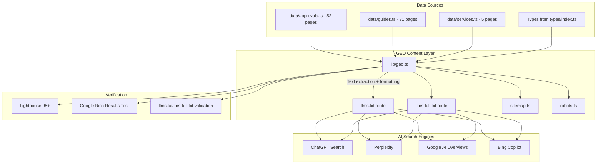

# Phase 13: Generative Engine Optimization (GEO) — AI Search Ranking Plan

**Target:** Rank #1 across Google AI Overviews, ChatGPT Search, Perplexity, Bing Copilot for ALL Dubai approval-related queries.

**Scope:** All 97+ existing pages + future pages. Programmatic approach using Next.js 15 Route Handlers + data-driven content extraction.

**Prerequisites:** Phases 0-12 complete (Next.js 15 project, branding, layout, analytics, homepage, static pages, data layer, all 52 approvals, all 31 guides, 5 services, hub pages, animated drawings).

---

## Architecture Overview



---

## Page Inventory by Category

### Approval Pages (52 total)

| # | Category | Count | Slugs | Priority |
|---|----------|-------|-------|----------|
| 1 | **Government & Regulatory** | 12 | `dubai-municipality-building-permit`, `dubai-civil-defense-approval`, `dubai-municipality-noc`, `rta-approval`, `dubai-municipality-health-safety-approval`, `dubai-municipality-environmental-compliance`, `dubai-municipality-signage-approval`, `dubai-municipality-civil-defense-noc`, `dubai-municipality-completion-certificate`, `dubai-municipality-preliminary-building-permit`, `dubai-municipality-demolition-permit`, `dubai-municipality-excavation-permit` | **P0** |
| 2 | **Free Zone Approvals** | 8 | `dubai-silicon-oasis-approval`, `dubai-south-approval`, `tecom-approvals`, `jebel-ali-free-zone-approval`, `dubai-airport-freezone-approval`, `dubai-knowledge-park-approval`, `dmcc-approval`, `dubai-science-park-approval` | **P0** |
| 3 | **Developer & Community** | 6 | `emaar-community-approval`, `nakheel-developer-approval`, `dubai-properties-approval`, `damac-properties-approval`, `meraas-holding-approval`, `sobha-realty-approval` | **P0** |
| 4 | **Fit-Out & Construction** | 6 | `interior-fit-out-approval`, `change-of-usage-permit`, `structural-modification-permit`, `refurbishment-permit`, `partition-ceiling-approval`, `mep-approval` | **P0** |
| 5 | **Drawing & Documentation** | 4 | `2d-drawing-submission`, `3d-design-approval`, `cad-drawing-certification`, `as-built-drawing-approval` | **P0** |
| 6 | **Property Registration** | 4 | `dubai-land-department-registration`, `ejari-registration`, `title-deed-registration`, `rera-permit` | P1 |
| 7 | **Technical & Utility** | 7 | `dewa-approval`, `dewa-connection-noc`, `district-cooling-approval`, `dewa-meter-installation`, `dewa-load-enhancement`, `telecom-connection-approval`, `dewa-temporary-power-connection` | P1 |
| 8 | **Trade, Food & Hospitality** | 5 | `food-control-department-approval`, `dtcm-tourism-approval`, `dubai-health-authority-approval`, `public-health-approval`, `entertainment-license-approval` | P1 |

### Guide / Q&A Pages (31 total)

| Category | Count | Examples |
|----------|-------|----------|
| **Government & Regulatory** | 5 | `how-long-does-dm-building-permit-take`, `dcd-fire-safety-approval-documents`, `dm-noc-for-renovation-guide`, `rta-approval-commercial-projects`, `dm-completion-certificate-steps` |
| **Free Zone** | 4 | `dso-fit-out-approval-guide`, `dubai-south-design-guidelines`, `tecom-business-setup-approvals`, `dmcc-free-zone-approval-process` |
| **Developer & Community** | 3 | `nakheel-renovation-approval-process`, `emaar-community-design-guidelines`, `dubai-properties-noc-process` |
| **Property Registration** | 3 | `ejari-registration-complete-guide`, `title-deed-transfer-dubai`, `rera-permit-requirements-guide` |
| **Technical & Utility** | 3 | `dewa-connection-process-guide`, `district-cooling-connection-guide`, `dewa-meter-installation-steps` |
| **Trade, Food & Hospitality** | 3 | `dubai-food-control-approval-guide`, `dtcm-tourism-license-requirements`, `dha-healthcare-approval-guide` |
| **Fit-Out & Construction** | 3 | `interior-fit-out-permit-process`, `change-of-usage-permit-guide`, `structural-modification-approval-guide` |
| **Drawing & Documentation** | 3 | `cad-drawing-standards-dubai-guide`, `as-built-drawing-requirements`, `3d-design-submission-guide` |
| **General** | 4 | `complete-guide-dubai-building-approvals`, `how-to-avoid-approval-rejection-dubai`, `dubai-approval-fees-guide`, `approval-timelines-dubai-guide` |

### Service Pages (5 total)
`2d-drawings`, `3d-design-visualization`, `cad-documentation`, `building-permit-expediting`, `consultation-advisory`

### Static Pages (5 total)
Homepage, About Us, Contact Us, Services Hub, Approvals Hub, Guides Hub

---

## Phase 13 — Step-by-Step Plan

### Step 13.1 — Create [`src/lib/geo.ts`](src/lib/geo.ts) — GEO Text Extraction & Formatting Engine

**Purpose:** Central utility that extracts clean, AI-optimized text from approval/guide/service data objects and formats them according to GEO rules (objectivity, entity resolution, answer-first, information density).

**Design Pattern:** Extensible registry pattern. Each data type (approval, guide, service) registers a formatter function. Future pages register new formatters without modifying existing code.

```typescript
// Pseudo-interface for the GEO registry
interface GeoFormatter<T> {
  type: string;
  format(item: T): GeoDocument;
}

interface GeoDocument {
  title: string;
  description: string;
  sections: GeoSection[];
  metadata: Record<string, string>;
}

interface GeoSection {
  heading: string;
  body: string;        // Markdown-formatted, stripped of HTML
  table?: string[][];  // Optional markdown table
  list?: string[];     // Optional bullet list
}
```

**Functions to implement:**

| Function | Purpose | GEO Rules Applied |
|----------|---------|-------------------|
| `formatApprovalPage(approval)` | Transform ApprovalData into GeoDocument | Objectivity, Entity Resolution, Answer-First, Tables |
| `formatGuidePage(guide)` | Transform GuideData into GeoDocument | Answer-First, Entity Resolution |
| `formatServicePage(service)` | Transform ServiceData into GeoDocument | Objectivity, Tables |
| `formatApprovalDirectAnswer(approval)` | Extract standalone AI-quotable block | Self-contained, 2-3 sentences |
| `formatDocumentTable(docs)` | Format document list as markdown table | Information Density via Tables |
| `formatTimelineTable(entries)` | Format timeline/cost as markdown table | Information Density via Tables |
| `formatFaqBlock(faqs)` | Format FAQs as Q/A pairs | Strict Entity Resolution |
| `formatProcessSteps(steps)` | Format process as numbered list | Explicit Timelines |
| `resolveEntities(text, authority)` | Replace pronouns with specific nouns | Strict Entity Resolution |
| `stripMarketingFluff(text)` | Filter out sales language | Ruthless Objectivity |
| `buildLlmsIndex(pages)` | Generate llms.txt content | AI Manifest Format |
| `buildLlmsFull(pages)` | Generate llms-full.txt content | Knowledge Base Format |
| `buildSitemapEntries(pages)` | Generate sitemap XML entries | Technical SEO |

**Key Implementation Details:**

1. **Entity Resolution function** (`resolveEntities`):
   - Regex-based pronoun replacement
   - Maps: "it" → "[authority name]", "they" → "[authority name]", "the authority" → "[authority name]"
   - Applied to all `description`, `directAnswer`, `answer` fields before output

2. **Marketing Fluff filter** (`stripMarketingFluff`):
   - Removes phrases: "best in class", "unmatched", "leading", "top-tier", "guaranteed"
   - Preserves factual statements with numbers, timelines, costs, document counts

3. **Table Formatters** (`formatDocumentTable`, `formatTimelineTable`):
   - Generate GitHub-flavored markdown tables
   - Document table columns: Document | Mandatory | Notes
   - Timeline table columns: Stage | Duration | Cost | Notes

**Extensibility for Future Pages:**
```typescript
// Registry pattern — new formatters register here
const geoRegistry = new Map<string, GeoFormatter<unknown>>();

export function registerGeoFormatter<T>(type: string, formatter: GeoFormatter<T>) {
  geoRegistry.set(type, formatter);
}

export function formatForGeo<T>(type: string, item: T): GeoDocument {
  const formatter = geoRegistry.get(type);
  if (!formatter) throw new Error(`No GEO formatter for type: ${type}`);
  return formatter.format(item);
}
```

---

### Step 13.2 — Create [`src/app/llms.txt/route.ts`](src/app/llms.txt/route.ts) — AI Manifest Route Handler

**Purpose:** Serve the llms.txt file at `https://www.dubaiapprovalconsultants.com/llms.txt` — a plain-text markdown index of all pages organized by category. This is the PRIMARY file AI search engines fetch first.

**Route Handler Spec:**
```typescript
// app/llms.txt/route.ts
import { NextResponse } from "next/server";

export async function GET() {
  const content = generateLlmsTxt(); // from geo.ts
  return new NextResponse(content, {
    headers: {
      "Content-Type": "text/plain; charset=utf-8",
      "Cache-Control": "public, max-age=3600, s-maxage=86400",
    },
  });
}
```

**Generated Content Structure:**
```markdown
# Wasleen Liminal Approval Consultants
> An engineering and consulting firm specializing in securing government and authority approvals for commercial and residential projects in Dubai, United Arab Emirates.

## Government & Regulatory Approvals — 12 pages
- [Dubai Municipality Building Permit](/approvals/dubai-municipality-building-permit): Primary construction approval for all building, extension, or alteration projects in Dubai. Timeline: 5–10 business days.
- [Dubai Civil Defense Approval](/approvals/dubai-civil-defense-approval): Mandatory fire and life safety approval for all commercial and residential buildings in Dubai. Timeline: 3–7 business days.
  ... (all 12)

## Free Zone Approvals — 8 pages
  ... (all 8)

## Developer & Community Approvals — 6 pages
  ... (all 6)

## Fit-Out & Construction Approvals — 6 pages
  ... (all 6)

## Drawing & Documentation Approvals — 4 pages
  ... (all 4)

## Property Registration — 4 pages
  ... (all 4)

## Technical & Utility Approvals — 7 pages
  ... (all 7)

## Trade, Food & Hospitality Approvals — 5 pages
  ... (all 5)

## Guide / Q&A Pages — 31 pages
  ... (all 31, organized by subcategory)

## Service Pages — 5 pages
  ... (all 5)

## Information Pages
- [About Us](/about-us)
- [Contact Us](/contact-us)
- [Approvals Hub](/approvals)
- [Guides Hub](/guides)
- [Services Hub](/services)
```

**GEO Formatting Rules Applied:**
- H1 = exact business name (entity signal)
- Blockquote = neutral, factual business definition (no marketing)
- Each entry: `[keyword-rich title](url): {self-contained one-sentence description}. Timeline: {X}.`
- Categories match the site's data model exactly (consistent entity references)
- No HTML, no scripts, no inline styles

---

### Step 13.3 — Create [`src/app/llms-full.txt/route.ts`](src/app/llms-full.txt/route.ts) — Complete Knowledge Base Route Handler

**Purpose:** Serve `llms-full.txt` at `https://www.dubaiapprovalconsultants.com/llms-full.txt` — the entire website's expertise in a single text file. AI agents ingest this for complex multi-step queries.

**Route Handler Spec:**
```typescript
// app/llms-full.txt/route.ts
export async function GET() {
  const content = generateLlmsFull(); // from geo.ts
  return new NextResponse(content, {
    headers: {
      "Content-Type": "text/plain; charset=utf-8",
      "Cache-Control": "public, max-age=3600, s-maxage=86400",
    },
  });
}
```

**Generated Content Structure for EACH page:**
```markdown
---
## Dubai Municipality Building Permit

### Direct Answer
{approval.directAnswer — entity-resolved, fluff-free}

### At a Glance
| Attribute | Value |
|-----------|-------|
| Authority | Dubai Municipality |
| Timeline | 5–10 business days |
| Cost Range | AED 1,000 – 5,000 |
| Mandatory For | All construction projects |
| Documents Required | 8–12 documents |

### Description
{approval.description — entity-resolved, fluff-free, 150-250 words}

### Who Needs This
- {whoNeedsIt item 1}
- {whoNeedsIt item 2}
...

### Required Documents
| Document | Mandatory | Notes |
|----------|-----------|-------|
| {document} | {Yes/No} | {description} |
...

### Process Steps
1. **{step.title}**: {step.description}
2. **{step.title}**: {step.description}
...

### Timeline & Cost
| Stage | Duration | Cost | Notes |
|-------|----------|------|-------|
| {stage} | {duration} | {cost} | {notes} |
...

### Common Rejection Reasons
- **{reason}**: {solution}
...

### FAQ
Q: {question}
A: {answer}
...
```

**Key Implementation Rules:**
1. Every page is separated by `---` horizontal rule
2. Every section heading is `###` (H3) within the page `##` (H2)
3. ALL text passes through `resolveEntities()` and `stripMarketingFluff()`
4. Tables use GitHub-flavored markdown for maximum AI parseability
5. No HTML tags, no navigation, no scripts
6. Complete content — never summarized or truncated
7. Pages ordered by priority: Government & Regulatory → Free Zone → Developer → Fit-Out → Drawing → Property → Technical → Trade → Guides → Services → Static
8. Future pages automatically included via the data-driven approach (loop over all data arrays)

---

### Step 13.4 — Update [`src/app/sitemap.ts`](src/app/sitemap.ts) — Dynamic Sitemap with GEO Signals

**Purpose:** Generate a comprehensive XML sitemap at `/sitemap.xml` that includes ALL pages with proper metadata for search engine crawling.

**Required Changes:**
```typescript
// app/sitemap.ts — update to include ALL pages
import type { MetadataRoute } from "next";
import { approvals } from "@/data/approvals";
import { guides } from "@/data/guides";
import { services } from "@/data/services";
import { SITE } from "@/lib/constants";

export default function sitemap(): MetadataRoute.Sitemap {
  const staticPages = [
    { url: SITE.url, lastModified: "2026-07-01", changeFrequency: "weekly", priority: 1.0 },
    { url: `${SITE.url}/about-us`, lastModified: "2026-07-01", changeFrequency: "monthly", priority: 0.7 },
    { url: `${SITE.url}/contact-us`, lastModified: "2026-07-01", changeFrequency: "monthly", priority: 0.7 },
    { url: `${SITE.url}/approvals`, lastModified: "2026-07-01", changeFrequency: "weekly", priority: 0.9 },
    { url: `${SITE.url}/guides`, lastModified: "2026-07-01", changeFrequency: "weekly", priority: 0.8 },
    { url: `${SITE.url}/services`, lastModified: "2026-07-01", changeFrequency: "weekly", priority: 0.8 },
  ];

  // Add llms.txt and llms-full.txt as separate entries for discovery
  const geoFiles = [
    { url: `${SITE.url}/llms.txt`, lastModified: "2026-07-01", changeFrequency: "weekly", priority: 0.5 },
    { url: `${SITE.url}/llms-full.txt`, lastModified: "2026-07-01", changeFrequency: "weekly", priority: 0.5 },
  ];

  // ... approval pages, guide pages, service pages
}
```

**Key Updates Required:**
- Add `llms.txt` and `llms-full.txt` entries (signals to crawlers these exist)
- Ensure all 97+ pages are included with correct `lastModified` from data
- Verify priority hierarchy: Homepage (1.0) > Approvals (0.9) > Hubs (0.8-0.9) > Static (0.7) > GEO files (0.5)

---

### Step 13.5 — Update [`src/app/robots.ts`](src/app/robots.ts) — Robots.txt

**Purpose:** Ensure crawlers can discover the GEO files.

**Required Changes:**
```typescript
// app/robots.ts
import type { MetadataRoute } from "next";
import { SITE } from "@/lib/constants";

export default function robots(): MetadataRoute.Robots {
  return {
    rules: {
      userAgent: "*",
      allow: "/",
      disallow: "/api/",
    },
    sitemap: `${SITE.url}/sitemap.xml`,
  };
}
```

No changes needed — the existing `robots.ts` should already work. Verify it's in place.

---

### Step 13.6 — GEO Content Audit: Government & Regulatory (12 pages)

**Objective:** Audit all 12 Government & Regulatory approval pages for GEO compliance.

**Audit Checklist (per page):**

| Check | Criteria | Pass/Fail |
|-------|----------|-----------|
| **Direct Answer** | 2-3 sentences, self-contained (no pronouns referencing external text), contains authority name + timeline + mandatory status | |
| **Stats Strip** | 4 facts present: Authority, Timeline, Mandatory For, Documents Required | |
| **Description** | No marketing fluff, entity-resolved (no "it"/"they" referring to authority), 150-250 words | |
| **Who Needs It** | 5-6 bullet points, specific (not generic "anyone who needs approval") | |
| **Documents Table** | Table format, mandatory flag, notes column. Disclaimer present. | |
| **Process Steps** | 5-8 steps with title + description. Entity-resolved. | |
| **Timeline & Cost Table** | Table format with Stage, Duration, Cost, Notes. Disclaimer present. | |
| **Rejection Reasons** | 3-5 reasons with actionable solutions | |
| **FAQ Block** | 5-8 Q&A pairs. Each answer 2-3 sentences, complete, entity-resolved. Matches JSON-LD exactly. | |
| **JSON-LD Schema** | Valid Service + FAQPage + HowTo + BreadcrumbList + WebPage | |
| **Internal Links** | Links to 3-5 related approvals, 2-4 related guides | |

**Priority Pages (audit first):**
1. `dubai-municipality-building-permit` — highest search volume
2. `dubai-civil-defense-approval` — second highest
3. `dubai-municipality-noc` — high intent
4. `rta-approval` — commercial projects
5. `dubai-municipality-completion-certificate` — end-of-project

**Action Items:**
- Run each page through the GEO formatter and review output
- Fix any instances of pronoun usage for entities
- Verify all tables have proper markdown format
- Ensure disclaimers present on all data tables

---

### Step 13.7 — GEO Content Audit: Free Zone Approvals (8 pages)

**Audit Checklist (same as 13.6, per page):**

**Pages to audit:**
1. `dubai-silicon-oasis-approval`
2. `dubai-south-approval`
3. `tecom-approvals`
4. `jebel-ali-free-zone-approval`
5. `dubai-airport-freezone-approval`
6. `dubai-knowledge-park-approval`
7. `dmcc-approval`
8. `dubai-science-park-approval`

**Special GEO Considerations for Free Zone Pages:**
- Must explicitly state which free zone authority (e.g., "Trakhees," "PCFC," "DSO Authority")
- Must clarify jurisdiction boundaries (which zones the free zone authority governs)
- Comparison content: "DM vs Trakhees" differences are high-value for AI extraction

---

### Step 13.8 — GEO Content Audit: Developer & Community (6 pages)

**Pages to audit:**
1. `emaar-community-approval`
2. `nakheel-developer-approval`
3. `dubai-properties-approval`
4. `damac-properties-approval`
5. `meraas-holding-approval`
6. `sobha-realty-approval`

**Special GEO Considerations for Developer Pages:**
- Must distinguish between developer NOC and authority approval
- Must list specific community guidelines per developer
- Comparison content: "Emaar vs Nakheel approval process" is high-value

---

### Step 13.9 — GEO Content Audit: Fit-Out & Construction (6 pages)

**Pages to audit:**
1. `interior-fit-out-approval`
2. `change-of-usage-permit`
3. `structural-modification-permit`
4. `refurbishment-permit`
5. `partition-ceiling-approval`
6. `mep-approval`

**Special GEO Considerations for Fit-Out Pages:**
- Timeline precision is critical (fit-out queries are intent-rich)
- Must distinguish between DM fit-out and free zone fit-out processes
- Document checklists are the #1 extracted content type

---

### Step 13.10 — GEO Content Audit: Drawing & Documentation (4 pages)

**Pages to audit:**
1. `2d-drawing-submission`
2. `3d-design-approval`
3. `cad-drawing-certification`
4. `as-built-drawing-approval`

**Special GEO Considerations for Drawing Pages:**
- CAD standards references (DM layer naming, line weights) are unique differentiators
- Technical specifications extract well as tables
- Prerequisite documents are high-value for AI (what drawings are needed before what)

---

### Step 13.11 — GEO Content Audit: Guide / Q&A Pages (31 pages)

**Audit Checklist (per guide page):**

| Check | Criteria |
|-------|----------|
| **Question/Answer (QA type)** | `question` field is the exact question users ask. `answer` field is 2-3 sentences, complete, entity-resolved. |
| **Content paragraphs** | Answer-first structure: first 40-75 words summarize the topic completely. |
| **Entity Resolution** | No pronouns referring to authorities. Always repeat "Dubai Municipality" not "they/it/the authority". |
| **Tables** | Present where comparisons or timelines are discussed. |
| **Explicit Timelines** | Every guide mentions duration in working days. |
| **Internal Links** | Links to parent approval page + related guides. Descriptive anchor text. |
| **Schema** | QAPage (for QA type) or WebPage (for hub type) + BreadcrumbList. |

**Content Audit by Subcategory:**

| Subcategory | Count | Key Verbs for AI Queries |
|-------------|-------|--------------------------|
| Government & Regulatory | 5 | "How long does...", "What documents...", "Steps for..." |
| Free Zone | 4 | "How to...", "Process for...", "Requirements for..." |
| Developer & Community | 3 | "Approval process for...", "Design guidelines..." |
| Property Registration | 3 | "Complete guide to...", "How to register..." |
| Technical & Utility | 3 | "Connection process...", "Installation steps..." |
| Trade, Food & Hospitality | 3 | "License requirements...", "Approval guide for..." |
| Fit-Out & Construction | 3 | "Permit process...", "Approval guide for..." |
| Drawing & Documentation | 3 | "Standards for...", "Requirements for..." |
| General | 4 | "Complete guide...", "How to avoid...", "Fees guide..." |

---

### Step 13.12 — GEO Content Audit: Remaining Categories (16 pages)

| Category | Count | Pages |
|----------|-------|-------|
| Property Registration | 4 | `dubai-land-department-registration`, `ejari-registration`, `title-deed-registration`, `rera-permit` |
| Technical & Utility | 7 | `dewa-approval`, `dewa-connection-noc`, `district-cooling-approval`, `dewa-meter-installation`, `dewa-load-enhancement`, `telecom-connection-approval`, `dewa-temporary-power-connection` |
| Trade, Food & Hospitality | 5 | `food-control-department-approval`, `dtcm-tourism-approval`, `dubai-health-authority-approval`, `public-health-approval`, `entertainment-license-approval` |

**Special GEO Considerations:**
- DEWA pages: "DEWA approval" is extremely high-volume search term — prioritize
- Property Registration: "Ejari registration" and "Title deed" are transactional queries
- Trade/Food: Cross-reference with Dubai Municipality food control, DTCM, DHA

---

### Step 13.13 — GEO Content Audit: Service Pages & Static Pages (10 pages)

**Service Pages (5):** `2d-drawings`, `3d-design-visualization`, `cad-documentation`, `building-permit-expediting`, `consultation-advisory`

**Audit Checklist for Service Pages:**
- Direct answer: 2-3 sentence standalone summary with timeline
- Features list: 5-6 bullet points with specific deliverables
- FAQ: 5 questions minimum, entity-resolved answers
- Process steps (if applicable): numbered with durations

**Static Pages (5):** Homepage, About Us, Contact Us, Approvals Hub, Guides Hub, Services Hub

**Audit Checklist for Static Pages:**
- Homepage: Direct answer in hero section, stats strip with numbers, FAQ block
- About Us: Team credentials, license/registration numbers, case studies
- Contact Us: NAP data matching schema byte-for-byte, contact form
- Hub pages: All child pages listed with descriptions, filtered by category

---

### Step 13.14 — Performance & Technical SEO Finalization

**Verification Tasks:**

| Task | Tool/Method | Target |
|------|-------------|--------|
| **Lighthouse Audit** | Chrome DevTools / PageSpeed Insights | 95+ mobile, 98+ desktop |
| **Core Web Vitals** | PageSpeed Insights | LCP < 1.5s, CLS < 0.05, INP < 100ms |
| **JSON-LD Validation** | Google Rich Results Test | All schema valid, no errors |
| **Schema Crawl** | Schema.org Validator | All @id references resolve correctly |
| **llms.txt Verification** | Manual review + curl | File serves correctly, all 97+ pages listed |
| **llms-full.txt Verification** | Manual review + curl | File serves correctly, all content present, no HTML |
| **Sitemap Validation** | Google Search Console | All URLs valid, no 404s |
| **Internal Link Check** | Broken link checker | No dead links |
| **Canonical Tag Check** | Manual per page type | Self-referencing on all pages |
| **Meta Tag Check** | Manual per page type | Title 50-60 chars, Description 140-160 chars |
| **Hreflang Check** | Manual | en-AE + x-default present (Arabic when ready) |
| **Robots.txt Check** | Manual | Allows all, disallows /api/, points to sitemap |
| **NAP Consistency** | Cross-reference footer, schema, contact page | Byte-for-byte identical |
| **Crawl Budget Check** | robots.txt + sitemap priority | High-priority pages crawled first |

---

### Step 13.15 — Future Pages Programmatic GEO Integration

**Design Pattern for Future Scalability:**

When a new approval, guide, or service page is added to the data files, the following happens AUTOMATICALLY:

1. **`llms.txt`** — Page added to its category section with auto-generated one-line description
2. **`llms-full.txt`** — Full page content appended with proper section boundaries
3. **`sitemap.xml`** — New URL added with correct priority and lastmod
4. **JSON-LD Schema** — Schema generated via existing `approvalSchemaStack()` / `guideSchemaStack()` / `serviceSchemaStack()`
5. **Internal Links** — Related pages section auto-updates based on category matching

**To add a new approval page, simply:**
```typescript
// In data/approvals.ts, add a new object to the approvals array
{
  slug: "new-approval-slug",
  name: "New Approval Name",
  // ... all ApprovalData fields
  category: "government-regulatory", // or any category
  // ...
}
```

The GEO system picks it up automatically on next build.

**To add a new guide page, simply:**
```typescript
// In data/guides.ts, add a new object to the guides array
{
  slug: "new-guide-slug",
  type: "qa", // or "hub"
  title: "New Guide Title",
  // ... all GuideData fields
  parentApprovalSlug: "dubai-municipality-building-permit",
  // ...
}
```

---

### Step 13.16 — GEO Performance Monitoring & Continuous Optimization

**Pre-Launch:**
- [ ] Run Lighthouse audit on every page type (approval, guide, service, static)
- [ ] Validate all schema with Google Rich Results Test
- [ ] Verify llms.txt and llms-full.txt serve correctly with proper content-type headers
- [ ] Cross-check NAP consistency across all schema instances, footer, contact page
- [ ] Verify sitemap includes ALL 97+ pages plus GEO files

**Post-Launch (30 days):**
- [ ] Monitor Google Search Console for crawl errors on GEO files
- [ ] Track which pages are appearing in Google AI Overviews
- [ ] Check ChatGPT Search and Perplexity for citation of llms.txt content
- [ ] Review crawl stats — ensure llms.txt and llms-full.txt are being crawled
- [ ] Monitor PageSpeed scores in Search Console CrUX report

**Post-Launch (90 days):**
- [ ] Analyze which pages rank in AI search results
- [ ] Review GEO file content for missing entities or sections
- [ ] Update content based on real user queries from Search Console
- [ ] Add new pages to fill content gaps identified by AI search queries
- [ ] Refresh lastUpdated dates on pages with updated content

---

## Implementation Order (Execution Sequence)

| Step | Task | Files | Mode |
|------|------|-------|------|
| **13.1** | Create [`src/lib/geo.ts`](src/lib/geo.ts) — GEO text extraction engine with registry pattern | `src/lib/geo.ts` | Code |
| **13.2** | Create [`src/app/llms.txt/route.ts`](src/app/llms.txt/route.ts) — AI manifest route | `src/app/llms.txt/route.ts` | Code |
| **13.3** | Create [`src/app/llms-full.txt/route.ts`](src/app/llms-full.txt/route.ts) — Full knowledge base route | `src/app/llms-full.txt/route.ts` | Code |
| **13.4** | Update [`src/app/sitemap.ts`](src/app/sitemap.ts) — Add GEO file entries, all pages | `src/app/sitemap.ts` | Code |
| **13.5** | Verify [`src/app/robots.ts`](src/app/robots.ts) — Already correct, verify no changes needed | `src/app/robots.ts` | Code |
| **13.6** | Build verification — `npm run build` passes with no errors | — | Code |
| **13.7** | GEO Content Audit: Government & Regulatory (12 pages) | Data files | Code |
| **13.8** | GEO Content Audit: Free Zone Approvals (8 pages) | Data files | Code |
| **13.9** | GEO Content Audit: Developer & Community (6 pages) | Data files | Code |
| **13.10** | GEO Content Audit: Fit-Out & Construction (6 pages) | Data files | Code |
| **13.11** | GEO Content Audit: Drawing & Documentation (4 pages) | Data files | Code |
| **13.12** | GEO Content Audit: Guide/Q&A Pages (31 pages) | Data files | Code |
| **13.13** | GEO Content Audit: Remaining Categories (16 pages) | Data files | Code |
| **13.14** | GEO Content Audit: Service Pages & Static Pages (10 pages) | Data files | Code |
| **13.15** | Performance & SEO Finalization — Lighthouse, schema validation | Various | Code |
| **13.16** | Final build verification + manual spot-check of GEO files | — | Code |

---

## GEO Content Formatting Reference

### Rule 1: Ruthless Objectivity
```markdown
❌ BAD: "We offer the fastest, most incredible approval service in Dubai, guaranteed to save you money!"
✅ GOOD: "We process Dubai Civil Defense DCD 24/7 approvals with an average turnaround time of 3 to 5 business days."
```

### Rule 2: Information Density via Tables
```markdown
| Document | Mandatory | Notes |
|----------|-----------|-------|
| Completed application form | Yes | Available on DM website |
| Title deed copy | Yes | Must be current |
| NOC from master developer | Yes | Required for community properties |
| Architectural drawings | Yes | Stamped by registered engineer |
```

### Rule 3: Strict Entity Resolution
```markdown
❌ BAD: "Once you submit the drawings, they will review them and issue the NOC."
✅ GOOD: "Once the applicant submits the architectural drawings, Dubai Municipality DM will review the submission and issue the No Objection Certificate NOC."
```

### Rule 4: Answer-First Paragraph Structure
```markdown
### What is a Trakhees Modification NOC?
A Trakhees Modification NOC is a mandatory no-objection certificate required for any structural or architectural changes within PCFC jurisdiction zones in Dubai. This NOC must be obtained before commencing interior fit-out or exterior construction works within Trakhees-regulated areas including Palm Jumeirah, Jebel Ali Waterfront, and Dubai Islands.
```

### Rule 5: Explicit Timelines and Prerequisites
```markdown
**Required Documents:**
1. Trade License copy
2. Passport copy
3. Tenancy Contract or Ejari
4. Title Deed
5. Affection Plan
6. NOC from Landlord

**Standard Timelines:**
- Initial review: 2-3 working days
- Authority submission: 1 working day
- Authority processing: 5-10 working days
- NOC issuance: 1-2 working days after approval
```

---

## Verification Gates

Before moving from Phase 13 to Phase 14 (Deployment):

- [ ] `npm run build` completes with zero errors
- [ ] `npm run lint` passes with zero warnings
- [ ] `GET /llms.txt` returns valid markdown with all 97+ pages listed
- [ ] `GET /llms-full.txt` returns valid markdown with complete content for all pages
- [ ] `GET /sitemap.xml` includes all pages + GEO file entries
- [ ] `GET /robots.txt` allows crawling, points to sitemap
- [ ] Lighthouse score 95+ on mobile for each page type
- [ ] Google Rich Results Test passes for approval page, guide page, service page
- [ ] NAP data byte-for-byte identical across footer, schema, contact page
- [ ] All internal links resolve to valid pages (no 404s)
- [ ] Every page has unique meta title (50-60 chars) and description (140-160 chars)
- [ ] GEO formatter correctly strips HTML, marketing fluff, and resolves entities
