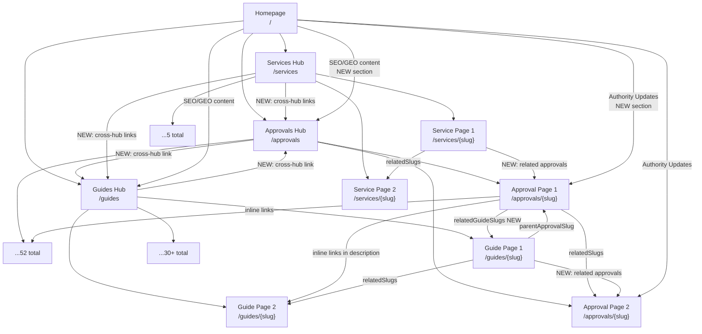

# Comprehensive Plan: Spider-Web Internal Linking, Homepage SEO/GEO Overhaul & NAP Consistency

## Overview

This plan addresses all requests in a single coordinated execution. Changes are ordered so that foundational data updates (NAP, constants) happen first, then content enhancements, then linking structure, then final SEO polish.

---

## PHASE 1 — NAP & Company Address Consistency (Foundation)

### Task 1.1: Update Company Address in `src/lib/constants.ts`

**Current:**
```ts
address: {
  locality: "Dubai",
  region: "Dubai",
  country: "AE",
},
```

**Target:**
```ts
address: {
  streetAddress: "Office 401, Darwish Building",
  addressLocality: "Al Qusais",
  addressRegion: "Dubai",
  addressCountry: "AE",
  postalCode: "",
},
```

**Files to update:**
- [`src/lib/constants.ts`](src/lib/constants.ts) — Add `streetAddress`, update `locality` → `streetAddress: "Office 401, Darwish Building"`, `addressLocality: "Al Qusais"`

### Task 1.2: Update JSON-LD Organization Schema

**File:** [`src/lib/schema.ts`](src/lib/schema.ts:39)
- Update `organizationSchema()` to use the new `NAP.address.streetAddress` and `NAP.address.addressLocality`
- Add `@type: "PostalAddress"` with full street address

### Task 1.3: Update Footer Address Display

**File:** [`src/components/layout/Footer.tsx`](src/components/layout/Footer.tsx:304)
- Replace "Dubai, United Arab Emirates" with "Office 401, Darwish Building, Al Qusais, Dubai"
- Update Google Maps iframe embed coordinates if needed to match Al Qusais location

### Task 1.4: Update Root Layout (& env.local if applicable)

**File:** [`src/app/layout.tsx`](src/app/layout.tsx)
- Root metadata `authors`, `creator`, `publisher` already use `NAP.companyName` — verify they render correctly
- If `NEXT_PUBLIC_SITE_URL` in `.env.local` points to non-canonical domain, verify it's `https://www.dubaiapprovalconsultants.com`

---

## PHASE 2 — Homepage Content & Copywriting Overhaul

### Task 2.1: Rename Tagline / Placeholder

**File:** [`src/lib/constants.ts`](src/lib/constants.ts:10)
- Change `tagline: "Dubai Approvals Made Simple"` → `tagline: "Dubai Approval Consultant Experts"`
- This automatically updates the H1 via [`HeroSection.tsx`](src/components/sections/HeroSection.tsx:44) which renders `SITE.tagline`

### Task 2.2: Upgrade HeroSection Headline & Copy

**File:** [`src/components/sections/HeroSection.tsx`](src/components/sections/HeroSection.tsx)

Replace the generic H1 and subtext with an **entity-rich headline** with geographic anchoring:

- **H1:** Replace `SITE.tagline` with a hardcoded entity-rich headline like:
  > "Fast-Track Dubai Municipality, DDA, DEWA & DCD Project Approvals in UAE"
- **Subtext (paragraph):** Inject location anchors:
  > "Expert approval consultants serving Business Bay, Downtown Dubai, JLT, Sheikh Zayed Road, JAFZA, Meydan, Al Quoz, and all Dubai free zones. We manage DM building permits, DCD civil defense NOCs, DEWA connections, DDA fit-out approvals, and 48+ other government and developer permits across the UAE."

- **Keep** the 52+ / 500+ / 8+ stats strip below the CTA buttons (these are strong trust signals)

### Task 2.3: Add SEO/GEO Content Section (above FAQ)

**File:** [`src/app/page.tsx`](src/app/page.tsx)

Insert a **new content section** between `ProcessOverview` and `FAQBlock` (position 5, pushing FAQ to position 6 and CTA to 7).

This section should include:

**Section A — "Trusted Across Dubai's Key Commercial & Residential Hubs"**
- 200-250 words of entity-rich content that naturally anchors Dubai locations
- Paragraph 1: General intro about Wasleen's coverage across all major Dubai jurisdictions (DM, DDA, DEWA, DCD, Trakhees, all free zones)
- Paragraph 2: Geographic anchoring — "From our office in Al Qusais, we serve clients across Business Bay, Downtown Dubai, Jumeirah Lakes Towers JLT, Sheikh Zayed Road, Dubai Marina, Dubai Silicon Valley, DAFZA, JAFZA, Meydan, Al Quoz Industrial, Dubai South, and all 50+ communities in between."
- Paragraph 3: Authority/trust building — "Our registered engineers prepare and stamp all DM-compliant drawings in-house. We submit directly to Dubai Municipality Trakhees, DDA, DEWA, DCD, and all free zone authorities on your behalf."
- Include contextual links to:
  - `/approvals/dubai-municipality-building-permit`
  - `/approvals/dda-approval`
  - `/approvals/dewa-approval`
  - `/approvals/dubai-civil-defense-approval`
  - `/approvals` (hub page)

**Section B — "Why Dubai Chooses Wasleen for Project Approvals"**
- 4-column stat/counter row (keep existing 52+, 500+, 8+ but add location-specific context)
- Short paragraph with link to `/about-us`

### Task 2.4: Add News / Regulatory Updates Section (Priority Approvals)

**File:** [`src/app/page.tsx`](src/app/page.tsx)

Add a **"Dubai Approval Authority Updates"** section (just above CTA, below FAQ). This is a news-type section showing 5 high-priority approval topics with recent regulatory update context.

**5 High-Priority Topics (choose top authorities):**

| # | Authority | Topic Slug | Focus |
|---|---|---|---|
| 1 | **Dubai Municipality (DM)** | `dubai-municipality-building-permit` | Updated DM building code requirements for 2026, digital submission enhancements |
| 2 | **Dubai Civil Defense (DCD)** | `dubai-civil-defense-approval` | Updated fire safety compliance standards, new DCD NOC process |
| 3 | **DEWA** | `dewa-approval` | Smart meter mandate, load enhancement process changes |
| 4 | **Dubai Development Authority (DDA)** | `dda-approval` | DDA 2026 design guidelines for d3, Dubai Internet City, Media City |
| 5 | **DMCC / JAFZA (Free Zones)** | `dmcc-approval` | Free zone fit-out permit updates, JAFZA warehouse modification rules |

Each topic should be a card with:
- Authority name + logo (use existing logos from `/public/logos/`)
- "Last updated" date
- 2-3 sentence summary of the regulatory update/development
- Link to the relevant approval page
- A "Read More →" CTA link

**Implementation approach:**
- Create a new component `src/components/sections/AuthorityUpdates.tsx`
- Define the 5 news items directly in the component (or as a data array)
- Use the existing Card/Badge UI components for consistency

---

## PHASE 3 — Spider-Web Internal Linking Overhaul

### Current State Analysis

**Approval pages** (`/approvals/[slug]`):
- Section 12: `RelatedApprovals` — links to 3-5 related approval pages via `relatedSlugs`
- Missing: **No links to related guides** or related services

**Guide pages** (`/guides/[slug]`):
- Section 4: `RelatedGuides` — links to 3-5 related guides
- Has back-link to parent approval (if `parentApprovalSlug` set)
- Missing: **No links to related approvals** or services

**Service pages** (`/services/[slug]`):
- Links to related services via `relatedSlugs`
- Missing: **No links to approvals or guides**

**Hub pages** (`/approvals`, `/guides`, `/services`):
- Link out to child pages
- Missing: **No cross-hub links** (e.g., approvals hub → guides hub)

### Task 3.1: Add Related Guides Section to Approval Pages

**File:** [`src/app/approvals/[slug]/page.tsx`](src/app/approvals/[slug]/page.tsx)

Add a new **"Related Guides & Resources"** section after Section 12 (RelatedApprovals) and before Section 13 (CTA).

- Create a new component `RelatedGuides` that accepts an array of guide slugs to show
- Each approval needs a `relatedGuideSlugs` field in its data — OR we compute this dynamically by matching guides whose `parentApprovalSlug` equals the current approval slug

**Recommended approach (dynamic):** Compute related guides automatically by filtering `guides` array where `guide.parentApprovalSlug === approval.slug`. This is zero-maintenance — adding a guide with `parentApprovalSlug` automatically adds the link.

### Task 3.2: Add Related Approvals Section to Guide Pages

**File:** [`src/app/guides/[slug]/page.tsx`](src/app/guides/[slug]/page.tsx)

Add a **"Related Approvals"** section after the content body and before RelatedGuides.

- If `parentApprovalSlug` exists, show that specific approval prominently
- Also show 2-3 additional related approvals from the same category (can be computed)

### Task 3.3: Update `ApprovalData` Type to Include `relatedGuideSlugs`

**File:** [`src/types/index.ts`](src/types/index.ts:133)

Add optional field:
```ts
/** Related guide slugs for cross-linking approval → guides */
relatedGuideSlugs?: string[];
```

### Task 3.4: Enrich Approval Data with Guide Cross-References

**File:** [`src/data/approvals.ts`](src/data/approvals.ts)

For each approval (52 total), add `relatedGuideSlugs` array that maps to relevant guides. For example:

```ts
// Dubai Municipality Building Permit
relatedGuideSlugs: [
  "how-long-does-dm-building-permit-take",
  "dm-noc-for-renovation-guide",
  "dm-completion-certificate-steps",
],
```

This is the most labor-intensive task but critical for the spider-web effect. Suggested mapping strategy:
- 12 government-regulatory approvals → maps to government-regulatory guides
- 8 free-zone approvals → maps to free-zone guides
- etc.

### Task 3.5: Add Content-Contextual Inline Links Within Approval Descriptions

**File:** [`src/data/approvals.ts`](src/data/approvals.ts)

The `description` field in each approval entry currently has no internal links. Add natural inline links within the description text pointing to:

1. Related approval pages (e.g., "You may also need a [Dubai Civil Defense Approval](/approvals/dubai-civil-defense-approval)")
2. Related guide pages
3. The `/approvals` hub page
4. Relevant service pages

**Example enrichment for DM Building Permit:**
> "...The application process involves submitting detailed architectural drawings, structural calculations, and supporting documents for review by multiple DM departments including the building inspection, planning, and civil defense units. Most projects also require a separate [Dubai Civil Defense NOC](/approvals/dubai-civil-defense-approval) and [DEWA connection approval](/approvals/dewa-approval). For complete guidance, see our [DM Building Permit timeline guide](/guides/how-long-does-dm-building-permit-take)."

### Task 3.6: Add Related Approvals Section to Service Pages

**File:** [`src/app/services/[slug]/page.tsx`](src/app/services/[slug]/page.tsx)

Add a "Related Approvals" section that links to relevant approval pages based on service type.

### Task 3.7: Cross-Hub Linking on Hub Pages

**File:** [`src/app/approvals/page.tsx`](src/app/approvals/page.tsx)

Add brief content sections that link to:
- `/guides` — "Browse our expert guides and Q&A resources"
- `/services` — "Explore our drawing and documentation services"

**File:** [`src/app/guides/page.tsx`](src/app/guides/page.tsx)

Add brief content sections that link to:
- `/approvals` — "View all 52+ approval types"
- `/services` — "Need technical drawings? Explore our services"

**File:** [`src/app/services/page.tsx`](src/app/services/page.tsx)

Add brief content sections that link to:
- `/approvals` — "View all 52+ approval types"
- `/guides` — "Browse expert guides and resources"

### Task 3.8: Update Footer Internal Links

**File:** [`src/components/layout/Footer.tsx`](src/components/layout/Footer.tsx)

- Add "Guides & Q&A" link in the Company & Contact column
- Ensure all 3 hub pages (approvals, guides, services) are linked from footer

---

## PHASE 4 — Thin Content Remediation

### Task 4.1: Content Audit of All Approval Pages

**Check:** Each approval's `description` field is at least 150 words. `directAnswer` is at least 50 words. FAQ has 5-8 questions.

**If any page falls short,** enrich the content with:
- Additional geographic anchoring (where this approval type applies)
- More specific operational details
- Cross-references to related approvals/guides

### Task 4.2: Content Audit of Guide Pages

**Check:** Each guide has meaningful content (not just 1-2 sentences for non-QA types).

### Task 4.3: Homepage Content Thickness Check

After Phase 2 additions, the homepage should have:
- Hero section (~100 words)
- Trust strip
- Service Categories (~150 words)
- Process Overview (~100 words)
- **NEW: SEO/GEO Anchoring Section (~250-300 words)**
- **NEW: Authority Updates Section (~300 words)**
- FAQ (~500 words across 6 items)
- CTA

Total should exceed 1,200 words of unique content — well above thin-content threshold.

---

## PHASE 5 — Metadata & Schema Updates

### Task 5.1: Update Homepage Metadata

**File:** [`src/app/page.tsx`](src/app/page.tsx)

Update `title` and `description` to reflect the new entity-rich positioning:

```ts
title: "Fast-Track Dubai Project Approvals | DM, DDA, DEWA & DCD | Wasleen",
description:
  "Wasleen Approval Consultants in Al Qusais, Dubai — expert DM building permits, DDA fit-outs, DEWA connections, DCD civil defense NOCs, and 52+ authority approvals for Business Bay, JLT, Downtown Dubai, and all UAE commercial hubs. Contact us today.",
```

### Task 5.2: Update Homepage Schema

**File:** [`src/app/page.tsx`](src/app/page.tsx)
- Homepage schema already uses `webPageSchema` and `breadcrumbList` — update the `name` and `description` to match new metadata.

### Task 5.3: Update Sitewide Schema with New Address

**File:** [`src/app/layout.tsx`](src/app/layout.tsx)
- The `organizationSchema()` and `websiteSchema()` are already called in the root layout — ensure the updated address flows through correctly.

---

## PHASE 6 — JSON-LD Schema Verification

### Task 6.1: Verify Organization Schema

Ensure the generated Organization JSON-LD now includes:
```json
"address": {
  "@type": "PostalAddress",
  "streetAddress": "Office 401, Darwish Building",
  "addressLocality": "Al Qusais",
  "addressRegion": "Dubai",
  "addressCountry": "AE"
}
```

### Task 6.2: Verify NAP Consistency

Audit all locations where NAP data appears:
- [ ] [`src/lib/constants.ts`](src/lib/constants.ts) — source of truth
- [ ] [`src/lib/schema.ts`](src/lib/schema.ts) — Organization schema generator
- [ ] [`src/components/layout/Footer.tsx`](src/components/layout/Footer.tsx) — visible address
- [ ] [`src/app/contact-us/page.tsx`](src/app/contact-us/page.tsx) — contact page
- [ ] [`src/app/about-us/page.tsx`](src/app/about-us/page.tsx) — about page
- [ ] Google Business Profile (external — flag for manual update)

---

## Execution Order Summary

| Order | Phase | Task | Description |
|---|---|---|---|
| 1 | P1 | 1.1 | Update address in `constants.ts` |
| 2 | P1 | 1.2 | Update `schema.ts` Organization generator |
| 3 | P1 | 1.3 | Update Footer address display |
| 4 | P1 | 1.4 | Verify root layout, env |
| 5 | P2 | 2.1 | Rename tagline in `constants.ts` |
| 6 | P2 | 2.2 | Rewrite HeroSection with entity-rich headline + geo anchors |
| 7 | P2 | 2.3 | Add SEO/GEO content section to homepage (above FAQ) |
| 8 | P2 | 2.4 | Create AuthorityUpdates component, add to homepage |
| 9 | P3 | 3.1 | Add RelatedGuides to approval page template |
| 10 | P3 | 3.2 | Add RelatedApprovals to guide page template |
| 11 | P3 | 3.3 | Update type definition with `relatedGuideSlugs` |
| 12 | P3 | 3.4 | Enrich all 52 approvals with guide cross-references |
| 13 | P3 | 3.5 | Add inline contextual links in approval descriptions |
| 14 | P3 | 3.6 | Add related approvals to service pages |
| 15 | P3 | 3.7 | Cross-hub links on all 3 hub pages |
| 16 | P3 | 3.8 | Update footer links |
| 17 | P4 | 4.1-4.3 | Thin content audit and remediation |
| 18 | P5 | 5.1-5.3 | Update metadata and schema |
| 19 | P6 | 6.1-6.2 | NAP consistency verification |

---

## Mermaid Diagram: Spider-Web Linking Architecture



---

## Notes

1. **No artificial tone** — all added content should read naturally, as if written by a human SEO content writer who understands Dubai's regulatory landscape.
2. **No duplication** — each approval page's description must remain unique. The `relatedGuideSlugs` and inline links enrich without copying.
3. **No keyword stuffing** — geographic anchors should be woven naturally into sentences, not listed as comma-separated keywords.
4. **Mobile-first** — all new sections must be responsive at 360px viewport.
5. **Accessibility** — all new interactive elements need `aria-label`.
