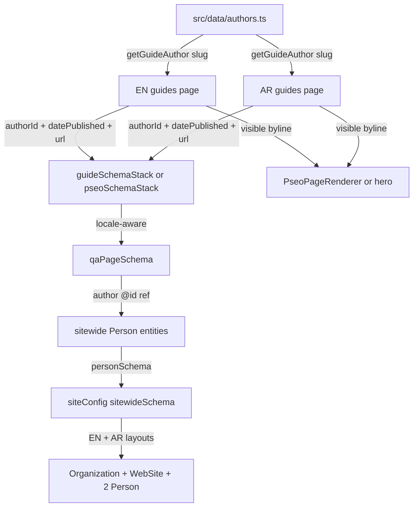

# GSC Q&A Structured Data Fix + Author System — Implementation Plan

**Status:** Approved by client (architecture agreed)
**Mode:** Architect → Code (implementation)
**Constraint:** Strictly ONE task at a time. Do NOT touch unrelated code, structure, content, or styles. No fabricated data. EN + AR parity.

---

## 1. Problem (Confirmed Root Cause)

Google Search Console (Aug 13, 2026) flagged Q&A structured-data issues on 4 Law 3 of 2026 guide URLs:

| Severity | Field | Location |
|---|---|---|
| **Critical** | Missing `answerCount` | `mainEntity` (Question) |
| Non-critical | Missing `datePublished` | `mainEntity.acceptedAnswer` |
| Non-critical | Missing `author` | `mainEntity` |
| Non-critical | Missing `author` | `mainEntity.acceptedAnswer` |
| Non-critical | Missing `datePublished` | `mainEntity` |
| Non-critical | Missing `url` | `mainEntity.acceptedAnswer` |

**Root cause:** the single shared [`qaPageSchema()`](src/lib/schema.ts:224) emits only `Question.name`, `Question.text`, `Answer.text`. Because **every** Q&A page on the site routes through this one generator (via [`pseoSchemaStack()`](src/lib/schema.ts:481) and [`guideSchemaStack()`](src/lib/schema.ts:335), EN and AR), the missing fields exist on **all** Q&A pages, not just the 4 flagged URLs.

## 2. Blast Radius (All 126 Q&A Pages)

| Source | EN count | AR count | Total |
|---|---|---|---|
| pSEO pages with `kind: "qa"` (`pseo-pages.json`) | 36 | 36 | 72 |
| `guides.ts` entries with `type: "qa"` | 27 | 27 | 54 |
| **Total Q&A pages emitting QAPage schema** | 63 | 63 | **126** |

Plus 23 non-QA `/guides` pages (11 guide, 2 checklist, 1 timeline, 2 cost, 3 compare, 4 hub) receive the **visible author byline only** (no QAPage node).

All 55 pSEO pages have a real `lastVerified` date (`2026-08-12`) — no `schemaDate()` fallback risk for the flagged pages.

## 3. Approved Fix Design

### 3.1 Target QAPage JSON-LD (after fix, EN example)

```json
{
  "@context": "https://schema.org",
  "@type": "QAPage",
  "@id": "https://www.dubaiapprovalconsultants.com/guides/law-3-2026-key-changes-explained#qa",
  "mainEntity": {
    "@type": "Question",
    "name": "Law 3 of 2026 Key Changes Explained for Dubai Buildings",
    "text": "Law 3 of 2026 Key Changes Explained for Dubai Buildings",
    "answerCount": 1,
    "author": { "@id": "https://www.dubaiapprovalconsultants.com/#author-jamsheed-khalid" },
    "datePublished": "2026-08-12",
    "upvoteCount": 0,
    "acceptedAnswer": {
      "@type": "Answer",
      "text": "…",
      "url": "https://www.dubaiapprovalconsultants.com/guides/law-3-2026-key-changes-explained",
      "author": { "@id": "https://www.dubaiapprovalconsultants.com/#author-jamsheed-khalid" },
      "datePublished": "2026-08-12",
      "upvoteCount": 0
    }
  }
}
```

### 3.2 Sitewide Person entities (registered once, referenced by `@id`)

`@id` pattern: `https://www.dubaiapprovalconsultants.com/{ar}/#author-{id}` (locale-prefixed).

```json
{
  "@context": "https://schema.org",
  "@type": "Person",
  "@id": "https://www.dubaiapprovalconsultants.com/#author-jamsheed-khalid",
  "name": "Jamsheed Khalid",
  "jobTitle": "Senior Fit-Out Consultant & Structural Engineer",
  "worksFor": { "@id": "https://www.dubaiapprovalconsultants.com/#organization" },
  "sameAs": [
    "https://www.linkedin.com/in/jamsheed-khalid-343148b6",
    "https://gravatar.com/jamsheedkhalid"
  ]
}
```

**Rules (no fabricated data):**
- Person `name` / `jobTitle` / `sameAs` come ONLY from `reference details/authors-profile-links.md` (verified LinkedIn / Gravatar URLs).
- Do **NOT** copy unverified stats (11+ years, 273+ projects, "PMP-certified", "Wasleen Interior" `worksFor`) into schema.
- `worksFor` always points at THIS site's `#organization` (Wasleen Liminal Approval Consultants) — keeps the graph self-consistent and NAP-clean.
- Kavya has **no LinkedIn** — `sameAs` uses only her Gravatar URL.
- The company author maps to `#organization` — **no** new Person node for the company (the `WI` brand in the reference file is the different wasleen.com interior-design company).

### 3.2.1 `@id` vs `sameAs` — DECISION (confirmed by client)

The Person **`@id` is the site-internal `#author-{id}`** (e.g. `https://www.dubaiapprovalconsultants.com/#author-jamsheed-khalid`), **NOT** the Gravatar/LinkedIn profile URL. The external profiles (Gravatar, LinkedIn) live **only** in `sameAs`.

Rationale:
- **Consistency** — matches the existing sitewide pattern (`#organization`, `#website`); mixing external IDs for People with site-internal IDs for Organization would be inconsistent.
- **Locale safety** — EN `#author-…` and AR `/ar/#author-…` stay separate keys; using a single external URL as `@id` for both EN and AR nodes would create two nodes with different names claiming the same identity.
- **No third-party dependency** — the primary key should never depend on Gravatar/LinkedIn slug stability.
- **`sameAs` is the correct field** for authority linking — Google uses `sameAs` (LinkedIn/Gravatar) to identify the real-world person; `@id` is only the internal graph key.

> The plan already implements this — this subsection records the confirmed decision for the implementation record.

### 3.3 Author flow



## 4. Author Assignment Map (86 /guides pages — explicit, deterministic)

Source of truth: `GUIDE_AUTHORS: Record<string, "jamsheed-khalid" | "kavya-ramachandran" | "organization">`. Missing slug ⇒ `organization` fallback.

### Jamsheed Khalid — engineering / Law 3 of 2026 / building permit / structural (39 pages)

**pSEO `kind:"qa"` (25):**
`dm-building-permit-validity-period`, `who-needs-quality-safety-certificate-dubai`, `what-happens-if-you-dont-get-safety-certificate`, `why-dubai-introduced-building-safety-law-2026`, `law-3-2026-key-changes-explained`, `quality-safety-certificate-validity-renewal`, `documents-required-quality-safety-certificate`, `building-inspection-process-law-3-2026`, `law-3-2026-free-zone-buildings-guide`, `jointly-owned-property-owners-safety-certificate`, `how-to-choose-licensed-engineering-office-dubai`, `law-3-2026-appeal-process-guide`, `repeat-violation-penalties-law-3-2026`, `building-permit-suspension-law-3-2026`, `contractor-responsibilities-law-3-2026`, `building-management-obligations-law-3-2026`, `landlord-obligations-building-safety-law-2026`, `tenant-rights-demolition-law-3-2026`, `mep-systems-law-3-2026-compliance`, `property-investors-law-3-2026-impact`, `buying-property-without-safety-certificate-dubai`, `dubai-municipality-digital-building-portal`, `dubai-building-safety-law-tenant-guide`, `buildings-over-40-years-safety-certificate`, `engineering-office-responsibilities-law-3-2026`

**pSEO non-qa (11):** `dm-building-permit-complete-guide` (guide), `how-to-get-building-safety-certificate-dubai` (guide), `law-3-2026-penalties-fines-guide` (guide), `dubai-law-3-2026-complete-guide` (guide), `building-maintenance-obligations-law-3-2026` (guide), `law-3-2026-faq` (guide), `building-safety-certificate-cost-dubai` (cost), `law-3-2026-compliance-deadline-guide` (timeline), `building-safety-certificate-compliance-checklist` (checklist), `old-vs-new-building-safety-regulations-dubai` (compare), `quality-safety-certificate-vs-completion-certificate-dubai` (compare)

**guides.ts `type:"qa"` (3):** `how-long-does-dm-building-permit-take`, `change-of-usage-permit-guide`, `structural-modification-approval-guide`

### Kavya Ramachandran — design / fit-out / drawings (12 pages)

**pSEO (2):** `dda-fit-out-permit-documents` (qa), `dda-fit-out-approval-complete-guide` (guide)

**guides.ts `type:"qa"` (10):** `dm-noc-for-renovation-guide`, `dso-fit-out-approval-guide`, `dubai-south-design-guidelines`, `dmcc-free-zone-approval-process`, `nakheel-renovation-approval-process`, `emaar-community-design-guidelines`, `interior-fit-out-permit-process`, `cad-drawing-standards-dubai-guide`, `as-built-drawing-requirements`, `3d-design-submission-guide`

### Organization — fallback (35 pages)

All remaining pages default to `organization` via the fallback. This includes: DEWA, Ejari, RERA, title deed, DTCM, DHA, food control, RTA, Dubai Properties, TECOM, DCD, DED, Dubai Police, entertainment, DM NOC, mainland-vs-free-zone, trade license, common rejection reasons, approval cost guide, restaurant checklist, and the 4 hub guides (`complete-guide-dubai-building-approvals`, `how-to-avoid-approval-rejection-dubai`, `dubai-approval-fees-guide`, `approval-timelines-dubai-guide`).

> Implementation note: the map lists ONLY the 51 explicit entries (39 Jamsheed + 12 Kavya). Everything else resolves to `organization` by fallback — fewer lines, zero risk of a typo corrupting an org page.

## 5. Implementation Tasks (STRICT ORDER — one at a time)

### Task 1 — Create author registry `src/data/authors.ts` (NEW FILE)
- `export type GuideAuthorId = "jamsheed-khalid" | "kavya-ramachandran" | "organization";`
- `interface GuideAuthor { id; name; arabicName; titleEn; titleAr; jobTitle; sameAs?: string[] }`
- `AUTHOR_REGISTRY: Record<GuideAuthorId, GuideAuthor>` (3 entries; Arabic names are transliterations matching the visible byline).
- `GUIDE_AUTHORS: Record<string, GuideAuthorId>` (51 explicit slug→author entries per §4).
- `getGuideAuthor(slug): GuideAuthor` with `organization` fallback.
- Pure data + lookups only — **no** schema imports (avoid circular dependency).

### Task 2 — Fix `qaPageSchema()` in `src/lib/schema.ts` (ROOT CAUSE)
- Extend `QAPageSchemaInput` with `authorId?: string`, `datePublished?: string`, `url?: string`.
- Add private helper `authorEntityRef(authorId, locale)`: returns `` `${BASE}${lp}/#author-${id}` `` for persons, `` `${BASE}${lp}/#organization` `` for `"organization"`, `undefined` if absent.
- Emit `mainEntity.answerCount: 1`, `mainEntity.upvoteCount: 0`, `author` (`{ "@id": ref }`) on both Question + Answer, `datePublished` on both, `acceptedAnswer.url`.
- No change to `@id`, `name`, `text`, or `localePrefix`.

### Task 3 — Thread through `guideSchemaStack()` (guides.ts Q&A pages)
- Add `authorId?: string; datePublished?: string;` to `GuideSchemaStackInput`.
- In the `type === "qa"` branch, pass `authorId`, `datePublished`, and `url: input.url` into `qaPageSchema`.

### Task 4 — Thread through `pseoSchemaStack()` (pSEO Q&A pages)
- Add `authorId?: string; datePublished?: string;` to `PseoSchemaStackInput`.
- In the `kind === "qa"` branch, pass `authorId`, `datePublished`, and `url: input.url` into `qaPageSchema`.

### Task 5 — Add `personSchema()` + register Person entities sitewide
- Add `personSchema(person, locale)` generator in `src/lib/schema.ts` (Person with locale-prefixed `@id`, `worksFor` → `#organization`, `sameAs`).
- In `src/lib/site-config.ts`, import `AUTHOR_REGISTRY` (or a helper from authors.ts) and append the two Person schemas (Jamsheed, Kavya) to `sitewideSchema`. EN + AR layouts inherit automatically (shared `siteConfig()`). `#organization` is not re-registered (already emitted).

### Task 6 — Add optional `author` prop to `PseoPageRenderer.tsx` (visible byline, EN + AR in one component)
- `author?: { name: string; title: string } | null` prop.
- Render byline after the hero description `(src/components/pseo/PseoPageRenderer.tsx:91)` before the parentApproval link, using existing design tokens (`text-caption`, `text-body-text/70`, `font-montserrat`).
- No structural/style change to any other section. Component is used ONLY by the two guides pages.

### Task 7 — EN `src/app/guides/[slug]/page.tsx`
- `renderPseoPage(page)`: `const author = getGuideAuthor(page.slug);` pass `authorId: author.id`, `datePublished: schemaDate(page.lastVerified)` into `pseoSchemaStack` call; pass `author={{ name, title }}` to `PseoPageRenderer`.
- Regular-guide branch: `getGuideAuthor(guide.slug)`; add `authorId` + `datePublished: schemaDate(guide.lastUpdated)` to `guideSchemaStack` call; render visible byline in hero after description `(:343)`.

### Task 8 — AR `src/app/ar/guides/[slug]/page.tsx`
- `renderPseoPageAr(page, arEntry)`: same author wiring as Task 7 (EN); pass Arabic `author` to `PseoPageRenderer`.
- Regular Arabic-guide branch: add `authorId` + `datePublished: schemaDate(guide.lastUpdated)` to `guideSchemaStack` call `(:311)`; render Arabic byline after description `(:379)`.

### Task 9 — Verification (GATE — do not proceed past a failed check)
1. `npm run build` — zero errors, zero TS errors.
2. Grep built HTML (or a small node script over `pseo-pages.json` + `guides.ts` slug lists) to confirm ALL 126 Q&A pages emit `answerCount`, `author` (Question + Answer), `datePublished` (Question + Answer), `acceptedAnswer.url`; and ALL 86 /guides pages contain a visible byline.
3. Google Rich Results Test on the 4 flagged URLs + 1 AR sample + 1 org-page sample.
4. NAP check: no new organization/fabricated data introduced.
5. GSC: request re-inspection for the 4 URLs after deployment.

## 6. Constraint Checklist (MUST NOT DO)

- [ ] No changes to any file outside: `src/data/authors.ts` (new), `src/lib/schema.ts`, `src/lib/site-config.ts`, `src/components/pseo/PseoPageRenderer.tsx`, `src/app/guides/[slug]/page.tsx`, `src/app/ar/guides/[slug]/page.tsx`.
- [ ] No changes to `pseo-pages.json`, `guides.ts`, `constants.ts`, `types/index.ts`, layouts' metadata, footer/header, styles, or any other component.
- [ ] No inline styles; existing Tailwind tokens only.
- [ ] No new dependencies.
- [ ] No fabricated stats/dates; `datePublished` derived only from real `lastVerified`/`lastUpdated`.
- [ ] Visible byline name must match the schema `author` name word-for-word (master rule).
- [ ] One task at a time — commit/verify each before the next.
