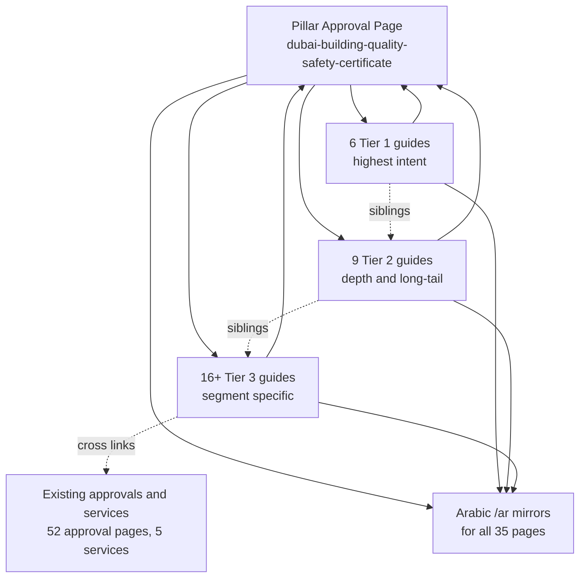

# Dubai Building Quality & Safety Certificate — Law No. (3) of 2026 Content Cluster Plan

**Domain:** https://www.dubaiapprovalconsultants.com
**Project:** Wasleen Liminal Approval Consultants (Wasleen Approvals)
**Plan status:** Draft for approval (Architect mode)
**Source of truth for all legal facts:** `reference details/Law-3-2026-Official-Fact-SheetDLP-Legal-sheet.md` (Dubai Legislation Portal extract)

---

## 1. Executive Summary

This plan builds the full content cluster around **Law No. (3) of 2026 — Concerning the Quality and Safety of Buildings in the Emirate of Dubai**. It produces:

- **1 pillar page** (commercial / money page, Google Ads Final URL) at `/approvals/dubai-building-quality-safety-certificate`
- **31 enumerated guides** from the brief + **3 recommended additions** (to match the brief's stated "34 guides" — see Section 3.3)
- **Arabic `/ar/` mirrors** for all pages, generated after each EN tier is locked / do not do word to word translation from english.write as a native Arabic expert content writer without losing the context and details from respective EN page
- **At least 2 images per page** (pillar and every guide)
- **Full internal-linking map** (pillar ↔ guides, sibling "Related Topics" matrix, cross-links into existing approval/service pages)
- **Tiered rollout** — Tier 1 → pillar live + Ads → Tier 2 → Tier 3 → AR — per the brief's sequencing

The single non-negotiable sourcing rule: **every number, date, fine, deadline, or obligation published must trace to the DLP fact sheet** — never to a law-firm paraphrase. Tier 2 commentary (Al Tamimi, Motei, MEP Middle East, Gulf press) is used only for framing and reader angle, never for exact figures.

### 1.1 Cluster architecture



---

## 2. Source & Fact Policy (non-negotiable)

| # | Rule |
|---|---|
| 1 | The DLP fact sheet is the **only** source for legal figures: fine range AED 100 – AED 1,000,000; repeat-violation doubling capped at AED 2,000,000; 20-year certificate trigger; 10/5-year validity; 6-month Technical Report window extendable to 2 years; 60-day in-force; 1-year compliance deadline; 30-day appeal; AED 50,000 demolition deposit; 3-month vacation window. |
| 2 | **Fine-schedule nuance (critical):** the law sets the *outer range* only. Exact per-violation amounts are delegated to a future Executive Council Chairman resolution. Content must say "fines range from AED 100 to AED 1,000,000, with per-violation amounts to be set by a follow-up resolution" — never a fabricated specific number for a specific act. This is the defensible, accurate position and it differs from several secondary sources. |
| 3 | Every page that states a legal fact carries the official note: *"Every effort has been made to produce an accurate and complete English version of this legislation. However, for the purpose of its interpretation and application, reference must be made to the original Arabic text. In case of conflict, the Arabic text will prevail."* |
| 4 | **Audience truth that drives all content:** the certificate applies to existing buildings **20+ years** past their Completion Certificate. Buildings under 20 years carry only a periodic maintenance obligation (Article 9(a)(4)). Buildings 40+ years get a shorter 5-year validity (Article 13). **Never write copy implying new buildings need certification now.** |
| 5 | Tier 2 law-firm/industry sources: structure and emphasis only. No figures, no dates, no paraphrased obligations. |
| 6 | Tier 3 sources (Global Law Experts, Valorisimo, Real Estate Club): **do not use** — the brief flags unverifiable claims (contractor registration "critical dates" tables; fines "escalating from warnings") that do not appear in the law text. |
| 7 | No page may closely paraphrase any single source. Synthesize DLP facts + Tier-2 framing into original structure per search intent (`qa`, `guide`, `cost`, `checklist`, `compare`). |
| 8 | Visible page content and JSON-LD schema text must match word-for-word (FAQ answers, HowTo steps). |

### 2.1 Legal-fact reference table (from DLP fact sheet — used in stats, tables, FAQs)

| Fact | Value | Source article |
|---|---|---|
| Issued | 27 February 2026 (10 Ramadan 1447 AH) | Header |
| In force | 60 days after Official Gazette publication | Art. 25 |
| Compliance deadline | 1 year from effective date, extendable by Executive Council Chairman | Art. 22 |
| Building (definition) | Existing building 20+ years past Completion Certificate date | Art. 2 |
| Certificate trigger | After 20 years from Completion Certificate issuance | Art. 9(a)(1) |
| Under-20-year obligation | Periodic maintenance + fix safety-risk defects | Art. 9(a)(4) |
| Validity (under 40 yrs) | 10 years, renewable | Art. 13 |
| Validity (40+ yrs) | 5 years, renewable | Art. 13 |
| Technical Report window | 6 months from initial approval, extendable up to 2 years | Art. 8 |
| Vacation window (works) | 3 months after Technical Report approval | Art. 12 |
| Demolition grace | 1 year, refundable AED 50,000 security deposit | Art. 14 |
| Fine range | AED 100 – AED 1,000,000 | Art. 16 |
| Repeat violation (within 2 yrs) | Fine doubled, capped AED 2,000,000 | Art. 16 |
| Non-monetary measures | Suspend permits; suspend/reject applications incl. lease attestation (via DLD) | Art. 16 |
| Appeal | 30 days written grievance to Director General; committee decides in 30 days; final | Art. 19 |
| Fees | Set by Executive Council Chairman resolution | Art. 21 |
| Technical Report scope | Structural, cladding, electrical/mechanical, windows/doors/barriers, Civil Defence compliance, CCTV/SIRA | Art. 7 |

---

## 3. Final Page List

### 3.1 Pillar page

| Slug | Type | Role |
|---|---|---|
| `/approvals/dubai-building-quality-safety-certificate` | Approval page (`ApprovalData`, 13 sections) | Google Ads Final URL. Every guide links up to it. |

### 3.2 Guides (34 total = 31 brief + 3 recommended additions)

**Tier 1 — Highest intent (build first, priority 10)**

| # | Kind | Slug | Core search intent |
|---|---|---|---|
| 1 | qa | `who-needs-quality-safety-certificate-dubai` | Who is affected (20+ yr owners, JOP, free zone, 40+ yr urgent) |
| 2 | qa | `how-to-get-building-safety-certificate-dubai` | The 7-step process |
| 3 | cost | `building-safety-certificate-cost-dubai` | Pricing (fees by resolution; report cost; AED 50k deposit) |
| 4 | qa | `what-happens-if-you-dont-get-safety-certificate` | Permit suspension, DLD transaction freeze, lease attestation block |
| 5 | qa | `law-3-2026-penalties-fines-guide` | Fine range + repeat doubling + per-type schedule pending |
| 6 | qa | `law-3-2026-compliance-deadline-guide` | 1-year compliance clock + extension |

**Tier 2 — Depth & long-tail (priority 7)**

| # | Kind | Slug | Core search intent |
|---|---|---|---|
| 7 | guide | `dubai-law-3-2026-complete-guide` | Full overview / pillar-adjacent explainer |
| 8 | qa | `why-dubai-introduced-building-safety-law-2026` | The "why" (Art. 4 objectives, Dubai Media Office angle) |
| 9 | qa | `law-3-2026-key-changes-explained` | Old system vs new |
| 10 | qa | `quality-safety-certificate-validity-renewal` | 10/5-year validity + renewal |
| 11 | checklist | `building-safety-certificate-compliance-checklist` | Step-by-step action list |
| 12 | qa | `documents-required-quality-safety-certificate` | Paperwork (Technical Report, completion cert, etc.) |
| 13 | qa | `building-inspection-process-law-3-2026` | What the assessment checks (Art. 7 scope) |
| 14 | qa | `law-3-2026-free-zone-buildings-guide` | DIFC/free zones not exempt — cross-sell to free-zone approvals |
| 15 | qa | `jointly-owned-property-owners-safety-certificate` | Strata / JOP unit-owner + management entity duties |
| **A** | guide | `building-maintenance-obligations-law-3-2026` *(recommended)* | Under-20-year periodic maintenance obligation (Art. 9(a)(4)) |

**Tier 3 — Segment-specific (priority 5)**

| # | Kind | Slug | Core search intent |
|---|---|---|---|
| 16 | qa | `buildings-over-40-years-safety-certificate` | Older-building 5-year cycle |
| 17 | qa | `how-to-choose-licensed-engineering-office-dubai` | Vendor-selection intent |
| 18 | qa | `law-3-2026-appeal-process-guide` | 30-day appeal to Director General |
| 19 | qa | `repeat-violation-penalties-law-3-2026` | Doubled fines within 2 years |
| 20 | qa | `building-permit-suspension-law-3-2026` | Enforcement measure deep-dive |
| 21 | qa | `engineering-office-responsibilities-law-3-2026` | B2B — consultancy/firm duties (Art. 11) |
| 22 | qa | `contractor-responsibilities-law-3-2026` | Contractor duties (Art. 2, 9(5), Law 7/2025) |
| 23 | qa | `building-management-obligations-law-3-2026` | Facility management / JOP management entity (Art. 10) |
| 24 | qa | `landlord-obligations-building-safety-law-2026` | Landlord-specific duties |
| 25 | qa | `tenant-rights-demolition-law-3-2026` | Priority-return, same rent, 3-month vacation |
| 26 | qa | `mep-systems-law-3-2026-compliance` | MEP angle — cross-sell to MEP approval |
| 27 | qa | `property-investors-law-3-2026-impact` | Investment/valuation angle |
| 28 | qa | `buying-property-without-safety-certificate-dubai` | High-intent resale/transaction scenario |
| 29 | qa | `dubai-municipality-digital-building-portal` | Digital Window / unified database (Art. 5, 6) |
| 30 | compare | `old-vs-new-building-safety-regulations-dubai` | Before/after comparison |
| 31 | guide | `law-3-2026-faq` | Mega-FAQ aggregating short answers — featured-snippet target |
| **B** | compare | `quality-safety-certificate-vs-completion-certificate-dubai` *(recommended)* | Distinguishes the two DM certificates (20-year trigger) |
| **C** | qa | `dubai-building-safety-law-tenant-guide` *(recommended)* | Tenant-facing rights/duties digest |

### 3.3 Page-count reconciliation & open item

The brief states **"1 pillar + 34 guides = 35 pages"** but enumerates only **31 guides** (6 + 9 + 16). This plan proposes the **3 additions in Section 3.2 (A, B, C)** to reach 34, each chosen to capture a distinct, fact-sheet-backed audience that is otherwise uncovered:
- **A** `building-maintenance-obligations-law-3-2026` — the under-20-year segment is the largest owner population and the law's most common obligation (Art. 9(a)(4)).
- **B** `quality-safety-certificate-vs-completion-certificate-dubai` — high-value comparison; the fact sheet's defining rule (20-year trigger vs Completion Certificate) is precisely what searchers confuse.
- **C** `dubai-building-safety-law-tenant-guide` — complements `tenant-rights-demolition-law-3-2026` with the broader tenant audience.

**Decision needed:** confirm the 3 additions (default: yes) or cut to 31.

---

## 4. Page Architecture (mapping to the existing data layer)

### 4.1 Pillar page → `ApprovalData` (13-section contract)

The pillar is added as a full entry in `src/data/approvals.ts` (rendered by the existing `src/app/approvals/[slug]/page.tsx` template) with an Arabic entry in `src/data/approvals-ar.ts`. It needs a new optional field for images (see Section 7).

### 4.2 Guide pages → `PseoPage` (34 entries)

Each guide is a `PseoPage` written to `src/data/pseo/pseo-pages.json` (EN) and `src/data/pseo/pseo-pages-ar.json` (AR), rendered at `/guides/{slug}`. Required contract fields per page:

```
slug, kind, title, metaTitle, metaDescription, primaryKeyword, secondaryKeywords[],
directAnswer, sections[] (heading/anchor/blocks), faqs[], relatedSlugs[],
parentApprovalSlug: "dubai-building-quality-safety-certificate",
image (hero) + image blocks (in-body), lastVerified, reviewStatus, ar{...}
```

### 4.3 Kind → template + schema driver

| Kind | Pages | Drives |
|---|---|---|
| `qa` | 22 | Direct-answer + QAPage schema |
| `guide` | 4 | Full section structure + HowTo schema |
| `checklist` | 1 | Ordered lists + HowTo schema |
| `cost` | 1 | Fee/timeline tables + FAQ schema |
| `compare` | 2 | Comparison table + FAQ schema |
| `timeline` / `glossary` | 0 | (not used in this cluster) |

---

## 5. SEO Tactics

### 5.1 Keyword map (primary + secondary per page)

All meta titles front-load the primary keyword and end with `| Wasleen Approvals` (≤ 60 chars). Meta descriptions are 140–160 chars, active voice, contain one concrete number, and end with a CTA.

| Slug | Primary keyword | Secondary keywords (3–5) |
|---|---|---|
| `who-needs-quality-safety-certificate-dubai` | who needs a Quality and Safety Certificate in Dubai | building safety certificate requirements Dubai; Quality and Safety Certificate 20 years; Dubai building certificate owners; free zone building certificate |
| `how-to-get-building-safety-certificate-dubai` | how to get a building safety certificate in Dubai | Quality and Safety Certificate process; DM building certificate application; steps to get safety certificate; Digital Window application |
| `building-safety-certificate-cost-dubai` | building safety certificate cost Dubai | Quality and Safety Certificate fees; cost of technical report Dubai; engineering firm cost Dubai; AED 50,000 demolition deposit |
| `what-happens-if-you-dont-get-safety-certificate` | what happens if you don't get a safety certificate in Dubai | building safety certificate penalty; no safety certificate Dubai; permit suspension Dubai; lease attestation blocked |
| `law-3-2026-penalties-fines-guide` | Law 3 of 2026 Dubai building fines | building safety law penalties Dubai; AED 1,000,000 fine Dubai building; repeat violation double fine; Law 3 2026 violation |
| `law-3-2026-compliance-deadline-guide` | Law 3 of 2026 compliance deadline Dubai | building safety certificate deadline; 1 year compliance Dubai; law effective date 60 days; extendable compliance deadline |
| `dubai-law-3-2026-complete-guide` | Dubai Law No 3 of 2026 complete guide | building quality and safety law Dubai; Law 3 2026 explained; building safety regulation Dubai; Quality and Safety Certificate law |
| `why-dubai-introduced-building-safety-law-2026` | why did Dubai introduce Law 3 of 2026 | building safety law objectives Dubai; aging buildings Dubai; building quality law purpose |
| `law-3-2026-key-changes-explained` | Law 3 of 2026 key changes Dubai | new building safety rules Dubai; old vs new system; building certificate changes; maintenance obligation Dubai |
| `quality-safety-certificate-validity-renewal` | Quality and Safety Certificate validity Dubai | building certificate renewal Dubai; 10 year certificate validity; 5 year validity 40 years; certificate renewal process |
| `building-safety-certificate-compliance-checklist` | building safety certificate compliance checklist Dubai | Quality and Safety Certificate checklist; building compliance steps; certificate documents checklist; technical report checklist |
| `documents-required-quality-safety-certificate` | documents required for Quality and Safety Certificate Dubai | building safety certificate documents; technical report Dubai; completion certificate; engineering firm classification; as-built drawings |
| `building-inspection-process-law-3-2026` | building inspection process Dubai Law 3 2026 | technical assessment Dubai; building structural inspection; cladding inspection; MEP inspection; SIRA CCTV compliance |
| `law-3-2026-free-zone-buildings-guide` | Law 3 of 2026 free zone buildings Dubai | DIFC building safety certificate; DMCC building certificate; TECOM compliance; JAFZA building safety; free zone not exempt |
| `jointly-owned-property-owners-safety-certificate` | jointly owned property safety certificate Dubai | strata building certificate Dubai; JOP owner obligations; management entity certificate; DLD implementing resolution |
| `buildings-over-40-years-safety-certificate` | buildings over 40 years safety certificate Dubai | old building safety certificate; 5 year validity 40 years; older building inspection; aging building compliance |
| `how-to-choose-licensed-engineering-office-dubai` | how to choose a licensed engineering office in Dubai | DM registered engineering firm; technical report engineer Dubai; engineering consultancy classification; accredited engineering office |
| `law-3-2026-appeal-process-guide` | Law 3 of 2026 appeal process Dubai | building safety grievance Dubai; 30 day appeal Director General; appeal committee decision; challenge building fine |
| `repeat-violation-penalties-law-3-2026` | repeat violation penalties Law 3 of 2026 Dubai | double fine repeat violation; AED 2,000,000 cap; 2 year repeat window; building fine escalation |
| `building-permit-suspension-law-3-2026` | building permit suspension Law 3 of 2026 Dubai | permit suspended building violation; DLD transaction freeze; lease attestation suspension; enforcement measures |
| `engineering-office-responsibilities-law-3-2026` | engineering office responsibilities Law 3 of 2026 | technical report obligations Dubai; engineering firm duties; no subcontracting technical report; engineer certification liability |
| `contractor-responsibilities-law-3-2026` | contractor responsibilities Law 3 of 2026 Dubai | building contractor obligations Dubai; defect rectification contractor; DM licensed contractor; contracting activities law |
| `building-management-obligations-law-3-2026` | building management obligations Law 3 of 2026 Dubai | facility management building safety; management entity certificate Dubai; JOP management duties; building manager compliance |
| `landlord-obligations-building-safety-law-2026` | landlord obligations building safety law Dubai | owner building safety duties; landlord certificate responsibility; eviction building works; rental dispute settlement |
| `tenant-rights-demolition-law-3-2026` | tenant rights demolition Law 3 of 2026 Dubai | priority right of return Dubai; same rent reconstruction; vacate 3 months building; judicial eviction rental dispute |
| `mep-systems-law-3-2026-compliance` | MEP systems Law 3 of 2026 compliance Dubai | MEP inspection building safety; electrical installations check; mechanical systems compliance; MEP approval Dubai |
| `property-investors-law-3-2026-impact` | property investors Law 3 of 2026 impact Dubai | building safety law investment impact; Dubai property due diligence; safety certificate valuation; free zone investment |
| `buying-property-without-safety-certificate-dubai` | buying a property without a safety certificate in Dubai | title deed safety certificate; DLD transfer certificate; buying old building Dubai; property transaction compliance |
| `dubai-municipality-digital-building-portal` | Dubai Municipality digital building portal | Digital Window certificate; DM building database; quality safety certificate online; building assessment portal |
| `old-vs-new-building-safety-regulations-dubai` | old vs new building safety regulations Dubai | building safety law comparison; before Law 3 2026; new compliance regime; maintenance obligation change |
| `law-3-2026-faq` | Law 3 of 2026 Dubai FAQ | building safety certificate questions; Law 3 2026 answers; quality safety certificate FAQ; building law common questions |
| `building-maintenance-obligations-law-3-2026` | building maintenance obligations Law 3 of 2026 | periodic maintenance Dubai building; under 20 years building; maintenance defect repair; building upkeep obligation |
| `quality-safety-certificate-vs-completion-certificate-dubai` | Quality and Safety Certificate vs Completion Certificate Dubai | completion certificate difference; DM completion certificate; safety certificate 20 years; building certificate comparison |
| `dubai-building-safety-law-tenant-guide` | Dubai building safety law tenant guide | tenant building safety rights; tenant compliance Dubai; vacate building works; tenant cooperation inspection |

### 5.2 Worked metadata examples (pattern for all 34)

- **Meta title (Tier 1 qa):** `Building Safety Certificate Cost Dubai | Wasleen` (47 chars) — PK front-loaded, pipe separator, brand suffix.
- **Meta title (penalties):** `Law 3 of 2026 Dubai Building Fines | Wasleen` (50 chars).
- **Meta description (cost):** "Quality and Safety Certificate costs in Dubai start from the DM fee scale set by resolution, with fines from AED 100 up to AED 1,000,000 for non-compliance. Get a fixed quote today." (157 chars — contains numbers + CTA).

### 5.3 AEO / GEO / AIO requirements (every page)

1. **Direct Answer Block** — Section 1, 2–3 self-contained sentences (what it is, who needs it, the key number/deadline). Must make sense with zero context (AI engines lift it verbatim). Example for the pillar:
   > "A Dubai Quality and Safety Certificate confirms an existing building is structurally sound and safe for continued use. Under Law No. 3 of 2026 it is required once a building is 20 years past its Completion Certificate, and it must be renewed every 10 years (or every 5 for buildings 40+ years old). Owners have 1 year from the law's effective date to achieve compliance."
2. **Stats strip** — 4 numbered facts per page (the legal-fact table in Section 2.1 provides the pool).
3. **Two mandatory tables** where relevant: documents & requirements; timeline & cost. AI engines parse `<table>` well.
4. **FAQ block** — 4–8 items, answers 2–3 sentences, self-contained, mirrored exactly in FAQPage schema.
5. **One quotable fact every ~150–200 words** (number, duration, document).
6. **Entity-first** — define the law/acronym in the first paragraph; full name + abbreviation consistently; link to the DLP/DM official portals for authority.

### 5.4 Heading hierarchy

- One H1 = exact primary keyword. H2 sections (kebab-case anchors). H3 subsections. H4 rarely. No skipped levels.
- Every H2 carries a relevant keyword.

### 5.5 Canonical / hreflang / sitemap

- Every page self-canonicalizes to `https://www.dubaiapprovalconsultants.com/{path}` via the existing metadata pipeline (`alternates.canonical`).
- `hreflang` EN/AR pairs via the existing `hreflangAlternates` helper.
- New pages are picked up automatically by `src/app/sitemap.ts` (approval + pSEO sources). No sitemap code change expected, but the sitemap must be re-verified post-build.

---

## 6. Schema Map (JSON-LD)

### 6.1 Pillar page — `approvalSchemaStack` (existing)

| Schema | Source | Notes |
|---|---|---|
| `Service` | approval name/description/category | provider → Organization `@id` |
| `WebPage` | URL/title/description/dateModified | references Service `@id` |
| `FAQPage` | Section 11 FAQs | text = visible text verbatim |
| `HowTo` | Section 6 process steps | text = visible text verbatim |
| `BreadcrumbList` | Home → Approvals → pillar | 3 items |

### 6.2 Guide pages — `pseoSchemaStack` (existing)

| Kind | Stack |
|---|---|
| `qa` | WebPage + BreadcrumbList (Home → Approvals → pillar → page) + FAQPage + QAPage + ItemList |
| `guide` / `checklist` | WebPage + BreadcrumbList + FAQPage + HowTo + ItemList |
| `cost` / `compare` | WebPage + BreadcrumbList + FAQPage + ItemList |

All reference the shared Organization `@id` (`/#organization`) and the pillar's Service `@id` as the parent entity. `parentApprovalSlug: "dubai-building-quality-safety-certificate"` on every guide drives the breadcrumb and related-card hierarchy automatically.

### 6.3 Schema correctness gates

- Visible FAQ/HowTo text == schema text, word-for-word.
- No fabricated ratings, reviews, awards, or founding dates.
- No `Offer`/price markup for the fine figures (they are penalties, not offers).
- The official Arabic-prevails note lives in visible content; the DLP citation can be added to the `Service` `description`/`url` where appropriate.

---

## 7. Image Strategy — at least 2 images per page

### 7.1 Current state (gap analysis)

- `PseoPage` supports a **single** `image` (hero) — rendered once in `PseoPageRenderer`.
- `PseoBlock` has no `image` block type; `PseoSectionBlock` renders paragraph/heading/list/table/quote only.
- `ApprovalData` has **no** image field; the approval template renders zero images.
- `FramedImage` (CLS-safe, explicit dimensions, alt/caption) and `PseoImageBlock` already exist and can be reused.

### 7.2 Required code changes (Phase A — see Section 10)

1. **Extend `PseoBlock`** in `src/types/index.ts` with `{ type: "image"; image: ImageAssetRef }`.
2. **Render the image block** in `PseoSectionBlock.tsx` (reuse `PseoImageBlock` / `FramedImage`).
3. **Update the pipeline** to accept the new block: `EN_JSON_SHAPE` in `scripts/pseo/prompts.ts`, `sanitizeBlocks` and `blockText`/`pageBody` in `scripts/pseo/generate.ts`, and the quality gate.
4. **Add optional `images?: ImageAssetRef[]`** to `ApprovalData`; render the first as the Section-1 hero (`FramedImage` with `priority`) and the second mid-body (e.g., after Section 4) in `src/app/approvals/[slug]/page.tsx`.
5. **Seed 2 images per page** via the queue item (`imageHint` for the hero) + prompt instruction for the in-body image.

### 7.3 New topical image registry (12 assets, naming `{subject}-{context}-{location}.webp`)

Add each to `src/data/images.ts` with `status: "planned"` first (excluded from auto-match), then flip to `"available"` once the `.webp` file is dropped into `public/images/`. Each needs EN + AR alt/caption.

| Filename | topicTags | Used on |
|---|---|---|
| `building-safety-inspection-dubai.webp` | inspection, structural, engineering | inspection, choose-engineering-office, how-to-get |
| `quality-safety-certificate-dubai-building.webp` | certificate, compliance, general | pillar hero, who-needs, law-3-2026-faq |
| `building-maintenance-dubai-exterior.webp` | maintenance, repair, contractor | maintenance-obligations, contractor-responsibilities |
| `dubai-old-building-40-years.webp` | old-building, 40-years, structural | buildings-over-40-years, validity-renewal, compare |
| `dubai-free-zone-building.webp` | freezone, difc, commercial | free-zone-buildings, property-investors |
| `engineering-office-dubai-assessment.webp` | engineering, technical-report, inspection | choose-engineering-office, engineering-office-responsibilities |
| `dubai-municipality-digital-portal.webp` | portal, digital, dm | digital-building-portal, how-to-get, compliance-deadline |
| `building-compliance-penalties-dubai.webp` | penalty, enforcement, compliance | penalties, repeat-violation, what-happens, permit-suspension |
| `jointly-owned-property-dubai-strata.webp` | jop, strata, residential | jointly-owned-property, landlord, building-management |
| `dubai-building-demolition.webp` | demolition, redevelopment | tenant-rights-demolition, landlord |
| `mep-systems-dubai-building.webp` | mep, electrical, mechanical | mep-systems, inspection-process |
| `building-safety-checklist-dubai.webp` | checklist, compliance, document | compliance-checklist, documents-required |

**Fallback pool (existing):** `1773525851355.webp` (consultation), `1773527415014.webp` (meeting), `1773529249805.webp` (process), `1773527788836.webp` (Dubai skyline), `DCD-approval-consultants-in-dubai (1).webp` (DCD fire safety) — reused via existing topicTags for pages without a bespoke image yet.

### 7.4 Per-page image rule

- **Hero** (`page.image`): the most intent-relevant image; `priority` above fold.
- **In-body (1–2 image blocks):** placed contextually — next to the process/checklist table, next to the fines table, or beside the free-zone/strata sections.
- **Alt text:** unique per page, descriptive (never "logo"/"image"); Arabic localized.
- **Dimensions:** explicit width/height to prevent CLS; lazy-load in-body.

---

## 8. Internal Linking Plan

### 8.1 Rules (from the brief, enforced by the pipeline + review)

1. Anchor text lives inside real sentences — never "click here"/"learn more" or stacked bare links.
2. Pillar → Tier 1 guides embedded in pillar body copy (see 8.4 example).
3. Every Tier 2/3 guide → pillar via a natural mid-content CTA (not just a footer button).
4. Lateral linking: each guide links to 3–4 sibling guides via the Related Topics block.
5. Cross-link into existing `/approvals/` and `/services/` pages wherever topics genuinely overlap.

### 8.2 Full Related Topics matrix (all 34 guides — built-out open item)

Each row is the `relatedSlugs` array for that guide (3–4 siblings; pillar `parentApprovalSlug` is separate and automatic).

| Guide | Related siblings |
|---|---|
| who-needs-quality-safety-certificate-dubai | jointly-owned-property-owners-safety-certificate, law-3-2026-free-zone-buildings-guide, buildings-over-40-years-safety-certificate, how-to-get-building-safety-certificate-dubai |
| how-to-get-building-safety-certificate-dubai | who-needs-quality-safety-certificate-dubai, documents-required-quality-safety-certificate, building-inspection-process-law-3-2026, building-safety-certificate-cost-dubai |
| building-safety-certificate-cost-dubai | how-to-get-building-safety-certificate-dubai, documents-required-quality-safety-certificate, how-to-choose-licensed-engineering-office-dubai, law-3-2026-faq |
| what-happens-if-you-dont-get-safety-certificate | law-3-2026-penalties-fines-guide, building-permit-suspension-law-3-2026, law-3-2026-compliance-deadline-guide, buying-property-without-safety-certificate-dubai |
| law-3-2026-penalties-fines-guide | what-happens-if-you-dont-get-safety-certificate, repeat-violation-penalties-law-3-2026, law-3-2026-appeal-process-guide, building-permit-suspension-law-3-2026 |
| law-3-2026-compliance-deadline-guide | what-happens-if-you-dont-get-safety-certificate, law-3-2026-penalties-fines-guide, how-to-get-building-safety-certificate-dubai, quality-safety-certificate-validity-renewal |
| dubai-law-3-2026-complete-guide | law-3-2026-key-changes-explained, why-dubai-introduced-building-safety-law-2026, how-to-get-building-safety-certificate-dubai, old-vs-new-building-safety-regulations-dubai |
| why-dubai-introduced-building-safety-law-2026 | dubai-law-3-2026-complete-guide, law-3-2026-key-changes-explained, old-vs-new-building-safety-regulations-dubai, dubai-municipality-digital-building-portal |
| law-3-2026-key-changes-explained | old-vs-new-building-safety-regulations-dubai, why-dubai-introduced-building-safety-law-2026, dubai-law-3-2026-complete-guide, quality-safety-certificate-validity-renewal |
| quality-safety-certificate-validity-renewal | buildings-over-40-years-safety-certificate, how-to-get-building-safety-certificate-dubai, law-3-2026-compliance-deadline-guide, law-3-2026-key-changes-explained |
| building-safety-certificate-compliance-checklist | documents-required-quality-safety-certificate, how-to-get-building-safety-certificate-dubai, building-inspection-process-law-3-2026, building-management-obligations-law-3-2026 |
| documents-required-quality-safety-certificate | how-to-get-building-safety-certificate-dubai, building-safety-certificate-compliance-checklist, building-inspection-process-law-3-2026, building-safety-certificate-cost-dubai |
| building-inspection-process-law-3-2026 | how-to-get-building-safety-certificate-dubai, documents-required-quality-safety-certificate, mep-systems-law-3-2026-compliance, engineering-office-responsibilities-law-3-2026 |
| law-3-2026-free-zone-buildings-guide | who-needs-quality-safety-certificate-dubai, jointly-owned-property-owners-safety-certificate, dubai-law-3-2026-complete-guide, property-investors-law-3-2026-impact |
| jointly-owned-property-owners-safety-certificate | who-needs-quality-safety-certificate-dubai, building-management-obligations-law-3-2026, landlord-obligations-building-safety-law-2026, buildings-over-40-years-safety-certificate |
| buildings-over-40-years-safety-certificate | quality-safety-certificate-validity-renewal, building-inspection-process-law-3-2026, old-vs-new-building-safety-regulations-dubai, tenant-rights-demolition-law-3-2026 |
| how-to-choose-licensed-engineering-office-dubai | engineering-office-responsibilities-law-3-2026, building-safety-certificate-cost-dubai, building-inspection-process-law-3-2026, documents-required-quality-safety-certificate |
| law-3-2026-appeal-process-guide | law-3-2026-penalties-fines-guide, what-happens-if-you-dont-get-safety-certificate, repeat-violation-penalties-law-3-2026, law-3-2026-faq |
| repeat-violation-penalties-law-3-2026 | law-3-2026-penalties-fines-guide, what-happens-if-you-dont-get-safety-certificate, law-3-2026-appeal-process-guide, law-3-2026-compliance-deadline-guide |
| building-permit-suspension-law-3-2026 | what-happens-if-you-dont-get-safety-certificate, law-3-2026-penalties-fines-guide, repeat-violation-penalties-law-3-2026, buying-property-without-safety-certificate-dubai |
| engineering-office-responsibilities-law-3-2026 | how-to-choose-licensed-engineering-office-dubai, contractor-responsibilities-law-3-2026, building-inspection-process-law-3-2026, mep-systems-law-3-2026-compliance |
| contractor-responsibilities-law-3-2026 | engineering-office-responsibilities-law-3-2026, building-management-obligations-law-3-2026, building-inspection-process-law-3-2026, dubai-law-3-2026-complete-guide |
| building-management-obligations-law-3-2026 | jointly-owned-property-owners-safety-certificate, landlord-obligations-building-safety-law-2026, building-safety-certificate-compliance-checklist, contractor-responsibilities-law-3-2026 |
| landlord-obligations-building-safety-law-2026 | tenant-rights-demolition-law-3-2026, jointly-owned-property-owners-safety-certificate, building-management-obligations-law-3-2026, what-happens-if-you-dont-get-safety-certificate |
| tenant-rights-demolition-law-3-2026 | landlord-obligations-building-safety-law-2026, buildings-over-40-years-safety-certificate, what-happens-if-you-dont-get-safety-certificate, law-3-2026-faq |
| mep-systems-law-3-2026-compliance | building-inspection-process-law-3-2026, engineering-office-responsibilities-law-3-2026, building-safety-certificate-compliance-checklist, contractor-responsibilities-law-3-2026 |
| property-investors-law-3-2026-impact | buying-property-without-safety-certificate-dubai, law-3-2026-free-zone-buildings-guide, quality-safety-certificate-validity-renewal, old-vs-new-building-safety-regulations-dubai |
| buying-property-without-safety-certificate-dubai | what-happens-if-you-dont-get-safety-certificate, property-investors-law-3-2026-impact, building-permit-suspension-law-3-2026, documents-required-quality-safety-certificate |
| dubai-municipality-digital-building-portal | how-to-get-building-safety-certificate-dubai, building-inspection-process-law-3-2026, law-3-2026-key-changes-explained, why-dubai-introduced-building-safety-law-2026 |
| old-vs-new-building-safety-regulations-dubai | law-3-2026-key-changes-explained, why-dubai-introduced-building-safety-law-2026, buildings-over-40-years-safety-certificate, quality-safety-certificate-validity-renewal |
| law-3-2026-faq | who-needs-quality-safety-certificate-dubai, how-to-get-building-safety-certificate-dubai, law-3-2026-penalties-fines-guide, law-3-2026-compliance-deadline-guide |
| building-maintenance-obligations-law-3-2026 | building-safety-certificate-compliance-checklist, quality-safety-certificate-validity-renewal, buildings-over-40-years-safety-certificate, how-to-get-building-safety-certificate-dubai |
| quality-safety-certificate-vs-completion-certificate-dubai | how-to-get-building-safety-certificate-dubai, buildings-over-40-years-safety-certificate, old-vs-new-building-safety-regulations-dubai, law-3-2026-faq |
| dubai-building-safety-law-tenant-guide | tenant-rights-demolition-law-3-2026, landlord-obligations-building-safety-law-2026, what-happens-if-you-dont-get-safety-certificate, how-to-get-building-safety-certificate-dubai |

### 8.3 Cross-link map — new cluster → existing service pages

| New guide | Links naturally into existing page(s) | Example anchor style |
|---|---|---|
| mep-systems-law-3-2026-compliance | `/approvals/mep-approval` | "MEP works on a certified building still need a separate MEP approval from the authority" |
| law-3-2026-free-zone-buildings-guide | `/approvals/difc-approval`, `/approvals/dmcc-approval`, `/approvals/tecom-approvals`, `/approvals/jebel-ali-free-zone-approval` | "Owners inside DMCC, TECOM, and JAFZA are not exempt — the law applies uniformly across mainland and free zone buildings" |
| how-to-get-building-safety-certificate-dubai + completion-adjacent content | `/approvals/dubai-municipality-completion-certificate` | "The 20-year clock runs from the building's Completion Certificate issued by Dubai Municipality" |
| buying-property-without-safety-certificate-dubai | `/approvals/dubai-land-department-registration`, `/approvals/title-deed-registration` | "DLD registration of a title transfer may be affected while a certificate obligation is outstanding" |
| building-inspection-process-law-3-2026 | `/approvals/structural-modification-permit`, `/approvals/electrical-works-approval` | "Any structural or electrical modification uncovered during assessment still needs its own permit" |
| documents-required-quality-safety-certificate | `/approvals/as-built-drawing-approval`, `/services/cad-documentation` | "Accurate as-built drawings are typically required to support the Technical Report" |

All six cross-link target slugs were confirmed to exist in `reference details/live-pages-urls.md`.

### 8.4 Anchor text exemplars (to seed the pipeline prompts)

- **Pillar → Tier 1 (body copy):**
  > "Not sure whether your property is affected? Our guide on [who needs a Quality and Safety Certificate in Dubai](/guides/who-needs-quality-safety-certificate-dubai) breaks down every category of owner covered under the law. If you're weighing the investment, we've also laid out [what a Quality and Safety Certificate costs in Dubai](/guides/building-safety-certificate-cost-dubai) — and if you're past the compliance window, it's worth understanding [what happens if you don't get certified in time](/guides/what-happens-if-you-dont-get-safety-certificate) before penalties escalate."
- **Penalties page → pillar (mid-content CTA):**
  > "Rather than risk a fine of up to AED 1,000,000, most owners choose to get their [Quality and Safety Certificate](/approvals/dubai-building-quality-safety-certificate) handled by licensed experts from the start — avoiding suspension of permits, Land Department transactions, or lease certification altogether."

---

## 9. Page Content Structure

### 9.1 Pillar page — 13-section `ApprovalData` (mapped to law)

| Section | ApprovalData field | Law 3/2026 content source |
|---|---|---|
| 1 Hero / Direct Answer | `directAnswer` + `primaryKeyword` | 2–3 sentence self-contained answer (see 5.3); timeline/cost badges (10-yr validity; 1-yr deadline) |
| 2 Stats strip | `stats[]` (4 facts) | 20-yr trigger; 10/5-yr validity; AED 100–1M fines; 1-yr compliance |
| 3 What it is / why | `description` | Art. 2 + Art. 4 objectives (quality, safety, structural integrity, urban identity) |
| 4 Who needs it | `whoNeedsIt[]` | Art. 9: owners 20+ yrs; JOP owners/management entities (Art. 10); 40+ yrs urgent; engineering firms/contractors as duty-holders |
| 5 Documents & requirements | `documents[]` | Technical Report (Art. 7 scope), Completion Certificate, ownership proof, Engineering Firm classification, EIAC-accredited lab |
| 6 Process steps | `process[]` (HowTo) | Art. 8 — 7 steps (Digital Window application → initial approval → report → rectification plan → contractor → re-application → issue) |
| 7 Timeline & cost | `timelineTable[]` | 6-month report window; 2-yr extension; 10/5-yr validity; 1-yr compliance; fees by resolution; AED 50k deposit (Art. 14, 21) |
| 8 Rejection reasons | `rejectionReasons[]` | Incomplete report, unaccredited lab, wrong firm classification, unfixed defects, missing drawings |
| 9 Case study | `caseStudy` | Anonymized representative scenario (40+ yr strata tower) — no fabricated stats |
| 10 Why choose us | `whyChooseUs[]` | Standard Wasleen positioning (no invented figures) |
| 11 FAQs | `faqs[]` | 5–8 items mirrored in FAQPage schema |
| 12 Related approvals | `relatedSlugs[]` | completion-certificate, structural-modification, electrical-works, as-built-drawing, mep-approval, DLD registration |
| 13 CTA | `CTASection` | Automatic |

### 9.2 Guide pages — section template per kind

**All kinds** (minimum structure):
1. H1 (exact primary keyword) + hero image
2. Direct Answer block (quotable)
3. Stats strip (4 facts from the legal-fact table)
4. Body sections: H2 sections with H3 subsections; at least one `<table>` (documents or timeline/cost) where the kind supports it
5. One in-body image block (contextual)
6. Mid-content CTA → pillar (`parentApprovalSlug`) with descriptive anchor
7. FAQ block (4–8, schema-linked)
8. Related Topics cards (`relatedSlugs`)

**Kind-specific emphasis:**
- `qa` — question-form H1 + QAPage; answer-first.
- `guide` — sequential H2 steps; HowTo schema (7-step process for how-to-get; overview map for complete-guide).
- `checklist` — ordered/unordered checklists; HowTo schema.
- `cost` — fee table (per-resolution ranges + the AED 100–1M fine range + AED 50k deposit); FAQ schema; no HowTo.
- `compare` — comparison table (e.g., old vs new; safety cert vs completion cert); FAQ schema.

### 9.3 Block library (used by generation)

`paragraph`, `heading (h2/h3)`, `list (ordered/unordered)`, `table (headers/rows)`, `quote`, **`image` (new)**. Inline `[anchor text](/path)` markdown links rendered by the existing `renderInlineLinks`.

---

## 10. Build Sequencing (tiers — do NOT build all at once)

### Phase A — Foundation (code changes, verified once)
1. Create `src/data/fact-sheets/law-3-2026.ts` from the DLP fact sheet + register in `fact-sheets/index.ts` + wire the sheet lookup (`authority` → `law-3-2026`) in the pipeline.
2. Extend `PseoBlock` with the `image` block type; render in `PseoSectionBlock.tsx`.
3. Add optional `images?: ImageAssetRef[]` to `ApprovalData`; render hero + second image in the approval template.
4. Add 12 topical images to `src/data/images.ts` (status `planned`; flip to `available` as `.webp` files are added).
5. Update `prompts.ts` (image-block shape + 2-image instruction), `generate.ts` (`sanitizeBlocks`, `blockText`, `pageBody`), and the quality gate.
6. Verify: `npm run build` green, existing pages unchanged.

### Phase B — Pillar page
1. Add the pillar `ApprovalData` entry (13 sections) to `src/data/approvals.ts` + AR entry to `approvals-ar.ts`.
2. Verify page renders (header/footer, images, schema), Google Rich Results pass.

### Phase C — Tier 1 (6 guides)
1. Seed 6 queue items (priority 10) in `scripts/pseo/queue.json` with keyword map + `relatedSlugs` + `imageHint` + AR fields.
2. Generate EN, human-review fact claims + links, commit.
3. **Publish pillar + Tier 1; point Google Ads Final URL at the pillar.**

### Phase D — Tier 2 (9 guides)
1. Seed 9 queue items (priority 7).
2. Generate EN, review, commit. Tier 1 siblings link into Tier 2 and vice-versa via the matrix.

### Phase E — Tier 3 (16 guides)
1. Seed 16 queue items (priority 5).
2. Generate EN, review, commit.

### Phase F — Arabic + finalization
1. Generate AR mirrors (`pseo-pages-ar.json` + `approvals-ar.ts`) for all 35 pages — after each EN tier is locked per the brief.
2. Run `scripts/pseo/check-inline-links.mjs` (all internal links resolve) and `scripts/pseo/fact-flag.ts` (all numbers trace to the fact sheet).
3. Re-verify `src/app/sitemap.ts` includes all 35 EN + AR URLs; full `npm run build`.
4. Spot-check schema via Google Rich Results for each page kind (qa/guide/checklist/cost/compare + pillar).

---

## 11. Quality Gates (before any tier is "done")

- [ ] `npm run build` completes with zero errors
- [ ] All JSON valid (`pseo-pages.json`, `pseo-pages-ar.json`)
- [ ] Every number/date/fine on a page traces to `reference details/Law-3-2026-Official-Fact-SheetDLP-Legal-sheet.md`
- [ ] Fine-schedule nuance stated correctly (AED 100–1M range; per-type amounts pending resolution) — never a fabricated specific fine
- [ ] Arabic-prevails disclaimer present on every legal-fact page
- [ ] Meta title 50–60 chars, PK front-loaded, brand suffix; meta description 140–160 chars, one number, CTA
- [ ] Exactly one H1; no skipped heading levels
- [ ] **At least 2 images per page** (1 hero + ≥1 in-body), CLS-safe dimensions, unique alt, AR alt present
- [ ] Visible FAQ/HowTo text == schema text verbatim
- [ ] Every guide links up to the pillar (mid-content CTA) + 3–4 siblings + cross-links per map
- [ ] No fabricated stats, reviews, ratings, awards
- [ ] Google Rich Results passes for each schema kind

---

## 12. Decisions requested before implementation

1. **Page list:** confirm the 3 recommended additions (A/B/C in Section 3.2) — default is to include them to reach the brief's 34-guide target.
2. **Images:** confirm we may extend `PseoBlock`/`ApprovalData` and add 12 registry images (`status: planned`) — and whether you will supply the `.webp` files or want them sourced/created in Code mode before flipping to `available`.
3. **Tier rollout pacing:** confirm EN-first per tier with AR generated after each tier is locked (brief default), or generate AR in the same pass.
4. **Pillar category:** confirm the `ApprovalCategory` assignment for the pillar (recommend the existing building/completion category so it appears in the right hub).
