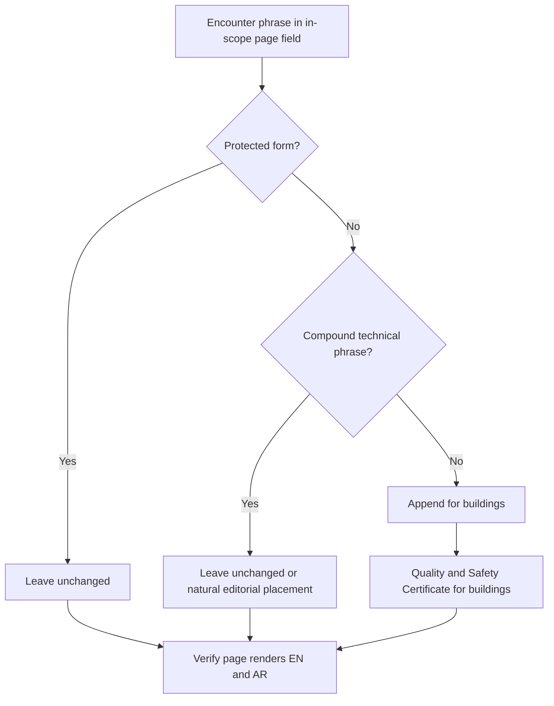
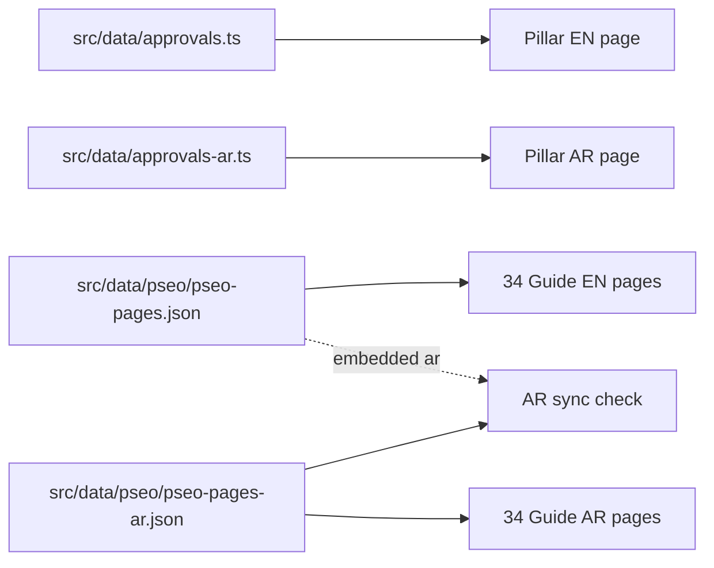

# Law 3 of 2026 Cluster — "Quality and Safety Certificate for buildings" Phrase Update

**Status:** Update plan for an ALREADY-COMPLETED build (do NOT rebuild; do NOT modify the original build plan)
**Parent plan:** `plans/law-3-2026-content-cluster-plan.md`
**Date:** 2026-08-12
**Mode rule:** DATA-ONLY edits. No `.tsx`/`.ts` component, style, theme, or layout changes. No changes to any page outside this cluster.

---

## 1. Objective

Add the phrase **"for buildings"** to every viewer-facing occurrence of **"Quality and Safety Certificate"** within the 35 pages of the Law 3 of 2026 cluster (1 pillar + 34 guides, English + Arabic), so viewers and search engines always see **"Quality and Safety Certificate for buildings"**.

- **English:** `Quality and Safety Certificate` → `Quality and Safety Certificate for buildings`
- **Arabic:** `شهادة الجودة والسلامة` → `شهادة الجودة والسلامة للمباني`

Scope is **strictly limited** to the pages built from `plans/law-3-2026-content-cluster-plan.md`. No other approvals, guides, services, or static pages are touched.

---

## 2. Cluster Page Inventory (35 pages — the ONLY pages in scope)

### Pillar (2 pages, 2 data entries)
| # | Slug | EN Data File | AR Data File |
|---|---|---|---|
| P | `dubai-building-quality-safety-certificate` | `src/data/approvals.ts` | `src/data/approvals-ar.ts` |

### Guides (34 pages, 68 data entries — 34 EN entries + 34 AR entries)
All guides live in `src/data/pseo/pseo-pages.json` (EN entry + embedded `ar` sub-object) and `src/data/pseo/pseo-pages-ar.json` (separate AR entry), identified by `parentApprovalSlug: "dubai-building-quality-safety-certificate"`.

| # | Guide Slug |
|---|---|
| 1 | `who-needs-quality-safety-certificate-dubai` |
| 2 | `how-to-get-building-safety-certificate-dubai` |
| 3 | `building-safety-certificate-cost-dubai` |
| 4 | `what-happens-if-you-dont-get-safety-certificate` |
| 5 | `law-3-2026-penalties-fines-guide` |
| 6 | `law-3-2026-compliance-deadline-guide` |
| 7 | `dubai-law-3-2026-complete-guide` |
| 8 | `why-dubai-introduced-building-safety-law-2026` |
| 9 | `law-3-2026-key-changes-explained` |
| 10 | `quality-safety-certificate-validity-renewal` |
| 11 | `building-safety-certificate-compliance-checklist` |
| 12 | `documents-required-quality-safety-certificate` |
| 13 | `building-inspection-process-law-3-2026` |
| 14 | `law-3-2026-free-zone-buildings-guide` |
| 15 | `jointly-owned-property-owners-safety-certificate` |
| 16 | `building-maintenance-obligations-law-3-2026` |
| 17 | `how-to-choose-licensed-engineering-office-dubai` |
| 18 | `law-3-2026-appeal-process-guide` |
| 19 | `repeat-violation-penalties-law-3-2026` |
| 20 | `building-permit-suspension-law-3-2026` |
| 21 | `contractor-responsibilities-law-3-2026` |
| 22 | `building-management-obligations-law-3-2026` |
| 23 | `landlord-obligations-building-safety-law-2026` |
| 24 | `tenant-rights-demolition-law-3-2026` |
| 25 | `mep-systems-law-3-2026-compliance` |
| 26 | `property-investors-law-3-2026-impact` |
| 27 | `buying-property-without-safety-certificate-dubai` |
| 28 | `dubai-municipality-digital-building-portal` |
| 29 | `old-vs-new-building-safety-regulations-dubai` |
| 30 | `law-3-2026-faq` |
| 31 | `quality-safety-certificate-vs-completion-certificate-dubai` |
| 32 | `dubai-building-safety-law-tenant-guide` |
| 33 | `buildings-over-40-years-safety-certificate` |
| 34 | `engineering-office-responsibilities-law-3-2026` |

> Note: Slugs 2, 3, 11, 33 use the phrase **"building safety certificate"** (already contains "building"). Their **titles are protected** (see Rule P3) but their body text / FAQ / direct-answer fields must still be checked for standalone "Quality and Safety Certificate" occurrences.

---

## 3. Edit Surface (data files only — NO code)

| File | What to edit |
|---|---|
| `src/data/approvals.ts` | Pillar EN entry (slug `dubai-building-quality-safety-certificate`) |
| `src/data/approvals-ar.ts` | Pillar AR entry (same slug) |
| `src/data/pseo/pseo-pages.json` | 34 guide EN entries **and** their embedded `ar` sub-objects |
| `src/data/pseo/pseo-pages-ar.json` | 34 separate AR entries (must stay in sync with embedded `ar`) |
| `scripts/pseo/queue.json` | OPTIONAL consistency only (seed data, status `done`, not rendered) — update only the cluster items' title/keyword fields |

**CRITICAL SYNC RULE:** For every guide, the embedded `ar` sub-object inside `pseo-pages.json` and the corresponding entry in `pseo-pages-ar.json` MUST contain identical Arabic text after the edit. AR pages render from `pseo-pages-ar.json` (via `getPseoArabicEntry()`), so an unsynced embedded copy will surface in `PseoResourceHub` gating.

---

## 4. English Transformation Rules

### RULE 1 — Core substitution
Replace the standalone noun phrase **"Quality and Safety Certificate"** with **"Quality and Safety Certificate for buildings"** in ALL viewer-facing fields of the 35 in-scope pages:

- `title` (renders as H1)
- `metaTitle` and `metaDescription`
- `primaryKeyword` and `secondaryKeywords`
- `directAnswer`
- section `heading` / paragraph / quote / list text
- `faqs[].question` and `faqs[].answer`
- `image.alt` / `image.caption`
- pillar `shortName` (drives section H2s "What is {shortName}?" / "Who Needs {shortName}?" and the FAQ title)

### RULE 2 — Ampersand variant
Where the meta title uses the ampersand form **"Quality & Safety Certificate"**, apply the same rule: → **"Quality & Safety Certificate for buildings"**.

### RULE 3 — Protected forms (NEVER change)
| Protected string | Reason |
|---|---|
| `Dubai Building Quality and Safety Certificate` | Official pillar name (`name` field) — already implies buildings |
| `Quality and Safety of Buildings` | Law title (Law No. 3 of 2026) |
| `building safety certificate` / `Building Safety Certificate` | Already contains "building" — appending "for buildings" is redundant and grammatically wrong |
| `Law No. 3 of 2026` / `Law 3 of 2026` | Legal reference, unchanged |
| `Quality and Safety Certificate Technical Report` | Official document name — compound technical phrase, protect |
| `Quality and Safety Certificate application` / `process` / `fees` / `requirements` / `validity` / `checklist` / `service` | Compound technical phrases — appending "for buildings" after the noun breaks grammar |

### RULE 4 — Compound technical phrases
For compound phrases (Rule 3 last row), **leave intact** by default. If an occurrence reads naturally with "for buildings" placed before the descriptor noun, use editorial judgment (e.g., a sentence like *"submit the application for the Quality and Safety Certificate for buildings"* is acceptable; *"Quality and Safety Certificate for buildings application"* is not). When in doubt, protect (leave unchanged).

### RULE 5 — Internal-link anchor text sync
The pillar `description` field contains bracketed anchor phrases such as `[who needs a Quality and Safety Certificate in Dubai]`. These anchors must be updated to match the new guide H1s:
- `[who needs a Quality and Safety Certificate in Dubai]` → `[who needs a Quality and Safety Certificate for buildings in Dubai]`
- `[what a Quality and Safety Certificate costs in Dubai]` → `[what a Quality and Safety Certificate for buildings costs in Dubai]`
- Check all other bracketed anchors in the pillar entry and any in-scope guide entries for the same rule.

### RULE 6 — Pillar meta-title side effect (KNOWN & ACCEPTED)
The pillar has **no `metaTitle` field**; the code derives it as `` `${approval.primaryKeyword} | Wasleen Approvals` `` and truncates to 60 chars (`src/app/approvals/[slug]/page.tsx:59`). Changing `primaryKeyword` to `Dubai Quality and Safety Certificate for buildings` yields:
- H1: `Dubai Quality and Safety Certificate for buildings` ✅ (user's goal)
- Meta title: `Dubai Quality and Safety Certificate for buildings | Wasleen` (truncated brand suffix — accepted; no code changes allowed)

Do NOT add a `metaTitle` field or change code. Accept the truncation; the key phrase is fully visible in the first 51 chars.

---

## 5. Arabic Transformation Rules

### RULE A1 — Core substitution
Replace standalone **`شهادة الجودة والسلامة`** → **`شهادة الجودة والسلامة للمباني`** in the same field set as RULE 1 (title, metaTitle, metaDescription, keywords, directAnswer, section headings/paragraphs/lists, FAQs, image alt/caption, pillar `ar.shortName`).

### RULE A2 — Already-correct forms (NEVER change)
- **`شهادة جودة وسلامة المباني`** — already means "Quality and Safety Certificate of Buildings" (do NOT double-append)
- **`شهادة سلامة المباني`** — already means "Building Safety Certificate"
- The pillar AR `name` field `شهادة جودة وسلامة المباني في دبي (القانون رقم (3) لسنة 2026)` — already correct, leave unchanged

### RULE A3 — Pillar AR keywords
- `ar.shortName: 'شهادة الجودة والسلامة'` → `'شهادة الجودة والسلامة للمباني'`
- `ar.primaryKeyword: 'شهادة الجودة والسلامة دبي'` → `'شهادة الجودة والسلامة للمباني دبي'` (or natural Arabic keyword order `'شهادة الجودة والسلامة للمباني في دبي'` if the implementer judges it reads better — keep the exact phrase `شهادة الجودة والسلامة للمباني` intact)

---

## 6. Decision Flow

---

## 7. Execution — One Page at a Time

**GOLDEN RULE:** Complete and verify ONE page before starting the next. Do not batch-edit multiple pages in parallel. Do not switch tasks.

For each page, in order:
1. Read the full EN entry in the source data file.
2. Read the matching AR entry (embedded `ar` + `pseo-pages-ar.json`).
3. Apply the EN rules (§4) and AR rules (§5) — field by field, occurrence by occurrence.
4. Verify the page renders correctly in BOTH `/guides/{slug}` (or `/approvals/{slug}`) and `/ar/guides/{slug}` (or `/ar/approvals/{slug}`).
5. Tick the page off the checklist in §2. Then proceed to the next page.

### Execution order (35 steps, strictly sequential)
1. Pillar EN (`src/data/approvals.ts`)
2. Pillar AR (`src/data/approvals-ar.ts`)
3. Guide 1 → Guide 34, one at a time (each = EN + embedded AR + `pseo-pages-ar.json`)

---

## 8. Verification Checklist (after all pages)

- [ ] `npm run build` completes with no TypeScript / Next.js errors
- [ ] `search_files` on `src/data/pseo/*.json` for `Quality and Safety Certificate` (and `Quality & Safety Certificate`) returns NO remaining unprotected occurrences in cluster entries
- [ ] `search_files` on the two approval data files returns NO remaining unprotected occurrences
- [ ] No occurrence of `Quality and Safety Certificate` remains in **protected forms** (Rules P3) — i.e., protected strings were not altered
- [ ] Arabic `شهادة الجودة والسلامة` has no remaining standalone occurrences outside already-correct `المباني` forms
- [ ] Embedded `ar` sub-object in `pseo-pages.json` matches `pseo-pages-ar.json` for every guide (spot-check ≥ 3)
- [ ] Pillar H1 = `Dubai Quality and Safety Certificate for buildings`; section H2s read `What is Quality and Safety Certificate for buildings?` / `Who Needs Quality and Safety Certificate for buildings?`
- [ ] Pillar meta title = `Dubai Quality and Safety Certificate for buildings | Wasleen` (60-char truncation accepted)
- [ ] Sample spot-checks: `who-needs-quality-safety-certificate-dubai`, `documents-required-quality-safety-certificate`, `quality-safety-certificate-validity-renewal`, `dubai-law-3-2026-complete-guide` — EN + AR render correctly
- [ ] No other approvals / guides / services / static pages were modified (confirm via git diff scope)
- [ ] `queue.json` consistency updated (optional) — cluster items only

---

## 9. Out of Scope (do NOT touch)

- All other approval pages (52), guides outside this cluster, services, hub pages, static pages
- Header / Footer / layouts / components / styles / themes
- `src/lib/*`, `src/components/*`, `src/app/*` (code)
- Design tokens, favicons, logo components
- `lastVerified`, schema dates, or any content outside the cluster entries
