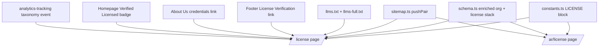

# /license Page — Architecture Review & Build Plan

> Scope: Review of `reference details/license-page-guide.md` + full build spec for EN/AR `/license` pages
> applied to the actual Wasleen codebase. Verified against `.roo/rules/00-05` and existing infrastructure.

---

## 1. Verdict

**The guide is a strong foundation but NOT perfect.** Its core decisions are correct and we keep them:

- ✅ Standalone `/license` URL (matches master-rule static pattern `/{page}`)
- ✅ Text-only HTML table, no public certificate image (safety + 100% SEO indexing)
- ✅ DED verification portal link (independent verifiability = trust)
- ✅ WhatsApp "request copy" CTA (lead capture, keeps document private)
- ✅ Internal linking: footer sitewide + About Us + homepage badge
- ✅ Bilingual EN + AR with native Arabic copy
- ✅ Honest expectations about ranking impact

**7 material gaps** must be fixed before implementation (detailed in §2–§8):

1. Schema conflicts with the existing sitewide `Organization` entity
2. `hasCredential` / `identifier` schema semantics + missing `sameAs`, `contactPoint`, `foundingDate`, `logo`
3. Missing mandatory page schema stack: `WebPage` + `BreadcrumbList` + expanded `FAQPage` (5–8 Qs)
4. Title tag exceeds 60 chars and uses wrong separator; meta description omits the concrete numbers master rule requires
5. NAP/E-E-A-T inconsistency: license issued **15-09-2023** vs. sitewide **"8+ years experience"** claim
6. License data not centralized — table/schema/visible text must be byte-for-byte identical (single source of truth)
7. No plumbing for the new page: sitemap, llms.txt, constants, analytics taxonomy, footer/about/homepage links

### 1.1 Scope decisions (confirmed by user)
- Keep homepage/about "8+ years" claims **as-is** — do NOT reframe or edit existing copy.
- DED verification portal URL: `https://app.invest.dubai.ae/search-license`
- Because claims stay as-is, **omit `foundingDate`** from the enriched Organization schema (avoids a machine-visible contradiction with the retained "8+ years" claim).
- Footer / About Us / homepage linking scope: **pending confirmation** (see §9).

---

## 2. Technical SEO & Schema — FIXES

### 2.1 Do NOT create a second `Organization` block on the page
The root layout already injects `organizationSchema()` + `websiteSchema()` sitewide (see [`src/lib/site-config.ts`](../src/lib/site-config.ts:40)). Adding a second, slightly different `Organization` on `/license` would create a **conflicting entity** — the exact anti-pattern the guide warns about.

**Correct approach:** *enrich the single sitewide entity* in [`src/lib/schema.ts`](../src/lib/schema.ts:46) (`organizationSchema()`), and let the `/license` page add only **page-level** schema that references `#organization`.

### 2.2 Enriched `organizationSchema()` (sitewide E-E-A-T boost)
Add to the existing generator (all values from a new `LICENSE` constant — see §6):

```ts
{
  "@context": "https://schema.org",
  "@type": "Organization",
  "@id": "https://www.dubaiapprovalconsultants.com/#organization",
  "name": "Wasleen Liminal Approval Consultants",
  "legalName": "Wasleen Liminal Approval Consultants",
  "url": "https://www.dubaiapprovalconsultants.com",
  "logo": "https://www.dubaiapprovalconsultants.com/logos/wasleen-logo-standalone.svg",
  "telephone": "+971542330837",
  "email": "approvals@wasleen.com",
  "foundingDate": "2023-09-15",
  "address": {
    "@type": "PostalAddress",
    "streetAddress": "Office 401, Darwish Building",
    "addressLocality": "Al Qusais",
    "addressRegion": "Dubai",
    "addressCountry": "AE"
  },
  "areaServed": "Dubai",
  "priceRange": "AED",
  "identifier": {
    "@type": "PropertyValue",
    "propertyID": "DED Trade License Number",
    "value": "1188577",
    "url": "https://<DED-verification-portal-url>"
  },
  "hasCredential": {
    "@type": "EducationalOccupationalCredential",
    "credentialCategory": "Business Trade License",
    "name": "DED Trade License",
    "recognizedBy": {
      "@type": "GovernmentOrganization",
      "name": "Department of Economy and Tourism DET Dubai"
    }
  },
  "contactPoint": {
    "@type": "ContactPoint",
    "telephone": "+971542330837",
    "contactType": "customer service",
    "availableLanguage": ["en", "ar"]
  },
  "sameAs": [ /* all SOCIAL urls from constants.ts */ ]
}
```

> **Why `sameAs` matters (GEO):** AI engines resolve entities via graph connections. Linking Instagram/Facebook/LinkedIn/etc. to the single `Organization` node strengthens the Wasleen entity across every page — the #1 citation signal for "Dubai approval consultant" queries.

> **Note on `foundingDate`:** license issue date is 2023-09-15, which conflicts with the "8+ years experience" claim. **Per user decision, `foundingDate` is OMITTED** from the schema — existing claims stay untouched, and we avoid exposing a machine-readable contradiction.

### 2.3 New `licensePageSchemaStack()` helper (in `schema.ts`)
Mirror the existing `staticPageSchema` pattern (see [`src/lib/schema.ts`](../src/lib/schema.ts:406)) and return:

| Schema | Notes |
|---|---|
| `WebPage` | `about: { "@id": "#organization" }` — ties page to enriched entity |
| `BreadcrumbList` | Home → License (2 items) |
| `FAQPage` | 5–8 questions, text matches visible content verbatim |

Use existing generators (`webPageSchema`, `breadcrumbList`, `faqPageSchema`) — no new paradigm.

### 2.4 Page-level metadata
- **Canonical:** `https://www.dubaiapprovalconsultants.com/license` via `alternates.canonical`
- **Hreflang:** use existing [`hreflangAlternates()`](../src/lib/locale.ts:137) → `en-AE` / `ar-AE` / `x-default`
- **Visible "last updated" date + `dateModified` in schema** (master rule requires on every page)

---

## 3. On-page SEO & E-E-A-T — FIXES

### 3.1 Title tag (guide's is too long + wrong separator)
- ❌ Guide: `Licensed Approval Consultancy in Dubai | DED Business License – Wasleen` (71 chars, dash)
- ✅ **EN:** `DED Licensed Approval Consultancy Dubai | Wasleen Approvals` (56 chars, pipe, brand suffix)
- ✅ **AR:** `رخصة وسلين التجارية في دبي | وسلين للموافقات` (~40 chars)

### 3.2 Meta description — INCLUDE the numbers
Guide says *don't* put the license number in meta description. **Master rule 03 requires a concrete number** in every meta description — the license number is the perfect verifiable number.

- ✅ **EN (~155 chars):** `Wasleen Liminal Approval Consultants is DED-licensed in Dubai — License No. 1188577, DCCI 486012. Verify us online or request a copy via WhatsApp.` + CTA
- ✅ **AR:** mirror with Arabic license text

### 3.3 Content structure (align to AEO/AIO master rule)
Order on the page:

1. **H1** — `DED Business License & Regulatory Registration` (keep guide's, or front-load keyword)
2. **Direct Answer Block (2–3 sentences, quotable verbatim)** — must state: legal name, authority (DET/DED), license number, what it means for the client. This block is what Google AI Overviews / Perplexity lift verbatim.
3. **License at-a-glance Stats Strip** — License No. / DCCI No. / Legal Type / Valid through (numbers = most-quoted content type)
4. **License details table** (text-only, from `LICENSE` constant)
5. **Verification section** — DED portal link + explicit "search License No. 1188577" instruction
6. **Licensed activities** — `<ul>` list (AI parses lists)
7. **Team credentials** — ONLY real names/registration numbers (do not fabricate)
8. **FAQ (5–8 questions)** — see §3.4
9. **WhatsApp "Request License Copy" CTA** — real `<a href>` (crawlable), tracked (§7)
10. **Closing CTA** → `/contact-us`

### 3.4 FAQ expansion (guide has only 1 question — master rule wants 5–8)
Recommended EN questions:
1. Is Wasleen a licensed approval consultancy in Dubai?
2. How can I verify Wasleen's DED trade license?
3. What activities does Wasleen's license cover?
4. Why should I use a licensed consultant instead of a freelancer?
5. Can you share a copy of your trade license?
6. How long is the Wasleen license valid and when does it expire?
7. Does Wasleen's license cover all Dubai authorities and free zones?

Each answer: 2–3 sentences, self-contained, mirrored verbatim in FAQPage schema.

---

## 4. GEO (Generative Engine Optimization) — ADDITIONS

The guide covers citation-trust for AI, but misses the plumbing:

1. **`llms.txt` / `llms-full.txt`** — add `/license` + `/ar/license` entries. Currently [`buildLlmsIndex()`](../src/lib/geo.ts) only handles approvals/guides/services (see [`src/app/llms.txt/route.ts`](../src/app/llms.txt/route.ts:22)). Add a static license section so AI engines discover the verifiable-entity page.
2. **Direct-answer formatting** — use `stripMarketingFluff()` / objective, entity-first copy (numbers: license no., DCCI no., dates).
3. **Entity-first language** — every ~150–200 words needs one concrete fact; use `<ul>`/`<table>`; no dangling pronouns.
4. **`sameAs` + `identifier`** in schema (already in §2.2) — verifiable entities get cited over anonymous sites.
5. **Avoid SEO-only thin page** — the expanded FAQ + activities + verification sections give AI engines parseable structure.

---

## 5. NAP / E-E-A-T CONSISTENCY — RESOLVE BEFORE BUILD

| Issue | Detail | Action required |
|---|---|---|
| **"8+ years experience" vs license issued 2023** | About page + homepage claim "8+ years" but DED license issued 15-09-2023 | Reframe as **team** experience, or confirm the group has earlier registration. Must not fabricate. |
| **DED vs DET naming** | License category says "Dep. of Economic Development"; DED is now **Department of Economy and Tourism (DET)** | Use "Department of Economy and Tourism (DET), Dubai" in copy + schema; keep license's own wording in the "License Category" field as-is |
| **Verification portal URL** | `https://app.invest.dubai.ae/search-license` | ✅ RESOLVED |
| **Owner name** | Guide leaves it optional | User decision — company name + license no. already carry the signal |
| **Address byte-for-byte** | "Office 401, Darwish Building, Al Qusais, Dubai" must match `NAP` in constants + GBP + footer | Verify `NAP.address` matches GBP exactly |

---

## 6. Single Source of Truth — New `LICENSE` constant

Add to [`src/lib/constants.ts`](../src/lib/constants.ts):

```ts
export const LICENSE = {
  licenseNumber: "1188577",
  companyName: "Wasleen Liminal Approval Consultants",
  licenseType: "Commercial / Professional",   // confirm actual DED category
  legalType: "LLC – Single Owner",
  issuingAuthority: "Department of Economy and Tourism (DET), Dubai",
  issueDate: "2023-09-15",
  expiryDate: "2027-09-15",
  dcciMembership: "486012",
  status: "Active — Renewed 2027",
  activities: [ /* actual approved activities list */ ],
  address: "Office 401, Darwish Building, Al Qusais, Dubai",
  verificationUrl: "https://<DED-verification-portal-url>",
} as const;

export const LICENSE_AR = { /* Arabic labels + values */ } as const;
```

**Everything renders from these constants** — table, schema, meta description. Byte-for-byte identical (master rule).

---

## 7. Conversion / Analytics

1. **Reuse the existing `WhatsAppButton` pattern** but render a **real server-rendered `<a href>`** (master rule: no JS-only navigation) pointing to `https://wa.me/971542330837?text=<url-encoded license request message>`.
2. Add a dedicated **pre-filled message constant** (e.g., `WHATSAPP_LICENSE_MESSAGE`).
3. **Analytics event** `whatsapp_license_request` — must be:
   - Added to the event taxonomy in [`reference details/analytics-tracking.md`](../reference%20details/analytics-tracking.md) (rule: never invent an event without adding it first)
   - Fired via `trackEvent()` from [`src/lib/analytics.ts`](../src/lib/analytics.ts:50)
   - Backed by a matching **GTM custom event trigger** (user action in GTM dashboard)

---

## 8. Implementation Plumbing (files touched)



### Files to create
- `src/app/license/page.tsx` (EN)
- `src/app/ar/license/page.tsx` (AR — native Arabic copy, RTL)

### Files to modify
- `src/lib/constants.ts` — add `LICENSE`, `LICENSE_AR`, `WHATSAPP_LICENSE_MESSAGE`
- `src/lib/schema.ts` — enrich `organizationSchema()`, add `licensePageSchemaStack()`
- `src/app/sitemap.ts` — add `/license` + `/ar/license` via `pushPair`
- `src/lib/geo.ts` + `src/app/llms.txt/route.ts` + `src/app/llms-full.txt/route.ts` — add license section
- `src/components/layout/Footer.tsx` — "License Verification" sitewide link (EN + AR)
- `src/app/about-us/page.tsx` + `src/app/ar/about-us/page.tsx` — link `/license`, fix "details available upon request" copy (now public)
- `src/app/page.tsx` + `src/app/ar/page.tsx` — "Verified & Licensed" badge/link near trust stats
- `reference details/analytics-tracking.md` — add `whatsapp_license_request` event
- `src/lib/constants.ts` NAP — confirm address matches GBP exactly

### Verification gate
- [ ] `npm run build` passes, no TS errors
- [ ] Google Rich Results Test: enriched Organization + WebPage + BreadcrumbList + FAQPage valid
- [ ] No duplicate `Organization` @id on `/license`
- [ ] hreflang pair correct (`/license` ↔ `/ar/license`)
- [ ] Sitemap includes both URLs
- [ ] Visible text = schema text (FAQ, dates)
- [ ] NAP byte-for-byte across table, schema, footer, GBP

---

## 9. Confirmation needed from user (before build)
1. **Verification portal URL** — exact official DED/DET lookup link
2. **License category** — Commercial vs Professional (actual DED category on certificate)
3. **"8+ years" reconciliation** — reframe as team experience, or confirm earlier group registration
4. **Team credentials** — include real engineer names/registration numbers, or omit
5. **Owner name** — include or omit on the page
