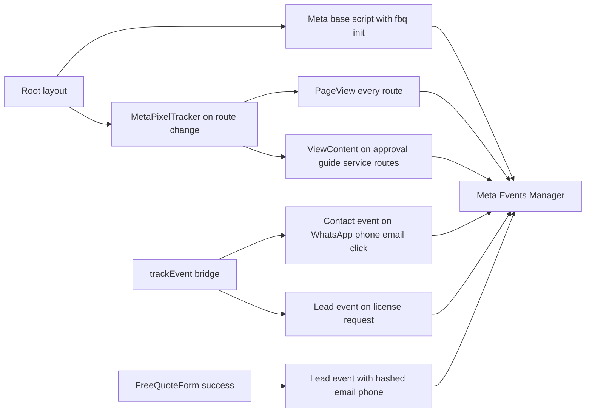

# Meta Pixel Implementation Plan

**Status:** Draft — pending approval
**Owner:** Wasleen Approvals (architect review)
**Goal:** Install Meta Pixel (ID `4406234089664940`) across the entire site to capture visitor behavior and conversion events for more accurate Facebook/Meta ads results.

---

## 1. Research summary — what Meta's docs require

Reviewed the Meta Pixel "Get Started" guidance. Key requirements applied here:

| Meta requirement | How we satisfy it |
|---|---|
| Base code loads on every page | `next/script` injected once in the **root layout** (covers EN + AR routes) |
| `fbq('init', PIXEL_ID)` | In the base code, id from `NEXT_PUBLIC_META_PIXEL_ID` |
| PageView fires on every page view | Dedicated `MetaPixelTracker` fires `fbq('track','PageView')` on **every route change**, including SPA navigation (Meta's documented SPA pattern) |
| `<noscript>` fallback for non-JS browsers | Plain `<noscript></noscript>` rendered in the root body |
| Use **standard events** for conversions | `PageView`, `ViewContent`, `Contact`, `Lead` |
| **Advanced Matching** for better attribution | Hashed email + phone passed as `em`/`ph` on the `Lead` event (Meta hashes automatically); this is a major accuracy booster |
| **Conversions API** for server-side signal | Documented as Phase 2 follow-up — requires a Meta access token from the user (see §7) |
| Event deduplication (`event_id`) | Noted for Phase 2 when CAPI is added |

### Important SPA decision (avoids double-firing)
The user-provided base snippet includes `fbq('track', 'PageView')` inline. Because Next.js App Router uses client-side navigation, our route-change tracker also fires PageView on the **first** mount. If the inline PageView were kept, the first page load would send **two** PageViews.

**Decision:** The base code we install contains only the loader + `fbq('init', ID)` (no inline PageView). `MetaPixelTracker` fires PageView on every route including the first — this matches Meta's own SPA documentation and guarantees exactly one PageView per page view.

---

## 2. Current analytics architecture (what we build on)

- **Stack:** Next.js 15.5 App Router, TypeScript, Tailwind v4. Deployed on Vercel.
- **Existing tracking:** GTM `GTM-P45BMK7J` + GA4 `G-SJF4WHM8QJ` via `next/script` in `src/app/layout.tsx` (EN) and `src/app/ar/layout.tsx` (AR).
- **Single funnel:** All GTM events go through `trackEvent()` in [`src/lib/analytics.ts`](../src/lib/analytics.ts:50).
- **Route tracking:** [`PageViewTracker.tsx`](../src/components/analytics/PageViewTracker.tsx:16) fires `page_view` on route changes.
- **`@next/third-parties`** is v15.5.22 and exports only `./google` — there is **no official `MetaPixel` component** in the 15.x line (that landed with Next 16). We therefore follow the existing inline `next/script` pattern already used for the GA4 init.
- **Root layout wraps everything**, including `/ar` routes. So the pixel base code + tracker must live **only** in `src/app/layout.tsx` (not the AR layout) to avoid double-firing on Arabic routes.

### Flagged pre-existing issue (out of scope, worth noting)
`PageViewTracker` is mounted in **both** the root layout and [`src/app/ar/layout.tsx`](../src/app/ar/layout.tsx:120), so `/ar` routes currently send **double** `page_view` events to GTM. Our Meta tracker avoids reproducing this by mounting once in the root layout only. Fixing the GTM duplicate is a separate task.

---

## 3. Event mapping (Meta standard events)

| Trigger | Meta event | Params | Source code |
|---|---|---|---|
| Every page view / route change | `PageView` | — | `MetaPixelTracker` |
| Content page (approvals/guides/services, EN+AR) | `ViewContent` | `content_name` = path, `content_type` = page type | `MetaPixelTracker` |
| WhatsApp click (any component) | `Contact` | `content_name = whatsapp` | Bridge in `trackEvent()` |
| Phone click | `Contact` | `content_name = phone` | Bridge in `trackEvent()` |
| Email click | `Contact` | `content_name = email` | Bridge in `trackEvent()` |
| License copy requested (WhatsApp) | `Lead` | `content_name = license_request` | Bridge in `trackEvent()` |
| Free quote form submitted successfully | `Lead` | `content_name` = service, `em` = hashed email, `ph` = hashed phone (Advanced Matching), `currency/content_category` | Direct call in `FreeQuoteForm` |

**Why a bridge in `trackEvent()`:** WhatsApp/phone/email clicks are fired from 7+ components via `trackEvent({ action: "contact_click", method: … })`. Adding the Meta forwarding inside [`trackEvent()`](../src/lib/analytics.ts:50) covers all of them with **zero component edits** and keeps one funnel. PII (email/phone) is **not** routed through GTM — `metaLead()` is called directly in `FreeQuoteForm` so sensitive data never enters the dataLayer.

---

## 4. Mermaid — event flow

---

## 5. Files

### New files
| File | Purpose |
|---|---|
| `src/lib/meta-pixel.ts` | `fbq` type declarations, `META_PIXEL_ID`, helpers `metaPageView()`, `metaViewContent()`, `metaContact()`, `metaLead()`, `metaEvent()`. Mirror of `lib/analytics.ts`. |
| `src/components/analytics/MetaPixelTracker.tsx` | Client component. Fires `PageView` on every route change; fires `ViewContent` when the route is `/approvals/`, `/guides/`, `/services/` or Arabic equivalents. Mounted **once** in the root layout inside `<Suspense>`. |

### Modified files
| File | Change |
|---|---|
| `.env.local` | Add `NEXT_PUBLIC_META_PIXEL_ID=4406234089664940` |
| `.env.example` | Add `NEXT_PUBLIC_META_PIXEL_ID=` (placeholder) |
| `src/lib/constants.ts` | Add `META_PIXEL_ID = process.env.NEXT_PUBLIC_META_PIXEL_ID || ""` |
| `src/lib/site-config.ts` | Add `metaPixelId` to `SiteConfig` + return value (consistent with `gtmId`/`gaId` single-source pattern) |
| `src/app/layout.tsx` | Add Meta base script (loader + `fbq('init')`) via `next/script`, `<noscript>` fallback image, mount `<MetaPixelTracker />` in Suspense |
| `src/lib/analytics.ts` | Add Meta bridge inside `trackEvent()` for `contact_click` (method whatsapp/phone/email) and `whatsapp_license_request` |
| `src/components/sections/FreeQuoteForm.tsx` | In the `quote_submit_success` path, call `metaLead({ email, phone, service, locale })` for Advanced Matching |
| `reference details/analytics-tracking.md` | Add a **Meta Pixel** section documenting the event mapping (honors the "never invent an event without documenting it" rule) |

### Deliberately NOT modified
- `src/app/ar/layout.tsx` — root layout already covers `/ar`; adding here would double-fire.
- `@next/third-parties` — no Meta export in v15; no dependency upgrades needed.
- Any component that calls `trackEvent()` — handled centrally via the bridge.

---

## 6. Step-by-step tasks

1. Add `NEXT_PUBLIC_META_PIXEL_ID=4406234089664940` to `.env.local` and `.env.example`.
2. Add `META_PIXEL_ID` constant to `src/lib/constants.ts`; add `metaPixelId` to `SiteConfig` in `src/lib/site-config.ts`.
3. Create `src/lib/meta-pixel.ts` (fbq typing + `META_PIXEL_ID` + `metaPageView`, `metaViewContent`, `metaContact`, `metaLead`, `metaEvent`).
4. Create `src/components/analytics/MetaPixelTracker.tsx` (PageView on every route + ViewContent on content routes).
5. In `src/app/layout.tsx`: add the base script (loader + `fbq('init', META_PIXEL_ID)`, **no** inline PageView), the `<noscript>` fallback image, and mount `<MetaPixelTracker />` inside `<Suspense>`.
6. In `src/lib/analytics.ts`: extend `trackEvent()` to forward `contact_click` → `metaContact({ method })` and `whatsapp_license_request` → `metaLead({ content_name: 'license_request' })`.
7. In `src/components/sections/FreeQuoteForm.tsx`: call `metaLead({ email, phone, service, locale })` on `quote_submit_success` (PII stays out of GTM).
8. Update `reference details/analytics-tracking.md` with the Meta event mapping table + architecture note.
9. Verify (see checklist below).

---

## 7. Phase 2 follow-ups (recommended, not in this task)

1. **Conversions API (CAPI)** — the biggest accuracy booster Meta recommends. Requires:
   - Meta **access token** (from Meta Business Manager / System User) — not yet provided.
   - A server-side call to `https://graph.facebook.com/v21.0/{PIXEL_ID}/events` from a Next.js API route or the Apps Script webhook.
   - `event_id` on both pixel + CAPI events for deduplication.
   - Do **not** ship this until the user supplies Meta credentials.
2. **Privacy policy disclosure** — add a short "Meta Pixel / Advertising" note to the privacy policy page (`src/data/privacy.ts` + Arabic) describing what Meta Pixel collects. Recommended before go-live.
3. **Consent banner (optional)** — only required if Meta ads later target EU/EEA; UAE-only targeting does not require it. Not in scope now.
4. **Separate bug fix** — deduplicate the existing GTM `page_view` double-fire on `/ar` routes (root + AR layouts both mount `PageViewTracker`).

---

## 8. Verification checklist

- [ ] `npm run build` completes with no TS/lint errors.
- [ ] Meta Pixel Helper browser extension detects the pixel on EN and AR pages.
- [ ] Meta Events Manager → **Test Events** shows:
  - `PageView` on initial load and on every SPA route change (exactly one per page).
  - `ViewContent` on `/approvals/*`, `/guides/*`, `/services/*` (EN + AR).
  - `Contact` on WhatsApp / phone / email clicks (including floating button, hero, CTA sections).
  - `Lead` with `em` + `ph` params after a successful free-quote submission (EN + AR).
- [ ] No duplicate PageView on first load (base code has no inline PageView).
- [ ] No double events on `/ar` routes (tracker mounted only in root layout).
- [ ] `<noscript>` fallback image present in the DOM.
- [ ] Network tab shows `fbevents.js` loaded and `tr` requests firing.
- [ ] PageSpeed/Lighthouse re-checked (pixel is small and deferred like GTM; confirm no LCP regression).
