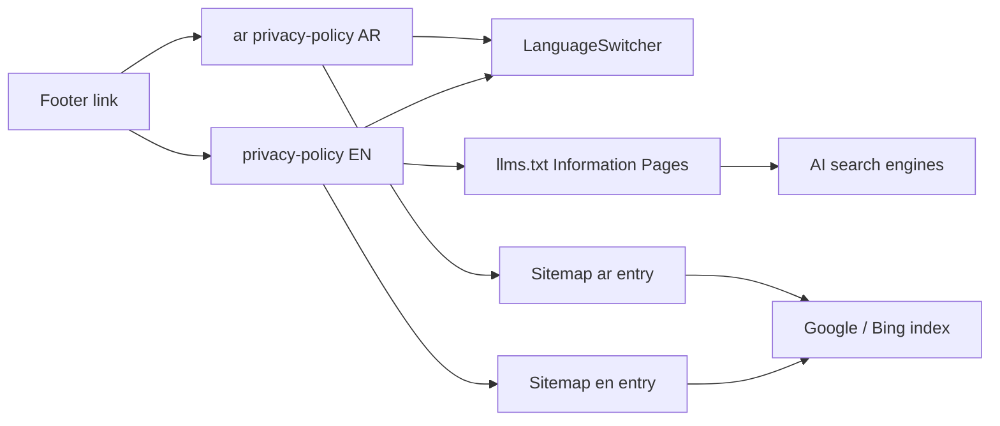

# /privacy-policy Pages — World-Class Build Plan (EN + AR)

> **Scope:** Create a professional, trust-grade Privacy Policy page at `/privacy-policy` (English) and `/ar/privacy-policy` (Arabic), with a **category sidebar**, full policy content, **no-third-party-sharing** commitment, and full Technical SEO + GEO (AEO/AIO) treatment. Add the page to the Footer and sitemap.
>
> **Hard constraint:** Do NOT modify any existing page content, components, styles, structure, or design tokens. Only NEW files are created, plus 3 surgical additions to existing infrastructure (Footer link, sitemap entry, llms.txt entry) — each explicitly requested by the user.
>
> **Verified against:** `.roo/rules/00–05`, current codebase (`Footer.tsx`, `schema.ts`, `sitemap.ts`, `geo.ts`, `locale.ts`, `globals.css`, `ar/layout.tsx`, `about-us`, `contact-us`, `license` pages).

---

## 1. Verdict & Approach

The site already has a strong trust-page pattern from the `/license` page (direct-answer block → stats strip → tables → FAQ → WhatsApp/contact CTA, with `licensePageSchemaStack`). The privacy policy reuses that exact DNA but adds one new element: a **sticky category sidebar** (table of contents) for a long legal document — the industry-standard "world-class" layout (Apple, Stripe, AWS, Stripe-style legal pages).

### 1.1 Scope decisions (confirmed by user)
- URL pattern: `/privacy-policy` (EN) + `/ar/privacy-policy` (AR) — matches master-rule static pattern `/{page}`.
- **No third-party sharing** is the company's standing policy → made the **pillar section** of the page, stated early, repeated in FAQ + schema.
- Approvals consultancy inherently requires submitting client documents **to government authorities** (DM, DEWA, DCD, DDA, etc.) to deliver the service. The policy states this explicitly as "authorized disclosure to the authorities necessary to provide the requested service" — **not** third-party marketing sharing. This keeps the policy legally accurate while honoring the user's "we do not share to third parties" rule.
- Arabic version is **contextual, native copy** (same 16-section structure for hreflang/schema parity, NOT word-for-word translation) — written for Arabic SEO keywords.
- Existing `AR.footer.privacy` ("سياسة الخصوصية") and `AR.footer.terms` constants already exist — the footer link reuses them. **No new constant needed.**
- `dateModified` = `2026-08-02` (current date). Visible date matches schema `dateModified` exactly.

### 1.2 What we WILL touch (3 existing files, surgical only)
| File | Change | Why |
|---|---|---|
| `src/components/layout/Footer.tsx` | Add one Privacy Policy link to `FooterContactColumn` (Company & Contact) | User requested footer inclusion |
| `src/app/sitemap.ts` | Add `pushPair("/privacy-policy", "/ar/privacy-policy", …)` in the static section | Required for indexing |
| `src/lib/geo.ts` | Add 1 line to `buildLlmsIndex()` "Information Pages" section | GEO discovery for AI engines |

**Everything else is a NEW file** (types, data, components, pages, one schema helper).

### 1.3 What we will NOT touch
- No existing page content (`about-us`, `contact-us`, `license`, hubs, approvals, guides, services).
- No `Header`, `MegaMenu`, `MobileNav`, `LanguageSwitcher` (it auto-handles `/privacy-policy` ↔ `/ar/privacy-policy` — verified).
- No `globals.css`, no design tokens, no `tailwind` config, no `constants.ts` (only reads existing constants).
- No `robots.ts` (all paths already allowed), no `middleware.ts` (trailing-slash logic already handles `/ar/...`).
- No new dependencies. No `framer-motion`, no icon lib beyond existing `lucide-react`.

---

## 2. URL & Routing Architecture

```
EN:  https://www.dubaiapprovalconsultants.com/privacy-policy
AR:  https://www.dubaiapprovalconsultants.com/ar/privacy-policy
```

- `/ar/privacy-policy` lives under the existing `src/app/ar/layout.tsx` (Arabic layout, `dir="rtl"`, Arabic Header/Footer, Arabic sitewide Organization/WebSite schema). **No layout change required.**
- `LanguageSwitcher` maps `/privacy-policy` ↔ `/ar/privacy-policy` automatically (path-agnostic, verified in [`locale.ts`](../src/components/layout/LanguageSwitcher.tsx:28)).
- Hreflang via existing [`hreflangAlternates()`](../src/lib/locale.ts:137): `en-AE`, `ar-AE`, `x-default` (→ EN).



---

## 3. File Map (all NEW unless noted)

| # | File | Type | Purpose |
|---|---|---|---|
| 1 | `src/types/privacy.ts` | NEW | `PrivacySection`, `PrivacyTable`, `PrivacyContent`, FAQ reuse |
| 2 | `src/data/privacy.ts` | NEW | Full EN policy content: 16 sections, stats, tables, 8 FAQ |
| 3 | `src/data/privacy-ar.ts` | NEW | Contextual AR policy content (same structure, native copy) |
| 4 | `src/lib/schema.ts` | EDIT (add helper) | `privacyPageSchemaStack()` — `PrivacyPolicy` + `BreadcrumbList` + `FAQPage` |
| 5 | `src/components/privacy/PrivacySidebar.tsx` | NEW (client) | Sticky scrollspy category sidebar, RTL-aware |
| 6 | `src/components/privacy/PrivacyPolicyPage.tsx` | NEW (server) | Shared layout: hero, sidebar + content grid, stats, tables, FAQ, CTA |
| 7 | `src/app/privacy-policy/page.tsx` | NEW | EN page (metadata + schema + shared layout) |
| 8 | `src/app/ar/privacy-policy/page.tsx` | NEW | AR page (metadata + schema + shared layout) |
| 9 | `src/components/layout/Footer.tsx` | EDIT | +1 Privacy Policy link in `FooterContactColumn` |
| 10 | `src/app/sitemap.ts` | EDIT | +1 `pushPair` for privacy-policy |
| 11 | `src/lib/geo.ts` | EDIT | +1 Privacy Policy line in `buildLlmsIndex` Information Pages |

---

## 4. Content Architecture — EN (16 sections, sidebar categories)

World-class legal layout. Each section is an `<article>`/`<section>` with `id` matching a sidebar anchor. Every ~150–200 words carries a quotable fact; tables for data-dense content (AI/GEO rule).

### Sidebar categories (TOC) — sidebar "menus or categories"
1. Introduction & Our Commitment
2. Who We Are
3. Information We Collect
4. How We Collect Information
5. How We Use Your Information
6. No Third-Party Sharing Policy ★ pillar
7. Sharing With Government Authorities
8. Cookies, Analytics & Automated Data
9. Data Security & Storage
10. Data Retention
11. Your Rights Under UAE PDPL
12. Children's Privacy
13. Third-Party Links
14. Changes to This Policy
15. Contact Us & Data Protection Officer
16. Consent & How to Withdraw

### Page hero (H1 + direct-answer block — GEO/AEO)
- **H1:** `Privacy Policy` — front-loads the exact keyword.
- **Direct Answer Block** (2–3 sentences, self-contained, liftable verbatim by Google AI Overviews / Perplexity):

> "Wasleen Liminal Approval Consultants is committed to protecting your personal data. We collect only the information needed to deliver Dubai approval services, process it 100% in-house, and never sell, rent, or share your data with any third party. Your data is handled under the UAE Federal Decree-Law No. 45 of 2021 on Personal Data Protection (PDPL)."

### Stats Strip (numbers = most-quoted by AI)
| Stat | Value |
|---|---|
| Third parties we share data with | **0** |
| In-house processing | **100%** |
| Data-request response time | **24h** |
| UAE data-protection law | **PDPL No. 45 / 2021** |

### Mandatory data tables
- **Table A — Information We Collect** (columns: Data Category / Examples / Purpose / Retention)
- **Table B — How We Use It / Legal Basis** (columns: Purpose / Data Used / Legal Basis)
- Both with the standard project **disclaimer line** beneath ("Regulations may change…").

### Section 6 ★ — No Third-Party Sharing Policy (pillar)
Must state plainly, in a highlighted callout card (`bg-card-bg`, `border-brand-blue`):
- Wasleen **never** sells, rents, trades, leases, or shares personal information with any third party for marketing, advertising, or any commercial purpose.
- Data is used **only within our own internal processes** to deliver the requested service.
- The only disclosures are: (a) to the government/regulatory authorities required to deliver the approval service — always with the client's authorization and only the minimum documents needed; (b) where disclosure is mandated by UAE law or a court order.
- No data brokers. No affiliate marketing. No external analytics vendors beyond Google Analytics/Tag Manager (aggregated, pseudonymous).

### FAQ Block (8 Qs — mirrored verbatim in FAQPage schema)
1. Does Wasleen Approvals share my personal information with third parties?
2. What personal information does Wasleen collect?
3. Which government authorities see my documents, and why?
4. How does Wasleen protect my personal data?
5. What are my data protection rights under UAE PDPL?
6. How long does Wasleen retain my personal data?
7. How can I request access to, correction, or deletion of my data?
8. How can I contact Wasleen's data protection team?

### Contact CTA
Real `<a href>` links: phone `tel:+971542330837`, WhatsApp `wa.me`, email `mailto:approvals@wasleen.com`, and a CTA to `/contact-us`. NAP byte-for-byte from `NAP` constant (footer + GBP consistency rule).

### Internal links (master rule §3)
- Footer → `/privacy-policy` (sitewide, required).
- Privacy page → `/contact-us`, `/about-us`, `/license` (trust cluster).
- Anchor text always descriptive (e.g., "Contact Wasleen Approvals").

### External authority links (E-E-A-T / trust)
- UAE PDPL reference — official UAE portal (`https://u.ae`) as authoritative outbound link (not competitors).
- DET license verification (reuse `LICENSE.verificationUrl`) for "Who We Are".

---

## 5. Arabic Content Strategy (contextual, SEO-parity)

- **Not word-for-word translation.** Written natively for Arabic readers with the same 16-section structure (required for hreflang/schema parity) but context-appropriate phrasing and Arabic SEO keywords.
- **Arabic keyword targets:** سياسة الخصوصية، حماية البيانات الشخصية، بيانات العملاء، مشاركة البيانات مع أطراف ثالثة، قانون حماية البيانات الشخصية في الإمارات، القانون الاتحادي رقم 45 لسنة 2021، حقوق صاحب البيانات، الخصوصية في دبي.
- Direct-answer block and FAQ answers written natively (2–3 sentences, self-contained, quotable).
- Stats strip localized (0 أطراف ثالثة، 100% معالجة داخلية، 24 ساعة، القانون 45/2021).
- **AR title:** `سياسة الخصوصية | وسلين للموافقات`
- **AR meta description:** contains a number + CTA, e.g. "لا نشارك بياناتك مع أي طرف ثالث — معالجة 100% داخلية وفق قانون حماية البيانات الإماراتي. اقرأ سياستنا أو تواصل معنا اليوم."
- NAP / authority names kept in their official bilingual form (بلدية دبي، ديوا، الدفاع المدني).

---

## 6. Design & Layout Spec (World-Class, Sidebar + Content)

Follows the design token system exactly — **no raw hex, no inline styles, Tailwind classes only** (rules 02).

### Layout (desktop)
```
┌────────────────────────────────────────────────────────────┐
│  HERO — brand-blue bg, H1 + direct answer + "Last updated" │
├───────────────┬────────────────────────────────────────────┤
│ SIDEBAR (sticky)│ CONTENT column                             │
│ • Introduction  │ section (H2 + H3 + paragraphs + tables)   │
│ • Who We Are    │ section …                                  │
│ • …             │ FAQ block (Accordion-like)                 │
│ Contact card    │ Contact CTA                                │
└───────────────┴────────────────────────────────────────────┘
```

### Sidebar (`PrivacySidebar.tsx`, "use client")
- Desktop: `lg:sticky lg:top-24`, `lg:w-72`, `border-e` (logical → flips in RTL), list of `<a href="#section-id">` anchors.
- **Scrollspy:** `IntersectionObserver` highlights the active section (`bg-card-bg`, `text-brand-blue`, `border-s-2 border-brand-blue`).
- **Mobile-first (360–390px):** sidebar becomes a horizontal, scrollable chip row (`overflow-x-auto`, `gap-2`) above the content — full width, `dir="rtl"` friendly.
- Every link is a **real `<a href="#anchor">`** (no JS-only nav), plus `aria-label` and `aria-current` for the active item.
- Direction handled via **CSS logical properties** (`ps-`, `pe-`, `border-s-`, `start-`) so it auto-flips in RTL — no `if (locale === 'ar')` layout conditionals (rule in `globals.css` §RTL).

### Content column
- Sections as semantic `<section id="…" aria-labelledby>` with `<h2>` (Montserrat, `text-h2`/`text-h3`), body `text-body text-body-text leading-relaxed`.
- Tables: semantic `<table>` with `<thead>/<tbody>`, `text-start` (RTL-safe), `border-border-light`, `bg-light-bg` header, disclaimer beneath.
- Pillar callout card: `bg-card-bg border-s-4 border-brand-blue rounded-md p-6`.
- FAQ: reuse pattern of `FAQBlock` but rendered inside the shared component (new markup, no edits to `FAQBlock`).
- **`prefers-reduced-motion`** respected (global rule already handles it).

### Accessibility
- Skip/aria labels on sidebar and interactive elements; `aria-current` on active TOC item; visible focus states (`focus-visible:ring`); semantic landmarks (`<main>`, `<nav>`, `<article>`, `<footer>`).

---

## 7. Technical SEO — Metadata & Schema

### 7.1 Metadata (EN page)
- **Title (51 chars, pipe):** `Privacy Policy | Wasleen Dubai Approval Consultants`
- **Description (~152 chars, number + CTA):** `Wasleen Approvals never sells or shares your data with third parties. 100% in-house processing under UAE PDPL. Read our full privacy policy or contact us today.`
- `alternates.canonical` → `https://www.dubaiapprovalconsultants.com/privacy-policy`
- `alternates.languages` → `hreflangAlternates(SITE.url, "/privacy-policy")`
- OpenGraph + Twitter card (match description; `og:image` `/logos/og.jpg`).

### 7.2 Metadata (AR page)
- **Title:** `سياسة الخصوصية | وسلين للموافقات`
- **Description:** native Arabic, ~150 chars, with number + CTA (see §5).
- `alternates.canonical` → `…/ar/privacy-policy`; `languages` → `hreflangAlternates(…, "/ar/privacy-policy")`; `og:locale: ar_AE`.

### 7.3 New `privacyPageSchemaStack()` in `src/lib/schema.ts`
Mirror the existing `licensePageSchemaStack` pattern ([`schema.ts:468`](../src/lib/schema.ts:468)) — returns:

| Schema | Type | Notes |
|---|---|---|
| `PrivacyPolicy` | schema.org `PrivacyPolicy` (a `WebPage` subtype — semantically precise for AI engines) | `@id` = page URL, `about: #organization`, `dateModified`, `inLanguage` |
| `BreadcrumbList` | Home → Privacy Policy (2 items, locale-aware) | `Home` / `الرئيسية` |
| `FAQPage` | 8 Q&A, text mirrors visible FAQ **verbatim** | per locale |

> No duplicate `Organization` block — the sitewide entity in the root layout already carries NAP/license (rule 05 §2.1).

Signature:
```ts
export interface PrivacyPageSchemaInput {
  url: string; title: string; description: string;
  faqs: FAQItem[]; dateModified: string;
}
export function privacyPageSchemaStack(input: PrivacyPageSchemaInput, locale: "en" | "ar" = "en"): Record<string, unknown>[]
```

---

## 8. GEO (Generative Engine Optimization) — Full Treatment

1. **Direct-answer block** as Section 1 (liftable verbatim) + **stats strip** (numbers).
2. **Tables** for data categories, purposes, retention, legal basis (AI parses tables).
3. **Lists** (`<ul>`) for rights, collection methods, retention schedule.
4. **Entity-first copy:** "Wasleen Liminal Approval Consultants" + license number + PDPL law name defined in first section; no dangling pronouns.
5. **`sameAs`/Organization already sitewide** — no duplication.
6. **llms.txt / llms-full.txt:** add Privacy Policy to `buildLlmsIndex` "Information Pages" (1 line, EN + note; AR llms route derives the same list). This tells ChatGPT/Perplexity the trust/legal page exists.
7. **No SEO-thin page** — full 16-section document + tables + FAQ gives parseable structure.
8. **Outbound authority links** to `u.ae` (PDPL) — trust signals.

---

## 9. Footer Integration (surgical)

In [`Footer.tsx`](../src/components/layout/Footer.tsx:306) `FooterContactColumn`, add a `<li>` immediately after the **License Verification** item (lines ~337):

```tsx
<li>
  <Link
    href={`${prefix}/privacy-policy`}
    className="text-body-sm text-white/70 hover:text-white transition-colors"
  >
    {locale === "ar" ? AR.footer.privacy : "Privacy Policy"}
  </Link>
</li>
```

- Reuses existing `AR.footer.privacy` constant → **no constants change**.
- Appears in desktop Company & Contact column AND mobile accordion (both render `FooterContactColumn`). No other footer change.
- (`AR.footer.terms` already exists for a future Terms page — left untouched, out of scope.)

---

## 10. Sitemap & GEO Plumbing (surgical)

### 10.1 `src/app/sitemap.ts`
Add to the static-pages block (after the `/license` line, [`sitemap.ts:84`](../src/app/sitemap.ts:84)):
```ts
pushPair(entries, "/privacy-policy", "/ar/privacy-policy", "2026-08-02", "2026-08-02");
```

### 10.2 `src/lib/geo.ts` — `buildLlmsIndex()` Information Pages
After the License line ([`geo.ts:564`](../src/lib/geo.ts:564)):
```ts
lines.push(`- [Privacy Policy](/privacy-policy): Wasleen Liminal Approval Consultants never shares client data with third parties; data processed 100% in-house under UAE PDPL (Federal Decree-Law No. 45 of 2021).`);
```

---

## 11. Implementation Order (one task at a time — rule 04)

1. `src/types/privacy.ts` (types compile-clean)
2. `src/data/privacy.ts` (EN content)
3. `src/data/privacy-ar.ts` (AR content)
4. `src/lib/schema.ts` → add `privacyPageSchemaStack()` (no other edits)
5. `src/components/privacy/PrivacySidebar.tsx` (client scrollspy)
6. `src/components/privacy/PrivacyPolicyPage.tsx` (shared server layout)
7. `src/app/privacy-policy/page.tsx` (EN)
8. `src/app/ar/privacy-policy/page.tsx` (AR)
9. `src/components/layout/Footer.tsx` → +1 link
10. `src/app/sitemap.ts` → +1 pair
11. `src/lib/geo.ts` → +1 line
12. `npm run build` → verify no TS/lint errors, no regressions

---

## 12. Verification Checklist

- [ ] `/privacy-policy` renders: hero, sticky sidebar (scrollspy active state), 16 sections, tables, FAQ, contact CTA
- [ ] `/ar/privacy-policy` renders with `dir="rtl"`: sidebar on the **right**, chips scroll correctly, Arabic copy native (not translated)
- [ ] LanguageSwitcher toggles EN ↔ AR correctly
- [ ] Footer shows Privacy Policy in EN + AR, links resolve
- [ ] Sitemap includes both URLs; `hreflang`/canonical self-referencing
- [ ] `PrivacyPolicy` + `BreadcrumbList` + `FAQPage` schema valid (Google Rich Results / schema.org validator), FAQ text = visible text
- [ ] NAP in "Contact Us" section byte-for-byte matches footer + GBP
- [ ] Mobile-first at 360–390px; `prefers-reduced-motion` OK
- [ ] `npm run build` passes; no scope creep (no other files changed)

---

## 13. Risks & Mitigations

| Risk | Mitigation |
|---|---|
| Arabic content read as "translated" not native | Contextual rewrite w/ Arabic keyword map (§5); review pass in Code mode |
| `IntersectionObserver` SSR hydration | Component is `"use client"`; initial active item = first section; no layout shift |
| Privacy schema type unsupported by a validator | `PrivacyPolicy` is valid schema.org; fallback is `WebPage` if needed |
| Scrollspy + sticky sidebar CLS | Reserved sidebar width via `lg:grid-cols-[18rem_1fr]`; no font shifts |
| Footer/sitemap edits touching shared render paths | Changes are additive single-lines; `npm run build` gate |
