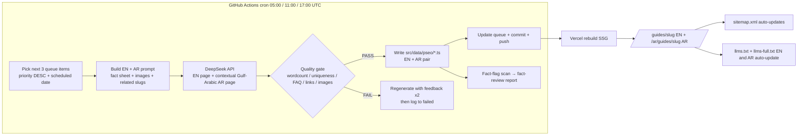

# 🏛️ Wasleen Approvals — Programmatic SEO (pSEO) Domination Engine

**Domain:** https://www.dubaiapprovalconsultants.com
**Stack:** Next.js 15 (App Router) + Tailwind CSS v4 + TypeScript + GitHub Actions + DeepSeek API
**Cadence:** 3 batches/day @ 9:00 AM / 3:00 PM / 9:00 PM UAE (UTC+4) = **05:00 / 11:00 / 17:00 UTC**
**Batch size:** 3 pages per batch (each page = EN + AR pair) → **9 pages/day ≈ 270 pages/month**
**Storage:** Static TypeScript data files (no runtime DB) — consistent with the existing 100% SSG build

---

## 0. DIRECT ANSWERS TO YOUR QUESTIONS

### Q1 — Do I need to check every pSEO page daily for review?

**No.** The system is designed so you **never review page-by-page daily**. Instead:

1. **Verified fact sheets per authority (the real gate).** You verify the *numbers* (fees, processing days, required documents) **once per authority** in a `fact-sheets/{authority}.ts` file. The generator is hard-constrained to source **every** fee/timeline/document from that fact sheet — it may never invent new numbers. One-time verification of ~10–90 authorities replaces reviewing thousands of pages.
2. **Automated quality gate runs on every page** (word count, uniqueness vs siblings, FAQ count, link count, image presence) and blocks weak pages before they commit.
3. **Fact-flag → weekly batch review.** If the model ever introduces a number *not* present in the fact sheet, it's flagged. The system writes a **`fact-review.md` report** and/or opens a **GitHub Issue** listing only the flagged facts. You review **one weekly sitting (~10–20 min)**, not daily.
4. **Optional spot-check:** one random page per week — nothing more.

The combination of *fact-sheet-sourced numbers* + *automated gate* + *weekly batch review* means daily work stays **zero**, and weekly work is **one short sitting**.

### Q2 — Will all created pages be added to sitemap.xml and llms.txt / llms-full.txt in both EN and AR?

**Yes — automatically, for all four files, in both languages.**

| File | What it includes | Mechanism |
|---|---|---|
| `sitemap.xml` | **Every** pSEO page (EN + AR URLs, self-referencing hreflang + x-default) | [`sitemap.ts`](src/app/sitemap.ts:75) is extended to merge the pSEO data array — same loop as approvals/guides |
| `llms.txt` (EN + AR) | **Curated index** — hubs + new pSEO guides grouped by category (not all thousands of pages; llms.txt is a discovery index, per GEO best practice) | [`buildLlmsIndex()`](src/lib/geo.ts) extended to accept pSEO pages |
| `llms-full.txt` (EN + AR) | **Full knowledge base** — includes full pSEO page text (direct answer, sections, tables, FAQ) | [`buildLlmsFull()`](src/lib/geo.ts) extended with a pSEO formatter registered in the existing registry pattern |
| `/ar/*` counterparts | Same, in Arabic, from the Arabic pSEO data | `/ar/llms.txt` and `/ar/llms-full.txt` routes extended to consume `pseo-ar` data |

Because the site is SSG, sitemap + llms rebuild on every publish with zero manual steps.

### Q3 — NAP / phone number

Your real phone & WhatsApp is **`+971567648220`**. That value is **already correct** in [`src/lib/constants.ts`](src/lib/constants.ts:17) — which is what actually renders in the Footer and all JSON-LD. The **rule files** are the ones carrying the stale number and must be corrected to keep them byte-for-byte consistent:

- `.roo/rules/00-PROJECT-MASTER-RULE.md` (lines 15–16) — `+971542330837` → `+971567648220`
- `.roo/rules/05-TECHNICAL-SEO-SCHEMA.md` (line 29) — `+971542330837` → `+971567648220`

This is Todo #1 — done before anything scales.

---

## 1. SYSTEM ARCHITECTURE



**Why static files (confirmed):** identical pattern to the existing 52 approval + 30 guide pages; best TTFB/LCP for the 95+ PageSpeed target; no runtime DB in the bundle; git-native review/rollback for YMYL-adjacent compliance content; no ISR webhook to secure.

---

## 2. CONTENT UNIVERSE (pSEO Page Taxonomy)

All pSEO pages live at **`/guides/{slug}`** (EN) and **`/ar/guides/{slug}`** (AR) — compliant with the master-rule URL patterns. Each page carries a `kind` that selects its rendering template + schema stack. New kinds are additive (no rewrites).

| `kind` | Purpose | Example (from your list) | Schema stack |
|---|---|---|---|
| `guide` | Deep "everything about X" hub guide (1,800+ words) | `Dubai Municipality Building Permit — Complete Guide` | Article + FAQPage + HowTo + BreadcrumbList |
| `qa` | Single question + answer (AEO/snippet play) | `How long does a DEWA approval take?` | QAPage + BreadcrumbList |
| `checklist` | Document / process / combined-authority checklist | `Restaurant / Food Business Approval — Full Checklist (DM Food Control + DCD + DEWA)` | HowTo + ItemList + FAQPage |
| `cost` | Cost / fee breakdown (transparency = conversion) | `How Much Does an Approval Cost in Dubai?` | Article + ItemList + FAQPage |
| `timeline` | Processing-time breakdown | `DEWA Approval Timeline: Stage by Stage` | HowTo + Article |
| `compare` | X vs Y comparison | `Mainland vs Free Zone Approval Process — Comparison` | Article + ItemList + FAQPage |
| `glossary` | Single-term definition (feeds entity/AEO) | `NOC — No Objection Certificate, explained` | Definition/Article + BreadcrumbList |

### The 10 pilot complete-guides (queue seeds — slugs checked against existing `guides.ts` to avoid duplicates)

1. `dm-building-permit-complete-guide`
2. `dcd-noc-complete-guide`
3. `dewa-approval-connection-complete-guide`
4. `dda-fit-out-approval-complete-guide`
5. `trade-license-approval-by-business-activity`
6. `restaurant-food-business-approval-checklist`
7. `how-much-does-approval-cost-in-dubai`
8. `mainland-vs-free-zone-approval-comparison`
9. `common-reasons-approvals-rejected-in-dubai`
10. `ejari-registration-complete-guide`

> Note: `ejari-registration-complete-guide` may already exist in [`guides.ts`](src/data/guides.ts:38) — the queue builder **dedups against every existing slug** and merges/extends rather than duplicates.

### Queue dimensions (expanded after pilot)

Authorities (~90) × question sets (10–20 Q&A each) + project types (14) + business activities + locations (only where genuinely differentiated — per the anti-thin-content rule in `reference details/WASLEEN_APPROVALS_PSEO_DOMINATION_PLAN.md`). **Quality-gated, never volume-gated.**

---

## 3. DATA MODEL & NEW FILES

### New interfaces in `src/types/index.ts`

```ts
export type PseoPageKind = "guide" | "qa" | "checklist" | "cost" | "timeline" | "compare" | "glossary";

export interface PseoPage {
  slug: string;                 // unique, deduped against approvals + guides
  kind: PseoPageKind;
  title: string;                // H1
  metaTitle: string;            // 50-60 chars
  metaDescription: string;      // 140-160 chars
  primaryKeyword: string;
  secondaryKeywords: string[];
  directAnswer: string;         // 40-60 word AI-Overview snippet
  sections: PseoSection[];      // ordered H2/H3 blocks with tables/lists
  faqs: FAQItem[];              // 4-8 distinct per page
  relatedSlugs: string[];       // dependency-graph + sibling links
  image?: ImageAssetRef;        // from image registry
  parentApprovalSlug?: string;  // links up to pillar
  lastVerified: string;         // set when fact sheet verified; "pending" until then
  reviewStatus: "auto" | "needs-review";
  ar?: PseoArabicContent;       // contextual Gulf-Arabic, not translation
}
```

### New data files

| File | Purpose |
|---|---|
| `src/data/pseo/pseo-pages.ts` | All generated pages (EN canonical) — merged into guides route |
| `src/data/pseo/pseo-pages-ar.ts` | Arabic pages (parity with `approvals-ar` pattern) |
| `src/data/images.ts` | **Image registry** — every `public/images/*.webp` mapped to alt/caption/topic tags (EN+AR) |
| `src/data/dependency-graph.ts` | Regulatory dependency graph: `approval → required approvals` (the internal-link mesh) |
| `src/data/fact-sheets/{authority}.ts` | **Human-verified** fees/timelines/documents per authority (single source of truth) |
| `scripts/pseo/queue.json` | The pSEO queue (planned pages + status), tracked in git |
| `scripts/pseo/fact-review.md` (generated) | Weekly fact-flag report for your one-sitting review |

---

## 4. GENERATION ENGINE (`scripts/pseo/`)

| File | Responsibility |
|---|---|
| `types.ts` | Shared pSEO TS types (queue item, generated content) |
| `queue.ts` | Read/update `queue.json`; `getNextBatch()` by priority + schedule; dedup vs existing slugs |
| `prompts.ts` | Build **EN prompt** + **Gulf-Arabic AR prompt** (contextual localization instructions) |
| `deepseek.ts` | DeepSeek API client (`deepseek-chat`), JSON-mode, retry/backoff |
| `generate.ts` | Orchestrator: queue → prompt → API → parse → quality gate → write data → update queue → commit |
| `quality.ts` | Automated quality gate (below) |
| `arabic.ts` | AR prompt helper + AR quality checks (contextual, not word-for-word) |
| `fact-flag.ts` | Detect numbers not in the fact sheet → append to `fact-review.md` + `reviewStatus` |

### Quality gate (hard blocks — no exceptions)

- Word count: `guide/checklist/compare` ≥ 900; `cost/timeline` ≥ 700; `qa/glossary` ≥ 350
- Similarity vs sibling pages ≤ 30% (paragraph-diff/embedding check) — the anti-thin-content rule
- FAQ count ≥ 4, answers self-contained
- ≥ 3 outbound internal links (dependency graph) + 1 image present with alt text
- Unique `metaTitle`/`metaDescription`/H1 (never template-swap)
- Failure → regenerate with feedback up to 2×, then mark `failed` and log

### Fact rule (YMYL protection — non-negotiable)

- Every fee/timeline/document **must** be sourced from the authority fact sheet
- Any number not in the fact sheet → `reviewStatus: "needs-review"` + added to `fact-review.md`
- Pages with `needs-review` still publish but display a discreet **"Last verified: pending review"** badge (trust signal, not a blocker)

### GitHub Actions — `.github/workflows/pseo-generate.yml`

```yaml
on:
  schedule:
    - cron: "0 5 * * *"    # 9:00 AM UAE
    - cron: "0 11 * * *"   # 3:00 PM UAE
    - cron: "0 17 * * *"   # 9:00 PM UAE
  workflow_dispatch: {}    # manual trigger for pilot
```

Each run: generate 3 pages (EN+AR) → quality gate per page → write files → `git commit` + `git push` → Vercel auto-rebuilds.

### Required secrets / env

| Variable | Where |
|---|---|
| `DEEPSEEK_API_KEY` | `.env.local` (dev) + GitHub Actions secret (prod) |
| `GITHUB_TOKEN` | Default, available in Actions |
| Vercel | Git-connected auto-deploy (already in place) |

---

## 5. RENDERING & TEMPLATES

- Extend `src/app/guides/[slug]/page.tsx` to resolve from **both** `guides` and `pseo-pages` (single slug namespace).
- New components in `src/components/pseo/`:
  - `PseoPageRenderer.tsx` — dispatches by `kind`
  - `PseoSectionBlock.tsx` — H2/H3 + paragraphs + tables + lists (semantic HTML)
  - `PseoImageBlock.tsx` — `next/image` with explicit width/height, descriptive `alt`, `<figcaption>`, lazy-load, WebP
  - `PseoFaqBlock.tsx` — accordion (reuse existing FAQBlock patterns)
  - `PseoRelatedBlock.tsx` — dependency-graph links (up/side/down)
  - `PseoBreadcrumbs.tsx` — BreadcrumbList
  - `PseoFactBadge.tsx` — "Last verified" + `needs-review` badge
- **No inline styles** — Tailwind v4 classes + design tokens only (project rule).

---

## 6. IMAGE SYSTEM (incl. the 20 new filenames for you to create)

### How images are used

1. **Registry** `src/data/images.ts` maps every `public/images/*.webp` to `{ alt (EN), altAr (AR), caption, topicTags, aspectRatio }`.
2. **Placement:** every `guide/checklist/cost/compare` page gets **1–2 images** — one after the direct-answer block, one near the cost/timeline table (proven placement: breaks text walls, boosts engagement, supports image SEO).
3. **Alt text:** generated per page (keyword-natural, descriptive, EN + AR), never "image" or "logo".
4. **Technical:** `next/image`, explicit `width`/`height` (CLS-safe), `loading="lazy"` below fold, WebP/AVIF via existing [`next.config.ts`](next.config.ts:17).

### The 20 new images to create — save as `.webp` in `public/images/` with these exact filenames

| # | Filename | Best used on |
|---|---|---|
| 1 | `dubai-approval-consultants-consultation.webp` | Homepage/About + generic guide intro |
| 2 | `dm-building-permit-dubai-municipality.webp` | DM building permit guides |
| 3 | `dcd-fire-safety-noc-dubai-civil-defense.webp` | DCD / fire-safety pages |
| 4 | `dewa-electricity-connection-approval.webp` | DEWA connection guides |
| 5 | `dda-fit-out-approval-engineering.webp` | DDA / fit-out pages |
| 6 | `trade-license-approval-dubai-business-activity.webp` | Trade license / business activity |
| 7 | `restaurant-food-business-approval-dubai.webp` | Restaurant / food checklist |
| 8 | `approval-cost-fees-budget-dubai.webp` | Cost / calculator pages |
| 9 | `mainland-vs-free-zone-approval-dubai.webp` | Comparison pages |
| 10 | `approval-rejection-reasons-dubai.webp` | Rejection / troubleshooting pages |
| 11 | `ejari-tenancy-registration-dubai.webp` | Ejari / tenancy pages |
| 12 | `blueprint-drawing-submission-approval-dubai.webp` | Drawing / 2D / 3D pages |
| 13 | `commercial-office-fit-out-approval-dubai.webp` | Office fit-out pages |
| 14 | `warehouse-industrial-approval-dubai.webp` | Warehouse / industrial pages |
| 15 | `mep-electrical-mechanical-approval-dubai.webp` | MEP / electrical / mechanical |
| 16 | `signage-advertising-approval-dubai.webp` | Signage / advertising pages |
| 17 | `structural-approval-engineering-dubai.webp` | Structural / mezzanine pages |
| 18 | `villa-renovation-approval-dubai.webp` | Residential / villa pages |
| 19 | `free-zone-community-noc-approval-dubai.webp` | Free-zone / community NOC pages |
| 20 | `project-completion-handover-approval-dubai.webp` | Completion certificate / handover |

**Naming convention for all future images:** `{subject}-{context}-{location}.webp`, lowercase, hyphenated, keyword-descriptive (e.g., `retail-shop-fit-out-approval-dubai.webp`). Then add one line to `src/data/images.ts` (or tell the code agent — the registry is designed to make this a 2-minute task). The existing **17 images** in `public/images/` are reused and registered too.

---

## 7. INTERNAL LINKING — THE ENTITY MESH

Every pSEO page automatically includes:
- **Up:** breadcrumb chain + parent approval pillar (`/approvals/{slug}`) + category hub
- **Sideways:** 5–8 dependency-graph siblings (e.g., a DDA page links DEWA, DCD, TECOM — modeling the real regulatory chain, per `dependency-graph.ts`)
- **Down:** related pSEO guides, cost/timeline/FAQ sub-pages, glossary terms
- **Auto-linker:** extend `renderInlineLinks` ([`content.ts`](src/lib/content.ts:17)) with a glossary pass that auto-links known acronyms/terms (NOC, BCC, Estidama, Al Sa'fat…) to their glossary pages
- **Anchor text:** always descriptive (never "click here")

This turns the site into the interconnected knowledge graph the domination plan demands — the actual mechanism behind GEO ranking.

---

## 8. ARABIC ENGINE (contextual, not translation)

- One DeepSeek call generates **both** EN and AR, or two calls with the AR prompt carrying explicit **Gulf/Emirati SEO-localization instructions**: contextual rewriting, MSA with Gulf register, Arabic keyword targeting (`موافقة بلدية دبي`, `شهادة عدم ممانعة`), no word-for-word translation, natural Arabic GEO phrasing.
- AR pages land at `/ar/guides/{slug}` via the existing `/ar` routes (already wired for approvals/guides).
- hreflang `en` ↔ `ar` pairs auto-generated (reuse [`hreflangAlternates`](src/lib/locale.ts)).
- Parity validation reuses the existing `scripts/validate-ar-parity.js` pattern.

---

## 9. SEO / GEO / SCHEMA

- Per-kind schema stack (Section 2 table) generated by a new `pseoSchemaStack()` in `src/lib/schema.ts`, all referencing `#organization` / `#website` @ids and NAP from constants.
- Canonical self-referencing; hreflang EN/AR; unique OG per page (page-type OG template).
- Sitemap + llms integration (Q2 above).
- Visible "Last verified" + `dateModified` (freshness signal for LLM citation preference).

---

## 10. ROADMAP

| Phase | Deliverable |
|---|---|
| **A. Foundation** | NAP fix (todo 1) · types · image registry · dependency graph · fact sheets for top-10 authorities · seed queue with 10 pilot guides |
| **B. Engine** | `scripts/pseo/*` generation engine · GitHub Actions cron · env/secrets · quality gate + fact-flag |
| **C. Rendering** | schema stack · `src/components/pseo/*` · guides route extension · AR parity · sitemap + llms integration |
| **D. Pilot** | Generate the 10 example guides → you review the diff → verify `npm run build` → publish |
| **E. Scale** | Expand queue to full universe (authorities × Q&A × project types × activities) at 9/day; monitor GSC + AI citations; weekly fact review |

---

## 11. MANUAL WORK REQUIRED FROM YOU (checklist)

1. **Confirm NAP fix** (phone `+971567648220`) — already confirmed; applied in Todo 1.
2. **Provide `DEEPSEEK_API_KEY`** (or OpenAI-compatible key) — one-time.
3. **Verify the top-10 authority fact sheets** (fees/timelines/documents) — one sitting, then done; the rest batched at your pace.
4. **Create the 20 images** (Section 6) and drop them into `public/images/` with the exact filenames.
5. **Approve the seeded queue** (10 pilot guides + priority order).
6. **Weekly review (10–20 min):** read `scripts/pseo/fact-review.md` (or the auto-opened GitHub issue) and approve/flag facts.
7. **Spot-check 1 random page/week** (optional).
8. **Post-launch:** submit sitemap to Google Search Console; verify in GTM Preview; watch indexed-count vs built-count in GSC.

**You do NOT do:** daily page-by-page review, manual sitemap/llms edits, manual alt-text writing, manual internal links.
