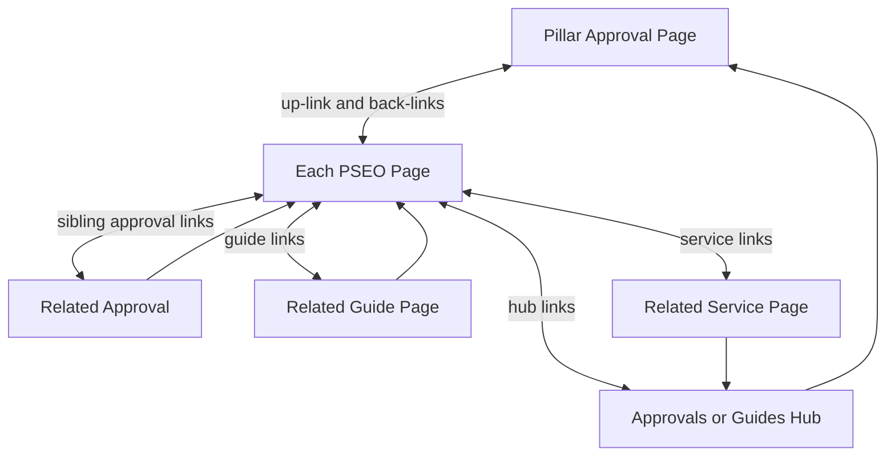

# PSEO Manual Internal Linking Plan — "Spider-Web" Content Links

## 1. Objective & Scope

**Goal:** Add 4–6 natural, in-content (on-words) internal links to **every live PSEO page** so the site behaves like a "mega spider internal-link hub". Currently PSEO pages only carry links in the bottom "Related Dubai approvals" list — almost no links inside the prose. This plan adds inline links **manually and intelligently**: the implementer reads each page's paragraphs, finds the sentence that naturally mentions a related topic, and wraps a descriptive phrase in `[text](/path)` syntax.

**Scope — exactly two data files are edited:**
1. [`src/data/pseo/pseo-pages.json`](src/data/pseo/pseo-pages.json) — the 21 live **EN** pages (served at `/guides/{slug}`)
2. [`src/data/pseo/pseo-pages-ar.json`](src/data/pseo/pseo-pages-ar.json) — the 21 **Arabic** mirrors (served at `/ar/guides/{slug}`)

> **Arabic data source — important:** the live Arabic route ([`src/app/ar/guides/[slug]/page.tsx`](src/app/ar/guides/[slug]/page.tsx:221)) merges Arabic content from `pseo-pages-ar.json` via `getPseoArabicEntry()` — it does **NOT** render the embedded `ar` blocks inside `pseo-pages.json`. Those embedded `ar` blocks are legacy/unused, so **do not edit them**; edit the `ar` objects in `pseo-pages-ar.json` instead.

**Out of scope (do NOT touch):**
- No other file (no components, no routes, no types, no prompts, no other data files)
- The embedded `ar` blocks inside `pseo-pages.json` (legacy, not rendered by the live AR route)
- No changes to headings, facts, fees, timelines, FAQ text, `relatedSlugs`, images, or metadata
- No new/removed sections or list items (except the inline link markup added inside existing paragraph text)
- The bottom "Related Dubai approvals" list items are left as-is

## 2. How the Links Render (confirmed — infrastructure already works)

The renderer [`PseoSectionBlock.tsx`](src/components/pseo/PseoSectionBlock.tsx:15) passes every paragraph, list-item, and table-cell through [`renderInlineLinks()`](src/lib/content.ts:17), which converts `[text](/path)` into:

```html
<a href="/path" class="text-link-blue hover:text-link-blue underline transition-colors">text</a>
```

So we only need to edit the JSON string content — no code changes. Arabic links use `/ar/...` prefixes and render identically. Remember: the Arabic strings live in `pseo-pages-ar.json` (per §1), not in the `ar` blocks embedded in `pseo-pages.json`.

## 3. The 21 Live PSEO Pages

| # | Slug | Kind | EN Title | Parent Approval |
|---|------|------|----------|-----------------|
| 1 | `dcd-noc-complete-guide` | guide | Dubai Civil Defense NOC — Complete Guide | `dubai-civil-defense-approval` |
| 2 | `dewa-approval-connection-complete-guide` | guide | DEWA Approval & Connection — Complete Guide | `dewa-approval` |
| 3 | `dm-building-permit-complete-guide` | guide | Dubai Municipality Building Permit — Complete Guide | `dubai-municipality-building-permit` |
| 4 | `dda-fit-out-approval-complete-guide` | guide | DDA Fit-Out Approval — Complete Guide | `dda-approval` |
| 5 | `trade-license-approval-by-business-activity` | guide | Trade License Approval by Business Activity | `ded-approval` |
| 6 | `how-much-does-approval-cost-in-dubai` | cost | How Much Does Approval Cost in Dubai? | — |
| 7 | `mainland-vs-free-zone-approval-comparison` | compare | Mainland vs Free Zone Approval — Comparison | — |
| 8 | `restaurant-food-business-approval-checklist` | checklist | Restaurant & Food Business Approval Checklist | `food-control-department-approval` |
| 9 | `common-reasons-approvals-rejected-in-dubai` | guide | Common Reasons Approvals Get Rejected in Dubai | — |
| 10 | `dm-noc-what-is-it-who-needs` | qa | What Is a DM NOC and Who Needs One? | `dubai-municipality-noc` |
| 11 | `dm-building-permit-validity-period` | qa | DM Building Permit Validity Period | `dubai-municipality-building-permit` |
| 12 | `dcd-fire-noc-validity-duration` | qa | DCD Fire NOC Validity Duration | `dubai-civil-defense-approval` |
| 13 | `dewa-noc-cost-connection` | qa | DEWA NOC Cost & Connection | `dewa-approval` |
| 14 | `dewa-load-enhancement-process` | qa | DEWA Load Enhancement Process | `dewa-approval` |
| 15 | `dda-fit-out-permit-documents` | qa | DDA Fit-Out Permit Documents | `dda-approval` |
| 16 | `ded-trade-license-renewal-cost` | qa | DED Trade License Renewal Cost | `ded-approval` |
| 17 | `ejari-renewal-how-to` | qa | How to Renew Ejari | `ejari-registration` |
| 18 | `rta-noc-driveway-access` | qa | RTA NOC for Driveway Access | `rta-approval` |
| 19 | `dha-clinic-license-requirements` | qa | DHA Clinic License Requirements | `dubai-health-authority-approval` |
| 20 | `entertainment-license-process-dubai` | qa | Entertainment License Process Dubai | `entertainment-license-approval` |
| 21 | `dubai-police-cctv-approval` | qa | Dubai Police CCTV Approval | `dubai-police-approval` |

## 4. Linking Rules (MUST follow on every page)

### 4.1 Link budget — 4 to 6 inline links per page (EN) and 4 to 6 (AR)

| Role | Count | Target types |
|------|-------|--------------|
| 1 "up-link" to pillar | 1 | `parentApprovalSlug` approval page |
| Sibling/related approvals | 1–2 | Other approval pages from inventory |
| Related guides | 1–2 | `/guides/{slug}` (QA or hub guides) |
| Service (contextual) | 0–1 | `/services/{slug}` when text mentions drawings/docs/management |
| Hub page | 0–1 | `/approvals`, `/guides`, or `/services` |

### 4.2 Placement rules
- Links go inside **`paragraph` blocks** primarily (spread across ≥ 3 different sections). Avoid putting the new inline links inside the bottom "Related Dubai approvals" list.
- Max ~2 links per paragraph; no two links adjacent.
- **Q&A pages** (short, ~5–8 paragraphs) still need 4 links — one per available paragraph is fine.
- Where a paragraph is dense and naturally mentions several related topics, use it; otherwise pick the closest-matching paragraph.
- Optionally add **1 link in the `directAnswer`** (AI engines lift this verbatim — highest-value interlink), wrapped so it still reads as a complete sentence.

### 4.3 Anchor text rules
- Descriptive, 3–8 words, a phrase that naturally exists in or near the sentence (e.g., "Dubai Municipality building permit", "Dubai Civil Defense NOC", "DEWA connection NOC", "interior fit-out approval").
- **Never** "click here", "learn more", "read more", "this page".
- Preserve grammar so the sentence reads naturally with the link.
- Vary anchor text across the site (do not reuse the exact same anchor for the same target on many pages — prefer natural variation like "Dubai Civil Defense approval process" vs "civil defense NOC").

### 4.4 No-duplicate & validity rules
- **No duplicate target URL on the same page.** If a target is already in the page's bottom related list, prefer a different target in prose; only reuse when no sensible alternative exists.
- **Every href must exist** — use ONLY targets from the inventory in §5 (all are real routes).
- Never link a PSEO page to itself and never to another PSEO page that does not exist.

### 4.5 Link-syntax format
Exactly this, inside the JSON string:
```
[Anchor Text](/approvals/dubai-municipality-building-permit)
[Anchor Text](/guides/how-long-does-dm-building-permit-take)
[Anchor Text](/services/approval-management)
[Anchor Text](/approvals)
```
Arabic uses `/ar/` prefixes: `/ar/approvals/...`, `/ar/guides/...`, `/ar/services/...`, `/ar/approvals`.

## 5. Link-Target Inventory (valid routes only)

### 5.1 Approval pages — `/approvals/{slug}` (68)
dubai-municipality-building-permit · dubai-civil-defense-approval · dubai-municipality-noc · rta-approval · dubai-municipality-health-safety-approval · dubai-municipality-environmental-compliance · dubai-municipality-signage-approval · dubai-municipality-civil-defense-noc · dubai-municipality-completion-certificate · dubai-municipality-preliminary-building-permit · dubai-municipality-demolition-permit · dubai-municipality-excavation-permit · dubai-silicon-oasis-approval · dubai-south-approval · tecom-approvals · jebel-ali-free-zone-approval · dubai-airport-freezone-approval · dubai-knowledge-park-approval · dmcc-approval · dubai-science-park-approval · emaar-community-approval · nakheel-developer-approval · dubai-properties-approval · damac-properties-approval · meraas-holding-approval · sobha-realty-approval · dubai-land-department-registration · ejari-registration · title-deed-registration · rera-permit · dewa-approval · dewa-connection-noc · district-cooling-approval · dewa-meter-installation · dewa-load-enhancement · telecom-connection-approval · dewa-temporary-power-connection · food-control-department-approval · dtcm-tourism-approval · dubai-health-authority-approval · public-health-approval · entertainment-license-approval · interior-fit-out-approval · change-of-usage-permit · structural-modification-permit · refurbishment-permit · partition-ceiling-approval · mep-approval · 2d-drawing-submission · 3d-design-approval · cad-drawing-certification · as-built-drawing-approval · ded-approval · dda-approval · dubai-police-approval · difc-approval · impz-approval · dubai-holding-approval · community-approval · al-safat-green-building-approval · sewerage-drainage-approval · electrical-works-approval · mezzanine-floor-approval · restaurant-works-approval · interior-works-approval · commercial-approval · residential-approval · project-approval

### 5.2 Guide pages — `/guides/{slug}` (31)
Hub guides: complete-guide-dubai-building-approvals · how-to-avoid-approval-rejection-dubai · dubai-approval-fees-guide · approval-timelines-dubai-guide
QA guides: how-long-does-dm-building-permit-take · dcd-fire-safety-approval-documents · dm-noc-for-renovation-guide · rta-approval-commercial-projects · dm-completion-certificate-steps · dso-fit-out-approval-guide · dubai-south-design-guidelines · tecom-business-setup-approvals · dmcc-free-zone-approval-process · nakheel-renovation-approval-process · emaar-community-design-guidelines · dubai-properties-noc-process · ejari-registration-complete-guide · title-deed-transfer-dubai · rera-permit-requirements-guide · dewa-connection-process-guide · district-cooling-connection-guide · dewa-meter-installation-steps · dubai-food-control-approval-guide · dtcm-tourism-license-requirements · dha-healthcare-approval-guide · interior-fit-out-permit-process · change-of-usage-permit-guide · structural-modification-approval-guide · cad-drawing-standards-dubai-guide · as-built-drawing-requirements · 3d-design-submission-guide

### 5.3 Service pages — `/services/{slug}` (7)
2d-drawings · 3d-design-visualization · cad-documentation · approval-management · document-clearing · project-management · fit-outs

### 5.4 Hub pages
`/approvals` · `/guides` · `/services`

## 6. Per-Page Link Plans

> **How to use:** For each page, read its paragraphs, locate the section named below, and wrap the natural matching phrase in the `[text](/path)` syntax. Anchors are suggestions — adjust to the exact wording already in the paragraph. Always end with the required 4–6 links.

### Page 1 — `dcd-noc-complete-guide` (DCD NOC, parent: dubai-civil-defense-approval)
| # | Target | Anchor suggestion | Section / context |
|---|--------|-------------------|-------------------|
| 1 | `/approvals/dubai-civil-defense-approval` | "Dubai Civil Defense approval process" / "civil defense NOC" | directAnswer or "What is a Dubai Civil Defense NOC?" |
| 2 | `/approvals/dubai-municipality-building-permit` | "Dubai Municipality building permit" | "Why You Need a DCD NOC" (already mentions DM building permit) |
| 3 | `/approvals/interior-fit-out-approval` | "interior fit-out approval" | "Why You Need a DCD NOC" / Required Documents |
| 4 | `/guides/dcd-fire-safety-approval-documents` | "DCD fire safety approval documents" | "Required Documents for DCD Approval" |
| 5 | `/services/cad-documentation` | "certified FLS / fire protection drawings" | "Required Documents" or "How Wasleen Can Help" |
| 6 | `/approvals` | "all related Dubai approvals" | bottom "Related Dubai approvals" intro line |

### Page 2 — `dewa-approval-connection-complete-guide` (DEWA, parent: dewa-approval)
| # | Target | Anchor suggestion | Section / context |
|---|--------|-------------------|-------------------|
| 1 | `/approvals/dewa-approval` | "DEWA approval" | directAnswer / intro |
| 2 | `/approvals/dewa-connection-noc` | "DEWA connection NOC" | Connection process section |
| 3 | `/approvals/dewa-meter-installation` | "DEWA meter installation" | Meter/connection section |
| 4 | `/approvals/district-cooling-approval` | "district cooling connection" | Where cooling is relevant |
| 5 | `/guides/dewa-connection-process-guide` | "DEWA connection step-by-step guide" | Process section |
| 6 | `/services/approval-management` | "manage your DEWA connection end to end" | "How Wasleen Can Help" |

### Page 3 — `dm-building-permit-complete-guide` (DM permit, parent: dubai-municipality-building-permit)
| # | Target | Anchor suggestion | Section / context |
|---|--------|-------------------|-------------------|
| 1 | `/approvals/dubai-municipality-building-permit` | "Dubai Municipality building permit" | directAnswer / intro |
| 2 | `/approvals/dubai-municipality-preliminary-building-permit` | "preliminary building permit" | Process section |
| 3 | `/approvals/dubai-civil-defense-approval` | "Dubai Civil Defense approval" | Where DCD NOC mentioned |
| 4 | `/guides/how-long-does-dm-building-permit-take` | "how long a DM building permit takes" | Timeline section |
| 5 | `/guides/dm-completion-certificate-steps` | "DM completion certificate steps" | Completion section |
| 6 | `/services/2d-drawings` | "DM-compliant 2D drawings" | Documents section |

### Page 4 — `dda-fit-out-approval-complete-guide` (DDA, parent: dda-approval)
| # | Target | Anchor suggestion | Section / context |
|---|--------|-------------------|-------------------|
| 1 | `/approvals/dda-approval` | "DDA approval" | directAnswer / intro |
| 2 | `/approvals/interior-fit-out-approval` | "interior fit-out approval" | Fit-out scope section |
| 3 | `/approvals/dubai-municipality-building-permit` | "Dubai Municipality building permit" | Where DDA coordinates with DM |
| 4 | `/guides/interior-fit-out-permit-process` | "interior fit-out permit process" | Process section |
| 5 | `/services/fit-outs` | "fit-out approval services" | "How Wasleen Can Help" |
| 6 | `/approvals/commercial-approval` OR `/guides/complete-guide-dubai-building-approvals` | "commercial fit-out approval" / "complete Dubai building approvals guide" | Commercial scope / closing |

### Page 5 — `trade-license-approval-by-business-activity` (DED, parent: ded-approval)
| # | Target | Anchor suggestion | Section / context |
|---|--------|-------------------|-------------------|
| 1 | `/approvals/ded-approval` | "DED (Dubai Economy & Tourism) approval" | directAnswer / intro |
| 2 | `/approvals/ejari-registration` | "Ejari registration" | Where tenancy required |
| 3 | `/approvals/dtcm-tourism-approval` | "DTCM tourism approval" | Hospitality/tourism activities |
| 4 | `/approvals/food-control-department-approval` | "Dubai Municipality Food Control approval" | Food business activities |
| 5 | `/guides/ejari-registration-complete-guide` | "Ejari registration guide" | Tenancy/doc section |
| 6 | `/services/approval-management` | "trade license approval management" | "How Wasleen Can Help" |

### Page 6 — `how-much-does-approval-cost-in-dubai` (cost)
| # | Target | Anchor suggestion | Section / context |
|---|--------|-------------------|-------------------|
| 1 | `/guides/dubai-approval-fees-guide` | "Dubai approval fees guide" | Intro / fees section |
| 2 | `/approvals/dubai-municipality-building-permit` | "Dubai Municipality building permit" | DM cost table context |
| 3 | `/approvals/dewa-approval` | "DEWA connection costs" | Utility cost section |
| 4 | `/approvals/dubai-civil-defense-approval` | "DCD NOC fees" | Fire safety cost section |
| 5 | `/approvals/ejari-registration` | "Ejari registration fee" | Property/tenancy costs |
| 6 | `/approvals` | "browse all approval fees" | Closing / hub |

### Page 7 — `mainland-vs-free-zone-approval-comparison` (compare)
| # | Target | Anchor suggestion | Section / context |
|---|--------|-------------------|-------------------|
| 1 | `/approvals/ded-approval` | "DED mainland trade license" | Mainland section |
| 2 | `/approvals/dmcc-approval` | "DMCC free zone approval" | Free zone section |
| 3 | `/approvals/jebel-ali-free-zone-approval` | "JAFZA approval" | Free zone section |
| 4 | `/guides/dmcc-free-zone-approval-process` | "DMCC fit-out and license guide" | Free zone details |
| 5 | `/guides/tecom-business-setup-approvals` | "TECOM business setup approvals" | Free zone details |
| 6 | `/approvals/dubai-municipality-building-permit` | "Dubai Municipality building permit" | Mainland permit section |

### Page 8 — `restaurant-food-business-approval-checklist` (checklist, parent: food-control-department-approval)
| # | Target | Anchor suggestion | Section / context |
|---|--------|-------------------|-------------------|
| 1 | `/approvals/food-control-department-approval` | "Dubai Municipality Food Control approval" | directAnswer / intro |
| 2 | `/approvals/restaurant-works-approval` | "restaurant works approval" | Works checklist |
| 3 | `/approvals/dubai-civil-defense-approval` | "Dubai Civil Defense NOC" | Fire safety item |
| 4 | `/guides/dubai-food-control-approval-guide` | "Dubai Food Control approval guide" | Checklist context |
| 5 | `/approvals/dtcm-tourism-approval` | "DTCM tourism license" | F&B tourism item |
| 6 | `/services/fit-outs` | "restaurant fit-out approval" | Closing / services |

### Page 9 — `common-reasons-approvals-rejected-in-dubai` (guide)
| # | Target | Anchor suggestion | Section / context |
|---|--------|-------------------|-------------------|
| 1 | `/guides/how-to-avoid-approval-rejection-dubai` | "how to avoid approval rejection" | Intro / closing |
| 2 | `/approvals/dubai-municipality-building-permit` | "Dubai Municipality building permit" | DM rejection reason |
| 3 | `/approvals/dubai-civil-defense-approval` | "Dubai Civil Defense approval" | Fire-safety rejection |
| 4 | `/approvals/interior-fit-out-approval` | "interior fit-out approval" | Fit-out rejection |
| 5 | `/approvals` | "all Dubai approval requirements" | Closing / hub |
| 6 | `/services/approval-management` | "approval management consultants" | "How to avoid" section |

### Page 10 — `dm-noc-what-is-it-who-needs` (qa, parent: dubai-municipality-noc)
| # | Target | Anchor suggestion | Section / context |
|---|--------|-------------------|-------------------|
| 1 | `/approvals/dubai-municipality-noc` | "Dubai Municipality NOC" | directAnswer / intro |
| 2 | `/approvals/dubai-municipality-building-permit` | "Dubai Municipality building permit" | "Why is a DM NOC Required" |
| 3 | `/guides/dm-noc-for-renovation-guide` | "DM NOC for renovation" | Renovation paragraph |
| 4 | `/approvals/dubai-municipality-demolition-permit` | "DM demolition permit" | Demolition list/context |
| 5 | `/approvals/dewa-approval` | "DEWA NOC" | Multi-authority paragraph |
| 6 | `/services/approval-management` | "DM NOC and building permit services" | "How Wasleen Can Help" |

### Page 11 — `dm-building-permit-validity-period` (qa, parent: dubai-municipality-building-permit)
| # | Target | Anchor suggestion | Section / context |
|---|--------|-------------------|-------------------|
| 1 | `/approvals/dubai-municipality-building-permit` | "Dubai Municipality building permit" | directAnswer / intro |
| 2 | `/approvals/dubai-municipality-preliminary-building-permit` | "preliminary building permit" | Validity context |
| 3 | `/approvals/dubai-municipality-completion-certificate` | "DM completion certificate" | Expiry/extension context |
| 4 | `/guides/how-long-does-dm-building-permit-take` | "how long a DM building permit takes" | Timeline context |
| 5 | `/guides/dm-completion-certificate-steps` | "completion certificate steps" | Completion context |
| 6 | `/approvals/dubai-municipality-noc` | "DM NOC" | Where NOC mentioned |

### Page 12 — `dcd-fire-noc-validity-duration` (qa, parent: dubai-civil-defense-approval)
| # | Target | Anchor suggestion | Section / context |
|---|--------|-------------------|-------------------|
| 1 | `/approvals/dubai-civil-defense-approval` | "Dubai Civil Defense approval" | directAnswer / intro |
| 2 | `/approvals/dubai-municipality-civil-defense-noc` | "Dubai Municipality civil defense NOC" | Cross-authority context |
| 3 | `/guides/dcd-fire-safety-approval-documents` | "DCD fire safety approval documents" | Documents/renewal context |
| 4 | `/approvals/dubai-municipality-building-permit` | "Dubai Municipality building permit" | Where permit mentioned |
| 5 | `/approvals/interior-fit-out-approval` | "interior fit-out approval" | Fit-out renewal context |
| 6 | `/approvals` | "related Dubai approvals" | Closing |

### Page 13 — `dewa-noc-cost-connection` (qa, parent: dewa-approval)
| # | Target | Anchor suggestion | Section / context |
|---|--------|-------------------|-------------------|
| 1 | `/approvals/dewa-approval` | "DEWA approval" | directAnswer / intro |
| 2 | `/approvals/dewa-connection-noc` | "DEWA connection NOC" | Cost context |
| 3 | `/approvals/dewa-meter-installation` | "DEWA meter installation" | Meter/connection context |
| 4 | `/guides/dewa-connection-process-guide` | "DEWA connection process guide" | Process context |
| 5 | `/guides/dubai-approval-fees-guide` | "Dubai approval fees guide" | Fees context |
| 6 | `/approvals/dewa-load-enhancement` | "DEWA load enhancement" | Upgrade context |

### Page 14 — `dewa-load-enhancement-process` (qa, parent: dewa-approval)
| # | Target | Anchor suggestion | Section / context |
|---|--------|-------------------|-------------------|
| 1 | `/approvals/dewa-load-enhancement` | "DEWA load enhancement" | directAnswer / intro |
| 2 | `/approvals/dewa-approval` | "DEWA approval" | Cross-ref |
| 3 | `/approvals/dewa-connection-noc` | "DEWA connection NOC" | Connection context |
| 4 | `/approvals/electrical-works-approval` | "electrical works approval" | Electrical context |
| 5 | `/guides/dewa-connection-process-guide` | "DEWA connection process" | Process context |
| 6 | `/approvals/dewa-temporary-power-connection` | "DEWA temporary power connection" | Interim power context |

### Page 15 — `dda-fit-out-permit-documents` (qa, parent: dda-approval)
| # | Target | Anchor suggestion | Section / context |
|---|--------|-------------------|-------------------|
| 1 | `/approvals/dda-approval` | "DDA fit-out approval" | directAnswer / intro |
| 2 | `/approvals/interior-fit-out-approval` | "interior fit-out approval" | Fit-out context |
| 3 | `/guides/interior-fit-out-permit-process` | "interior fit-out permit process" | Documents context |
| 4 | `/approvals/dubai-municipality-building-permit` | "Dubai Municipality building permit" | Where DM mentioned |
| 5 | `/approvals/dubai-civil-defense-approval` | "Dubai Civil Defense NOC" | Fire-safety documents |
| 6 | `/services/2d-drawings` | "DDA-compliant drawings" | Drawings context |

### Page 16 — `ded-trade-license-renewal-cost` (qa, parent: ded-approval)
| # | Target | Anchor suggestion | Section / context |
|---|--------|-------------------|-------------------|
| 1 | `/approvals/ded-approval` | "DED trade license" | directAnswer / intro |
| 2 | `/approvals/ejari-registration` | "Ejari registration" | Tenancy/renewal context |
| 3 | `/guides/ejari-registration-complete-guide` | "Ejari registration guide" | Renewal docs context |
| 4 | `/guides/dubai-approval-fees-guide` | "Dubai approval fees guide" | Fees context |
| 5 | `/approvals/dubai-municipality-building-permit` | "Dubai Municipality building permit" | Where premises permit mentioned |
| 6 | `/services/document-clearing` | "trade license document clearing" | Closing |

### Page 17 — `ejari-renewal-how-to` (qa, parent: ejari-registration)
| # | Target | Anchor suggestion | Section / context |
|---|--------|-------------------|-------------------|
| 1 | `/approvals/ejari-registration` | "Ejari registration" | directAnswer / intro |
| 2 | `/guides/ejari-registration-complete-guide` | "complete Ejari registration guide" | Renewal steps context |
| 3 | `/approvals/dubai-land-department-registration` | "Dubai Land Department registration" | Property context |
| 4 | `/approvals/title-deed-registration` | "title deed registration" | Ownership context |
| 5 | `/guides/title-deed-transfer-dubai` | "title deed transfer in Dubai" | Ownership context |
| 6 | `/approvals/rera-permit` | "RERA permit" | Rental context |

### Page 18 — `rta-noc-driveway-access` (qa, parent: rta-approval)
| # | Target | Anchor suggestion | Section / context |
|---|--------|-------------------|-------------------|
| 1 | `/approvals/rta-approval` | "RTA approval" | directAnswer / intro |
| 2 | `/guides/rta-approval-commercial-projects` | "RTA approval for commercial projects" | Commercial context |
| 3 | `/approvals/dubai-municipality-building-permit` | "Dubai Municipality building permit" | Permits context |
| 4 | `/approvals/dubai-municipality-noc` | "Dubai Municipality NOC" | NOC context |
| 5 | `/approvals/dubai-civil-defense-approval` | "Dubai Civil Defense approval" | Fire-safety context |
| 6 | `/services/approval-management` | "RTA NOC approval management" | Closing |

### Page 19 — `dha-clinic-license-requirements` (qa, parent: dubai-health-authority-approval)
| # | Target | Anchor suggestion | Section / context |
|---|--------|-------------------|-------------------|
| 1 | `/approvals/dubai-health-authority-approval` | "DHA healthcare approval" | directAnswer / intro |
| 2 | `/guides/dha-healthcare-approval-guide` | "DHA healthcare approval guide" | Requirements context |
| 3 | `/approvals/public-health-approval` | "Dubai Municipality public health approval" | Public-health context |
| 4 | `/approvals/dubai-municipality-building-permit` | "Dubai Municipality building permit" | Fit-out/premises context |
| 5 | `/approvals/interior-fit-out-approval` | "interior fit-out approval" | Clinic fit-out context |
| 6 | `/services/fit-outs` | "medical fit-out approval" | Closing |

### Page 20 — `entertainment-license-process-dubai` (qa, parent: entertainment-license-approval)
| # | Target | Anchor suggestion | Section / context |
|---|--------|-------------------|-------------------|
| 1 | `/approvals/entertainment-license-approval` | "entertainment license approval" | directAnswer / intro |
| 2 | `/approvals/dtcm-tourism-approval` | "DTCM tourism license" | Tourism/entertainment context |
| 3 | `/approvals/dubai-police-approval` | "Dubai Police security approval" | Security context |
| 4 | `/guides/dtcm-tourism-license-requirements` | "DTCM tourism license requirements" | License requirements context |
| 5 | `/approvals/food-control-department-approval` | "Food Control Department approval" | F&B venue context |
| 6 | `/approvals/dubai-municipality-building-permit` | "Dubai Municipality building permit" | Premises context |

### Page 21 — `dubai-police-cctv-approval` (qa, parent: dubai-police-approval)
| # | Target | Anchor suggestion | Section / context |
|---|--------|-------------------|-------------------|
| 1 | `/approvals/dubai-police-approval` | "Dubai Police security systems approval" | directAnswer / intro |
| 2 | `/approvals/dubai-municipality-building-permit` | "Dubai Municipality building permit" | Premises/CCTV install context |
| 3 | `/approvals/dubai-civil-defense-approval` | "Dubai Civil Defense NOC" | Fire-safety/security context |
| 4 | `/approvals/dubai-municipality-noc` | "Dubai Municipality NOC" | Works/NOC context |
| 5 | `/guides/how-to-avoid-approval-rejection-dubai` | "how to avoid approval rejection" | Compliance context |
| 6 | `/approvals/entertainment-license-approval` | "entertainment venue security approval" | Venue context |

## 7. Arabic Mirror Plan

**Where to edit:** [`src/data/pseo/pseo-pages-ar.json`](src/data/pseo/pseo-pages-ar.json) — each entry is `{ "slug": "<EN slug>", "ar": { ... } }`. Apply the links inside the `ar.sections` paragraph blocks. Convert every target from the §6 per-page tables to its `/ar/`-prefixed Arabic route.

For each of the 21 pages, apply the same link budget inside the `ar` object's `sections` paragraphs, using:
- **Arabic paths:** `/ar/approvals/{slug}`, `/ar/guides/{slug}`, `/ar/services/{slug}`, `/ar/approvals`
- **Arabic anchors** matching the Arabic content. Existing Arabic "related" list items already give us correct Arabic approval names, e.g.:
  - `موافقة الدفاع المدني بدبي` → `/ar/approvals/dubai-civil-defense-approval`
  - `تصريح بناء بلدية دبي` → `/ar/approvals/dubai-municipality-building-permit`
  - `شهادة عدم ممانعة من بلدية دبي` → `/ar/approvals/dubai-municipality-noc`
  - `موافقة هيئة كهرباء ومياه دبي (ديوا)` → `/ar/approvals/dewa-approval`
  - `موافقة التشطيب الداخلي (دبي)` → `/ar/approvals/interior-fit-out-approval`
- Use the Arabic title of each target page (from the AR entries in the same file) to build the anchor. For guide targets use the AR titles of `/ar/guides/{slug}` pages where they exist; otherwise use the EN guide title transliterated/translated naturally.
- Same rules: 4–6 links, spread across ≥3 sections, no duplicates, descriptive anchors, `/ar/` prefixes.

## 8. Verification Checklist (run after editing, before considering done)

- [ ] `npm run dev` still runs; build has no JSON syntax errors
- [ ] For every one of the 21 EN pages: exactly 4–6 inline links inside paragraph blocks
- [ ] For every AR page: 4–6 inline links inside Arabic paragraph blocks
- [ ] No duplicate target URL on the same page (EN and AR checked separately)
- [ ] No link points to a non-existent route (all targets from §5 inventory)
- [ ] No PSEO page links to itself; no "click here"/"learn more" anchors
- [ ] Links spread across ≥3 sections per page
- [ ] Diff on BOTH files (`pseo-pages.json` and `pseo-pages-ar.json`) shows ONLY added `[text](url)` fragments — no changed headings, facts, FAQ text, `relatedSlugs`, images, or metadata
- [ ] Embedded `ar` blocks inside `pseo-pages.json` left untouched (legacy; live AR route uses `pseo-pages-ar.json`)
- [ ] Spot-check rendering: open `/guides/dm-building-permit-complete-guide` and `/ar/guides/dm-building-permit-complete-guide`, confirm anchors render as blue underlined links with correct `href`

## 9. Target Link Architecture



## 10. Execution Order (Code mode)

1. EN Phase 1 — pages 1–9 (content-rich guides/cost/compare/checklist)
2. EN Phase 2 — pages 10–21 (Q&A pages)
3. AR Phase 3 — all 21 Arabic mirrors (edit `src/data/pseo/pseo-pages-ar.json`)
4. Verification checklist (§8)
